# DAA-Compute Architecture Diagrams

## System Overview

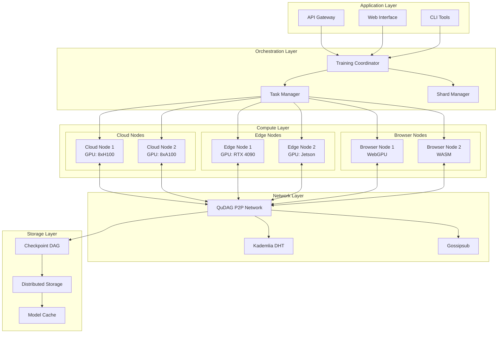

## Network Topology

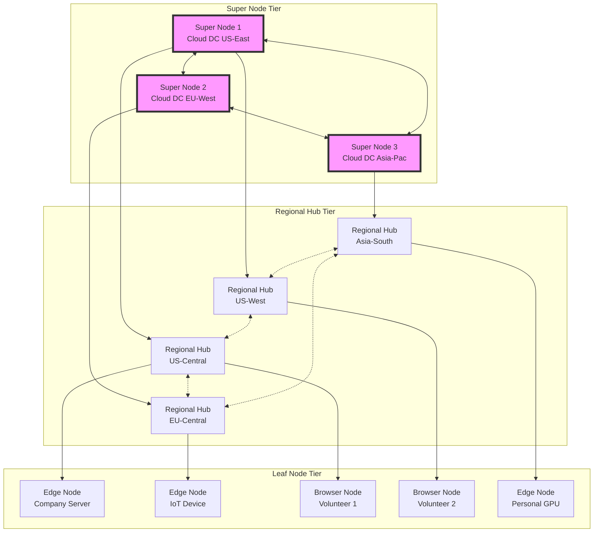

## Training Coordination Flow

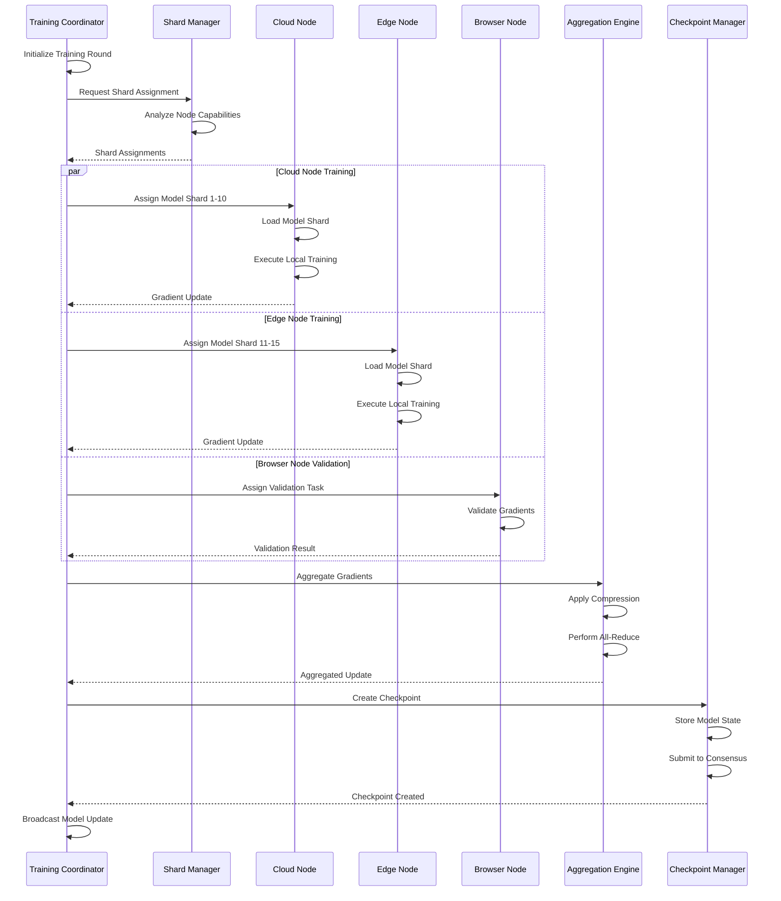

## Model Sharding Strategy

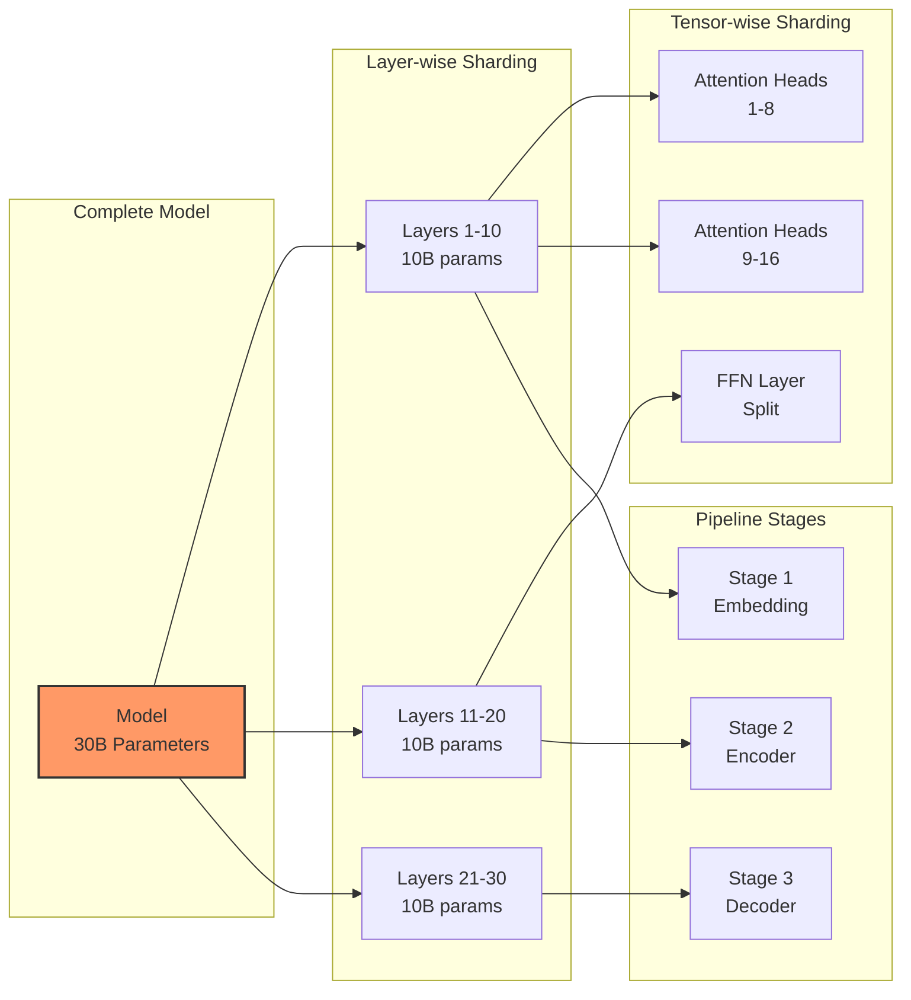

## Checkpoint DAG Structure

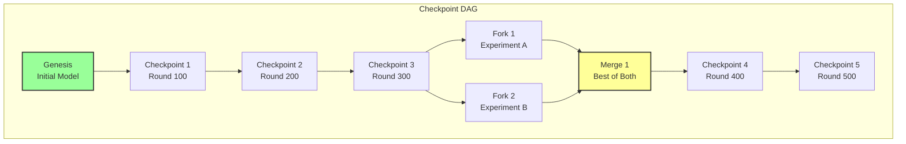

## Data Flow Architecture

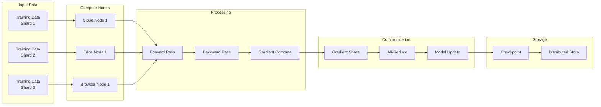

## DAA Autonomy Loop Integration

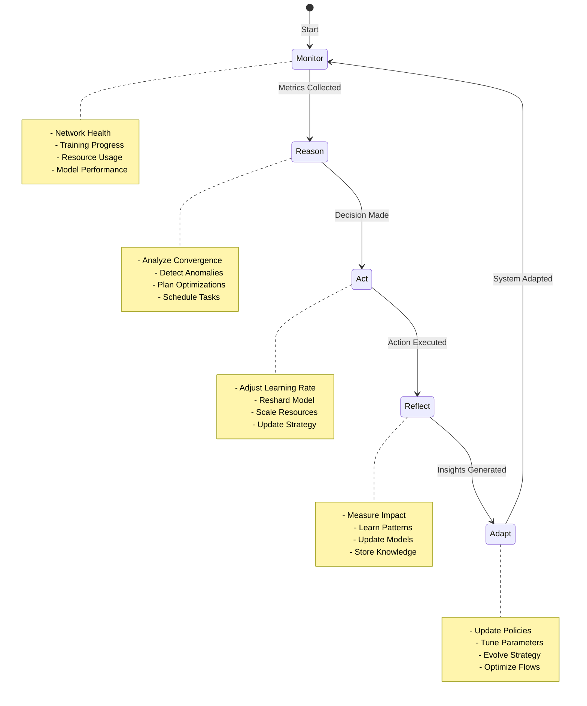

## Security Architecture

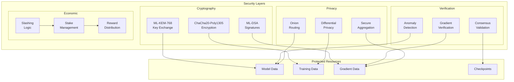

## Resource Allocation

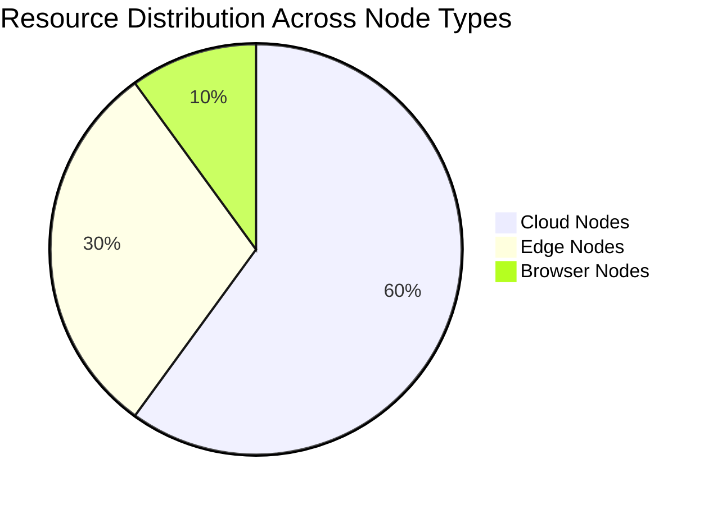

## Performance Metrics Flow

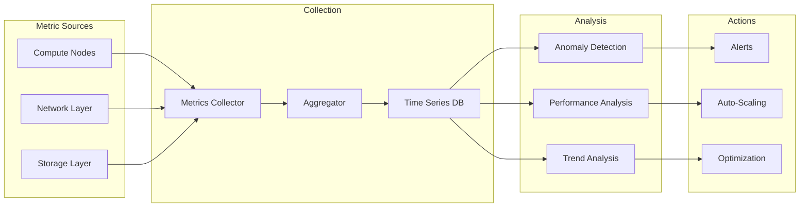

## Fault Tolerance Mechanisms

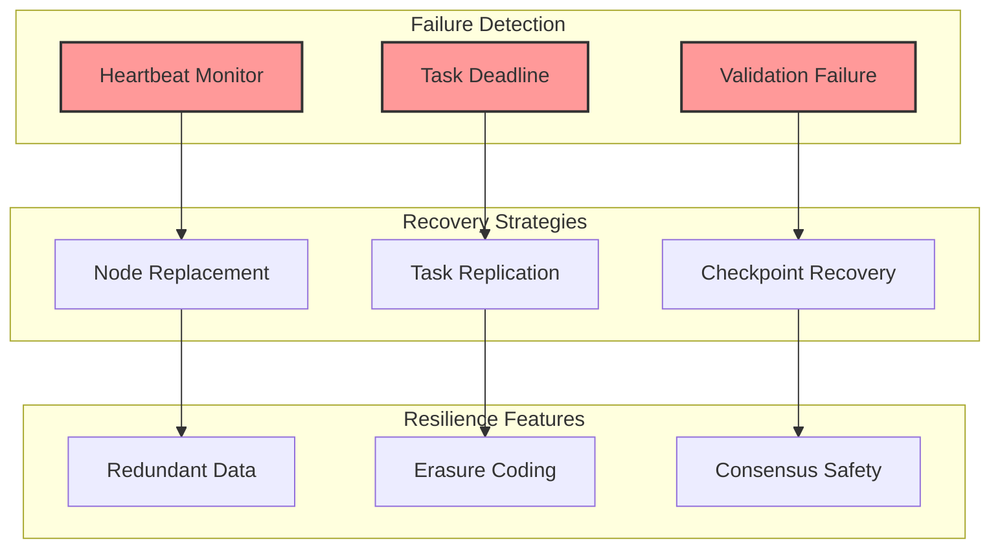

## Communication Patterns

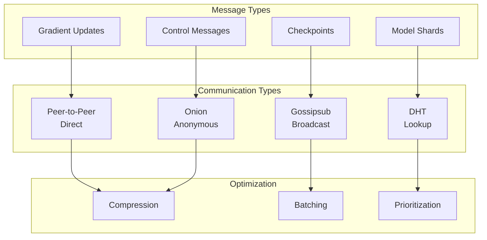