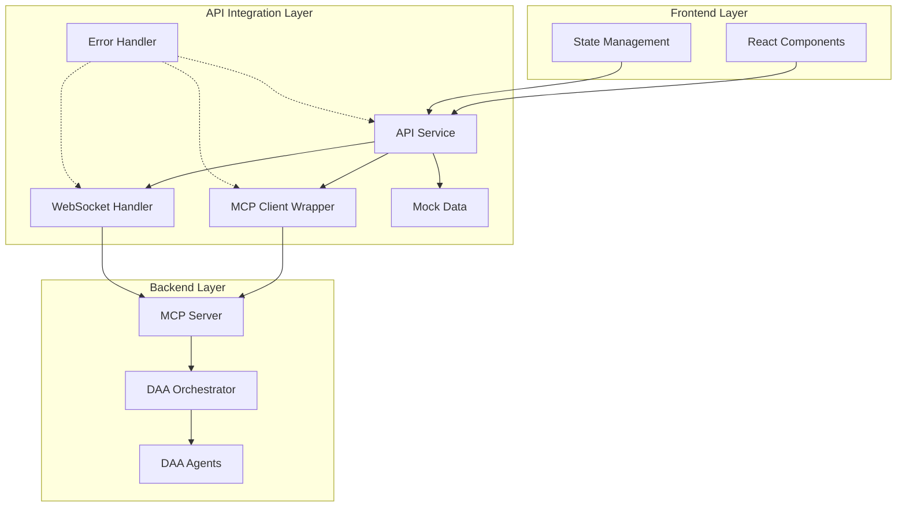
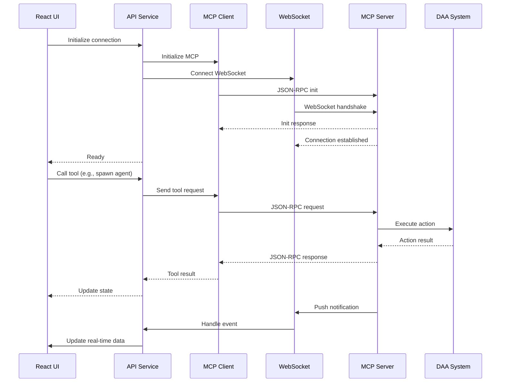
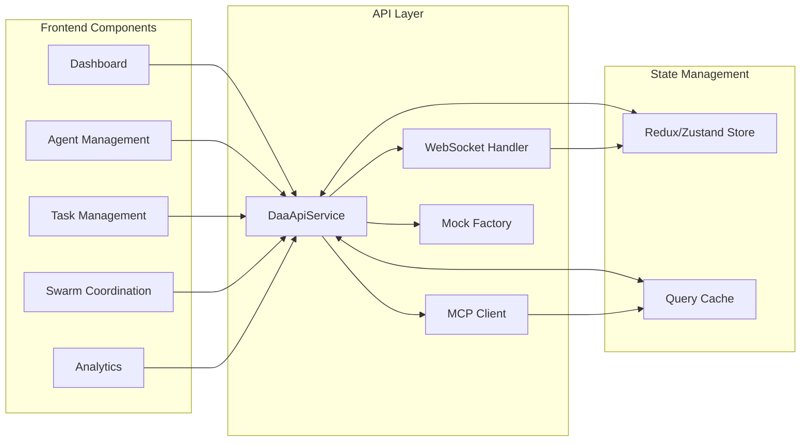

# DAA Dashboard API Integration Design

## Table of Contents
1. [Overview](#overview)
2. [Architecture](#architecture)
3. [TypeScript Interfaces](#typescript-interfaces)
4. [MCP Client Wrapper](#mcp-client-wrapper)
5. [WebSocket Event Handler](#websocket-event-handler)
6. [API Service Layer](#api-service-layer)
7. [Mock Data Factories](#mock-data-factories)
8. [Integration Diagrams](#integration-diagrams)
9. [Error Handling Strategy](#error-handling-strategy)
10. [Security Considerations](#security-considerations)

## Overview

The DAA Dashboard API integration layer provides a robust, type-safe interface between the React frontend and the DAA MCP (Model Context Protocol) server. This design ensures seamless communication with all 17 MCP tools and comprehensive resource monitoring capabilities.

### Key Features
- **Full MCP Protocol Support**: JSON-RPC 2.0 compliant communication
- **Type Safety**: Complete TypeScript interfaces for all DAA entities
- **Real-time Updates**: WebSocket support for live data streaming
- **Resilient Architecture**: Comprehensive error handling and retry mechanisms
- **Development Support**: Mock data factories for offline development

## Architecture



## TypeScript Interfaces

### Core DAA Entities

```typescript
// src/api/types/agent.ts
export interface DaaAgentInfo {
  id: string;
  name: string;
  agent_type: string;
  status: AgentStatus;
  capabilities: string[];
  endpoint?: string;
  created_at: string; // ISO 8601 datetime
  last_seen: string; // ISO 8601 datetime
  metadata: Record<string, any>;
}

export enum AgentStatus {
  Starting = 'starting',
  Running = 'running',
  Paused = 'paused',
  Stopping = 'stopping',
  Stopped = 'stopped',
  Error = 'error'
}

export interface AgentConfig {
  name: string;
  agent_type: string;
  capabilities: string[];
  rules: Record<string, any>;
  economic_config?: EconomicConfig;
  ai_config?: AiConfig;
  metadata: Record<string, any>;
}

export interface EconomicConfig {
  initial_balance: number;
  token_symbol: string;
  max_daily_spend?: number;
  risk_threshold?: number;
}

export interface AiConfig {
  model: string;
  max_tokens?: number;
  temperature?: number;
  system_prompt?: string;
}

// src/api/types/task.ts
export interface DaaTask {
  id: string;
  task_type: string;
  description: string;
  parameters: Record<string, any>;
  priority: TaskPriority;
  timeout?: number; // seconds
  dependencies: string[];
  assigned_agents: string[];
}

export enum TaskPriority {
  Low = 'low',
  Medium = 'medium',
  High = 'high',
  Critical = 'critical'
}

export interface TaskResult {
  task_id: string;
  agent_id: string;
  status: TaskStatus;
  result?: any;
  error?: string;
  started_at: string; // ISO 8601 datetime
  completed_at?: string; // ISO 8601 datetime
  metrics: Record<string, number>;
}

export enum TaskStatus {
  Pending = 'pending',
  Running = 'running',
  Completed = 'completed',
  Failed = 'failed',
  Cancelled = 'cancelled'
}

// src/api/types/swarm.ts
export interface SwarmMessage {
  id: string;
  from_agent: string;
  to_agents: string[];
  message_type: SwarmMessageType;
  payload: any;
  timestamp: string; // ISO 8601 datetime
  ttl?: number; // seconds
}

export enum SwarmMessageType {
  TaskAssignment = 'task_assignment',
  TaskUpdate = 'task_update',
  StateSync = 'state_sync',
  ResourceRequest = 'resource_request',
  ResourceResponse = 'resource_response',
  Heartbeat = 'heartbeat',
  Discovery = 'discovery',
  Coordination = 'coordination'
}

// src/api/types/mcp.ts
export interface McpMessage {
  jsonrpc: string;
  id?: string | number;
  method?: string;
  params?: any;
  result?: any;
  error?: McpError;
}

export interface McpError {
  code: number;
  message: string;
  data?: any;
}

export interface ToolInfo {
  name: string;
  description: string;
  inputSchema: any;
}

export interface ResourceInfo {
  uri: string;
  name: string;
  description: string;
  mime_type?: string;
  annotations?: ResourceAnnotations;
}

export interface ResourceAnnotations {
  audience?: string[];
  priority?: number;
}

export interface Content {
  type: string;
  text: string;
}

export interface ToolResult {
  content?: Content[];
  isError?: boolean;
}
```

## MCP Client Wrapper

```typescript
// src/api/mcp/McpClient.ts
import { McpMessage, McpError, ToolInfo, ResourceInfo, ToolResult } from '../types/mcp';

export interface McpClientConfig {
  serverUrl: string;
  timeout?: number;
  retryAttempts?: number;
  retryDelay?: number;
}

export class McpClient {
  private config: Required<McpClientConfig>;
  private requestId: number = 0;
  
  constructor(config: McpClientConfig) {
    this.config = {
      timeout: 30000,
      retryAttempts: 3,
      retryDelay: 1000,
      ...config
    };
  }

  // Initialize connection
  async initialize(): Promise<void> {
    const response = await this.sendRequest('initialize', {
      protocolVersion: '2025-03-26',
      capabilities: {
        tools: { listChanged: true },
        resources: { subscribe: true, listChanged: true },
        prompts: { listChanged: true }
      },
      clientInfo: {
        name: 'DAA Dashboard',
        version: '1.0.0'
      }
    });
    
    if (response.error) {
      throw new Error(`MCP initialization failed: ${response.error.message}`);
    }
  }

  // Tool methods
  async listTools(): Promise<ToolInfo[]> {
    const response = await this.sendRequest('tools/list');
    return response.result?.tools || [];
  }

  async callTool(name: string, args: any): Promise<ToolResult> {
    const response = await this.sendRequest('tools/call', {
      name,
      arguments: args
    });
    
    if (response.error) {
      throw new Error(`Tool call failed: ${response.error.message}`);
    }
    
    return response.result;
  }

  // Resource methods
  async listResources(): Promise<ResourceInfo[]> {
    const response = await this.sendRequest('resources/list');
    return response.result?.resources || [];
  }

  async readResource(uri: string): Promise<Content[]> {
    const response = await this.sendRequest('resources/read', { uri });
    
    if (response.error) {
      throw new Error(`Resource read failed: ${response.error.message}`);
    }
    
    return response.result?.contents || [];
  }

  // Core request method with retry logic
  private async sendRequest(method: string, params?: any): Promise<McpMessage> {
    const id = ++this.requestId;
    const request: McpMessage = {
      jsonrpc: '2.0',
      id,
      method,
      params
    };

    let lastError: Error | null = null;
    
    for (let attempt = 0; attempt < this.config.retryAttempts; attempt++) {
      try {
        const response = await this.sendHttpRequest(request);
        return response;
      } catch (error) {
        lastError = error as Error;
        if (attempt < this.config.retryAttempts - 1) {
          await this.delay(this.config.retryDelay * (attempt + 1));
        }
      }
    }
    
    throw lastError || new Error('Request failed after all retries');
  }

  private async sendHttpRequest(request: McpMessage): Promise<McpMessage> {
    const controller = new AbortController();
    const timeoutId = setTimeout(() => controller.abort(), this.config.timeout);
    
    try {
      const response = await fetch(this.config.serverUrl, {
        method: 'POST',
        headers: {
          'Content-Type': 'application/json',
        },
        body: JSON.stringify(request),
        signal: controller.signal
      });
      
      if (!response.ok) {
        throw new Error(`HTTP error! status: ${response.status}`);
      }
      
      return await response.json();
    } finally {
      clearTimeout(timeoutId);
    }
  }

  private delay(ms: number): Promise<void> {
    return new Promise(resolve => setTimeout(resolve, ms));
  }
}

// Typed tool wrappers
export class DaaTools {
  constructor(private client: McpClient) {}

  // Agent Management Tools
  async spawnAgent(config: AgentConfig): Promise<string> {
    const result = await this.client.callTool('spawn_agent', { config });
    return this.extractAgentId(result);
  }

  async stopAgent(agentId: string): Promise<void> {
    await this.client.callTool('stop_agent', { agent_id: agentId });
  }

  async pauseAgent(agentId: string): Promise<void> {
    await this.client.callTool('pause_agent', { agent_id: agentId });
  }

  async resumeAgent(agentId: string): Promise<void> {
    await this.client.callTool('resume_agent', { agent_id: agentId });
  }

  async listAgents(filter?: {
    status?: string;
    agent_type?: string;
    capabilities?: string[];
  }): Promise<DaaAgentInfo[]> {
    const result = await this.client.callTool('list_agents', { filter });
    return this.parseJsonContent(result);
  }

  async getAgentInfo(agentId: string): Promise<DaaAgentInfo> {
    const result = await this.client.callTool('get_agent_info', { agent_id: agentId });
    return this.parseJsonContent(result);
  }

  // Task Management Tools
  async createTask(params: {
    task_type: string;
    description: string;
    parameters?: Record<string, any>;
    priority?: TaskPriority;
    timeout?: number;
    dependencies?: string[];
    assigned_agents?: string[];
  }): Promise<string> {
    const result = await this.client.callTool('create_task', params);
    return this.extractTaskId(result);
  }

  async assignTask(taskId: string, agentIds: string[]): Promise<void> {
    await this.client.callTool('assign_task', {
      task_id: taskId,
      agent_ids: agentIds
    });
  }

  async cancelTask(taskId: string): Promise<void> {
    await this.client.callTool('cancel_task', { task_id: taskId });
  }

  async getTaskStatus(taskId: string): Promise<{
    task: DaaTask;
    result?: TaskResult;
    has_result: boolean;
  }> {
    const result = await this.client.callTool('get_task_status', { task_id: taskId });
    return this.parseJsonContent(result);
  }

  async listTasks(filter?: {
    status?: string;
    agent_id?: string;
    task_type?: string;
  }): Promise<Array<{
    task: DaaTask;
    result?: TaskResult;
    status: TaskStatus;
  }>> {
    const result = await this.client.callTool('list_tasks', { filter });
    const data = this.parseJsonContent(result);
    return data.tasks;
  }

  // Swarm Coordination Tools
  async coordinateSwarm(params: {
    objective: string;
    agent_types: string[];
    coordination_strategy?: string;
    max_agents?: number;
    timeout?: number;
  }): Promise<{
    swarm_id: string;
    coordinated_agents: number;
    agents: Array<{
      id: string;
      name: string;
      type: string;
      capabilities: string[];
    }>;
  }> {
    const result = await this.client.callTool('coordinate_swarm', params);
    return this.parseJsonContent(result);
  }

  async sendSwarmMessage(params: {
    from_agent: string;
    to_agents?: string[];
    message_type: string;
    payload: any;
    ttl?: number;
  }): Promise<string> {
    const result = await this.client.callTool('send_swarm_message', params);
    return this.extractMessageId(result);
  }

  async getSwarmStatus(swarmId?: string): Promise<any> {
    const result = await this.client.callTool('get_swarm_status', {
      swarm_id: swarmId
    });
    return this.parseJsonContent(result);
  }

  // Discovery and Monitoring Tools
  async discoverAgents(params: {
    required_capabilities?: string[];
    preferred_capabilities?: string[];
    max_results?: number;
  }): Promise<{
    discovered_agents: DaaAgentInfo[];
    total_found: number;
    search_criteria: any;
  }> {
    const result = await this.client.callTool('discover_agents', params);
    return this.parseJsonContent(result);
  }

  async getSystemMetrics(params?: {
    metric_types?: string[];
    time_range?: string;
  }): Promise<any> {
    const result = await this.client.callTool('get_system_metrics', params || {});
    return this.parseJsonContent(result);
  }

  async healthcheck(deepCheck?: boolean): Promise<{
    overall_status: string;
    timestamp: string;
    components: Record<string, string>;
    deep_check?: any;
  }> {
    const result = await this.client.callTool('healthcheck', {
      deep_check: deepCheck
    });
    return this.parseJsonContent(result);
  }

  // Helper methods
  private parseJsonContent(result: ToolResult): any {
    if (result.isError) {
      throw new Error('Tool execution failed');
    }
    
    const content = result.content?.[0];
    if (!content) {
      throw new Error('No content in tool result');
    }
    
    if (content.type === 'application/json') {
      return JSON.parse(content.text);
    }
    
    // Try to parse text content as JSON
    try {
      return JSON.parse(content.text);
    } catch {
      return content.text;
    }
  }

  private extractAgentId(result: ToolResult): string {
    const text = result.content?.[0]?.text || '';
    const match = text.match(/ID: ([a-f0-9-]+)/);
    return match?.[1] || '';
  }

  private extractTaskId(result: ToolResult): string {
    const text = result.content?.[0]?.text || '';
    const match = text.match(/ID: ([a-f0-9-]+)/);
    return match?.[1] || '';
  }

  private extractMessageId(result: ToolResult): string {
    const text = result.content?.[0]?.text || '';
    const match = text.match(/ID: ([a-f0-9-]+)/);
    return match?.[1] || '';
  }
}
```

## WebSocket Event Handler

```typescript
// src/api/websocket/WebSocketHandler.ts
import { EventEmitter } from 'events';
import { McpMessage } from '../types/mcp';

export enum WebSocketEvent {
  Connected = 'connected',
  Disconnected = 'disconnected',
  Error = 'error',
  Message = 'message',
  Notification = 'notification',
  AgentUpdate = 'agent_update',
  TaskUpdate = 'task_update',
  SwarmMessage = 'swarm_message',
  SystemMetric = 'system_metric',
  ResourceChanged = 'resource_changed'
}

export interface WebSocketConfig {
  url: string;
  reconnect?: boolean;
  reconnectInterval?: number;
  maxReconnectAttempts?: number;
  heartbeatInterval?: number;
}

export class WebSocketHandler extends EventEmitter {
  private ws: WebSocket | null = null;
  private config: Required<WebSocketConfig>;
  private reconnectAttempts = 0;
  private heartbeatTimer?: NodeJS.Timer;
  private reconnectTimer?: NodeJS.Timer;
  private isIntentionallyClosed = false;

  constructor(config: WebSocketConfig) {
    super();
    this.config = {
      reconnect: true,
      reconnectInterval: 5000,
      maxReconnectAttempts: 10,
      heartbeatInterval: 30000,
      ...config
    };
  }

  connect(): void {
    if (this.ws?.readyState === WebSocket.OPEN) {
      return;
    }

    this.isIntentionallyClosed = false;
    this.createWebSocket();
  }

  disconnect(): void {
    this.isIntentionallyClosed = true;
    this.cleanup();
  }

  send(message: McpMessage): void {
    if (this.ws?.readyState === WebSocket.OPEN) {
      this.ws.send(JSON.stringify(message));
    } else {
      throw new Error('WebSocket is not connected');
    }
  }

  // Subscribe to specific resource updates
  async subscribeToResource(uri: string): Promise<void> {
    this.send({
      jsonrpc: '2.0',
      method: 'notifications/resources/subscribe',
      params: { uri }
    });
  }

  // Unsubscribe from resource updates
  async unsubscribeFromResource(uri: string): Promise<void> {
    this.send({
      jsonrpc: '2.0',
      method: 'notifications/resources/unsubscribe',
      params: { uri }
    });
  }

  private createWebSocket(): void {
    try {
      this.ws = new WebSocket(this.config.url);
      this.setupEventHandlers();
    } catch (error) {
      this.handleError(error as Error);
    }
  }

  private setupEventHandlers(): void {
    if (!this.ws) return;

    this.ws.onopen = () => {
      this.reconnectAttempts = 0;
      this.emit(WebSocketEvent.Connected);
      this.startHeartbeat();
    };

    this.ws.onclose = (event) => {
      this.emit(WebSocketEvent.Disconnected, event);
      this.cleanup();
      
      if (!this.isIntentionallyClosed && this.config.reconnect) {
        this.scheduleReconnect();
      }
    };

    this.ws.onerror = (event) => {
      this.handleError(new Error('WebSocket error'));
    };

    this.ws.onmessage = (event) => {
      try {
        const message: McpMessage = JSON.parse(event.data);
        this.handleMessage(message);
      } catch (error) {
        this.handleError(error as Error);
      }
    };
  }

  private handleMessage(message: McpMessage): void {
    // Emit raw message event
    this.emit(WebSocketEvent.Message, message);

    // Handle notifications
    if (!message.id && message.method) {
      this.handleNotification(message);
    }
  }

  private handleNotification(message: McpMessage): void {
    this.emit(WebSocketEvent.Notification, message);

    // Route specific notifications
    switch (message.method) {
      case 'notifications/agent/status':
        this.emit(WebSocketEvent.AgentUpdate, message.params);
        break;
      
      case 'notifications/task/status':
        this.emit(WebSocketEvent.TaskUpdate, message.params);
        break;
      
      case 'notifications/swarm/message':
        this.emit(WebSocketEvent.SwarmMessage, message.params);
        break;
      
      case 'notifications/system/metric':
        this.emit(WebSocketEvent.SystemMetric, message.params);
        break;
      
      case 'notifications/resources/updated':
        this.emit(WebSocketEvent.ResourceChanged, message.params);
        break;
    }
  }

  private handleError(error: Error): void {
    this.emit(WebSocketEvent.Error, error);
  }

  private startHeartbeat(): void {
    this.stopHeartbeat();
    
    this.heartbeatTimer = setInterval(() => {
      if (this.ws?.readyState === WebSocket.OPEN) {
        this.send({
          jsonrpc: '2.0',
          method: 'ping'
        });
      }
    }, this.config.heartbeatInterval);
  }

  private stopHeartbeat(): void {
    if (this.heartbeatTimer) {
      clearInterval(this.heartbeatTimer);
      this.heartbeatTimer = undefined;
    }
  }

  private scheduleReconnect(): void {
    if (this.reconnectAttempts >= this.config.maxReconnectAttempts) {
      this.handleError(new Error('Max reconnection attempts reached'));
      return;
    }

    this.reconnectAttempts++;
    const delay = this.config.reconnectInterval * Math.min(this.reconnectAttempts, 5);

    this.reconnectTimer = setTimeout(() => {
      this.createWebSocket();
    }, delay);
  }

  private cleanup(): void {
    this.stopHeartbeat();
    
    if (this.reconnectTimer) {
      clearTimeout(this.reconnectTimer);
      this.reconnectTimer = undefined;
    }

    if (this.ws) {
      this.ws.onopen = null;
      this.ws.onclose = null;
      this.ws.onerror = null;
      this.ws.onmessage = null;
      
      if (this.ws.readyState === WebSocket.OPEN) {
        this.ws.close();
      }
      
      this.ws = null;
    }
  }
}

// React hook for WebSocket
export function useWebSocket(config: WebSocketConfig) {
  const [isConnected, setIsConnected] = React.useState(false);
  const [error, setError] = React.useState<Error | null>(null);
  const wsRef = React.useRef<WebSocketHandler | null>(null);

  React.useEffect(() => {
    const ws = new WebSocketHandler(config);
    wsRef.current = ws;

    ws.on(WebSocketEvent.Connected, () => {
      setIsConnected(true);
      setError(null);
    });

    ws.on(WebSocketEvent.Disconnected, () => {
      setIsConnected(false);
    });

    ws.on(WebSocketEvent.Error, (err: Error) => {
      setError(err);
    });

    ws.connect();

    return () => {
      ws.disconnect();
    };
  }, [config.url]);

  return {
    ws: wsRef.current,
    isConnected,
    error
  };
}
```

## API Service Layer

```typescript
// src/api/services/DaaApiService.ts
import { McpClient, DaaTools } from '../mcp/McpClient';
import { WebSocketHandler, WebSocketEvent } from '../websocket/WebSocketHandler';
import { 
  DaaAgentInfo, 
  AgentConfig,
  DaaTask, 
  TaskResult,
  SwarmMessage 
} from '../types';
import { MockDataFactory } from '../mock/MockDataFactory';

export interface DaaApiConfig {
  mcpServerUrl: string;
  wsServerUrl: string;
  useMockData?: boolean;
  mockDelay?: number;
}

export class DaaApiService {
  private mcpClient: McpClient;
  private wsHandler: WebSocketHandler;
  private tools: DaaTools;
  private mockFactory?: MockDataFactory;
  private config: DaaApiConfig;
  private eventCallbacks = new Map<string, Set<Function>>();

  constructor(config: DaaApiConfig) {
    this.config = config;
    
    this.mcpClient = new McpClient({
      serverUrl: config.mcpServerUrl
    });
    
    this.tools = new DaaTools(this.mcpClient);
    
    this.wsHandler = new WebSocketHandler({
      url: config.wsServerUrl
    });
    
    if (config.useMockData) {
      this.mockFactory = new MockDataFactory(config.mockDelay || 500);
    }
    
    this.setupWebSocketHandlers();
  }

  async initialize(): Promise<void> {
    if (this.config.useMockData) {
      // Simulate initialization delay
      await new Promise(resolve => setTimeout(resolve, 500));
      return;
    }
    
    await this.mcpClient.initialize();
    this.wsHandler.connect();
  }

  // Agent Management
  async spawnAgent(config: AgentConfig): Promise<string> {
    if (this.config.useMockData) {
      return this.mockFactory!.generateAgentId();
    }
    return this.tools.spawnAgent(config);
  }

  async getAgents(filter?: any): Promise<DaaAgentInfo[]> {
    if (this.config.useMockData) {
      return this.mockFactory!.generateAgents(10);
    }
    return this.tools.listAgents(filter);
  }

  async getAgent(agentId: string): Promise<DaaAgentInfo> {
    if (this.config.useMockData) {
      return this.mockFactory!.generateAgent(agentId);
    }
    return this.tools.getAgentInfo(agentId);
  }

  async stopAgent(agentId: string): Promise<void> {
    if (this.config.useMockData) {
      await this.mockFactory!.delay();
      return;
    }
    return this.tools.stopAgent(agentId);
  }

  async pauseAgent(agentId: string): Promise<void> {
    if (this.config.useMockData) {
      await this.mockFactory!.delay();
      return;
    }
    return this.tools.pauseAgent(agentId);
  }

  async resumeAgent(agentId: string): Promise<void> {
    if (this.config.useMockData) {
      await this.mockFactory!.delay();
      return;
    }
    return this.tools.resumeAgent(agentId);
  }

  // Task Management
  async createTask(params: any): Promise<string> {
    if (this.config.useMockData) {
      return this.mockFactory!.generateTaskId();
    }
    return this.tools.createTask(params);
  }

  async getTasks(filter?: any): Promise<Array<{
    task: DaaTask;
    result?: TaskResult;
    status: string;
  }>> {
    if (this.config.useMockData) {
      return this.mockFactory!.generateTasks(15);
    }
    return this.tools.listTasks(filter);
  }

  async getTaskStatus(taskId: string): Promise<any> {
    if (this.config.useMockData) {
      return this.mockFactory!.generateTaskStatus(taskId);
    }
    return this.tools.getTaskStatus(taskId);
  }

  async cancelTask(taskId: string): Promise<void> {
    if (this.config.useMockData) {
      await this.mockFactory!.delay();
      return;
    }
    return this.tools.cancelTask(taskId);
  }

  // Swarm Coordination
  async coordinateSwarm(params: any): Promise<any> {
    if (this.config.useMockData) {
      return this.mockFactory!.generateSwarmCoordination(params);
    }
    return this.tools.coordinateSwarm(params);
  }

  async sendSwarmMessage(params: any): Promise<string> {
    if (this.config.useMockData) {
      return this.mockFactory!.generateMessageId();
    }
    return this.tools.sendSwarmMessage(params);
  }

  async getSwarmStatus(swarmId?: string): Promise<any> {
    if (this.config.useMockData) {
      return this.mockFactory!.generateSwarmStatus(swarmId);
    }
    return this.tools.getSwarmStatus(swarmId);
  }

  // Discovery and Monitoring
  async discoverAgents(params: any): Promise<any> {
    if (this.config.useMockData) {
      return this.mockFactory!.generateDiscoveryResults(params);
    }
    return this.tools.discoverAgents(params);
  }

  async getSystemMetrics(params?: any): Promise<any> {
    if (this.config.useMockData) {
      return this.mockFactory!.generateSystemMetrics();
    }
    return this.tools.getSystemMetrics(params);
  }

  async performHealthcheck(deep?: boolean): Promise<any> {
    if (this.config.useMockData) {
      return this.mockFactory!.generateHealthcheck(deep);
    }
    return this.tools.healthcheck(deep);
  }

  // Resource Access
  async readResource(uri: string): Promise<any> {
    if (this.config.useMockData) {
      return this.mockFactory!.generateResourceData(uri);
    }
    
    const contents = await this.mcpClient.readResource(uri);
    
    // Parse JSON content if available
    if (contents.length > 0 && contents[0].type === 'application/json') {
      return JSON.parse(contents[0].text);
    }
    
    return contents[0]?.text || null;
  }

  // Event Subscription
  on(event: string, callback: Function): void {
    if (!this.eventCallbacks.has(event)) {
      this.eventCallbacks.set(event, new Set());
    }
    this.eventCallbacks.get(event)!.add(callback);
  }

  off(event: string, callback: Function): void {
    this.eventCallbacks.get(event)?.delete(callback);
  }

  // WebSocket resource subscription
  async subscribeToResource(uri: string): Promise<void> {
    if (this.config.useMockData) {
      // Simulate real-time updates with mock data
      setInterval(() => {
        const mockUpdate = this.mockFactory!.generateResourceUpdate(uri);
        this.emitEvent('resource_update', { uri, data: mockUpdate });
      }, 5000);
      return;
    }
    
    await this.wsHandler.subscribeToResource(uri);
  }

  async unsubscribeFromResource(uri: string): Promise<void> {
    if (this.config.useMockData) {
      return;
    }
    
    await this.wsHandler.unsubscribeFromResource(uri);
  }

  // Cleanup
  disconnect(): void {
    this.wsHandler.disconnect();
  }

  private setupWebSocketHandlers(): void {
    // Forward WebSocket events to service event emitter
    this.wsHandler.on(WebSocketEvent.AgentUpdate, (data) => {
      this.emitEvent('agent_update', data);
    });

    this.wsHandler.on(WebSocketEvent.TaskUpdate, (data) => {
      this.emitEvent('task_update', data);
    });

    this.wsHandler.on(WebSocketEvent.SwarmMessage, (data) => {
      this.emitEvent('swarm_message', data);
    });

    this.wsHandler.on(WebSocketEvent.SystemMetric, (data) => {
      this.emitEvent('system_metric', data);
    });

    this.wsHandler.on(WebSocketEvent.ResourceChanged, (data) => {
      this.emitEvent('resource_changed', data);
    });

    this.wsHandler.on(WebSocketEvent.Error, (error) => {
      this.emitEvent('error', error);
    });

    this.wsHandler.on(WebSocketEvent.Connected, () => {
      this.emitEvent('connected');
    });

    this.wsHandler.on(WebSocketEvent.Disconnected, () => {
      this.emitEvent('disconnected');
    });
  }

  private emitEvent(event: string, data?: any): void {
    this.eventCallbacks.get(event)?.forEach(callback => {
      try {
        callback(data);
      } catch (error) {
        console.error(`Error in event callback for ${event}:`, error);
      }
    });
  }
}

// React hook for API service
export function useDaaApi() {
  const [api, setApi] = React.useState<DaaApiService | null>(null);
  const [isInitialized, setIsInitialized] = React.useState(false);
  const [error, setError] = React.useState<Error | null>(null);

  React.useEffect(() => {
    const apiService = new DaaApiService({
      mcpServerUrl: import.meta.env.VITE_MCP_SERVER_URL || 'http://localhost:3001/mcp',
      wsServerUrl: import.meta.env.VITE_WS_SERVER_URL || 'ws://localhost:3001/mcp/ws',
      useMockData: import.meta.env.VITE_USE_MOCK_DATA === 'true'
    });

    apiService.initialize()
      .then(() => {
        setApi(apiService);
        setIsInitialized(true);
      })
      .catch((err) => {
        setError(err);
      });

    return () => {
      apiService.disconnect();
    };
  }, []);

  return { api, isInitialized, error };
}
```

## Mock Data Factories

```typescript
// src/api/mock/MockDataFactory.ts
import { v4 as uuidv4 } from 'uuid';
import { 
  DaaAgentInfo, 
  AgentStatus,
  DaaTask,
  TaskStatus,
  TaskPriority,
  TaskResult,
  SwarmMessage,
  SwarmMessageType
} from '../types';

export class MockDataFactory {
  constructor(private defaultDelay: number = 500) {}

  async delay(ms?: number): Promise<void> {
    return new Promise(resolve => setTimeout(resolve, ms || this.defaultDelay));
  }

  generateAgentId(): string {
    return `agent-${uuidv4()}`;
  }

  generateTaskId(): string {
    return `task-${uuidv4()}`;
  }

  generateMessageId(): string {
    return `msg-${uuidv4()}`;
  }

  generateAgent(id?: string): DaaAgentInfo {
    const agentTypes = ['treasury', 'defi', 'security', 'analytics', 'trader'];
    const statuses = [AgentStatus.Running, AgentStatus.Paused, AgentStatus.Stopped];
    
    return {
      id: id || this.generateAgentId(),
      name: `${this.randomElement(['Alpha', 'Beta', 'Gamma', 'Delta'])} ${this.randomElement(['Bot', 'Agent', 'System'])}`,
      agent_type: this.randomElement(agentTypes),
      status: this.randomElement(statuses),
      capabilities: this.randomSubset([
        'trading', 'risk_management', 'analytics', 
        'security_monitoring', 'yield_optimization',
        'market_making', 'arbitrage', 'reporting'
      ], 2, 5),
      endpoint: `http://localhost:${3000 + Math.floor(Math.random() * 100)}`,
      created_at: new Date(Date.now() - Math.random() * 86400000 * 30).toISOString(),
      last_seen: new Date(Date.now() - Math.random() * 3600000).toISOString(),
      metadata: {
        version: '1.0.0',
        region: this.randomElement(['us-east', 'eu-west', 'asia-pacific']),
        performance_score: Math.random() * 100
      }
    };
  }

  generateAgents(count: number): DaaAgentInfo[] {
    return Array.from({ length: count }, () => this.generateAgent());
  }

  generateTask(id?: string): DaaTask {
    const taskTypes = ['analysis', 'trading', 'monitoring', 'optimization', 'reporting'];
    
    return {
      id: id || this.generateTaskId(),
      task_type: this.randomElement(taskTypes),
      description: `${this.randomElement(['Analyze', 'Monitor', 'Optimize', 'Execute'])} ${this.randomElement(['market conditions', 'portfolio performance', 'risk metrics', 'trading strategy'])}`,
      parameters: {
        timeframe: this.randomElement(['1h', '4h', '1d', '1w']),
        threshold: Math.random() * 100,
        enabled: Math.random() > 0.5
      },
      priority: this.randomElement([
        TaskPriority.Low,
        TaskPriority.Medium,
        TaskPriority.High,
        TaskPriority.Critical
      ]),
      timeout: Math.floor(Math.random() * 3600) + 60,
      dependencies: Math.random() > 0.7 ? [this.generateTaskId()] : [],
      assigned_agents: Math.random() > 0.5 ? [this.generateAgentId()] : []
    };
  }

  generateTaskResult(taskId: string, agentId?: string): TaskResult {
    const statuses = [
      TaskStatus.Pending,
      TaskStatus.Running,
      TaskStatus.Completed,
      TaskStatus.Failed
    ];
    
    const status = this.randomElement(statuses);
    const startedAt = new Date(Date.now() - Math.random() * 3600000);
    
    return {
      task_id: taskId,
      agent_id: agentId || this.generateAgentId(),
      status,
      result: status === TaskStatus.Completed ? {
        success: true,
        data: { value: Math.random() * 1000 }
      } : undefined,
      error: status === TaskStatus.Failed ? 'Task execution failed' : undefined,
      started_at: startedAt.toISOString(),
      completed_at: status === TaskStatus.Completed || status === TaskStatus.Failed
        ? new Date(startedAt.getTime() + Math.random() * 60000).toISOString()
        : undefined,
      metrics: {
        execution_time: Math.random() * 60,
        cpu_usage: Math.random() * 100,
        memory_usage: Math.random() * 100
      }
    };
  }

  generateTasks(count: number): Array<{
    task: DaaTask;
    result?: TaskResult;
    status: TaskStatus;
  }> {
    return Array.from({ length: count }, () => {
      const task = this.generateTask();
      const hasResult = Math.random() > 0.3;
      const result = hasResult ? this.generateTaskResult(task.id) : undefined;
      
      return {
        task,
        result,
        status: result?.status || TaskStatus.Pending
      };
    });
  }

  generateTaskStatus(taskId: string): {
    task: DaaTask;
    result?: TaskResult;
    has_result: boolean;
  } {
    const task = this.generateTask(taskId);
    const hasResult = Math.random() > 0.3;
    const result = hasResult ? this.generateTaskResult(taskId) : undefined;
    
    return {
      task,
      result,
      has_result: hasResult
    };
  }

  generateSwarmMessage(): SwarmMessage {
    return {
      id: this.generateMessageId(),
      from_agent: this.generateAgentId(),
      to_agents: Math.random() > 0.5 
        ? Array.from({ length: Math.floor(Math.random() * 5) + 1 }, () => this.generateAgentId())
        : [],
      message_type: this.randomElement([
        SwarmMessageType.TaskAssignment,
        SwarmMessageType.TaskUpdate,
        SwarmMessageType.StateSync,
        SwarmMessageType.Coordination
      ]),
      payload: {
        action: this.randomElement(['start', 'update', 'complete', 'coordinate']),
        data: { value: Math.random() * 100 }
      },
      timestamp: new Date().toISOString(),
      ttl: Math.random() > 0.5 ? Math.floor(Math.random() * 300) + 60 : undefined
    };
  }

  generateSwarmCoordination(params: any): any {
    const swarmId = `swarm-${uuidv4()}`;
    const agentCount = params.max_agents || 5;
    
    return {
      swarm_id: swarmId,
      coordinated_agents: agentCount,
      agents: Array.from({ length: agentCount }, () => {
        const agent = this.generateAgent();
        return {
          id: agent.id,
          name: agent.name,
          type: agent.agent_type,
          capabilities: agent.capabilities
        };
      }),
      objective: params.objective
    };
  }

  generateSwarmStatus(swarmId?: string): any {
    const totalAgents = Math.floor(Math.random() * 20) + 5;
    const activeAgents = Math.floor(totalAgents * (0.5 + Math.random() * 0.5));
    
    return {
      swarm_id: swarmId || `swarm-${uuidv4()}`,
      total_agents: totalAgents,
      active_agents: activeAgents,
      total_messages: Math.floor(Math.random() * 1000),
      agent_types: {
        treasury: Math.floor(Math.random() * 5) + 1,
        defi: Math.floor(Math.random() * 5) + 1,
        security: Math.floor(Math.random() * 3) + 1,
        analytics: Math.floor(Math.random() * 4) + 1
      }
    };
  }

  generateDiscoveryResults(params: any): any {
    const agents = this.generateAgents(10)
      .filter(agent => {
        if (params.required_capabilities) {
          return params.required_capabilities.every((cap: string) => 
            agent.capabilities.includes(cap)
          );
        }
        return true;
      })
      .slice(0, params.max_results || 10);

    return {
      discovered_agents: agents,
      total_found: agents.length,
      search_criteria: params
    };
  }

  generateSystemMetrics(): any {
    return {
      agents: {
        total: Math.floor(Math.random() * 50) + 10,
        running: Math.floor(Math.random() * 40) + 5,
        paused: Math.floor(Math.random() * 10),
        stopped: Math.floor(Math.random() * 10),
        error: Math.floor(Math.random() * 5)
      },
      tasks: {
        total: Math.floor(Math.random() * 200) + 50,
        pending: Math.floor(Math.random() * 50),
        running: Math.floor(Math.random() * 30),
        completed: Math.floor(Math.random() * 100) + 20,
        failed: Math.floor(Math.random() * 20),
        cancelled: Math.floor(Math.random() * 10)
      },
      swarm: {
        total_messages: Math.floor(Math.random() * 1000) + 100,
        recent_messages: Math.floor(Math.random() * 100)
      },
      system: {
        uptime: 'running',
        version: '0.2.0',
        timestamp: new Date().toISOString()
      }
    };
  }

  generateHealthcheck(deep?: boolean): any {
    const isHealthy = Math.random() > 0.1;
    
    const result = {
      overall_status: isHealthy ? 'healthy' : 'degraded',
      timestamp: new Date().toISOString(),
      components: {
        mcp_server: 'healthy',
        agent_manager: isHealthy ? 'healthy' : 'degraded',
        task_manager: 'healthy',
        swarm_coordinator: 'healthy'
      }
    };

    if (deep) {
      result['deep_check'] = {
        performed: true,
        agent_response_times: 'normal',
        memory_usage: 'normal',
        disk_space: 'normal',
        network_connectivity: 'normal'
      };
    }

    return result;
  }

  generateResourceData(uri: string): any {
    // Generate appropriate mock data based on resource URI
    if (uri.includes('/agents')) {
      if (uri.includes('/logs')) {
        return this.generateLogs();
      } else if (uri.includes('/metrics')) {
        return this.generateAgentMetrics();
      } else {
        return this.generateAgents(10);
      }
    } else if (uri.includes('/tasks')) {
      return this.generateTasks(15);
    } else if (uri.includes('/swarm')) {
      return this.generateSwarmStatus();
    } else if (uri.includes('/system')) {
      return this.generateSystemMetrics();
    }
    
    return { message: 'Mock resource data', uri };
  }

  generateResourceUpdate(uri: string): any {
    // Generate incremental updates for resources
    if (uri.includes('/metrics')) {
      return {
        cpu_usage: Math.random() * 100,
        memory_usage: Math.random() * 100,
        timestamp: new Date().toISOString()
      };
    } else if (uri.includes('/agents')) {
      return {
        agent_id: this.generateAgentId(),
        status: this.randomElement([AgentStatus.Running, AgentStatus.Paused]),
        last_seen: new Date().toISOString()
      };
    }
    
    return { updated: true, timestamp: new Date().toISOString() };
  }

  private generateLogs(): string {
    const logLevels = ['INFO', 'DEBUG', 'WARN', 'ERROR'];
    const messages = [
      'Agent started successfully',
      'Processing task',
      'Task completed',
      'Connection established',
      'Heartbeat received',
      'State synchronized'
    ];
    
    const logs = Array.from({ length: 20 }, () => {
      const timestamp = new Date(Date.now() - Math.random() * 3600000).toISOString();
      const level = this.randomElement(logLevels);
      const message = this.randomElement(messages);
      return `[${timestamp}] ${level} ${message}`;
    });
    
    return logs.join('\n');
  }

  private generateAgentMetrics(): any {
    return {
      agent_id: this.generateAgentId(),
      uptime: Math.floor(Math.random() * 86400),
      performance: {
        cpu_usage: Math.random() * 100,
        memory_usage: Math.random() * 100,
        task_completion_rate: 0.8 + Math.random() * 0.2,
        average_response_time: Math.random() * 500
      },
      counters: {
        tasks_completed: Math.floor(Math.random() * 100),
        tasks_failed: Math.floor(Math.random() * 10),
        messages_sent: Math.floor(Math.random() * 200),
        messages_received: Math.floor(Math.random() * 250)
      },
      timestamp: new Date().toISOString()
    };
  }

  private randomElement<T>(array: T[]): T {
    return array[Math.floor(Math.random() * array.length)];
  }

  private randomSubset<T>(array: T[], min: number, max: number): T[] {
    const count = Math.floor(Math.random() * (max - min + 1)) + min;
    const shuffled = [...array].sort(() => 0.5 - Math.random());
    return shuffled.slice(0, count);
  }
}
```

## Integration Diagrams

### Data Flow Architecture



### Component Interaction



## Error Handling Strategy

```typescript
// src/api/errors/ErrorHandler.ts
export enum ErrorCode {
  // Network errors
  NetworkError = 'NETWORK_ERROR',
  ConnectionTimeout = 'CONNECTION_TIMEOUT',
  ConnectionLost = 'CONNECTION_LOST',
  
  // Protocol errors
  ProtocolError = 'PROTOCOL_ERROR',
  InvalidRequest = 'INVALID_REQUEST',
  InvalidResponse = 'INVALID_RESPONSE',
  
  // Business logic errors
  AgentNotFound = 'AGENT_NOT_FOUND',
  TaskNotFound = 'TASK_NOT_FOUND',
  UnauthorizedAction = 'UNAUTHORIZED_ACTION',
  ResourceUnavailable = 'RESOURCE_UNAVAILABLE',
  
  // System errors
  ServerError = 'SERVER_ERROR',
  ServiceUnavailable = 'SERVICE_UNAVAILABLE',
  RateLimitExceeded = 'RATE_LIMIT_EXCEEDED'
}

export class DaaError extends Error {
  constructor(
    public code: ErrorCode,
    message: string,
    public details?: any,
    public retryable: boolean = false
  ) {
    super(message);
    this.name = 'DaaError';
  }
}

export class ErrorHandler {
  private static retryableErrors = new Set([
    ErrorCode.NetworkError,
    ErrorCode.ConnectionTimeout,
    ErrorCode.ServiceUnavailable
  ]);

  static handle(error: any): DaaError {
    // Already a DaaError
    if (error instanceof DaaError) {
      return error;
    }

    // Network errors
    if (error instanceof TypeError && error.message.includes('fetch')) {
      return new DaaError(
        ErrorCode.NetworkError,
        'Network request failed',
        error,
        true
      );
    }

    // MCP protocol errors
    if (error.code && error.message) {
      return new DaaError(
        ErrorCode.ProtocolError,
        error.message,
        { code: error.code, data: error.data },
        false
      );
    }

    // Generic errors
    return new DaaError(
      ErrorCode.ServerError,
      error.message || 'An unexpected error occurred',
      error,
      false
    );
  }

  static isRetryable(error: DaaError): boolean {
    return error.retryable || this.retryableErrors.has(error.code);
  }

  static async withRetry<T>(
    operation: () => Promise<T>,
    maxAttempts: number = 3,
    backoffMs: number = 1000
  ): Promise<T> {
    let lastError: DaaError;
    
    for (let attempt = 0; attempt < maxAttempts; attempt++) {
      try {
        return await operation();
      } catch (error) {
        lastError = this.handle(error);
        
        if (!this.isRetryable(lastError) || attempt === maxAttempts - 1) {
          throw lastError;
        }
        
        // Exponential backoff
        await new Promise(resolve => 
          setTimeout(resolve, backoffMs * Math.pow(2, attempt))
        );
      }
    }
    
    throw lastError!;
  }
}

// React error boundary
export class ApiErrorBoundary extends React.Component<
  { children: React.ReactNode; fallback?: React.ComponentType<{ error: DaaError }> },
  { error: DaaError | null }
> {
  state = { error: null };

  static getDerivedStateFromError(error: any) {
    return { error: ErrorHandler.handle(error) };
  }

  componentDidCatch(error: any, errorInfo: any) {
    console.error('API Error:', error, errorInfo);
  }

  render() {
    if (this.state.error) {
      const Fallback = this.props.fallback || DefaultErrorFallback;
      return <Fallback error={this.state.error} />;
    }

    return this.props.children;
  }
}

function DefaultErrorFallback({ error }: { error: DaaError }) {
  return (
    <div className="error-fallback">
      <h2>Something went wrong</h2>
      <p>{error.message}</p>
      <details>
        <summary>Error details</summary>
        <pre>{JSON.stringify(error.details, null, 2)}</pre>
      </details>
    </div>
  );
}
```

## Security Considerations

### Authentication & Authorization

```typescript
// src/api/auth/AuthManager.ts
export interface AuthConfig {
  authEndpoint: string;
  tokenStorage: 'localStorage' | 'sessionStorage' | 'memory';
  refreshThreshold: number; // seconds before expiry
}

export class AuthManager {
  private token: string | null = null;
  private refreshToken: string | null = null;
  private tokenExpiry: Date | null = null;
  
  constructor(private config: AuthConfig) {
    this.loadStoredTokens();
  }

  async authenticate(credentials: { username: string; password: string }): Promise<void> {
    const response = await fetch(this.config.authEndpoint, {
      method: 'POST',
      headers: { 'Content-Type': 'application/json' },
      body: JSON.stringify(credentials)
    });

    if (!response.ok) {
      throw new Error('Authentication failed');
    }

    const data = await response.json();
    this.setTokens(data.access_token, data.refresh_token, data.expires_in);
  }

  async getValidToken(): Promise<string> {
    if (!this.token) {
      throw new Error('Not authenticated');
    }

    // Check if token needs refresh
    if (this.shouldRefreshToken()) {
      await this.refreshAccessToken();
    }

    return this.token!;
  }

  private shouldRefreshToken(): boolean {
    if (!this.tokenExpiry) return true;
    
    const now = new Date();
    const timeUntilExpiry = this.tokenExpiry.getTime() - now.getTime();
    return timeUntilExpiry < this.config.refreshThreshold * 1000;
  }

  private async refreshAccessToken(): Promise<void> {
    if (!this.refreshToken) {
      throw new Error('No refresh token available');
    }

    // Implement token refresh logic
    // Update tokens after successful refresh
  }

  private setTokens(accessToken: string, refreshToken: string, expiresIn: number): void {
    this.token = accessToken;
    this.refreshToken = refreshToken;
    this.tokenExpiry = new Date(Date.now() + expiresIn * 1000);
    
    // Store tokens based on configuration
    if (this.config.tokenStorage !== 'memory') {
      const storage = this.config.tokenStorage === 'localStorage' 
        ? localStorage 
        : sessionStorage;
      
      storage.setItem('daa_access_token', accessToken);
      storage.setItem('daa_refresh_token', refreshToken);
      storage.setItem('daa_token_expiry', this.tokenExpiry.toISOString());
    }
  }

  private loadStoredTokens(): void {
    if (this.config.tokenStorage === 'memory') return;
    
    const storage = this.config.tokenStorage === 'localStorage' 
      ? localStorage 
      : sessionStorage;
    
    this.token = storage.getItem('daa_access_token');
    this.refreshToken = storage.getItem('daa_refresh_token');
    
    const expiry = storage.getItem('daa_token_expiry');
    if (expiry) {
      this.tokenExpiry = new Date(expiry);
    }
  }
}

// Request interceptor for authenticated requests
export function withAuth(authManager: AuthManager) {
  return async (request: RequestInit): Promise<RequestInit> => {
    const token = await authManager.getValidToken();
    
    return {
      ...request,
      headers: {
        ...request.headers,
        'Authorization': `Bearer ${token}`
      }
    };
  };
}
```

### Data Encryption

```typescript
// src/api/security/Encryption.ts
export class EncryptionService {
  private key: CryptoKey | null = null;

  async initialize(password: string): Promise<void> {
    const encoder = new TextEncoder();
    const keyMaterial = await crypto.subtle.importKey(
      'raw',
      encoder.encode(password),
      { name: 'PBKDF2' },
      false,
      ['deriveKey']
    );

    this.key = await crypto.subtle.deriveKey(
      {
        name: 'PBKDF2',
        salt: encoder.encode('daa-dashboard-salt'),
        iterations: 100000,
        hash: 'SHA-256'
      },
      keyMaterial,
      { name: 'AES-GCM', length: 256 },
      false,
      ['encrypt', 'decrypt']
    );
  }

  async encrypt(data: string): Promise<string> {
    if (!this.key) throw new Error('Encryption not initialized');

    const encoder = new TextEncoder();
    const iv = crypto.getRandomValues(new Uint8Array(12));
    
    const encrypted = await crypto.subtle.encrypt(
      { name: 'AES-GCM', iv },
      this.key,
      encoder.encode(data)
    );

    const combined = new Uint8Array(iv.length + encrypted.byteLength);
    combined.set(iv);
    combined.set(new Uint8Array(encrypted), iv.length);

    return btoa(String.fromCharCode(...combined));
  }

  async decrypt(encryptedData: string): Promise<string> {
    if (!this.key) throw new Error('Encryption not initialized');

    const combined = Uint8Array.from(atob(encryptedData), c => c.charCodeAt(0));
    const iv = combined.slice(0, 12);
    const data = combined.slice(12);

    const decrypted = await crypto.subtle.decrypt(
      { name: 'AES-GCM', iv },
      this.key,
      data
    );

    const decoder = new TextDecoder();
    return decoder.decode(decrypted);
  }
}
```

## Usage Examples

### Basic Setup

```typescript
// src/App.tsx
import { DaaApiService } from './api/services/DaaApiService';
import { ApiErrorBoundary } from './api/errors/ErrorHandler';

function App() {
  return (
    <ApiErrorBoundary>
      <DaaProvider>
        <Dashboard />
      </DaaProvider>
    </ApiErrorBoundary>
  );
}

// src/contexts/DaaContext.tsx
const DaaContext = React.createContext<DaaApiService | null>(null);

export function DaaProvider({ children }: { children: React.ReactNode }) {
  const { api, isInitialized, error } = useDaaApi();

  if (error) {
    return <div>Failed to initialize API: {error.message}</div>;
  }

  if (!isInitialized) {
    return <div>Initializing...</div>;
  }

  return (
    <DaaContext.Provider value={api}>
      {children}
    </DaaContext.Provider>
  );
}

export function useDaa() {
  const context = React.useContext(DaaContext);
  if (!context) {
    throw new Error('useDaa must be used within DaaProvider');
  }
  return context;
}
```

### Component Usage

```typescript
// src/components/AgentList.tsx
import { useDaa } from '../contexts/DaaContext';
import { DaaAgentInfo } from '../api/types';

export function AgentList() {
  const api = useDaa();
  const [agents, setAgents] = React.useState<DaaAgentInfo[]>([]);
  const [loading, setLoading] = React.useState(true);

  React.useEffect(() => {
    loadAgents();
    
    // Subscribe to real-time updates
    api.on('agent_update', handleAgentUpdate);
    
    return () => {
      api.off('agent_update', handleAgentUpdate);
    };
  }, []);

  const loadAgents = async () => {
    try {
      setLoading(true);
      const data = await api.getAgents();
      setAgents(data);
    } catch (error) {
      console.error('Failed to load agents:', error);
    } finally {
      setLoading(false);
    }
  };

  const handleAgentUpdate = (update: any) => {
    setAgents(prev => 
      prev.map(agent => 
        agent.id === update.agent_id 
          ? { ...agent, ...update }
          : agent
      )
    );
  };

  const handleStopAgent = async (agentId: string) => {
    try {
      await api.stopAgent(agentId);
      await loadAgents(); // Reload to get updated status
    } catch (error) {
      console.error('Failed to stop agent:', error);
    }
  };

  if (loading) return <div>Loading agents...</div>;

  return (
    <div className="agent-list">
      {agents.map(agent => (
        <div key={agent.id} className="agent-card">
          <h3>{agent.name}</h3>
          <p>Type: {agent.agent_type}</p>
          <p>Status: {agent.status}</p>
          <button onClick={() => handleStopAgent(agent.id)}>
            Stop Agent
          </button>
        </div>
      ))}
    </div>
  );
}
```

## Testing Strategy

```typescript
// src/api/__tests__/DaaApiService.test.ts
import { DaaApiService } from '../services/DaaApiService';
import { MockDataFactory } from '../mock/MockDataFactory';

describe('DaaApiService', () => {
  let api: DaaApiService;
  let mockFactory: MockDataFactory;

  beforeEach(() => {
    api = new DaaApiService({
      mcpServerUrl: 'http://localhost:3001/mcp',
      wsServerUrl: 'ws://localhost:3001/mcp/ws',
      useMockData: true
    });
    
    mockFactory = new MockDataFactory();
  });

  afterEach(() => {
    api.disconnect();
  });

  test('should initialize successfully', async () => {
    await expect(api.initialize()).resolves.not.toThrow();
  });

  test('should fetch agents', async () => {
    const agents = await api.getAgents();
    expect(agents).toBeInstanceOf(Array);
    expect(agents.length).toBeGreaterThan(0);
    expect(agents[0]).toHaveProperty('id');
    expect(agents[0]).toHaveProperty('name');
    expect(agents[0]).toHaveProperty('status');
  });

  test('should create and fetch task', async () => {
    const taskId = await api.createTask({
      task_type: 'analysis',
      description: 'Test task',
      priority: 'medium'
    });
    
    expect(taskId).toBeTruthy();
    
    const status = await api.getTaskStatus(taskId);
    expect(status.task.id).toBe(taskId);
  });

  test('should handle errors gracefully', async () => {
    // Test with invalid agent ID
    await expect(api.getAgent('invalid-id')).resolves.toBeTruthy();
    // In mock mode, it should still return data
  });
});
```

## Performance Optimization

```typescript
// src/api/cache/QueryCache.ts
export class QueryCache {
  private cache = new Map<string, { 
    data: any; 
    timestamp: number; 
    ttl: number 
  }>();

  set(key: string, data: any, ttl: number = 60000): void {
    this.cache.set(key, {
      data,
      timestamp: Date.now(),
      ttl
    });
  }

  get(key: string): any | null {
    const entry = this.cache.get(key);
    if (!entry) return null;

    const age = Date.now() - entry.timestamp;
    if (age > entry.ttl) {
      this.cache.delete(key);
      return null;
    }

    return entry.data;
  }

  invalidate(pattern?: string): void {
    if (!pattern) {
      this.cache.clear();
      return;
    }

    for (const key of this.cache.keys()) {
      if (key.includes(pattern)) {
        this.cache.delete(key);
      }
    }
  }
}

// Usage with API service
export class CachedDaaApiService extends DaaApiService {
  private cache = new QueryCache();

  async getAgents(filter?: any): Promise<DaaAgentInfo[]> {
    const cacheKey = `agents:${JSON.stringify(filter || {})}`;
    const cached = this.cache.get(cacheKey);
    
    if (cached) {
      return cached;
    }

    const data = await super.getAgents(filter);
    this.cache.set(cacheKey, data, 30000); // Cache for 30 seconds
    return data;
  }

  // Override mutation methods to invalidate cache
  async stopAgent(agentId: string): Promise<void> {
    await super.stopAgent(agentId);
    this.cache.invalidate('agents:');
  }
}
```

## Conclusion

This comprehensive API integration design provides a robust foundation for the DAA Dashboard, featuring:

- **Complete TypeScript type safety** for all DAA entities
- **Full MCP protocol support** with all 17 tools
- **Real-time WebSocket integration** for live updates
- **Resilient error handling** with retry mechanisms
- **Mock data support** for development
- **Security considerations** including auth and encryption
- **Performance optimizations** with caching
- **Comprehensive testing strategy**

The modular architecture ensures maintainability and scalability as the DAA platform evolves.