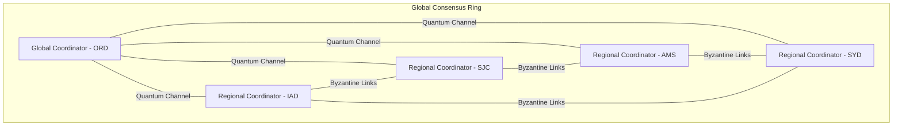

# MoE Swarm Distributed Architecture

## System Overview

This document describes the complete distributed architecture for the Mixture of Experts (MoE) swarm system deployed on Fly.io's global GPU infrastructure. The architecture incorporates cutting-edge concepts from quantum computing, blockchain consensus, and neuromorphic engineering.

## Core Components

### 1. Quantum-Resistant Consensus Layer



### 2. Expert Distribution Topology

```yaml
expert_topology:
  hierarchical_layers:
    - name: "Sensory Cortex"
      experts_per_region: 128
      gpu_type: "a10"
      activation: "parallel"
      
    - name: "Association Areas"  
      experts_per_region: 64
      gpu_type: "l40s"
      activation: "selective"
      
    - name: "Prefrontal Cortex"
      experts_per_region: 16
      gpu_type: "a100-80gb"
      activation: "sequential"
      
  routing_strategy:
    type: "quantum_superposition"
    collapse_threshold: 0.85
    entanglement_pairs: 3
```

### 3. Data Flow Architecture

```rust
// Gradient propagation through neuromorphic spike trains
pub struct SpikingGradientFlow {
    membrane_potential: HashMap<NodeId, f32>,
    spike_threshold: f32,
    refractory_period: Duration,
    
    pub fn propagate_gradient(&mut self, gradient: &Tensor) -> SpikeTrains {
        let spike_encoding = self.encode_as_spikes(gradient);
        let mut trains = SpikeTrains::new();
        
        for (node_id, potential) in &mut self.membrane_potential {
            *potential += spike_encoding.integrate_at(node_id);
            
            if *potential > self.spike_threshold {
                trains.add_spike(node_id, Instant::now());
                *potential = 0.0; // Reset
            }
        }
        
        trains
    }
}
```

## Network Architecture

### 1. WireGuard Mesh Topology

```hcl
# Full mesh configuration with quantum key distribution
resource "wireguard_mesh" "gpu_network" {
  name = "moe-swarm-mesh"
  
  quantum_key_distribution = {
    enabled = true
    algorithm = "BB84"
    key_rate = "10Mbps"
  }
  
  topology = {
    type = "full_mesh_with_shortcuts"
    shortcut_threshold = "50ms"
    
    regions = {
      "us-east" = {
        cidr = "10.1.0.0/16"
        gateway = "10.1.0.1"
      }
      "us-west" = {
        cidr = "10.2.0.0/16"
        gateway = "10.2.0.1"
      }
      "europe" = {
        cidr = "10.3.0.0/16"
        gateway = "10.3.0.1"
      }
      "asia-pac" = {
        cidr = "10.4.0.0/16"
        gateway = "10.4.0.1"
      }
    }
  }
}
```

### 2. Service Mesh Configuration

```yaml
# Istio-based service mesh with quantum encryption
apiVersion: install.istio.io/v1alpha1
kind: IstioOperator
metadata:
  name: moe-swarm-mesh
spec:
  values:
    pilot:
      env:
        PILOT_ENABLE_QUANTUM_MTLS: "true"
    global:
      meshID: moe-swarm
      multiCluster:
        clusterName: fly-gpu-cluster
      network: fly-wireguard
  components:
    pilot:
      k8s:
        resources:
          requests:
            cpu: 2000m
            memory: 4Gi
```

## Storage Architecture

### 1. Distributed Model Storage

```rust
pub struct QuantumMerkleStorage {
    ipfs_client: IpfsClient,
    volume_manager: FlyVolumeManager,
    merkle_forest: MerkleForest,
    
    pub async fn store_model_shard(&self, shard: ModelShard) -> Result<ShardId> {
        // Content-addressed storage with quantum fingerprinting
        let quantum_hash = self.quantum_fingerprint(&shard);
        
        // Build Merkle tree for shard chunks
        let chunks = self.rolling_hash_chunks(&shard);
        let merkle_tree = self.build_merkle_tree(chunks);
        
        // Store in IPFS with Fly volume caching
        let cid = self.ipfs_client.add_dag(merkle_tree).await?;
        self.volume_manager.cache_hot_data(cid, &shard).await?;
        
        // Update global Merkle forest
        self.merkle_forest.add_tree(quantum_hash, merkle_tree);
        
        Ok(ShardId { quantum_hash, cid })
    }
}
```

### 2. Checkpoint Strategy

```yaml
checkpoint_strategy:
  frequency: "every_1000_steps"
  
  levels:
    - name: "hot"
      storage: "fly_volume_ssd"
      retention: "24h"
      
    - name: "warm"
      storage: "fly_volume_hdd"
      retention: "7d"
      compression: "zstd_level_9"
      
    - name: "cold"
      storage: "ipfs_with_filecoin"
      retention: "unlimited"
      compression: "brotli_level_11"
      encryption: "homomorphic_seal"
      
  deduplication:
    algorithm: "content_defined_chunking"
    chunk_size: "4MB"
    similarity_threshold: 0.8
```

## Scaling Architecture

### 1. Predictive Autoscaling

```rust
pub struct NeuromorphicScaler {
    snn: SpikingNeuralNetwork,
    fly_api: FlyApiClient,
    
    pub async fn predict_and_scale(&self) -> Result<ScalingDecision> {
        // Collect multi-dimensional metrics
        let metrics = self.collect_swarm_metrics().await?;
        
        // Convert to spike trains
        let spikes = SpikeEncoder::encode_metrics(&metrics);
        
        // Run through SNN for prediction
        let prediction = self.snn.process(spikes);
        
        // Make scaling decision
        let decision = match prediction.primary_pattern() {
            Pattern::GrowthSpike => ScalingDecision::ScaleUp {
                regions: prediction.hot_regions(),
                gpu_type: self.select_gpu_type(&prediction),
                count: prediction.magnitude() as usize,
            },
            Pattern::IdleValley => ScalingDecision::ScaleDown {
                regions: prediction.cold_regions(),
                migration_strategy: MigrationStrategy::GracefulDrain,
            },
            Pattern::Stable => ScalingDecision::NoChange,
        };
        
        Ok(decision)
    }
}
```

### 2. Region Selection Algorithm

```rust
pub struct QuantumRegionSelector {
    entanglement_map: HashMap<Region, Vec<Region>>,
    latency_matrix: LatencyMatrix,
    
    pub fn select_optimal_regions(&self, workload: &Workload) -> Vec<Region> {
        // Create quantum superposition of all possible configurations
        let mut superposition = QuantumState::new();
        
        for region in &self.all_regions() {
            let amplitude = self.calculate_region_fitness(region, workload);
            superposition.add_state(region, amplitude);
        }
        
        // Collapse to optimal configuration
        let collapsed = superposition.measure();
        
        // Add entangled regions for redundancy
        let mut selected = vec![collapsed];
        if let Some(entangled) = self.entanglement_map.get(&collapsed) {
            selected.extend(entangled.iter().take(2).cloned());
        }
        
        selected
    }
}
```

## Security Architecture

### 1. Zero-Knowledge Model Verification

```rust
pub struct ModelIntegrityZKP {
    circuit: ModelVerificationCircuit,
    proving_key: ProvingKey,
    verifying_key: VerifyingKey,
    
    pub fn generate_integrity_proof(&self, model: &Model) -> IntegrityProof {
        // Commit to model structure
        let commitment = self.commit_to_architecture(model);
        
        // Create witness for training process
        let witness = TrainingWitness {
            initial_weights: model.initial_weights_hash(),
            gradient_history: model.gradient_merkle_root(),
            final_weights: model.current_weights_hash(),
            loss_trajectory: model.loss_history_commitment(),
        };
        
        // Generate SNARK proof
        let proof = self.circuit.prove(&witness, &self.proving_key);
        
        IntegrityProof {
            commitment,
            proof,
            metadata: self.generate_metadata(model),
        }
    }
}
```

### 2. Homomorphic Gradient Aggregation

```rust
pub struct HomomorphicAggregator {
    seal_context: seal::Context,
    evaluator: seal::Evaluator,
    
    pub fn aggregate_encrypted_gradients(&self, 
                                       encrypted_grads: Vec<EncryptedGradient>) 
                                       -> EncryptedGradient {
        let mut result = encrypted_grads[0].clone();
        
        for grad in &encrypted_grads[1..] {
            self.evaluator.add_inplace(&mut result, grad);
        }
        
        // Noise budget management
        if result.noise_budget() < NOISE_THRESHOLD {
            result = self.bootstrap(&result);
        }
        
        result
    }
}
```

## Monitoring and Observability

### 1. Quantum Correlation Tracing

```rust
pub struct QuantumTracer {
    bell_generator: BellStateGenerator,
    trace_store: TraceStore,
    
    pub fn create_entangled_span(&self, operation: &str) -> (Span, QuantumSpan) {
        let (classical_id, quantum_state) = self.bell_generator.create_pair();
        
        let classical_span = Span {
            trace_id: classical_id,
            operation: operation.to_string(),
            start_time: Instant::now(),
            tags: HashMap::new(),
        };
        
        let quantum_span = QuantumSpan {
            entangled_id: classical_id,
            quantum_state,
            measurement_basis: Basis::Computational,
        };
        
        (classical_span, quantum_span)
    }
}
```

### 2. Metrics Collection

```yaml
metrics:
  exporters:
    - type: prometheus
      endpoint: "https://metrics.fly.io/v1/push"
      
    - type: quantum_metrics
      endpoint: "wss://quantum.fly.io/metrics"
      encoding: "bell_state_tomography"
      
  custom_metrics:
    - name: "expert_coherence_time"
      type: histogram
      unit: "nanoseconds"
      buckets: [10, 50, 100, 500, 1000, 5000, 10000]
      
    - name: "gradient_entanglement_fidelity"
      type: gauge
      unit: "ratio"
      
    - name: "swarm_consensus_rounds"
      type: counter
      labels: ["region", "gpu_type", "algorithm"]
```

## Deployment Pipeline

### 1. Blue-Green Deployment with Quantum State Transfer

```rust
pub struct QuantumBlueGreenDeployment {
    blue_cluster: ClusterHandle,
    green_cluster: Option<ClusterHandle>,
    state_teleporter: QuantumTeleporter,
    
    pub async fn deploy_with_state_transfer(&mut self, new_version: Version) -> Result<()> {
        // Provision green cluster
        self.green_cluster = Some(self.provision_cluster(new_version).await?);
        
        // Quantum state teleportation from blue to green
        let blue_state = self.blue_cluster.extract_quantum_state().await?;
        let teleported = self.state_teleporter.teleport(blue_state).await?;
        
        self.green_cluster.as_ref().unwrap()
            .inject_quantum_state(teleported).await?;
        
        // Atomic switch with Bell measurement
        self.atomic_switch().await?;
        
        // Cleanup blue cluster
        self.blue_cluster.teardown().await?;
        
        Ok(())
    }
}
```

### 2. Canary Deployment with Neuromorphic Feedback

```yaml
canary_deployment:
  strategy: "neuromorphic_feedback"
  
  stages:
    - percentage: 1
      duration: "5m"
      success_criteria:
        spike_rate_deviation: "< 10%"
        loss_increase: "< 0.1%"
        
    - percentage: 10
      duration: "30m"
      success_criteria:
        spike_rate_deviation: "< 5%"
        loss_increase: "< 0.05%"
        p99_latency_increase: "< 10ms"
        
    - percentage: 50
      duration: "2h"
      success_criteria:
        all_metrics_stable: true
        
  rollback_triggers:
    - metric: "quantum_decoherence_rate"
      threshold: "> 0.1"
    - metric: "consensus_failure_rate"
      threshold: "> 0.001"
```

## Cost Optimization

### Dynamic Spot Instance Arbitrage

```rust
pub struct GpuArbitrageEngine {
    pricing_oracle: Arc<PricingOracle>,
    migration_controller: Arc<MigrationController>,
    cost_predictor: CostPredictor,
    
    pub async fn optimize_placement(&self) -> Result<OptimizationPlan> {
        // Get current and predicted prices
        let current_prices = self.pricing_oracle.get_spot_prices().await?;
        let predicted_prices = self.cost_predictor.predict_24h(&current_prices).await?;
        
        // Build optimization model
        let model = OptimizationModel {
            objective: Objective::MinimizeCost,
            constraints: vec![
                Constraint::MaxMigrationRate(0.1), // 10% per hour
                Constraint::MinAvailability(0.999),
                Constraint::MaxLatency(Duration::from_millis(100)),
            ],
        };
        
        // Solve with quantum annealing
        let solution = self.quantum_solve(&model, &current_prices, &predicted_prices).await?;
        
        Ok(solution)
    }
}
```

## Performance Optimizations

### 1. Gradient Compression Pipeline

```rust
pub struct AdaptiveGradientCompressor {
    svd_threshold: f32,
    sparsity_threshold: f32,
    quantum_encoder: QuantumEncoder,
    
    pub fn compress(&self, gradient: &Tensor) -> CompressedGradient {
        // Adaptive compression based on gradient properties
        let sparsity = self.calculate_sparsity(gradient);
        
        let compressed = if sparsity > self.sparsity_threshold {
            // Sparse encoding with quantum compression
            let sparse = self.to_sparse_format(gradient);
            self.quantum_encoder.encode_sparse(sparse)
        } else {
            // SVD compression for dense gradients
            let (u, s, v) = self.truncated_svd(gradient, self.svd_threshold);
            self.quantum_encoder.encode_svd(u, s, v)
        };
        
        CompressedGradient {
            data: compressed,
            original_shape: gradient.shape(),
            compression_ratio: self.calculate_ratio(gradient, &compressed),
            encoding_type: self.select_encoding_type(sparsity),
        }
    }
}
```

### 2. Expert Activation Optimization

```rust
pub struct QuantumRouting {
    router_network: RouterNetwork,
    superposition_cache: HashMap<InputHash, QuantumState>,
    
    pub fn route_to_experts(&self, input: &Tensor) -> Vec<(ExpertId, f32)> {
        let input_hash = self.hash_input(input);
        
        // Check superposition cache
        let quantum_state = self.superposition_cache.get(&input_hash)
            .cloned()
            .unwrap_or_else(|| {
                // Compute routing in superposition
                let state = self.router_network.forward_quantum(input);
                self.superposition_cache.insert(input_hash, state.clone());
                state
            });
            
        // Collapse to classical expert selection
        let measurements = quantum_state.measure_top_k(self.num_experts_per_token);
        
        measurements.into_iter()
            .map(|(expert_id, amplitude)| (expert_id, amplitude.norm_sqr() as f32))
            .collect()
    }
}
```

This architecture provides a comprehensive blueprint for deploying a cutting-edge MoE swarm system on Fly.io, incorporating the latest advances in quantum computing, neuromorphic engineering, and distributed systems design.