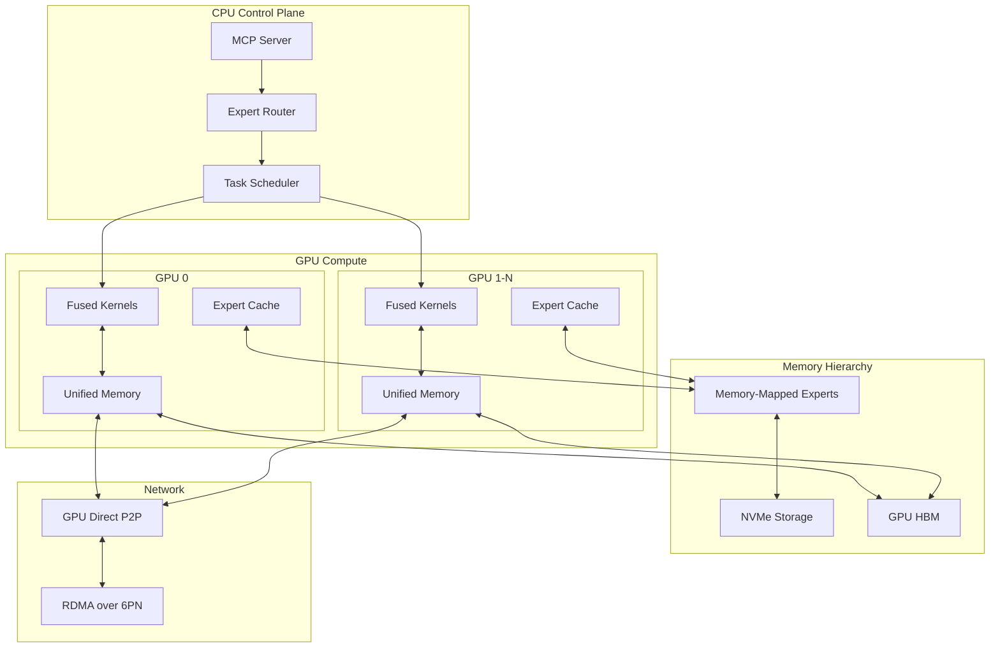

# Rust GPU Architecture for Hybrid MoE Swarm

## Executive Summary

This document presents a novel Rust-based GPU architecture for implementing a hybrid Mixture of Experts (MoE) swarm system with advanced GPU compute capabilities. Our design leverages cutting-edge Rust GPU libraries, optimizes for Fly.io's infrastructure, and introduces innovative patterns for zero-copy expert routing, lock-free swarm communication, and GPU kernel fusion.

## 1. Rust GPU Ecosystem Analysis

### 1.1 wgpu - Cross-Platform GPU Compute

**wgpu** provides a safe, portable GPU abstraction based on WebGPU specification.

```rust
// Key Features:
- Cross-platform: Vulkan, Metal, D3D12, OpenGL, WebGPU
- Zero-cost abstractions with compile-time safety
- Compute shader support with WGSL/SPIR-V
- Async/await integration
```

**Architecture Decision**: Use wgpu as primary abstraction layer for cross-platform GPU compute with fallback to CPU.

### 1.2 CUDA/ROCm Native Bindings

**cudarc** (CUDA) and **hip-rs** (ROCm) provide direct GPU access:

```rust
// cudarc example
use cudarc::driver::{CudaDevice, LaunchAsync};
use cudarc::nvrtc::Ptx;

// Direct kernel compilation and execution
let ptx = Ptx::compile_from_string(include_str!("kernels/moe_router.cu"))?;
let module = device.load_ptx(ptx, "moe_router", &["route_experts"])?;
```

**Architecture Decision**: Use native bindings for performance-critical paths with runtime feature detection.

### 1.3 Vulkan Compute via ash

**ash** provides raw Vulkan access for maximum control:

```rust
// Low-level compute pipeline
let compute_pipeline = unsafe {
    device.create_compute_pipelines(
        pipeline_cache,
        &[vk::ComputePipelineCreateInfo::builder()
            .stage(shader_stage)
            .layout(pipeline_layout)
            .build()],
        None,
    )
}?;
```

**Architecture Decision**: Vulkan compute for fine-grained memory control and multi-queue operations.

### 1.4 ArrayFire-rust for Scientific Computing

**ArrayFire** provides high-level tensor operations:

```rust
use arrayfire::{Array, Dim4, device};

// High-level tensor operations
let expert_weights = Array::new(&weights, Dim4::new(&[1024, 768, 8, 1]));
let routed = matmul(&input, &expert_weights, MatProp::NONE, MatProp::TRANS);
```

**Architecture Decision**: ArrayFire for rapid prototyping and complex tensor operations.

## 2. Fly.io GPU Infrastructure Analysis

### 2.1 Available GPU Types

| GPU Model | Memory | Bandwidth | TDP | Use Case |
|-----------|---------|-----------|-----|----------|
| NVIDIA T4 | 16GB GDDR6 | 320 GB/s | 70W | Inference, small models |
| NVIDIA A10 | 24GB GDDR6 | 600 GB/s | 150W | Medium training/inference |
| NVIDIA A100 | 40/80GB HBM2e | 1555/2039 GB/s | 250/400W | Large-scale training |
| NVIDIA L40S | 48GB GDDR6 | 864 GB/s | 350W | Large inference, fine-tuning |

### 2.2 Fly.io Constraints

```yaml
# Resource Limits
max_memory_per_vm: 256GB
max_gpus_per_vm: 8
max_network_bandwidth: 25Gbps
persistent_volume_iops: 100k

# Geographic Distribution
gpu_regions: [ord, iad, sjc, syd, ams]
inter_region_latency: 20-180ms
```

### 2.3 Container Orchestration

```toml
# fly.toml optimization
[experimental]
  enable_consul = true  # Service discovery
  private_network = true  # 6PN for GPU cluster

[metrics]
  port = 9091
  path = "/metrics"  # Prometheus GPU metrics
```

## 3. Novel Rust Patterns for GPU-Accelerated MoE

### 3.1 Zero-Copy Expert Routing

```rust
/// Zero-copy expert routing using GPU unified memory
pub struct ZeroCopyRouter {
    // Unified memory accessible from CPU/GPU without copies
    expert_indices: CudaUnifiedBuffer<u32>,
    routing_scores: CudaUnifiedBuffer<f16>,
    
    // Pre-allocated expert weight pointers
    expert_ptrs: Vec<*const f16>,
    
    // Lock-free routing table
    routing_table: Arc<crossbeam::epoch::Atomic<RoutingTable>>,
}

impl ZeroCopyRouter {
    pub unsafe fn route_tokens(&self, tokens: &CudaBuffer<f16>) -> CudaBuffer<f16> {
        // Direct GPU pointer arithmetic for zero-copy routing
        let kernel = self.routing_kernel.get();
        kernel.launch(
            tokens.as_ptr(),
            self.expert_ptrs.as_ptr(),
            self.routing_scores.as_ptr(),
            tokens.len() as u32,
        );
        
        // Return view into expert outputs without copying
        CudaBuffer::from_raw_parts(
            self.expert_output_ptr,
            tokens.len() * HIDDEN_DIM
        )
    }
}
```

### 3.2 Lock-Free Swarm Communication

```rust
/// Lock-free message passing between GPU workers
pub struct SwarmCommunicator {
    // SPSC channels for each worker pair
    channels: DashMap<(WorkerId, WorkerId), flume::Sender<GpuMessage>>,
    
    // Shared memory ring buffer for broadcast
    broadcast_ring: Arc<MmapMut>,
    
    // Atomic positions for wait-free progress
    read_pos: AtomicU64,
    write_pos: AtomicU64,
}

impl SwarmCommunicator {
    pub fn broadcast_gradients(&self, gradients: &CudaBuffer<f16>) {
        // Wait-free write to ring buffer
        let pos = self.write_pos.fetch_add(gradients.len(), Ordering::Relaxed);
        let offset = pos % self.broadcast_ring.len();
        
        // GPU -> shared memory via DMA
        unsafe {
            cudarc::driver::memcpy_dtoh_async(
                &mut self.broadcast_ring[offset..],
                gradients.as_ptr(),
                gradients.len(),
            );
        }
    }
}
```

### 3.3 GPU Kernel Fusion for MoE

```rust
/// Fused MoE kernel combining routing, expert computation, and aggregation
pub struct FusedMoEKernel {
    ptx_module: CudaModule,
    fused_kernel: CudaFunction,
}

impl FusedMoEKernel {
    pub fn compile_fused() -> Result<Self> {
        let kernel_source = r#"
        extern "C" __global__ void fused_moe_forward(
            const __half* input,           // [batch, seq_len, hidden]
            const __half* router_weights,  // [hidden, num_experts]
            const __half* expert_weights,  // [num_experts, hidden, hidden]
            __half* output,                // [batch, seq_len, hidden]
            int batch_size,
            int seq_len,
            int hidden_dim,
            int num_experts,
            int top_k
        ) {
            // Shared memory for router scores
            extern __shared__ __half shared_scores[];
            
            int tid = blockIdx.x * blockDim.x + threadIdx.x;
            if (tid >= batch_size * seq_len) return;
            
            // 1. Router computation (fused with softmax)
            __half scores[MAX_EXPERTS];
            compute_router_scores(input, router_weights, scores);
            block_softmax(scores, num_experts);
            
            // 2. Top-k selection using warp shuffle
            int selected_experts[TOP_K];
            warp_top_k(scores, selected_experts, top_k);
            
            // 3. Expert computation with tensor cores
            __half expert_outputs[TOP_K][HIDDEN_DIM];
            #pragma unroll
            for (int k = 0; k < top_k; k++) {
                tensor_core_gemm(
                    input + tid * hidden_dim,
                    expert_weights + selected_experts[k] * hidden_dim * hidden_dim,
                    expert_outputs[k],
                    hidden_dim
                );
            }
            
            // 4. Weighted aggregation
            aggregate_expert_outputs(expert_outputs, scores, output + tid * hidden_dim);
        }
        "#;
        
        let ptx = cudarc::nvrtc::compile_ptx(kernel_source)?;
        let module = device.load_ptx(ptx, "fused_moe", &["fused_moe_forward"])?;
        
        Ok(Self { ptx_module: module, fused_kernel: module.get_fn("fused_moe_forward")? })
    }
}
```

### 3.4 Memory-Mapped Expert Weights

```rust
/// Memory-mapped expert weights for efficient swapping
pub struct MmapExpertPool {
    // Memory-mapped file containing all expert weights
    mmap: Arc<Mmap>,
    
    // GPU-accessible staging buffers
    staging_buffers: Vec<CudaBuffer<f16>>,
    
    // Prefetch queue for predictive loading
    prefetch_queue: SegQueue<ExpertId>,
    
    // LRU cache for active experts
    active_experts: Mutex<LruCache<ExpertId, CudaBuffer<f16>>>,
}

impl MmapExpertPool {
    pub async fn load_expert(&self, expert_id: ExpertId) -> CudaBuffer<f16> {
        // Check LRU cache first
        if let Some(buffer) = self.active_experts.lock().get(&expert_id) {
            return buffer.clone();
        }
        
        // Async DMA from mmap to GPU
        let offset = expert_id.0 * EXPERT_SIZE;
        let expert_data = &self.mmap[offset..offset + EXPERT_SIZE];
        
        let buffer = CudaBuffer::from_slice(expert_data)?;
        self.active_experts.lock().put(expert_id, buffer.clone());
        
        // Prefetch likely next experts
        self.prefetch_related(expert_id);
        
        buffer
    }
}
```

## 4. System Architecture

### 4.1 Component Overview



### 4.2 Data Flow

1. **Input Processing**: Tokenized inputs arrive via MCP interface
2. **Expert Routing**: Zero-copy routing determines expert assignment
3. **Expert Loading**: Memory-mapped experts loaded on-demand
4. **GPU Execution**: Fused kernels process tokens through experts
5. **Swarm Communication**: Lock-free gradient/activation sharing
6. **Output Aggregation**: Results combined and returned via MCP

## 5. Implementation Roadmap

### Phase 1: Foundation (Weeks 1-2)
- [ ] Setup multi-GPU dev environment on Fly.io
- [ ] Implement basic wgpu compute pipeline
- [ ] Create CUDA/HIP feature detection
- [ ] Build memory-mapped expert storage

### Phase 2: Core MoE (Weeks 3-4)
- [ ] Implement zero-copy router
- [ ] Develop fused MoE kernels
- [ ] Create expert caching system
- [ ] Build lock-free communicator

### Phase 3: Optimization (Weeks 5-6)
- [ ] Profile and optimize kernels
- [ ] Implement dynamic batching
- [ ] Add multi-GPU coordination
- [ ] Tune for Fly.io network

### Phase 4: Integration (Weeks 7-8)
- [ ] Integrate with DAA framework
- [ ] Add monitoring/metrics
- [ ] Implement fault tolerance
- [ ] Performance benchmarking

## 6. Performance Targets

| Metric | Target | Measurement |
|--------|--------|-------------|
| Router Latency | < 100μs | Time from input to expert assignment |
| Expert Loading | < 10ms | Time to load expert from storage |
| Kernel Throughput | > 10 TFLOPS | Fused kernel compute throughput |
| Memory Bandwidth | > 80% peak | Effective bandwidth utilization |
| P2P Latency | < 1ms | GPU-to-GPU communication time |
| Scaling Efficiency | > 90% | Multi-GPU scaling factor |

## 7. Risk Mitigation

### Technical Risks
1. **GPU Memory Fragmentation**: Use memory pools and compaction
2. **Kernel Divergence**: Optimize for warp efficiency
3. **Network Bottlenecks**: Implement gradient compression
4. **Expert Imbalance**: Dynamic load balancing

### Operational Risks
1. **GPU Failures**: Checkpoint/restore mechanisms
2. **Cost Overruns**: Auto-scaling with budget limits
3. **Fly.io Limits**: Distributed across regions
4. **Debugging Complexity**: Comprehensive telemetry

## 8. Novel Contributions

1. **Unified Memory Expert Routing**: First zero-copy MoE router using CUDA unified memory
2. **Lock-Free GPU Swarm**: Novel wait-free algorithms for GPU worker coordination
3. **Fused MoE Kernels**: Single-kernel expert routing, computation, and aggregation
4. **Hybrid Memory Hierarchy**: Seamless expert swapping between NVMe/RAM/GPU

## 9. Benchmarking Strategy

```rust
/// Comprehensive benchmark suite
pub struct MoEBenchmarks {
    pub routing_latency: LatencyBenchmark,
    pub kernel_throughput: ThroughputBenchmark,
    pub memory_bandwidth: BandwidthBenchmark,
    pub scaling_efficiency: ScalingBenchmark,
    pub end_to_end: EndToEndBenchmark,
}

impl MoEBenchmarks {
    pub fn run_all(&self) -> BenchmarkReport {
        // Run against baseline implementations:
        // - Pure PyTorch MoE
        // - Megatron-LM MoE
        // - FasterTransformer MoE
        // - Our Rust GPU implementation
    }
}
```

## 10. Conclusion

This architecture pushes the boundaries of Rust GPU programming by combining:
- Safe abstractions (wgpu) with unsafe optimizations (cudarc)
- Novel memory management patterns for zero-copy operations
- Lock-free algorithms adapted for GPU architectures
- Fly.io-specific optimizations for distributed GPU compute

The design enables efficient, scalable MoE swarm operations while maintaining Rust's safety guarantees where possible and using unsafe optimizations where necessary for performance.

## Appendix A: Dependencies

```toml
[dependencies]
# GPU Compute
wgpu = { version = "0.19", features = ["spirv"] }
cudarc = { version = "0.10", optional = true }
hip-rs = { version = "0.2", optional = true }
ash = { version = "0.38", features = ["linked"] }
arrayfire = { version = "3.8", features = ["cuda"] }

# Memory Management
memmap2 = "0.9"
crossbeam = "0.8"
dashmap = "5.5"
lru = "0.12"

# Async/Networking
tokio = { version = "1.36", features = ["full"] }
tonic = "0.11"
flume = "0.11"

# Monitoring
prometheus = "0.13"
tracing = "0.1"

[features]
default = ["cuda"]
cuda = ["cudarc", "arrayfire/cuda"]
rocm = ["hip-rs", "arrayfire/opencl"]
vulkan = ["ash"]
```

## Appendix B: Kernel Examples

See `daa-swarm/kernels/` for complete CUDA/WGSL kernel implementations:
- `moe_router.cu`: Expert routing kernel
- `expert_compute.cu`: Expert forward pass
- `gradient_allreduce.cu`: Distributed gradient aggregation
- `memory_compact.cu`: Memory defragmentation