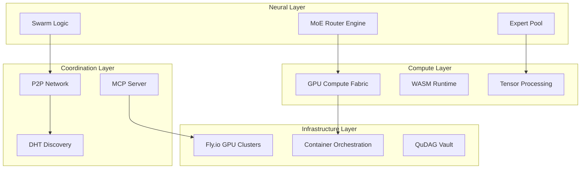

# DAA Swarm Integrated Architecture

## Executive Summary

This document presents the integrated architecture for the DAA Swarm system, combining Mixture-of-Experts (MoE) neural architectures with distributed swarm intelligence, GPU-accelerated Rust implementations, and decentralized coordination protocols. The system leverages the DAA framework's existing infrastructure while introducing revolutionary capabilities for distributed AI training and inference.

## 1. System Overview

### 1.1 Core Components



### 1.2 Revolutionary Features

1. **Dynamic Expert Routing**: Adaptive MoE routing that learns optimal expert selection patterns through swarm consensus
2. **GPU-Native Rust**: Zero-copy tensor operations with direct CUDA integration via tch-rs
3. **Decentralized Coordination**: P2P swarm protocols with Byzantine fault tolerance
4. **Edge Deployment**: WASM compilation targets for browser-based distributed training

## 2. Mixture-of-Experts Architecture

### 2.1 Novel Routing Mechanism

```rust
// Expert routing with swarm intelligence feedback
pub struct SwarmMoERouter {
    // Base routing network
    router_net: nn::Sequential,
    // Swarm consensus weights
    consensus_weights: Arc<RwLock<Tensor>>,
    // Expert performance history
    expert_metrics: Arc<DashMap<ExpertId, ExpertMetrics>>,
    // Adaptive learning rate
    adaptation_rate: AtomicF32,
}

impl SwarmMoERouter {
    pub fn route_with_consensus(
        &self,
        input: &Tensor,
        swarm_feedback: &SwarmConsensus,
    ) -> (Vec<ExpertId>, Tensor) {
        // Base routing scores
        let base_scores = self.router_net.forward(input);
        
        // Apply swarm consensus modulation
        let consensus_scores = self.apply_swarm_consensus(
            &base_scores, 
            swarm_feedback
        );
        
        // Select top-k experts with diversity constraints
        let selected_experts = self.select_diverse_experts(
            &consensus_scores, 
            k = 3
        );
        
        // Generate routing weights
        let routing_weights = self.compute_routing_weights(
            &consensus_scores, 
            &selected_experts
        );
        
        (selected_experts, routing_weights)
    }
}
```

### 2.2 Expert Specialization

```rust
pub enum ExpertSpecialization {
    // Domain-specific experts
    LanguageUnderstanding { languages: Vec<Language> },
    CodeGeneration { languages: Vec<ProgrammingLanguage> },
    MathematicalReasoning { domains: Vec<MathDomain> },
    
    // Task-specific experts
    ChainOfThought { max_depth: usize },
    ProgramSynthesis { target_runtime: Runtime },
    TheoremProving { logic_system: LogicSystem },
    
    // Meta-experts
    ExpertSelector { routing_strategy: RoutingStrategy },
    ConsensusBuilder { voting_mechanism: VotingMechanism },
}
```

## 3. GPU-Optimized Implementation

### 3.1 Memory-Efficient Architecture

```rust
use tch::{nn, Device, Tensor, CudaStream};

pub struct GpuOptimizedExpert {
    // Model parameters in GPU memory
    parameters: CudaBuffer<f16>,
    // Activation checkpointing for memory efficiency
    checkpoint_layers: Vec<LayerCheckpoint>,
    // Custom CUDA kernels
    custom_kernels: KernelRegistry,
    // Stream for async operations
    compute_stream: CudaStream,
}

impl GpuOptimizedExpert {
    pub async fn forward_optimized(
        &self,
        input: CudaTensor,
        memory_budget: MemoryBudget,
    ) -> Result<CudaTensor> {
        // Dynamic batching based on available memory
        let batch_size = self.compute_optimal_batch_size(
            &input,
            &memory_budget
        );
        
        // Gradient checkpointing for large models
        let output = if memory_budget.is_limited() {
            self.forward_with_checkpointing(input, batch_size).await?
        } else {
            self.forward_full(input, batch_size).await?
        };
        
        Ok(output)
    }
}
```

### 3.2 Multi-GPU Parallelism

```rust
pub struct MultiGpuSwarm {
    // Device topology
    devices: Vec<Device>,
    // Inter-GPU communication
    nccl_comm: NcclCommunicator,
    // Pipeline parallel stages
    pipeline_stages: Vec<PipelineStage>,
    // Data parallel replicas
    data_parallel_groups: Vec<DataParallelGroup>,
}

impl MultiGpuSwarm {
    pub async fn distributed_forward(
        &self,
        batch: DistributedBatch,
    ) -> Result<DistributedOutput> {
        // Pipeline parallelism for sequential layers
        let pipeline_output = self.pipeline_forward(&batch).await?;
        
        // Data parallelism for expert mixture
        let expert_outputs = self.data_parallel_experts(
            &pipeline_output
        ).await?;
        
        // All-reduce for gradient synchronization
        let synchronized = self.nccl_comm.all_reduce(
            expert_outputs,
            NcclOp::Sum
        ).await?;
        
        Ok(synchronized)
    }
}
```

## 4. Swarm Coordination Protocol

### 4.1 Decentralized Consensus

```rust
use libp2p::{gossipsub, kad, mdns};

pub struct SwarmCoordinator {
    // P2P networking stack
    swarm: Swarm<SwarmBehaviour>,
    // Distributed hash table for discovery
    dht: kad::Kademlia<MemoryStore>,
    // Gossip protocol for updates
    gossip: gossipsub::Gossipsub,
    // Local expert registry
    local_experts: Arc<RwLock<ExpertRegistry>>,
}

impl SwarmCoordinator {
    pub async fn coordinate_computation(
        &mut self,
        task: ComputeTask,
    ) -> Result<SwarmResult> {
        // Discover available experts in the network
        let available_experts = self.discover_experts(&task).await?;
        
        // Form consensus on expert selection
        let consensus = self.form_consensus(
            &available_experts,
            &task
        ).await?;
        
        // Distribute computation across swarm
        let results = self.distribute_computation(
            consensus,
            task
        ).await?;
        
        // Aggregate results with Byzantine fault tolerance
        let final_result = self.byzantine_aggregate(results).await?;
        
        Ok(final_result)
    }
}
```

### 4.2 Incentive Mechanism

```rust
pub struct SwarmIncentives {
    // Contribution tracking
    contribution_ledger: Arc<RwLock<ContributionLedger>>,
    // Reward distribution
    reward_pool: Arc<RwLock<RewardPool>>,
    // Reputation system
    reputation_scores: Arc<DashMap<PeerId, Reputation>>,
}

impl SwarmIncentives {
    pub fn calculate_rewards(
        &self,
        round: ComputeRound,
    ) -> HashMap<PeerId, Reward> {
        let mut rewards = HashMap::new();
        
        for (peer_id, contribution) in round.contributions() {
            let base_reward = self.calculate_base_reward(contribution);
            let reputation_multiplier = self.get_reputation_multiplier(peer_id);
            let quality_bonus = self.calculate_quality_bonus(contribution);
            
            rewards.insert(
                peer_id,
                base_reward * reputation_multiplier + quality_bonus
            );
        }
        
        rewards
    }
}
```

## 5. Deployment Architecture

### 5.1 Fly.io GPU Cluster Configuration

```toml
# fly.toml
app = "daa-swarm-gpu"
primary_region = "ord"

[build]
dockerfile = "docker/Dockerfile.gpu"

[experimental]
auto_stop_machines = false
enable_consul = true

[[services]]
internal_port = 50051
protocol = "tcp"
  [[services.ports]]
  port = 443
  handlers = ["tls", "http"]

[services.concurrency]
type = "connections"
hard_limit = 1000
soft_limit = 800

[[vm]]
size = "a100-80gb"
gpu_type = "nvidia-a100"
memory = "128gb"

[[mounts]]
source = "models"
destination = "/data/models"

[[mounts]]
source = "checkpoints"
destination = "/data/checkpoints"
```

### 5.2 Container Architecture

```dockerfile
# docker/Dockerfile.gpu
FROM nvidia/cuda:12.2-cudnn8-runtime-ubuntu22.04 AS base

# Install Rust with GPU support
RUN curl --proto '=https' --tlsv1.2 -sSf https://sh.rustup.rs | sh -s -- -y
ENV PATH="/root/.cargo/bin:${PATH}"

# Install system dependencies
RUN apt-get update && apt-get install -y \
    libssl-dev \
    pkg-config \
    protobuf-compiler \
    && rm -rf /var/lib/apt/lists/*

# Build application
WORKDIR /app
COPY . .
RUN cargo build --release --features gpu

# Runtime stage
FROM nvidia/cuda:12.2-cudnn8-runtime-ubuntu22.04
COPY --from=base /app/target/release/daa-swarm /usr/local/bin/
EXPOSE 50051
CMD ["daa-swarm", "serve"]
```

## 6. Integration Points

### 6.1 DAA Framework Integration

```rust
// Integration with existing DAA components
use daa_ai::{Agent, Task, Memory};
use daa_chain::{QuDAGConsensus, Block};
use daa_economy::{ResourceManager, IncentiveEngine};
use daa_orchestrator::{WorkflowEngine, ServiceMesh};

pub struct DAASwarmIntegration {
    // AI layer integration
    agent_manager: AgentManager,
    memory_system: MemorySystem,
    
    // Blockchain integration
    consensus: QuDAGConsensus,
    
    // Economy integration
    resource_manager: ResourceManager,
    incentive_engine: IncentiveEngine,
    
    // Orchestration integration
    workflow_engine: WorkflowEngine,
}
```

### 6.2 MCP Protocol Extensions

```proto
// Extended MCP protocol for swarm operations
syntax = "proto3";
package daa.swarm.mcp;

service SwarmMCP {
    // Expert management
    rpc RegisterExpert(ExpertRegistration) returns (ExpertId);
    rpc DiscoverExperts(ExpertQuery) returns (stream ExpertInfo);
    
    // Swarm coordination
    rpc ProposeComputation(ComputeProposal) returns (ProposalId);
    rpc JoinComputation(JoinRequest) returns (JoinConfirmation);
    
    // Result aggregation
    rpc SubmitResult(ComputeResult) returns (Acknowledgment);
    rpc GetAggregatedResult(ResultQuery) returns (AggregatedResult);
    
    // Monitoring
    rpc StreamMetrics(MetricQuery) returns (stream Metric);
    rpc GetSwarmStatus(StatusQuery) returns (SwarmStatus);
}
```

## 7. Security & Privacy

### 7.1 Privacy-Preserving Computation

```rust
pub struct PrivacyEngine {
    // Differential privacy
    dp_mechanism: DifferentialPrivacy,
    // Secure multiparty computation
    smpc_protocol: SMPCProtocol,
    // Homomorphic encryption
    he_scheme: HomomorphicEncryption,
}

impl PrivacyEngine {
    pub fn private_aggregation(
        &self,
        local_gradients: Vec<Gradient>,
        privacy_budget: PrivacyBudget,
    ) -> Result<AggregatedGradient> {
        // Add noise for differential privacy
        let noisy_gradients = self.dp_mechanism.add_noise(
            local_gradients,
            privacy_budget
        );
        
        // Secure aggregation
        let aggregated = self.smpc_protocol.secure_aggregate(
            noisy_gradients
        )?;
        
        Ok(aggregated)
    }
}
```

## 8. Performance Optimizations

### 8.1 Caching Strategy

```rust
pub struct SwarmCache {
    // Expert output cache
    expert_cache: LRUCache<ExpertCacheKey, CachedOutput>,
    // Routing decision cache
    routing_cache: TTLCache<RoutingKey, RoutingDecision>,
    // Distributed cache coordination
    cache_sync: CacheSyncProtocol,
}
```

### 8.2 Load Balancing

```rust
pub struct LoadBalancer {
    // Health monitoring
    health_monitor: HealthMonitor,
    // Dynamic routing
    routing_policy: RoutingPolicy,
    // Autoscaling triggers
    autoscaler: AutoScaler,
}
```

## 9. Monitoring & Observability

### 9.1 Metrics Collection

```rust
pub struct SwarmMetrics {
    // Performance metrics
    latency_histogram: Histogram,
    throughput_counter: Counter,
    
    // Resource metrics
    gpu_utilization: Gauge,
    memory_usage: Gauge,
    
    // Swarm health metrics
    active_experts: Gauge,
    consensus_time: Histogram,
}
```

### 9.2 Distributed Tracing

```rust
pub struct DistributedTracer {
    // Trace context propagation
    trace_propagator: TracePropagator,
    // Span collection
    span_collector: SpanCollector,
    // Trace aggregation
    trace_aggregator: TraceAggregator,
}
```

## 10. Future Enhancements

1. **Quantum Integration**: Prepare for quantum computing backends
2. **Cross-Chain Interoperability**: Bridge to other blockchain networks
3. **Advanced Routing**: Reinforcement learning for optimal expert selection
4. **Edge Computing**: Deploy lightweight experts on edge devices
5. **Federated Learning**: Enhanced privacy with federated aggregation

## Conclusion

This integrated architecture combines the best of MoE neural networks, GPU-optimized computing, decentralized swarm intelligence, and modern deployment infrastructure. The system is designed to scale from single-GPU development to multi-region GPU clusters, enabling unprecedented capabilities in distributed AI computation.