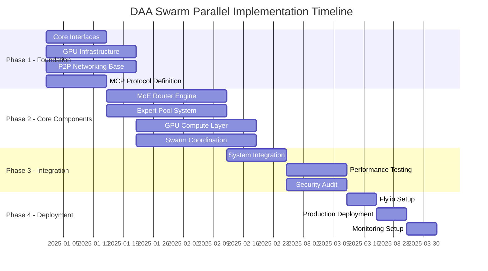
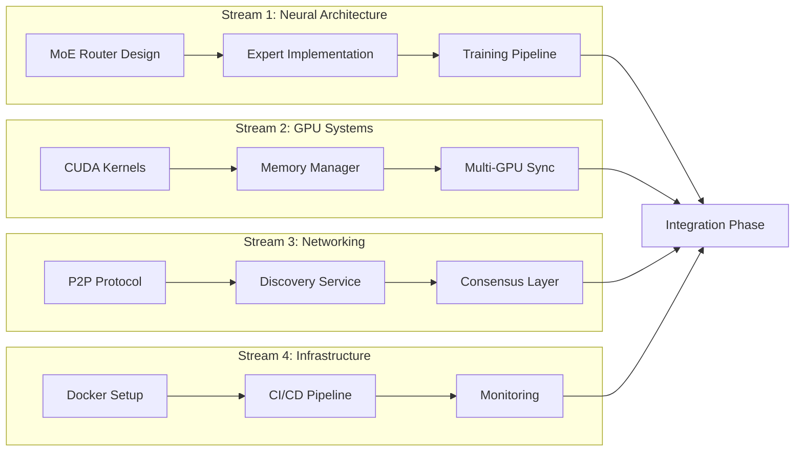
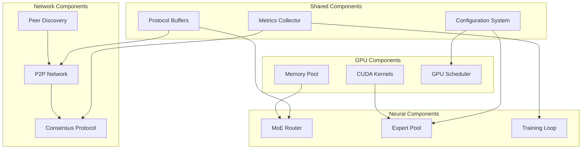
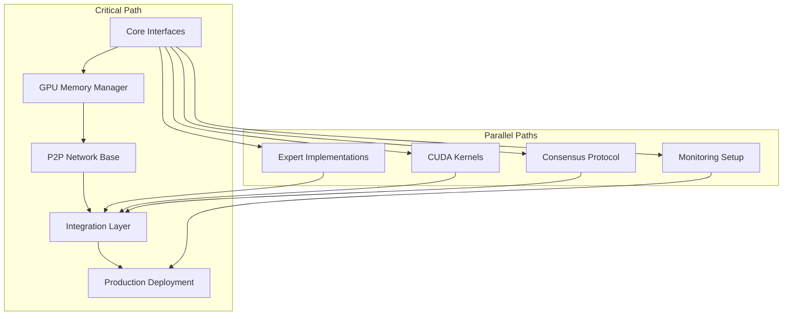

# DAA Swarm Parallel Implementation Guide

## Executive Summary

This guide outlines a parallel implementation strategy for the DAA Swarm system, enabling multiple teams to work simultaneously on different components while maintaining integration points. The strategy maximizes development velocity through careful task decomposition, clear interfaces, and continuous integration practices.

## 1. Implementation Timeline



## 2. Team Structure & Responsibilities

### 2.1 Team Organization

```yaml
teams:
  neural_team:
    size: 3-4 developers
    focus: MoE architecture, expert specialization
    lead: Senior ML Engineer
    
  gpu_team:
    size: 2-3 developers
    focus: CUDA optimization, memory management
    lead: GPU Systems Engineer
    
  network_team:
    size: 3-4 developers
    focus: P2P protocols, consensus mechanisms
    lead: Distributed Systems Architect
    
  infrastructure_team:
    size: 2-3 developers
    focus: Deployment, monitoring, DevOps
    lead: Platform Engineer
    
  integration_team:
    size: 2 developers
    focus: API design, system integration
    lead: Principal Engineer
```

### 2.2 Parallel Work Streams



## 3. Phase 1: Foundation (Weeks 1-3)

### 3.1 Core Interfaces (All Teams)

```rust
// crates/daa-swarm-core/src/traits.rs
pub trait Expert: Send + Sync {
    type Input;
    type Output;
    type Error;
    
    async fn forward(&self, input: Self::Input) -> Result<Self::Output, Self::Error>;
    fn specialization(&self) -> ExpertSpecialization;
    fn resource_requirements(&self) -> ResourceRequirements;
}

pub trait SwarmNode: Send + Sync {
    async fn join_swarm(&mut self, swarm_id: SwarmId) -> Result<(), SwarmError>;
    async fn propose_computation(&self, task: ComputeTask) -> Result<ProposalId, SwarmError>;
    async fn participate(&mut self, proposal: ProposalId) -> Result<(), SwarmError>;
}

pub trait GpuExecutor: Send + Sync {
    async fn allocate(&mut self, requirements: ResourceRequirements) -> Result<Allocation, GpuError>;
    async fn execute(&self, kernel: CudaKernel, allocation: Allocation) -> Result<Output, GpuError>;
    async fn release(&mut self, allocation: Allocation) -> Result<(), GpuError>;
}
```

### 3.2 Parallel Tasks by Team

#### Neural Team Tasks
```toml
[[tasks]]
id = "neural-1.1"
name = "Define Expert trait hierarchy"
duration = "3 days"
dependencies = []

[[tasks]]
id = "neural-1.2"
name = "Design MoE routing interface"
duration = "3 days"
dependencies = ["neural-1.1"]

[[tasks]]
id = "neural-1.3"
name = "Create expert specialization taxonomy"
duration = "4 days"
dependencies = ["neural-1.1"]
```

#### GPU Team Tasks
```toml
[[tasks]]
id = "gpu-1.1"
name = "Setup CUDA build environment"
duration = "2 days"
dependencies = []

[[tasks]]
id = "gpu-1.2"
name = "Design memory allocation interface"
duration = "3 days"
dependencies = []

[[tasks]]
id = "gpu-1.3"
name = "Implement basic tensor operations"
duration = "5 days"
dependencies = ["gpu-1.1"]
```

#### Network Team Tasks
```toml
[[tasks]]
id = "net-1.1"
name = "Setup libp2p dependencies"
duration = "2 days"
dependencies = []

[[tasks]]
id = "net-1.2"
name = "Design swarm discovery protocol"
duration = "4 days"
dependencies = ["net-1.1"]

[[tasks]]
id = "net-1.3"
name = "Implement DHT-based peer discovery"
duration = "5 days"
dependencies = ["net-1.2"]
```

#### Infrastructure Team Tasks
```toml
[[tasks]]
id = "infra-1.1"
name = "Create base Docker images"
duration = "3 days"
dependencies = []

[[tasks]]
id = "infra-1.2"
name = "Setup GitHub Actions workflows"
duration = "3 days"
dependencies = []

[[tasks]]
id = "infra-1.3"
name = "Configure Fly.io project"
duration = "2 days"
dependencies = []
```

## 4. Phase 2: Core Components (Weeks 4-7)

### 4.1 Component Dependencies



### 4.2 Parallel Implementation Tasks

#### Neural Team: MoE Implementation
```rust
// Week 4-5: Router Implementation
// crates/daa-swarm-neural/src/router.rs
pub struct AdaptiveRouter {
    base_network: nn::Sequential,
    adaptation_controller: AdaptationController,
    routing_cache: Arc<DashMap<InputHash, RoutingDecision>>,
}

// Week 5-6: Expert Pool
// crates/daa-swarm-neural/src/experts.rs
pub struct ExpertPool {
    experts: Vec<Box<dyn Expert>>,
    specializations: HashMap<ExpertId, ExpertSpecialization>,
    load_balancer: LoadBalancer,
}

// Week 6-7: Training Pipeline
// crates/daa-swarm-neural/src/training.rs
pub struct DistributedTrainer {
    local_model: SwarmModel,
    optimizer: AdamW,
    gradient_aggregator: GradientAggregator,
}
```

#### GPU Team: Compute Layer
```rust
// Week 4-5: CUDA Kernels
// crates/daa-swarm-gpu/src/kernels/mod.rs
pub mod attention {
    pub fn flash_attention_forward(
        q: &CudaTensor,
        k: &CudaTensor,
        v: &CudaTensor,
        mask: Option<&CudaTensor>,
    ) -> CudaTensor;
}

// Week 5-6: Memory Management
// crates/daa-swarm-gpu/src/memory.rs
pub struct GpuMemoryPool {
    pools: Vec<MemoryPool>,
    allocation_strategy: AllocationStrategy,
    defragmenter: Defragmenter,
}

// Week 6-7: Multi-GPU Coordination
// crates/daa-swarm-gpu/src/multi_gpu.rs
pub struct MultiGpuCoordinator {
    devices: Vec<CudaDevice>,
    nccl_comm: NcclCommunicator,
    pipeline: PipelineScheduler,
}
```

#### Network Team: P2P Infrastructure
```rust
// Week 4-5: P2P Base Layer
// crates/daa-swarm-network/src/p2p.rs
pub struct SwarmNetwork {
    swarm: Swarm<SwarmBehaviour>,
    peer_store: PeerStore,
    message_handler: MessageHandler,
}

// Week 5-6: Discovery Service
// crates/daa-swarm-network/src/discovery.rs
pub struct ExpertDiscovery {
    dht: Kademlia<MemoryStore>,
    mdns: Mdns,
    bootstrap_nodes: Vec<Multiaddr>,
}

// Week 6-7: Consensus Protocol
// crates/daa-swarm-network/src/consensus.rs
pub struct ByzantineConsensus {
    state_machine: StateMachine,
    voting_protocol: VotingProtocol,
    fault_detector: FaultDetector,
}
```

#### Infrastructure Team: Deployment Pipeline
```yaml
# Week 4-5: Docker Configuration
# docker/docker-compose.dev.yml
services:
  swarm-node:
    build:
      context: .
      dockerfile: docker/Dockerfile.gpu
    runtime: nvidia
    environment:
      - CUDA_VISIBLE_DEVICES=0
    volumes:
      - ./models:/data/models
      - ./checkpoints:/data/checkpoints

# Week 5-6: CI/CD Pipeline
# .github/workflows/swarm-ci.yml
name: Swarm CI
on: [push, pull_request]
jobs:
  test:
    strategy:
      matrix:
        component: [neural, gpu, network, integration]
    runs-on: [self-hosted, gpu]
    steps:
      - uses: actions/checkout@v3
      - name: Test Component
        run: cargo test --package daa-swarm-${{ matrix.component }}

# Week 6-7: Monitoring Setup
# monitoring/prometheus.yml
scrape_configs:
  - job_name: 'swarm-metrics'
    static_configs:
      - targets: ['swarm-node:9090']
    metric_relabel_configs:
      - source_labels: [__name__]
        regex: 'swarm_.*'
        action: keep
```

## 5. Phase 3: Integration (Weeks 8-9)

### 5.1 Integration Points

```rust
// crates/daa-swarm/src/lib.rs
pub struct SwarmOrchestrator {
    // Components from different teams
    router: Arc<AdaptiveRouter>,           // Neural team
    gpu_executor: Arc<MultiGpuCoordinator>, // GPU team
    network: Arc<SwarmNetwork>,             // Network team
    monitor: Arc<MetricsCollector>,         // Infrastructure team
}

impl SwarmOrchestrator {
    pub async fn process_request(
        &self,
        request: InferenceRequest,
    ) -> Result<InferenceResponse> {
        // 1. Route to experts
        let (expert_ids, weights) = self.router.route(&request.input).await?;
        
        // 2. Discover expert locations
        let expert_nodes = self.network.discover_experts(&expert_ids).await?;
        
        // 3. Distribute computation
        let compute_tasks = self.create_compute_tasks(
            &request,
            &expert_nodes,
            &weights
        );
        
        // 4. Execute on GPU
        let results = self.gpu_executor.execute_parallel(compute_tasks).await?;
        
        // 5. Aggregate results
        let aggregated = self.aggregate_expert_outputs(results, weights).await?;
        
        // 6. Record metrics
        self.monitor.record_inference(&request, &aggregated);
        
        Ok(InferenceResponse::new(aggregated))
    }
}
```

### 5.2 Integration Testing Matrix

| Component A | Component B | Test Scenario | Priority |
|------------|-------------|---------------|----------|
| Router | GPU Executor | Expert allocation efficiency | High |
| Network | Consensus | Byzantine fault tolerance | High |
| GPU | Network | Gradient synchronization | High |
| Router | Discovery | Expert availability queries | Medium |
| Monitor | All | Metrics collection accuracy | Medium |
| Docker | GPU | Container GPU access | High |

## 6. Phase 4: Deployment (Weeks 10-11)

### 6.1 Deployment Checklist

```markdown
## Pre-Deployment
- [ ] All unit tests passing
- [ ] Integration tests complete
- [ ] Performance benchmarks meet targets
- [ ] Security audit complete
- [ ] Documentation updated

## Fly.io Setup
- [ ] GPU regions selected (ord, iad, sjc)
- [ ] Machine sizes configured (a100-80gb)
- [ ] Volumes provisioned for models
- [ ] Secrets configured (API keys, certs)
- [ ] Monitoring endpoints exposed

## Production Deployment
- [ ] Blue-green deployment strategy
- [ ] Health checks configured
- [ ] Autoscaling policies set
- [ ] Backup procedures tested
- [ ] Incident response plan ready
```

### 6.2 Rollout Strategy

```mermaid
graph LR
    DEV[Development] --> STAGING[Staging]
    STAGING --> CANARY[Canary (5%)]
    CANARY --> PARTIAL[Partial (25%)]
    PARTIAL --> FULL[Full Production]
    
    STAGING -.->|Issues| DEV
    CANARY -.->|Issues| STAGING
    PARTIAL -.->|Issues| CANARY
    FULL -.->|Issues| PARTIAL
```

## 7. Critical Path Analysis

### 7.1 Dependencies Graph



### 7.2 Risk Mitigation

| Risk | Impact | Probability | Mitigation |
|------|--------|-------------|------------|
| GPU memory limitations | High | Medium | Implement gradient checkpointing, dynamic batching |
| Network latency issues | High | Medium | Edge caching, regional deployments |
| Integration complexity | Medium | High | Daily integration builds, clear interfaces |
| Fly.io GPU availability | Medium | Low | Multi-region fallback, reservation strategy |
| Team coordination | Medium | Medium | Daily standups, shared dashboards |

## 8. Continuous Integration Strategy

### 8.1 Branch Strategy

```bash
main
├── develop
│   ├── feature/neural-router
│   ├── feature/gpu-kernels
│   ├── feature/p2p-network
│   └── feature/deployment
└── release/v1.0
```

### 8.2 Merge Schedule

```yaml
merge_windows:
  daily:
    time: "10:00 UTC"
    branches: ["feature/*", "develop"]
    requirements:
      - all_tests_pass
      - code_review_approved
      - no_merge_conflicts
      
  weekly:
    time: "Friday 14:00 UTC"
    branches: ["develop", "main"]
    requirements:
      - integration_tests_pass
      - performance_benchmarks_pass
      - security_scan_pass
```

## 9. Communication Protocol

### 9.1 Sync Points

```yaml
meetings:
  daily_standup:
    time: "09:00 UTC"
    duration: "15 min"
    attendees: ["team_leads"]
    
  integration_sync:
    time: "Tuesday/Thursday 14:00 UTC"
    duration: "30 min"
    attendees: ["all_teams"]
    
  architecture_review:
    time: "Friday 15:00 UTC"
    duration: "1 hour"
    attendees: ["senior_engineers"]
```

### 9.2 Documentation Requirements

- API documentation: Generated from code comments
- Architecture decisions: ADR format in `/docs/adr/`
- Integration guides: Markdown in `/docs/integration/`
- Deployment runbooks: `/ops/runbooks/`

## 10. Success Metrics

### 10.1 Performance Targets

```yaml
performance_targets:
  latency:
    p50: "< 100ms"
    p95: "< 500ms"
    p99: "< 1000ms"
    
  throughput:
    single_gpu: "> 1000 req/s"
    multi_gpu: "> 5000 req/s"
    
  resource_utilization:
    gpu_memory: "< 80%"
    gpu_compute: "> 70%"
    
  availability:
    uptime: "> 99.9%"
    mttr: "< 15 min"
```

### 10.2 Quality Metrics

```yaml
quality_targets:
  code_coverage: "> 80%"
  documentation_coverage: "> 90%"
  security_vulnerabilities: "0 critical, < 5 medium"
  technical_debt_ratio: "< 5%"
```

## Conclusion

This parallel implementation guide enables multiple teams to work simultaneously while maintaining clear integration points and dependencies. The phased approach ensures continuous progress while managing complexity and risk. Regular sync points and clear success metrics keep all teams aligned toward the common goal of building a revolutionary distributed AI system.