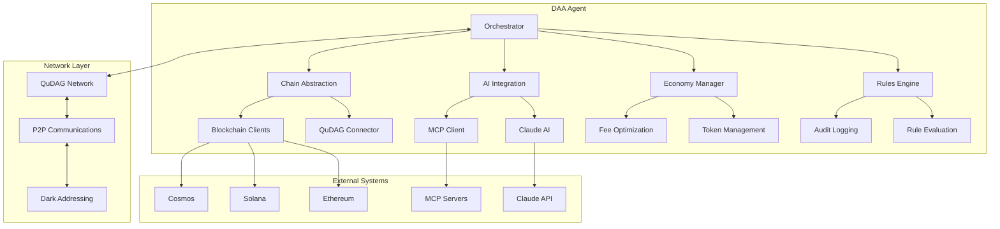
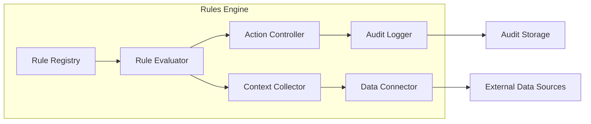
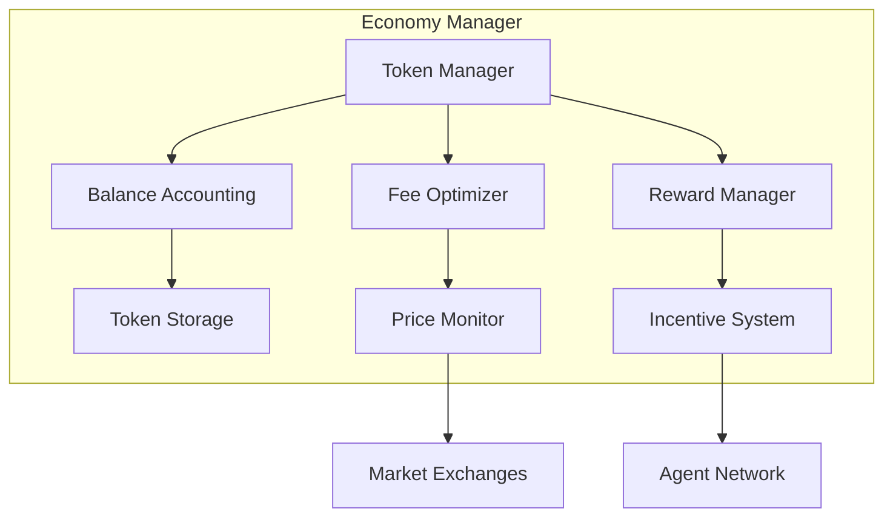
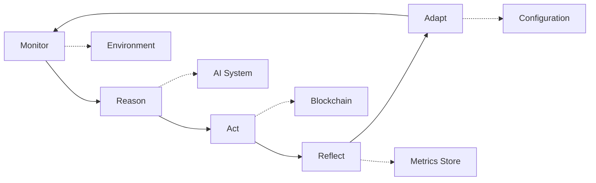
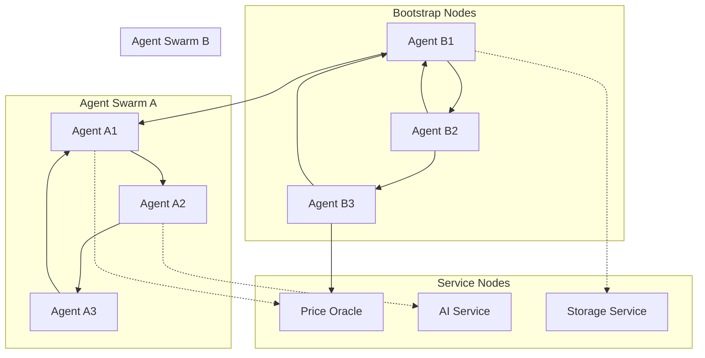
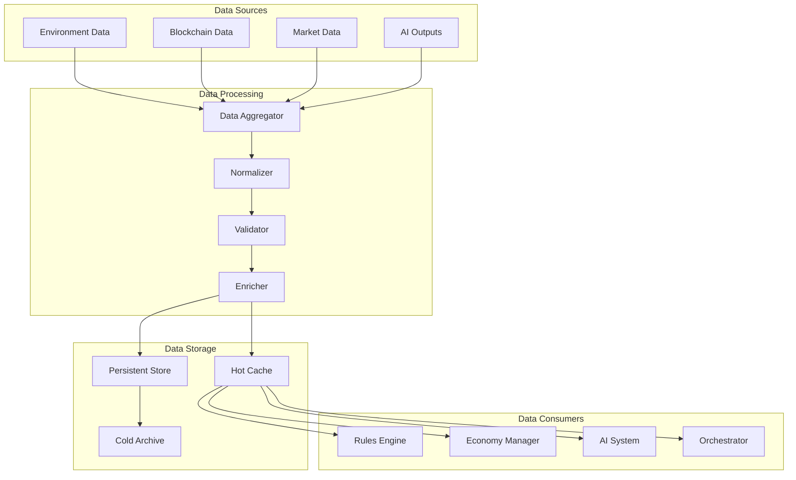

# 🏗️ DAA Architecture Guide

> **Deep dive into the architecture of Decentralized Autonomous Agents** - Understanding the design principles, component interactions, and system topology.

[](https://microservices.io)
[](https://github.com/ruvnet/qudag)
[](https://csrc.nist.gov/projects/post-quantum-cryptography)

---

## 📋 Table of Contents

1. [System Overview](#-system-overview)
2. [Core Principles](#-core-principles)
3. [Component Architecture](#-component-architecture)
4. [MRAP Autonomy Loop](#-mrap-autonomy-loop)
5. [Network Topology](#-network-topology)
6. [Security Architecture](#-security-architecture)
7. [Data Flow](#-data-flow)
8. [Scalability Design](#-scalability-design)
9. [Integration Patterns](#-integration-patterns)
10. [Deployment Models](#-deployment-models)

---

## 🌟 System Overview

The DAA SDK implements a **distributed, quantum-resistant, economically self-sustaining** autonomous agent architecture. The system is built on microservices principles with clear separation of concerns.

### High-Level Architecture



### Key Characteristics

| Aspect | Description | Implementation |
|--------|-------------|----------------|
| **Distributed** | No single point of failure | P2P network with QuDAG |
| **Autonomous** | Self-governing decision making | MRAP loop + Rules Engine |
| **Economic** | Self-sustaining token economy | Built-in rUv token system |
| **Secure** | Quantum-resistant cryptography | ML-DSA, ML-KEM, HQC |
| **Scalable** | Horizontal scaling support | Microservices + Swarm coordination |

---

## 🎯 Core Principles

### 1. **Separation of Concerns**

Each component has a single, well-defined responsibility:

```rust
// Clear separation between orchestration and business logic
pub struct DaaOrchestrator {
    rules_engine: Arc<RulesEngine>,
    economy_manager: Arc<EconomyManager>,
    ai_integration: Arc<AiIntegration>,
    chain_abstraction: Arc<ChainAbstraction>,
}
```

### 2. **Dependency Inversion**

High-level modules don't depend on low-level modules:

```rust
// Orchestrator depends on abstractions, not concrete implementations
pub trait ChainProvider {
    async fn execute_transaction(&self, tx: Transaction) -> Result<TxHash>;
    async fn query_balance(&self, address: Address) -> Result<Balance>;
}

pub struct EthereumProvider;
impl ChainProvider for EthereumProvider { /* ... */ }

pub struct SolanaProvider;
impl ChainProvider for SolanaProvider { /* ... */ }
```

### 3. **Event-Driven Architecture**

Components communicate through events:

```rust
#[derive(Debug, Clone)]
pub enum DaaEvent {
    BalanceChanged { amount: u64, token: String },
    RuleTriggered { rule_id: String, context: Context },
    TransactionCompleted { tx_hash: String, status: TxStatus },
    AiDecisionMade { decision: Decision, confidence: f64 },
}
```

### 4. **Fail-Safe Design**

System degrades gracefully under failure:

```rust
pub struct SafeExecutor {
    primary: Box<dyn Executor>,
    fallback: Box<dyn Executor>,
    circuit_breaker: CircuitBreaker,
}

impl SafeExecutor {
    pub async fn execute(&self, command: Command) -> Result<()> {
        if self.circuit_breaker.is_open() {
            return self.fallback.execute(command).await;
        }
        
        match self.primary.execute(command.clone()).await {
            Ok(result) => {
                self.circuit_breaker.record_success();
                Ok(result)
            }
            Err(e) => {
                self.circuit_breaker.record_failure();
                self.fallback.execute(command).await
            }
        }
    }
}
```

---

## 🧩 Component Architecture

### Orchestrator Layer

The **orchestrator** acts as the central coordination hub:

```rust
pub struct DaaOrchestrator {
    /// Core configuration
    config: OrchestratorConfig,
    
    /// Component managers
    workflow_engine: Arc<WorkflowEngine>,
    service_registry: Arc<ServiceRegistry>,
    event_bus: Arc<EventBus>,
    
    /// Integration layers
    rules_integration: Arc<RulesIntegration>,
    economy_integration: Arc<EconomyIntegration>,
    ai_integration: Arc<AiIntegration>,
    chain_integration: Arc<ChainIntegration>,
}
```

#### Responsibilities
- **Workflow Coordination**: Manages the execution of complex workflows
- **Service Discovery**: Maintains registry of available services
- **Event Routing**: Routes events between components
- **Resource Management**: Manages system resources and limits

### Rules Engine

Implements governance and decision-making logic:



#### Key Features
- **Dynamic Rule Loading**: Rules can be updated without restart
- **Context-Aware Evaluation**: Rules access current system state
- **Audit Trail**: All rule evaluations are logged
- **Performance Optimization**: Rule compilation and caching

```rust
pub struct RulesEngine {
    rule_registry: Arc<RuleRegistry>,
    context_provider: Arc<ContextProvider>,
    audit_logger: Arc<AuditLogger>,
    evaluator: Arc<RuleEvaluator>,
}

impl RulesEngine {
    pub async fn evaluate_rules(&self, trigger: &str) -> Result<Vec<Action>> {
        let context = self.context_provider.get_context().await?;
        let rules = self.rule_registry.get_rules_for_trigger(trigger)?;
        
        let mut actions = Vec::new();
        for rule in rules {
            let result = self.evaluator.evaluate(&rule, &context).await?;
            self.audit_logger.log_evaluation(&rule, &result).await?;
            
            if result.should_execute {
                actions.extend(result.actions);
            }
        }
        
        Ok(actions)
    }
}
```

### Economy Manager

Handles token economics and resource allocation:



#### Components
- **Token Manager**: Core rUv token operations
- **Fee Optimizer**: Dynamic fee calculation
- **Reward Manager**: Incentive distribution
- **Risk Manager**: Economic risk assessment

### AI Integration

Connects to Claude AI and MCP ecosystem:

```rust
pub struct AiIntegration {
    claude_client: Arc<ClaudeClient>,
    mcp_client: Arc<McpClient>,
    decision_cache: Arc<DecisionCache>,
    learning_engine: Arc<LearningEngine>,
}

impl AiIntegration {
    pub async fn make_decision(&self, context: &DecisionContext) -> Result<Decision> {
        // Check cache first
        if let Some(cached) = self.decision_cache.get(&context.hash()).await? {
            return Ok(cached);
        }
        
        // Gather relevant data through MCP
        let data = self.mcp_client.gather_context_data(context).await?;
        
        // Request decision from Claude
        let prompt = self.build_decision_prompt(context, &data)?;
        let response = self.claude_client.complete(prompt).await?;
        
        // Parse and validate decision
        let decision = self.parse_decision(response)?;
        self.validate_decision(&decision)?;
        
        // Cache for future use
        self.decision_cache.store(&context.hash(), &decision).await?;
        
        // Update learning engine
        self.learning_engine.record_decision(context, &decision).await?;
        
        Ok(decision)
    }
}
```

### Chain Abstraction

Provides unified interface to multiple blockchains:

```rust
pub trait ChainProvider: Send + Sync {
    async fn get_balance(&self, address: &Address) -> Result<Balance>;
    async fn send_transaction(&self, tx: &Transaction) -> Result<TxHash>;
    async fn get_transaction_status(&self, hash: &TxHash) -> Result<TxStatus>;
    async fn estimate_fee(&self, tx: &Transaction) -> Result<Fee>;
}

pub struct ChainAbstraction {
    providers: HashMap<ChainId, Box<dyn ChainProvider>>,
    router: Arc<ChainRouter>,
}

impl ChainAbstraction {
    pub async fn execute_transaction(&self, tx: Transaction) -> Result<TxHash> {
        let chain_id = tx.chain_id();
        let provider = self.providers.get(&chain_id)
            .ok_or(ChainError::UnsupportedChain(chain_id))?;
        
        // Estimate fees
        let fee = provider.estimate_fee(&tx).await?;
        
        // Apply fee optimization
        let optimized_tx = self.router.optimize_transaction(tx, fee).await?;
        
        // Execute transaction
        provider.send_transaction(&optimized_tx).await
    }
}
```

---

## 🔄 MRAP Autonomy Loop

The **Monitor-Reason-Act-Reflect-Adapt** loop is the core of agent autonomy:



### 1. **Monitor Phase**

Continuously observes the environment:

```rust
pub struct MonitoringSystem {
    data_collectors: Vec<Box<dyn DataCollector>>,
    event_aggregator: Arc<EventAggregator>,
    threshold_detector: Arc<ThresholdDetector>,
}

impl MonitoringSystem {
    pub async fn monitor_loop(&self) -> Result<()> {
        loop {
            // Collect data from all sources
            let mut observations = Vec::new();
            for collector in &self.data_collectors {
                let data = collector.collect().await?;
                observations.extend(data);
            }
            
            // Aggregate and analyze
            let aggregated = self.event_aggregator.aggregate(observations).await?;
            
            // Check for threshold violations
            let alerts = self.threshold_detector.check_thresholds(&aggregated).await?;
            
            // Emit events for significant changes
            for alert in alerts {
                self.emit_event(DaaEvent::ThresholdTriggered {
                    threshold: alert.threshold,
                    value: alert.current_value,
                    context: alert.context,
                }).await?;
            }
            
            tokio::time::sleep(Duration::from_secs(1)).await;
        }
    }
}
```

### 2. **Reason Phase**

Uses AI to analyze observations and plan actions:

```rust
pub struct ReasoningEngine {
    ai_client: Arc<AiIntegration>,
    knowledge_base: Arc<KnowledgeBase>,
    strategy_optimizer: Arc<StrategyOptimizer>,
}

impl ReasoningEngine {
    pub async fn reason(&self, observations: &[Observation]) -> Result<ActionPlan> {
        // Build context from observations
        let context = self.build_reasoning_context(observations).await?;
        
        // Query knowledge base for relevant patterns
        let patterns = self.knowledge_base.find_patterns(&context).await?;
        
        // Generate potential strategies
        let strategies = self.strategy_optimizer.generate_strategies(&context, &patterns).await?;
        
        // Use AI to evaluate and select best strategy
        let decision_context = DecisionContext {
            observations: observations.to_vec(),
            patterns,
            strategies,
            constraints: self.get_current_constraints().await?,
        };
        
        let decision = self.ai_client.make_decision(&decision_context).await?;
        
        // Convert decision to actionable plan
        let action_plan = self.build_action_plan(decision).await?;
        
        Ok(action_plan)
    }
}
```

### 3. **Act Phase**

Executes the planned actions:

```rust
pub struct ActionExecutor {
    executors: HashMap<ActionType, Box<dyn ActionHandler>>,
    safety_checker: Arc<SafetyChecker>,
    transaction_manager: Arc<TransactionManager>,
}

impl ActionExecutor {
    pub async fn execute_plan(&self, plan: ActionPlan) -> Result<ExecutionResult> {
        // Pre-execution safety checks
        self.safety_checker.validate_plan(&plan).await?;
        
        let mut results = Vec::new();
        
        // Execute actions according to plan
        for action in plan.actions {
            // Check if action is still valid
            if !self.safety_checker.is_action_safe(&action).await? {
                results.push(ActionResult::Skipped {
                    action: action.clone(),
                    reason: "Safety check failed".to_string(),
                });
                continue;
            }
            
            // Find appropriate executor
            let executor = self.executors.get(&action.action_type)
                .ok_or(ExecutionError::NoExecutor(action.action_type.clone()))?;
            
            // Execute with transaction management
            let result = self.transaction_manager.execute_with_rollback(|| {
                executor.execute(&action)
            }).await?;
            
            results.push(result);
        }
        
        Ok(ExecutionResult { results })
    }
}
```

### 4. **Reflect Phase**

Analyzes the results of actions:

```rust
pub struct ReflectionEngine {
    performance_analyzer: Arc<PerformanceAnalyzer>,
    outcome_tracker: Arc<OutcomeTracker>,
    metrics_collector: Arc<MetricsCollector>,
}

impl ReflectionEngine {
    pub async fn reflect(&self, 
        plan: &ActionPlan, 
        result: &ExecutionResult
    ) -> Result<ReflectionReport> {
        // Measure performance metrics
        let performance = self.performance_analyzer.analyze(plan, result).await?;
        
        // Track outcomes against expectations
        let outcomes = self.outcome_tracker.track_outcomes(plan, result).await?;
        
        // Collect system metrics
        let metrics = self.metrics_collector.collect_metrics().await?;
        
        // Generate insights
        let insights = self.generate_insights(&performance, &outcomes, &metrics).await?;
        
        Ok(ReflectionReport {
            performance,
            outcomes,
            metrics,
            insights,
            recommendations: self.generate_recommendations(&insights).await?,
        })
    }
}
```

### 5. **Adapt Phase**

Updates system parameters based on reflection:

```rust
pub struct AdaptationEngine {
    parameter_optimizer: Arc<ParameterOptimizer>,
    strategy_updater: Arc<StrategyUpdater>,
    learning_system: Arc<LearningSystem>,
}

impl AdaptationEngine {
    pub async fn adapt(&self, reflection: &ReflectionReport) -> Result<AdaptationResult> {
        let mut adaptations = Vec::new();
        
        // Optimize parameters based on performance
        if let Some(param_updates) = self.parameter_optimizer
            .optimize(&reflection.performance).await? {
            adaptations.push(Adaptation::ParameterUpdate(param_updates));
        }
        
        // Update strategies based on outcomes
        if let Some(strategy_updates) = self.strategy_updater
            .update_strategies(&reflection.outcomes).await? {
            adaptations.push(Adaptation::StrategyUpdate(strategy_updates));
        }
        
        // Update learning models
        self.learning_system.learn_from_reflection(reflection).await?;
        
        // Apply adaptations
        for adaptation in &adaptations {
            self.apply_adaptation(adaptation).await?;
        }
        
        Ok(AdaptationResult { adaptations })
    }
}
```

---

## 🌐 Network Topology

### P2P Network Structure

The DAA network uses a structured P2P topology with QuDAG protocol:



### Node Types

| Node Type | Role | Characteristics |
|-----------|------|----------------|
| **Bootstrap** | Network entry point | High availability, well-known addresses |
| **Agent** | Autonomous operation | Full DAA functionality, P2P communication |
| **Service** | Specialized function | Oracle, AI, storage, computation |
| **Bridge** | Cross-chain | Connects different blockchain networks |

### Discovery Protocol

```rust
pub struct NodeDiscovery {
    dht: Arc<Dht>,
    bootstrap_nodes: Vec<NodeId>,
    node_store: Arc<NodeStore>,
}

impl NodeDiscovery {
    pub async fn discover_nodes(&self, service_type: &str) -> Result<Vec<NodeInfo>> {
        // Query DHT for nodes providing the service
        let mut nodes = self.dht.find_providers(service_type).await?;
        
        // Add nodes from local store
        let local_nodes = self.node_store.get_nodes_by_service(service_type).await?;
        nodes.extend(local_nodes);
        
        // Filter by reachability and health
        let healthy_nodes = self.filter_healthy_nodes(nodes).await?;
        
        Ok(healthy_nodes)
    }
    
    async fn filter_healthy_nodes(&self, nodes: Vec<NodeInfo>) -> Result<Vec<NodeInfo>> {
        let mut healthy = Vec::new();
        
        for node in nodes {
            if self.check_node_health(&node).await? {
                healthy.push(node);
            }
        }
        
        Ok(healthy)
    }
}
```

---

## 🔒 Security Architecture

### Quantum-Resistant Cryptography

DAA implements post-quantum cryptographic algorithms:

```rust
pub struct CryptoSuite {
    // Digital signatures (ML-DSA)
    signature_provider: Arc<MlDsaProvider>,
    
    // Key encapsulation (ML-KEM)
    kem_provider: Arc<MlKemProvider>,
    
    // Code-based crypto (HQC)
    hqc_provider: Arc<HqcProvider>,
    
    // Hash-based signatures (backup)
    hash_sig_provider: Arc<HashSignatureProvider>,
}

impl CryptoSuite {
    pub async fn sign_message(&self, message: &[u8], private_key: &PrivateKey) -> Result<Signature> {
        // Use ML-DSA for primary signatures
        match self.signature_provider.sign(message, private_key).await {
            Ok(sig) => Ok(sig),
            Err(_) => {
                // Fallback to hash-based signatures
                self.hash_sig_provider.sign(message, private_key).await
            }
        }
    }
    
    pub async fn encrypt_data(&self, data: &[u8], public_key: &PublicKey) -> Result<EncryptedData> {
        // Use ML-KEM for key encapsulation
        let (encapsulated_key, shared_secret) = self.kem_provider
            .encapsulate(public_key).await?;
        
        // Use shared secret for symmetric encryption
        let encrypted = symmetric_encrypt(data, &shared_secret)?;
        
        Ok(EncryptedData {
            encapsulated_key,
            ciphertext: encrypted,
        })
    }
}
```

### Security Layers

1. **Transport Security**: TLS 1.3 with post-quantum cipher suites
2. **Message Security**: End-to-end encryption with ML-KEM
3. **Identity Security**: ML-DSA signatures for authentication
4. **Network Security**: Onion routing for privacy
5. **Application Security**: Rule-based access control

### Threat Model

| Threat | Mitigation | Implementation |
|--------|------------|----------------|
| **Quantum Attack** | Post-quantum crypto | ML-DSA, ML-KEM, HQC |
| **Network Analysis** | Traffic obfuscation | Onion routing, padding |
| **Economic Attack** | Risk limits | Rules engine constraints |
| **AI Manipulation** | Decision auditing | Comprehensive logging |
| **Node Compromise** | Byzantine tolerance | Consensus mechanisms |

---

## 📊 Data Flow

### Information Architecture



### Data Categories

| Category | Freshness | Volume | Access Pattern |
|----------|-----------|--------|----------------|
| **Real-time** | <1s | High | Streaming |
| **Operational** | <1m | Medium | Query/Response |
| **Historical** | >1h | Very High | Batch/Analytics |
| **Configuration** | Manual | Low | Read-heavy |

### Data Pipeline

```rust
pub struct DataPipeline {
    collectors: Vec<Box<dyn DataCollector>>,
    processors: Vec<Box<dyn DataProcessor>>,
    storage: Arc<dyn DataStorage>,
    distributors: Vec<Box<dyn DataDistributor>>,
}

impl DataPipeline {
    pub async fn process_data_stream(&self) -> Result<()> {
        let (tx, mut rx) = mpsc::channel(1000);
        
        // Start data collectors
        for collector in &self.collectors {
            let tx = tx.clone();
            let collector = collector.clone();
            tokio::spawn(async move {
                loop {
                    match collector.collect().await {
                        Ok(data) => {
                            if tx.send(data).await.is_err() {
                                break; // Channel closed
                            }
                        }
                        Err(e) => {
                            eprintln!("Collection error: {}", e);
                            tokio::time::sleep(Duration::from_secs(1)).await;
                        }
                    }
                }
            });
        }
        
        // Process data stream
        while let Some(raw_data) = rx.recv().await {
            // Apply processors in sequence
            let mut processed_data = raw_data;
            for processor in &self.processors {
                processed_data = processor.process(processed_data).await?;
            }
            
            // Store processed data
            self.storage.store(&processed_data).await?;
            
            // Distribute to consumers
            for distributor in &self.distributors {
                distributor.distribute(&processed_data).await?;
            }
        }
        
        Ok(())
    }
}
```

---

## 📈 Scalability Design

### Horizontal Scaling

DAA supports horizontal scaling through several mechanisms:

#### Agent Swarms

Multiple agents can work together on complex tasks:

```rust
pub struct AgentSwarm {
    agents: Vec<Arc<DaaAgent>>,
    coordinator: Arc<SwarmCoordinator>,
    task_queue: Arc<TaskQueue>,
    result_aggregator: Arc<ResultAggregator>,
}

impl AgentSwarm {
    pub async fn execute_distributed_task(&self, task: DistributedTask) -> Result<TaskResult> {
        // Split task into subtasks
        let subtasks = self.coordinator.split_task(task).await?;
        
        // Distribute subtasks to agents
        let mut handles = Vec::new();
        for (agent, subtask) in self.agents.iter().zip(subtasks) {
            let agent = agent.clone();
            let handle = tokio::spawn(async move {
                agent.execute_task(subtask).await
            });
            handles.push(handle);
        }
        
        // Collect results
        let mut results = Vec::new();
        for handle in handles {
            results.push(handle.await??);
        }
        
        // Aggregate results
        self.result_aggregator.aggregate(results).await
    }
}
```

#### Service Mesh

Services can be scaled independently:

```rust
pub struct ServiceMesh {
    service_registry: Arc<ServiceRegistry>,
    load_balancer: Arc<LoadBalancer>,
    health_checker: Arc<HealthChecker>,
}

impl ServiceMesh {
    pub async fn call_service(&self, 
        service_name: &str, 
        request: ServiceRequest
    ) -> Result<ServiceResponse> {
        // Discover available instances
        let instances = self.service_registry.get_instances(service_name).await?;
        
        // Filter healthy instances
        let healthy_instances = self.health_checker.filter_healthy(instances).await?;
        
        // Load balance request
        let selected_instance = self.load_balancer.select(healthy_instances).await?;
        
        // Make request with retries
        self.make_request_with_retry(selected_instance, request).await
    }
}
```

### Vertical Scaling

Individual components can be optimized for performance:

#### Resource Management

```rust
pub struct ResourceManager {
    cpu_monitor: Arc<CpuMonitor>,
    memory_monitor: Arc<MemoryMonitor>,
    io_monitor: Arc<IoMonitor>,
    auto_scaler: Arc<AutoScaler>,
}

impl ResourceManager {
    pub async fn optimize_resources(&self) -> Result<()> {
        // Monitor resource usage
        let cpu_usage = self.cpu_monitor.get_usage().await?;
        let memory_usage = self.memory_monitor.get_usage().await?;
        let io_usage = self.io_monitor.get_usage().await?;
        
        // Determine scaling needs
        let scaling_decision = self.auto_scaler.make_decision(
            cpu_usage, memory_usage, io_usage
        ).await?;
        
        // Apply scaling
        match scaling_decision {
            ScalingDecision::ScaleUp { resource, amount } => {
                self.scale_up_resource(resource, amount).await?;
            }
            ScalingDecision::ScaleDown { resource, amount } => {
                self.scale_down_resource(resource, amount).await?;
            }
            ScalingDecision::NoAction => {
                // Continue monitoring
            }
        }
        
        Ok(())
    }
}
```

---

## 🔌 Integration Patterns

### Plugin Architecture

DAA supports extensible plugins for customization:

```rust
pub trait DaaPlugin: Send + Sync {
    fn name(&self) -> &str;
    fn version(&self) -> &str;
    async fn initialize(&self, context: &PluginContext) -> Result<()>;
    async fn execute(&self, input: PluginInput) -> Result<PluginOutput>;
    async fn shutdown(&self) -> Result<()>;
}

pub struct PluginManager {
    plugins: HashMap<String, Box<dyn DaaPlugin>>,
    plugin_loader: Arc<PluginLoader>,
}

impl PluginManager {
    pub async fn load_plugin(&mut self, path: &Path) -> Result<()> {
        let plugin = self.plugin_loader.load(path).await?;
        let plugin_name = plugin.name().to_string();
        
        // Initialize plugin
        let context = PluginContext {
            config: self.get_plugin_config(&plugin_name)?,
            services: self.get_service_registry(),
        };
        
        plugin.initialize(&context).await?;
        
        // Register plugin
        self.plugins.insert(plugin_name, plugin);
        
        Ok(())
    }
}
```

### External API Integration

```rust
pub struct ApiIntegration {
    http_client: Arc<HttpClient>,
    auth_manager: Arc<AuthManager>,
    rate_limiter: Arc<RateLimiter>,
    circuit_breaker: Arc<CircuitBreaker>,
}

impl ApiIntegration {
    pub async fn call_external_api(&self, 
        endpoint: &str, 
        request: ApiRequest
    ) -> Result<ApiResponse> {
        // Check rate limits
        self.rate_limiter.check_limit().await?;
        
        // Check circuit breaker
        if self.circuit_breaker.is_open() {
            return Err(ApiError::ServiceUnavailable);
        }
        
        // Get authentication
        let auth_token = self.auth_manager.get_token().await?;
        
        // Make request
        let response = self.http_client
            .post(endpoint)
            .bearer_auth(auth_token)
            .json(&request)
            .send()
            .await?;
        
        // Handle response
        match response.status() {
            200..=299 => {
                self.circuit_breaker.record_success();
                Ok(response.json().await?)
            }
            400..=499 => {
                Err(ApiError::ClientError(response.status()))
            }
            500..=599 => {
                self.circuit_breaker.record_failure();
                Err(ApiError::ServerError(response.status()))
            }
            _ => {
                Err(ApiError::UnexpectedResponse(response.status()))
            }
        }
    }
}
```

---

## 🚀 Deployment Models

### Single Node Deployment

For development and small-scale applications:

```yaml
# docker-compose.yml
version: '3.8'
services:
  daa-agent:
    image: daa/agent:latest
    environment:
      - DAA_CONFIG_PATH=/config/agent.toml
      - DAA_LOG_LEVEL=info
    volumes:
      - ./config:/config
      - ./data:/data
    ports:
      - "8080:8080"
      - "9090:9090"
```

### Multi-Node Cluster

For production environments:

```yaml
# kubernetes/deployment.yaml
apiVersion: apps/v1
kind: Deployment
metadata:
  name: daa-agents
spec:
  replicas: 3
  selector:
    matchLabels:
      app: daa-agent
  template:
    metadata:
      labels:
        app: daa-agent
    spec:
      containers:
      - name: daa-agent
        image: daa/agent:latest
        env:
        - name: DAA_NODE_ID
          valueFrom:
            fieldRef:
              fieldPath: metadata.name
        - name: DAA_CLUSTER_MODE
          value: "true"
        resources:
          requests:
            memory: "512Mi"
            cpu: "250m"
          limits:
            memory: "1Gi"
            cpu: "500m"
```

### Cloud Native Deployment

With auto-scaling and service mesh:

```yaml
# istio/virtual-service.yaml
apiVersion: networking.istio.io/v1alpha3
kind: VirtualService
metadata:
  name: daa-agent
spec:
  http:
  - match:
    - uri:
        prefix: /api/v1
    route:
    - destination:
        host: daa-agent
        port:
          number: 8080
    fault:
      delay:
        percentage:
          value: 0.1
        fixedDelay: 5s
```

---

## 📚 Related Documentation

- [Core Concepts](./concepts.md) - Fundamental DAA concepts
- [Security Model](./security.md) - Detailed security architecture
- [Performance Guide](../troubleshooting/performance.md) - Performance optimization
- [Deployment Guide](../deployment/README.md) - Production deployment

---

## 🔄 Continuous Evolution

The DAA architecture is designed to evolve with advancing technology:

### Future Enhancements

- **Quantum Computing Integration**: Native quantum algorithm support
- **Advanced AI Models**: Integration with larger language models
- **Cross-Chain Protocols**: Universal blockchain interoperability
- **Edge Computing**: Distributed computation at network edge

### Versioning Strategy

- **Backward Compatibility**: APIs maintain compatibility across minor versions
- **Migration Paths**: Clear upgrade paths for major versions
- **Feature Flags**: Gradual rollout of new capabilities
- **Deprecation Policy**: 6-month notice for deprecated features

---

*This architecture guide is continuously updated to reflect the latest DAA design patterns and best practices.*