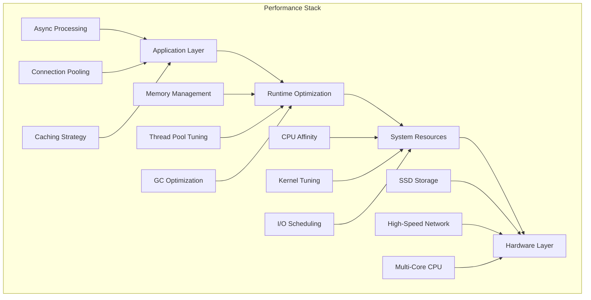

# ⚡ DAA Performance Tuning Guide

> **Optimize your DAA agents for maximum performance** - Advanced techniques for high-throughput, low-latency autonomous operations.

[](https://docs.daa.dev)
[](https://github.com/ruvnet/daa/tree/main/benchmarks)
[](https://prometheus.io)

---

## 📋 Table of Contents

1. [Performance Overview](#-performance-overview)
2. [System-Level Optimizations](#-system-level-optimizations)
3. [Application Tuning](#-application-tuning)
4. [Database Optimization](#-database-optimization)
5. [Network Performance](#-network-performance)
6. [Memory Management](#-memory-management)
7. [CPU Optimization](#-cpu-optimization)
8. [I/O Performance](#-io-performance)
9. [Monitoring & Profiling](#-monitoring--profiling)
10. [Benchmarking](#-benchmarking)

---

## 🎯 Performance Overview

### Target Performance Metrics

| Metric | Target | Production Range | Exceptional |
|--------|--------|------------------|-------------|
| **Workflow Throughput** | 100/sec | 50-200/sec | 500+/sec |
| **API Response Time** | <100ms | 50-200ms | <50ms |
| **P2P Message Latency** | <50ms | 20-100ms | <20ms |
| **Rule Evaluation** | <1ms | 0.5-2ms | <0.5ms |
| **Memory Usage** | <500MB | 200MB-1GB | <200MB |
| **CPU Usage** | <50% | 30-70% | <30% |

### Performance Architecture



---

## 🖥️ System-Level Optimizations

### Kernel Parameter Tuning

**Network Performance:**

```bash
# /etc/sysctl.conf
# TCP performance
net.core.rmem_max = 134217728
net.core.wmem_max = 134217728
net.ipv4.tcp_rmem = 4096 87380 134217728
net.ipv4.tcp_wmem = 4096 65536 134217728
net.ipv4.tcp_congestion_control = bbr

# Connection tracking
net.netfilter.nf_conntrack_max = 1048576
net.netfilter.nf_conntrack_tcp_timeout_established = 86400

# UDP performance
net.core.netdev_max_backlog = 5000
net.core.netdev_budget = 600

# Apply changes
sudo sysctl -p
```

**Memory Management:**

```bash
# Memory optimization
vm.swappiness = 10
vm.dirty_ratio = 15
vm.dirty_background_ratio = 5
vm.vfs_cache_pressure = 50

# Transparent Huge Pages
echo madvise | sudo tee /sys/kernel/mm/transparent_hugepage/enabled
echo madvise | sudo tee /sys/kernel/mm/transparent_hugepage/defrag
```

**File System Performance:**

```bash
# Increase file descriptor limits
echo "* soft nofile 65536" | sudo tee -a /etc/security/limits.conf
echo "* hard nofile 65536" | sudo tee -a /etc/security/limits.conf

# I/O scheduler optimization (for SSDs)
echo noop | sudo tee /sys/block/nvme0n1/queue/scheduler

# Mount options for performance
# Add to /etc/fstab:
# /dev/nvme0n1p1 /data ext4 defaults,noatime,discard 0 2
```

### CPU Optimization

**CPU Governor:**

```bash
# Set performance governor
sudo cpupower frequency-set -g performance

# Or use on-demand with lower latency
echo 1 | sudo tee /sys/devices/system/cpu/cpufreq/ondemand/ignore_nice_load
echo 10 | sudo tee /sys/devices/system/cpu/cpufreq/ondemand/up_threshold
```

**CPU Affinity:**

```bash
# Pin DAA agent to specific cores
taskset -c 0,1,2,3 daa-agent

# Or use systemd service
# /etc/systemd/system/daa-agent.service
[Service]
ExecStart=/usr/local/bin/daa-agent
CPUAffinity=0 1 2 3
```

**NUMA Optimization:**

```bash
# Check NUMA topology
numactl --hardware

# Run on specific NUMA node
numactl --cpunodebind=0 --membind=0 daa-agent

# Configure in systemd
[Service]
ExecStart=numactl --cpunodebind=0 --membind=0 /usr/local/bin/daa-agent
```

---

## 🚀 Application Tuning

### Runtime Configuration

**Optimal Configuration:**

```toml
# config/performance.toml
[runtime]
worker_threads = 8              # Match CPU cores
max_blocking_threads = 64       # For I/O intensive operations
thread_stack_size = "2MB"      # Reduce memory per thread
enable_io_uring = true          # Linux io_uring support (if available)

[orchestrator]
max_concurrent_workflows = 100   # Increase for high throughput
workflow_queue_size = 1000      # Buffer for workflow submissions
task_batch_size = 10            # Process tasks in batches
heartbeat_interval = "30s"      # Reduce for faster failure detection

[memory]
gc_interval = "60s"             # Garbage collection frequency
max_heap_size = "2GB"           # Limit memory usage
enable_memory_profiling = false # Disable in production

[cache]
enabled = true                  # Enable caching
max_size = "512MB"             # Cache size limit
ttl = "300s"                   # Time to live
eviction_policy = "lru"        # Least Recently Used
```

### Connection Pooling

**Database Connection Pool:**

```toml
[database]
pool_size = 50                  # Connection pool size
max_overflow = 20               # Additional connections
pool_timeout = "30s"            # Connection timeout
pool_recycle = "3600s"          # Recycle connections hourly
pool_pre_ping = true            # Validate connections
```

**HTTP Client Pool:**

```toml
[http_client]
pool_size = 100                 # HTTP connection pool
keep_alive_timeout = "60s"      # Keep connections alive
max_idle_per_host = 10          # Idle connections per host
enable_http2 = true             # HTTP/2 support
```

### Async Processing Optimization

**Tokio Runtime Tuning:**

```rust
// Custom runtime configuration
use tokio::runtime::{Builder, Runtime};

fn create_optimized_runtime() -> Runtime {
    Builder::new_multi_thread()
        .worker_threads(num_cpus::get())
        .max_blocking_threads(64)
        .thread_stack_size(2 * 1024 * 1024) // 2MB
        .thread_name("daa-worker")
        .enable_io()
        .enable_time()
        .build()
        .expect("Failed to create runtime")
}
```

**Channel Optimization:**

```rust
// Use bounded channels for backpressure
let (tx, rx) = tokio::sync::mpsc::channel(1000);

// Use oneshot for single responses
let (response_tx, response_rx) = tokio::sync::oneshot::channel();

// Use broadcast for fan-out
let (broadcast_tx, _) = tokio::sync::broadcast::channel(100);
```

---

## 🗄️ Database Optimization

### PostgreSQL Configuration

**Core Settings:**

```sql
-- postgresql.conf optimizations
shared_buffers = '2GB'                    -- 25% of RAM
effective_cache_size = '6GB'              -- 75% of RAM
work_mem = '64MB'                         -- Per-operation memory
maintenance_work_mem = '512MB'            -- Maintenance operations
max_connections = 200                     -- Connection limit
checkpoint_completion_target = 0.7        -- Checkpoint spreading
wal_buffers = '32MB'                      -- WAL buffer size
random_page_cost = 1.1                    -- SSD optimization
effective_io_concurrency = 200            -- Concurrent I/O operations
```

**Query Optimization:**

```sql
-- Enable query planning optimizations
SET enable_hashjoin = on;
SET enable_mergejoin = on;
SET enable_nestloop = off;  -- For large datasets

-- Analyze statistics regularly
ANALYZE;

-- Update statistics targets for important columns
ALTER TABLE workflows ALTER COLUMN status SET STATISTICS 1000;
ALTER TABLE transactions ALTER COLUMN created_at SET STATISTICS 1000;
```

**Index Optimization:**

```sql
-- Composite indexes for common queries
CREATE INDEX CONCURRENTLY idx_workflows_status_created 
ON workflows (status, created_at) 
WHERE status IN ('pending', 'running');

-- Partial indexes for filtered queries
CREATE INDEX CONCURRENTLY idx_active_agents 
ON agents (id, last_heartbeat) 
WHERE active = true;

-- GIN indexes for JSON queries
CREATE INDEX CONCURRENTLY idx_workflow_metadata_gin 
ON workflows USING gin (metadata);

-- Monitor index usage
SELECT schemaname, tablename, indexname, idx_tup_read, idx_tup_fetch
FROM pg_stat_user_indexes
ORDER BY idx_tup_read DESC;
```

**Connection Pool Tuning:**

```sql
-- Connection pool configuration
max_prepared_transactions = 200
max_locks_per_transaction = 256
max_pred_locks_per_transaction = 256

-- Monitor connection usage
SELECT count(*), state 
FROM pg_stat_activity 
GROUP BY state;
```

### Query Performance

**Slow Query Analysis:**

```sql
-- Enable slow query logging
ALTER SYSTEM SET log_min_duration_statement = 1000; -- 1 second
SELECT pg_reload_conf();

-- Use pg_stat_statements extension
CREATE EXTENSION IF NOT EXISTS pg_stat_statements;

-- Find slow queries
SELECT query, calls, total_time, mean_time, rows
FROM pg_stat_statements
WHERE mean_time > 100  -- Queries taking more than 100ms
ORDER BY total_time DESC
LIMIT 10;
```

**Query Optimization Examples:**

```sql
-- Instead of SELECT *
SELECT id, status, created_at FROM workflows WHERE status = 'pending';

-- Use LIMIT for large result sets
SELECT * FROM transactions ORDER BY created_at DESC LIMIT 100;

-- Use EXISTS instead of IN for subqueries
SELECT * FROM agents a 
WHERE EXISTS (SELECT 1 FROM workflows w WHERE w.agent_id = a.id);

-- Batch inserts
INSERT INTO events (type, data, created_at)
VALUES 
  ('workflow_start', '{"id": 1}', NOW()),
  ('workflow_start', '{"id": 2}', NOW()),
  ('workflow_start', '{"id": 3}', NOW());
```

---

## 🌐 Network Performance

### P2P Network Optimization

**libp2p Configuration:**

```toml
[network]
# Connection limits
max_peers = 100                 # Maximum peer connections
target_peers = 50               # Target number of peers
connection_timeout = "30s"      # Connection establishment timeout
keep_alive_interval = "60s"     # Keep-alive ping interval

# Transport optimization
enable_tcp_nodelay = true       # Disable Nagle's algorithm
tcp_socket_buffer_size = "1MB"  # Socket buffer size
enable_quic_transport = true    # QUIC for better performance

# Discovery optimization
discovery_interval = "30s"      # Peer discovery frequency
bootstrap_interval = "300s"     # Bootstrap retry interval
```

**Network Buffer Tuning:**

```rust
use tokio::net::TcpSocket;

async fn create_optimized_socket() -> Result<TcpSocket, std::io::Error> {
    let socket = TcpSocket::new_v4()?;
    
    // Set socket options for performance
    socket.set_recv_buffer_size(1024 * 1024)?;  // 1MB receive buffer
    socket.set_send_buffer_size(1024 * 1024)?;  // 1MB send buffer
    socket.set_nodelay(true)?;                  // Disable Nagle's algorithm
    socket.set_reuseaddr(true)?;                // Allow address reuse
    
    Ok(socket)
}
```

### Message Serialization

**Protocol Buffers Optimization:**

```rust
use prost::Message;

// Use pre-allocated buffers
let mut buf = BytesMut::with_capacity(1024);
message.encode(&mut buf)?;

// Batch messages when possible
struct MessageBatch {
    messages: Vec<DaaMessage>,
}

impl MessageBatch {
    fn encode_batch(&self) -> Result<Bytes, Error> {
        let total_size = self.messages.iter()
            .map(|m| m.encoded_len())
            .sum();
        
        let mut buf = BytesMut::with_capacity(total_size + 64);
        for message in &self.messages {
            message.encode_length_delimited(&mut buf)?;
        }
        
        Ok(buf.freeze())
    }
}
```

**Compression:**

```rust
use flate2::write::GzEncoder;
use flate2::Compression;

// Compress large messages
fn compress_message(data: &[u8]) -> Result<Vec<u8>, Error> {
    let mut encoder = GzEncoder::new(Vec::new(), Compression::fast());
    encoder.write_all(data)?;
    Ok(encoder.finish()?)
}

// Only compress messages above threshold
const COMPRESSION_THRESHOLD: usize = 1024; // 1KB

fn maybe_compress(data: Vec<u8>) -> Vec<u8> {
    if data.len() > COMPRESSION_THRESHOLD {
        compress_message(&data).unwrap_or(data)
    } else {
        data
    }
}
```

---

## 💾 Memory Management

### Memory Allocation

**jemalloc Configuration:**

```bash
# Install jemalloc
sudo apt-get install libjemalloc-dev

# Use jemalloc in production
export LD_PRELOAD=/usr/lib/x86_64-linux-gnu/libjemalloc.so.2

# jemalloc tuning
export MALLOC_CONF="dirty_decay_ms:1000,muzzy_decay_ms:1000,background_thread:true"
```

**Memory Pool Usage:**

```rust
use object_pool::Pool;

// Create object pool for frequent allocations
struct MessagePool {
    pool: Pool<Vec<u8>>,
}

impl MessagePool {
    fn new() -> Self {
        Self {
            pool: Pool::new(100, || Vec::with_capacity(1024)),
        }
    }
    
    fn get_buffer(&self) -> object_pool::Reusable<Vec<u8>> {
        let mut buf = self.pool.try_pull().unwrap_or_else(|| {
            self.pool.attach(Vec::with_capacity(1024))
        });
        buf.clear();
        buf
    }
}
```

### Garbage Collection

**Memory Pressure Management:**

```rust
use std::sync::atomic::{AtomicUsize, Ordering};

struct MemoryManager {
    allocated: AtomicUsize,
    limit: usize,
}

impl MemoryManager {
    fn allocate(&self, size: usize) -> Option<Vec<u8>> {
        let current = self.allocated.load(Ordering::Relaxed);
        if current + size > self.limit {
            // Force garbage collection
            self.force_gc();
            None
        } else {
            self.allocated.fetch_add(size, Ordering::Relaxed);
            Some(Vec::with_capacity(size))
        }
    }
    
    fn force_gc(&self) {
        // Trigger cleanup of caches and pools
        // Implementation depends on your caching strategy
    }
}
```

---

## ⚙️ CPU Optimization

### Thread Pool Tuning

**Work-Stealing Scheduler:**

```rust
use tokio::task;
use std::sync::Arc;

// CPU-intensive task scheduling
async fn process_cpu_intensive_batch(items: Vec<WorkItem>) -> Result<Vec<Result>, Error> {
    let num_workers = num_cpus::get();
    let chunk_size = (items.len() + num_workers - 1) / num_workers;
    
    let chunks: Vec<_> = items.chunks(chunk_size).collect();
    let tasks: Vec<_> = chunks.into_iter()
        .map(|chunk| {
            let chunk = chunk.to_vec();
            task::spawn_blocking(move || {
                chunk.into_iter()
                    .map(|item| process_item(item))
                    .collect::<Vec<_>>()
            })
        })
        .collect();
    
    let mut results = Vec::new();
    for task in tasks {
        let chunk_results = task.await??;
        results.extend(chunk_results);
    }
    
    Ok(results)
}
```

### SIMD Optimization

**Vectorized Operations:**

```rust
use packed_simd::*;

// Vectorized numeric processing
fn process_numbers_simd(data: &[f32]) -> Vec<f32> {
    let simd_lanes = 8;
    let mut result = Vec::with_capacity(data.len());
    
    // Process in SIMD chunks
    for chunk in data.chunks_exact(simd_lanes) {
        let simd_chunk = f32x8::from_slice_unaligned(chunk);
        let processed = simd_chunk * f32x8::splat(2.0) + f32x8::splat(1.0);
        result.extend_from_slice(&processed.to_array());
    }
    
    // Handle remainder
    for &value in data.chunks_exact(simd_lanes).remainder() {
        result.push(value * 2.0 + 1.0);
    }
    
    result
}
```

---

## 💽 I/O Performance

### Async I/O Optimization

**io_uring (Linux):**

```rust
use io_uring::{IoUring, opcode, types};

struct IoUringManager {
    ring: IoUring,
}

impl IoUringManager {
    fn new() -> Result<Self, Error> {
        let ring = IoUring::new(256)?; // Queue depth
        Ok(Self { ring })
    }
    
    async fn read_file_batch(&mut self, files: Vec<String>) -> Result<Vec<Vec<u8>>, Error> {
        let mut submissions = Vec::new();
        
        for (i, filename) in files.iter().enumerate() {
            let fd = std::fs::File::open(filename)?.as_raw_fd();
            let read_e = opcode::Read::new(types::Fd(fd), std::ptr::null_mut(), 0)
                .build()
                .user_data(i as u64);
            
            unsafe {
                self.ring.submission().push(&read_e)?;
            }
        }
        
        self.ring.submit_and_wait(files.len())?;
        
        let mut results = Vec::new();
        for _ in 0..files.len() {
            let cqe = self.ring.completion().next().expect("completion queue empty");
            // Process completion...
        }
        
        Ok(results)
    }
}
```

### File System Optimization

**Direct I/O:**

```rust
use std::fs::OpenOptions;
use std::os::unix::fs::OpenOptionsExt;

fn open_direct_io(path: &str) -> std::io::Result<std::fs::File> {
    OpenOptions::new()
        .read(true)
        .write(true)
        .custom_flags(libc::O_DIRECT)
        .open(path)
}
```

**Memory-Mapped Files:**

```rust
use memmap2::{Mmap, MmapOptions};

struct MmapStorage {
    mmap: Mmap,
}

impl MmapStorage {
    fn new(path: &str, size: usize) -> Result<Self, Error> {
        let file = std::fs::OpenOptions::new()
            .read(true)
            .write(true)
            .create(true)
            .open(path)?;
        
        file.set_len(size as u64)?;
        
        let mmap = unsafe {
            MmapOptions::new()
                .map(&file)
                .map_err(|e| Error::Mmap(e))?
        };
        
        Ok(Self { mmap })
    }
    
    fn read_slice(&self, offset: usize, len: usize) -> &[u8] {
        &self.mmap[offset..offset + len]
    }
}
```

---

## 📊 Monitoring & Profiling

### Performance Metrics

**Custom Metrics Collection:**

```rust
use prometheus::{Counter, Histogram, Gauge, register_counter, register_histogram, register_gauge};

lazy_static! {
    static ref WORKFLOW_COUNTER: Counter = register_counter!(
        "daa_workflows_total", "Total number of workflows processed"
    ).unwrap();
    
    static ref WORKFLOW_DURATION: Histogram = register_histogram!(
        "daa_workflow_duration_seconds", "Workflow execution duration"
    ).unwrap();
    
    static ref ACTIVE_CONNECTIONS: Gauge = register_gauge!(
        "daa_active_connections", "Number of active network connections"
    ).unwrap();
}

// Usage in code
fn record_workflow_completion(duration: std::time::Duration) {
    WORKFLOW_COUNTER.inc();
    WORKFLOW_DURATION.observe(duration.as_secs_f64());
}
```

**Performance Profiling:**

```bash
# CPU profiling with perf
perf record -g --call-graph=dwarf -p $(pgrep daa-agent)
perf report --stdio > cpu-profile.txt

# Memory profiling with valgrind
valgrind --tool=massif --detailed-freq=1 daa-agent
ms_print massif.out.* > memory-profile.txt

# Custom profiling integration
daa-cli profile cpu --duration 60s --output cpu-profile.svg
daa-cli profile memory --duration 300s --output memory-profile.html
```

### Real-time Monitoring

**Grafana Dashboard Configuration:**

```json
{
  "dashboard": {
    "title": "DAA Performance Dashboard",
    "panels": [
      {
        "title": "Workflow Throughput",
        "type": "graph",
        "targets": [
          {
            "expr": "rate(daa_workflows_total[5m])",
            "legendFormat": "Workflows/sec"
          }
        ]
      },
      {
        "title": "Response Time Distribution",
        "type": "heatmap",
        "targets": [
          {
            "expr": "rate(daa_workflow_duration_seconds_bucket[5m])",
            "format": "heatmap"
          }
        ]
      },
      {
        "title": "Memory Usage",
        "type": "graph",
        "targets": [
          {
            "expr": "process_resident_memory_bytes{job=\"daa-agent\"}",
            "legendFormat": "RSS Memory"
          }
        ]
      }
    ]
  }
}
```

---

## 🏁 Benchmarking

### Load Testing

**Workflow Load Test:**

```rust
use tokio::time::{Duration, Instant};

struct LoadTester {
    client: DaaClient,
}

impl LoadTester {
    async fn run_workflow_load_test(&self, 
        concurrent_requests: usize,
        duration: Duration
    ) -> LoadTestResults {
        let start_time = Instant::now();
        let mut handles = Vec::new();
        
        for _ in 0..concurrent_requests {
            let client = self.client.clone();
            let handle = tokio::spawn(async move {
                let mut request_count = 0;
                let mut error_count = 0;
                let mut response_times = Vec::new();
                
                while start_time.elapsed() < duration {
                    let request_start = Instant::now();
                    
                    match client.submit_workflow(create_test_workflow()).await {
                        Ok(_) => {
                            request_count += 1;
                            response_times.push(request_start.elapsed());
                        }
                        Err(_) => {
                            error_count += 1;
                        }
                    }
                    
                    tokio::time::sleep(Duration::from_millis(10)).await;
                }
                
                WorkerStats {
                    request_count,
                    error_count,
                    response_times,
                }
            });
            
            handles.push(handle);
        }
        
        // Collect results
        let mut total_requests = 0;
        let mut total_errors = 0;
        let mut all_response_times = Vec::new();
        
        for handle in handles {
            let stats = handle.await.unwrap();
            total_requests += stats.request_count;
            total_errors += stats.error_count;
            all_response_times.extend(stats.response_times);
        }
        
        LoadTestResults {
            duration,
            total_requests,
            total_errors,
            throughput: total_requests as f64 / duration.as_secs_f64(),
            avg_response_time: calculate_average(&all_response_times),
            p95_response_time: calculate_percentile(&all_response_times, 0.95),
            p99_response_time: calculate_percentile(&all_response_times, 0.99),
        }
    }
}
```

### Automated Benchmarking

**Benchmark Suite:**

```bash
#!/bin/bash
# benchmark-suite.sh

set -e

echo "🚀 Starting DAA Performance Benchmark Suite"

# Configuration
BENCHMARK_DURATION="300s"  # 5 minutes
WARMUP_DURATION="60s"     # 1 minute warmup

# System information
echo "📊 System Information:"
echo "CPU: $(lscpu | grep 'Model name' | cut -d':' -f2 | xargs)"
echo "Memory: $(free -h | awk '/^Mem:/ {print $2}')"
echo "Storage: $(lsblk -d -o name,size,model | grep -v loop)"

# Start DAA agent
echo "🏃 Starting DAA agent..."
daa-agent --config benchmark-config.toml &
AGENT_PID=$!

# Wait for startup
sleep 10

# Warmup
echo "🔥 Warming up for $WARMUP_DURATION..."
daa-cli benchmark warmup --duration $WARMUP_DURATION

# Run benchmarks
echo "⚡ Running workflow throughput benchmark..."
daa-cli benchmark workflow-throughput \
  --duration $BENCHMARK_DURATION \
  --concurrent-users 50 \
  --output workflow-throughput.json

echo "🌐 Running network latency benchmark..."
daa-cli benchmark network-latency \
  --duration $BENCHMARK_DURATION \
  --message-sizes 1KB,10KB,100KB \
  --output network-latency.json

echo "🗄️ Running database performance benchmark..."
daa-cli benchmark database \
  --duration $BENCHMARK_DURATION \
  --read-write-ratio 80:20 \
  --output database-performance.json

echo "🧠 Running AI integration benchmark..."
daa-cli benchmark ai-integration \
  --duration $BENCHMARK_DURATION \
  --model claude-3-sonnet-20240229 \
  --output ai-integration.json

# Generate report
echo "📈 Generating performance report..."
daa-cli benchmark report \
  --input workflow-throughput.json,network-latency.json,database-performance.json,ai-integration.json \
  --output performance-report.html

# Cleanup
kill $AGENT_PID

echo "✅ Benchmark suite completed!"
echo "📄 Report available at: performance-report.html"
```

### Performance Regression Testing

**CI/CD Integration:**

```yaml
# .github/workflows/performance.yml
name: Performance Tests

on:
  pull_request:
    branches: [main]
  schedule:
    - cron: '0 2 * * *'  # Daily at 2 AM

jobs:
  performance:
    runs-on: ubuntu-latest
    
    steps:
    - uses: actions/checkout@v3
    
    - name: Setup Rust
      uses: actions-rs/toolchain@v1
      with:
        toolchain: stable
        profile: minimal
        
    - name: Build DAA
      run: cargo build --release
      
    - name: Run Performance Tests
      run: |
        ./scripts/benchmark-suite.sh
        
    - name: Performance Regression Check
      run: |
        # Compare with baseline
        daa-cli benchmark compare \
          --baseline benchmarks/baseline.json \
          --current performance-report.json \
          --threshold 5%  # 5% regression threshold
          
    - name: Upload Results
      uses: actions/upload-artifact@v3
      with:
        name: performance-results
        path: |
          performance-report.html
          *.json
```

---

## 🎯 Performance Optimization Checklist

### Pre-Production Checklist

- [ ] **System Configuration**
  - [ ] Kernel parameters optimized
  - [ ] File descriptor limits increased
  - [ ] CPU governor set to performance
  - [ ] NUMA topology configured

- [ ] **Application Settings**
  - [ ] Thread pool size optimized
  - [ ] Connection pools configured
  - [ ] Memory limits set appropriately
  - [ ] Caching strategy implemented

- [ ] **Database Optimization**
  - [ ] Indexes created for common queries
  - [ ] Connection pool sized correctly
  - [ ] Query performance analyzed
  - [ ] Statistics updated regularly

- [ ] **Network Configuration**
  - [ ] TCP/UDP buffers optimized
  - [ ] Connection limits configured
  - [ ] Compression enabled for large messages
  - [ ] Keep-alive settings tuned

- [ ] **Monitoring Setup**
  - [ ] Performance metrics collection enabled
  - [ ] Alerting configured for key metrics
  - [ ] Dashboards created for visualization
  - [ ] Log aggregation configured

### Performance Testing

- [ ] **Load Testing**
  - [ ] Baseline performance established
  - [ ] Peak load capacity determined
  - [ ] Breaking point identified
  - [ ] Resource utilization measured

- [ ] **Stress Testing**
  - [ ] Memory pressure testing
  - [ ] CPU saturation testing
  - [ ] Network congestion testing
  - [ ] Database connection exhaustion

- [ ] **Regression Testing**
  - [ ] Automated performance tests in CI/CD
  - [ ] Performance trends tracked over time
  - [ ] Alerts for performance degradation
  - [ ] Regular performance reviews scheduled

---

## 📚 Additional Resources

### Tools & Libraries

**Profiling Tools:**
- [perf](https://perf.wiki.kernel.org/index.php/Main_Page) - Linux performance profiler
- [FlameGraph](https://github.com/brendangregg/FlameGraph) - Visualization tool
- [tokio-console](https://github.com/tokio-rs/console) - Tokio runtime profiler
- [criterion](https://github.com/bheisler/criterion.rs) - Benchmarking library

**Monitoring:**
- [Prometheus](https://prometheus.io/) - Metrics collection
- [Grafana](https://grafana.com/) - Visualization
- [Jaeger](https://www.jaegertracing.io/) - Distributed tracing
- [Vector](https://vector.dev/) - Log aggregation

### References

- [Rust Performance Book](https://nnethercote.github.io/perf-book/)
- [Linux Performance](http://www.brendangregg.com/linuxperf.html)
- [PostgreSQL Performance Tuning](https://wiki.postgresql.org/wiki/Performance_Optimization)
- [Network Performance Tuning](https://fasterdata.es.net/network-tuning/)

---

*This performance guide is continuously updated with the latest optimization techniques and community insights. For specific performance issues, please consult our [troubleshooting guide](./README.md) or reach out to the community.*