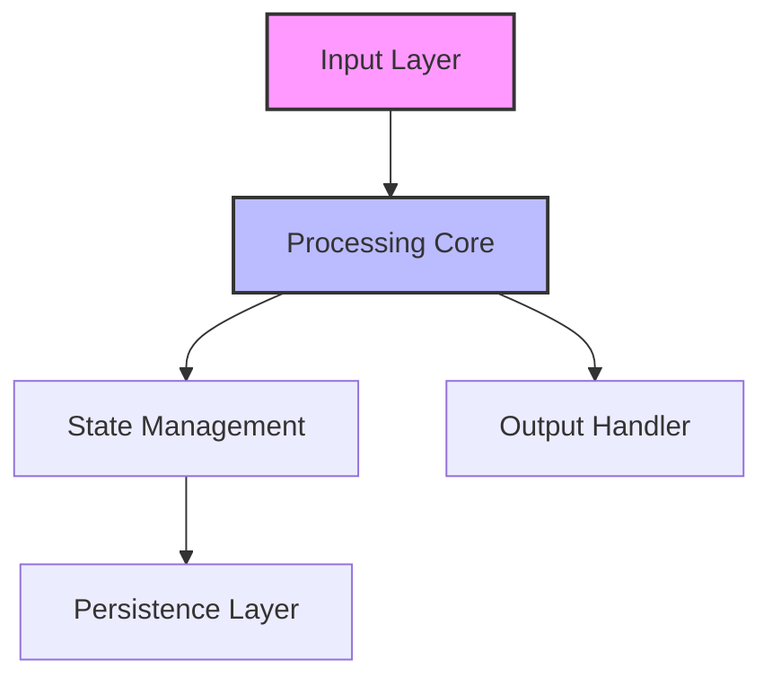
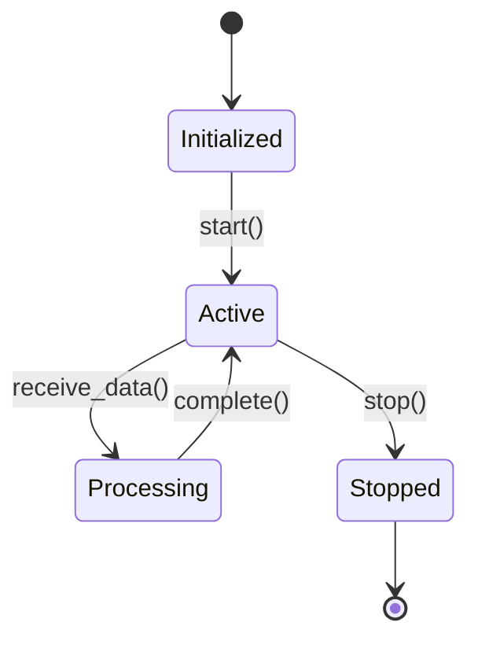
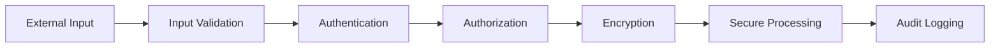

# Update Docs Command

When the user runs `/update-docs [module] [doc_type] [include_examples]`, execute the following:

## Parameters
- **module**: Module to update documentation for (crypto, dag, network, protocol) - REQUIRED
- **doc_type**: Type of documentation (api, architecture, security, deployment) - Optional, default: api
- **include_examples**: Include usage examples - Optional, default: true

## Execution Steps

### Step 1: Analyze Module and Documentation Needs
1. Scan the module source code to identify:
   - Public APIs and their signatures
   - Key types and data structures
   - Error types and handling patterns
   - Performance characteristics
   - Security considerations

2. Check existing documentation:
   - Look for outdated information
   - Identify missing documentation
   - Find broken examples

### Step 2: Generate Documentation Based on Type

#### For API Documentation:
Create or update `docs/${module}/api.md`:

```markdown
# ${module_name} API Documentation

## Overview
${module_description}

## Core Types

### Primary Structures
```rust
// Document main types with their purposes
pub struct ${TypeName} {
    // Document each field's purpose and constraints
}

impl ${TypeName} {
    // Document key methods
}
```

### Traits and Interfaces
```rust
pub trait ${TraitName} {
    // Document trait purpose and implementors
}
```

## Public API Reference

### Initialization Functions
```rust
/// Creates a new instance of ${module}
/// 
/// # Arguments
/// * `config` - Configuration parameters for initialization
/// 
/// # Returns
/// * `Result<${Module}, ${Error}>` - Initialized module or error
/// 
/// # Example
/// ```rust
/// let config = Config::default();
/// let module = ${Module}::new(config)?;
/// ```
pub fn new(config: Config) -> Result<${Module}, ${Error}>
```

### Core Operations
[Document each public function with rustdoc format]

## Usage Examples

### Basic Usage
```rust
use qudag_${module}::*;

// Example: ${common_use_case}
fn example_basic_usage() -> Result<(), Error> {
    let module = ${Module}::new(Config::default())?;
    
    // Perform operations
    let result = module.operation()?;
    
    Ok(())
}
```

### Advanced Patterns
```rust
// Example: ${advanced_use_case}
async fn example_advanced_usage() -> Result<(), Error> {
    // Show complex integration patterns
}
```

## Error Handling

### Error Types
- `${Error}::InvalidInput` - Input validation failed
- `${Error}::OperationFailed` - Core operation error
- `${Error}::ConfigError` - Configuration issues

### Recovery Strategies
```rust
match module.operation() {
    Ok(result) => process_result(result),
    Err(${Error}::InvalidInput(e)) => {
        // Handle validation errors
    },
    Err(${Error}::OperationFailed(e)) => {
        // Retry or fallback logic
    },
    Err(e) => {
        // Generic error handling
    }
}
```

## Performance Considerations

### Time Complexity
- `operation()`: O(n) where n is input size
- `batch_operation()`: O(n log n) with optimizations

### Memory Usage
- Base overhead: ~1KB per instance
- Scales linearly with data size

### Optimization Tips
1. Use batch operations for multiple items
2. Reuse instances when possible
3. Configure buffer sizes appropriately
```

#### For Architecture Documentation:
Create or update `docs/architecture/${module}.md`:

```markdown
# ${module_name} Architecture

## Design Principles
1. **Principle**: Explanation and rationale
2. **Trade-offs**: What we optimize for vs. what we sacrifice

## Component Overview



## Module Structure

### Directory Layout
```
${module}/
├── src/
│   ├── lib.rs          # Public API
│   ├── core/           # Core logic
│   ├── types/          # Data structures
│   └── errors.rs       # Error definitions
├── tests/
│   ├── unit/           # Unit tests
│   └── integration/    # Integration tests
└── benches/            # Performance benchmarks
```

### Key Components

#### ${Component1}
- **Purpose**: Primary responsibility
- **Dependencies**: What it requires
- **Interfaces**: How it connects to other parts

#### ${Component2}
- **Purpose**: Secondary responsibility
- **State Management**: How state is handled
- **Concurrency**: Thread safety considerations

## Data Flow

### Input Processing
1. Validate incoming data
2. Transform to internal representation
3. Route to appropriate handler

### State Transitions


## Integration Points

### External Dependencies
- `qudag_crypto`: For cryptographic operations
- `tokio`: For async runtime
- `serde`: For serialization

### Internal Interfaces
```rust
// Core trait that other modules implement
pub trait ${Module}Handler {
    fn handle_event(&self, event: Event) -> Result<Response>;
}
```

## Scalability Considerations

### Horizontal Scaling
- Stateless design allows multiple instances
- Work distribution via message passing

### Performance Bottlenecks
1. **Bottleneck**: Description and mitigation
2. **Optimization**: Caching strategies employed

### Resource Limits
- Memory: Bounded queues with backpressure
- CPU: Work stealing for parallelization
- Network: Connection pooling implemented
```

#### For Security Documentation:
Create or update `docs/security/${module}.md`:

```markdown
# ${module_name} Security Documentation

## Threat Model

### Assets Under Protection
1. **Asset**: What we're protecting and why
   - Value: Impact if compromised
   - Location: Where it exists in the system

### Threat Actors
1. **External Attackers**: Network-based threats
2. **Malicious Nodes**: Byzantine actors in the system
3. **Side Channels**: Timing and power analysis

### Attack Vectors
1. **Vector**: Description and potential impact
   - Likelihood: High/Medium/Low
   - Impact: Critical/High/Medium/Low
   - Mitigation: How we defend against it

## Security Architecture

### Defense in Depth


### Cryptographic Operations

#### Algorithms Used
- **Encryption**: ML-KEM-768 (Kyber)
- **Signatures**: ML-DSA-65 (Dilithium)
- **Hashing**: SHA3-256
- **KDF**: HKDF-SHA3

#### Key Management
```rust
// Key lifecycle management
pub struct KeyManager {
    // Keys are generated using secure RNG
    // Stored encrypted at rest
    // Rotated every N operations
}
```

#### Security Parameters
- Key sizes: 256-bit symmetric, 3072-bit post-quantum
- Nonce generation: CSPRNG with uniqueness guarantee
- Salt length: 32 bytes minimum

## Security Controls

### Input Validation
```rust
fn validate_input(data: &[u8]) -> Result<ValidatedInput> {
    // Length checks
    if data.len() > MAX_INPUT_SIZE {
        return Err(SecurityError::InputTooLarge);
    }
    
    // Format validation
    validate_format(data)?;
    
    // Sanitization
    let sanitized = sanitize_input(data);
    
    Ok(ValidatedInput(sanitized))
}
```

### Side-Channel Resistance
1. **Constant-Time Operations**
   ```rust
   // All comparisons use constant-time equality
   use constant_time_eq::constant_time_eq;
   
   fn verify_tag(expected: &[u8], actual: &[u8]) -> bool {
       constant_time_eq(expected, actual)
   }
   ```

2. **Memory Protection**
   ```rust
   use zeroize::Zeroize;
   
   // Sensitive data cleared on drop
   #[derive(Zeroize)]
   #[zeroize(drop)]
   struct SecretKey([u8; 32]);
   ```

### Access Control
- Role-based permissions
- Capability-based security for operations
- Audit trail for all security events

## Security Testing

### Test Coverage
- Fuzzing targets: All parsing code
- Property tests: Cryptographic invariants
- Penetration tests: Network interfaces

### Known Vulnerabilities
| ID | Description | Status | Mitigation |
|----|-------------|--------|------------|
| SEC-001 | Timing leak in v1.0 | Fixed in v1.1 | Use constant-time ops |

## Compliance and Standards

### Security Standards
- NIST Post-Quantum Cryptography
- OWASP Secure Coding Practices
- Common Criteria EAL4+

### Audit History
- Last audit: ${date}
- Auditor: ${auditor}
- Findings: ${summary}

## Incident Response

### Security Contacts
- Security Team: security@qudag.org
- Bug Bounty: https://qudag.org/security

### Disclosure Policy
- 90-day responsible disclosure
- CVE assignment for vulnerabilities
- Public advisory after patch
```

#### For Deployment Documentation:
Create or update `docs/deployment/${module}.md`:

```markdown
# ${module_name} Deployment Guide

## System Requirements

### Hardware Requirements
| Component | Minimum | Recommended | Production |
|-----------|---------|-------------|------------|
| CPU | 2 cores | 4 cores | 8+ cores |
| RAM | 4 GB | 8 GB | 16+ GB |
| Storage | 10 GB SSD | 50 GB SSD | 100+ GB NVMe |
| Network | 10 Mbps | 100 Mbps | 1+ Gbps |

### Software Dependencies
- Rust: 1.70+ (stable)
- Operating System: Linux (Ubuntu 20.04+), macOS 12+
- Container Runtime: Docker 20.10+ (optional)

### Network Requirements
```yaml
# Required ports
ports:
  - 8080  # HTTP API
  - 8443  # HTTPS API
  - 9090  # Metrics endpoint
  - 30303 # P2P communication

# Firewall rules
inbound:
  - from: 0.0.0.0/0
    to: 8443
    protocol: tcp
  - from: 10.0.0.0/8
    to: 9090
    protocol: tcp
```

## Configuration

### Configuration File
Create `config/${environment}.toml`:

```toml
# ${module} configuration
[${module}]
# Core settings
enabled = true
log_level = "info"
data_dir = "/var/lib/qudag/${module}"

# Performance tuning
[${module}.performance]
worker_threads = 4
queue_size = 1000
batch_size = 100

# Network settings
[${module}.network]
listen_address = "0.0.0.0:8080"
advertised_address = "node1.qudag.network:8080"
max_connections = 1000

# Security settings
[${module}.security]
tls_enabled = true
tls_cert = "/etc/qudag/certs/cert.pem"
tls_key = "/etc/qudag/certs/key.pem"
auth_required = true
```

### Environment Variables
```bash
# Required environment variables
export QUDAG_${MODULE}_CONFIG=/etc/qudag/config.toml
export QUDAG_${MODULE}_DATA_DIR=/var/lib/qudag/${module}
export QUDAG_${MODULE}_LOG_LEVEL=info

# Optional overrides
export QUDAG_${MODULE}_THREADS=8
export QUDAG_${MODULE}_MEMORY_LIMIT=8G
```

## Deployment Steps

### 1. Pre-deployment Checklist
- [ ] System requirements verified
- [ ] Dependencies installed
- [ ] Configuration files created
- [ ] TLS certificates generated
- [ ] Firewall rules configured
- [ ] Monitoring agents installed

### 2. Installation Process

#### Binary Installation
```bash
# Download latest release
curl -LO https://github.com/qudag/releases/latest/qudag-${module}
chmod +x qudag-${module}
sudo mv qudag-${module} /usr/local/bin/

# Verify installation
qudag-${module} --version
```

#### Container Deployment
```bash
# Pull official image
docker pull qudag/${module}:latest

# Run with configuration
docker run -d \
  --name qudag-${module} \
  -v /etc/qudag:/etc/qudag:ro \
  -v /var/lib/qudag:/var/lib/qudag \
  -p 8443:8443 \
  -p 30303:30303 \
  --restart unless-stopped \
  qudag/${module}:latest
```

#### Kubernetes Deployment
```yaml
apiVersion: apps/v1
kind: Deployment
metadata:
  name: qudag-${module}
spec:
  replicas: 3
  selector:
    matchLabels:
      app: qudag-${module}
  template:
    metadata:
      labels:
        app: qudag-${module}
    spec:
      containers:
      - name: ${module}
        image: qudag/${module}:latest
        ports:
        - containerPort: 8443
        - containerPort: 30303
        resources:
          requests:
            memory: "4Gi"
            cpu: "2"
          limits:
            memory: "8Gi"
            cpu: "4"
```

### 3. Configuration Steps
```bash
# Create configuration directory
sudo mkdir -p /etc/qudag/${module}

# Copy configuration template
sudo cp config/production.toml /etc/qudag/${module}/config.toml

# Generate TLS certificates
sudo qudag-${module} generate-certs \
  --output-dir /etc/qudag/certs \
  --hostname node1.qudag.network

# Initialize data directory
sudo qudag-${module} init \
  --data-dir /var/lib/qudag/${module}
```

### 4. Verification Procedures
```bash
# Check service status
systemctl status qudag-${module}

# Verify connectivity
curl -k https://localhost:8443/health

# Check logs
journalctl -u qudag-${module} -f

# Run diagnostics
qudag-${module} diagnose --verbose
```

## Monitoring

### Key Metrics
```prometheus
# Throughput metrics
qudag_${module}_messages_processed_total
qudag_${module}_bytes_processed_total

# Latency metrics
qudag_${module}_operation_duration_seconds

# Resource metrics
qudag_${module}_memory_usage_bytes
qudag_${module}_goroutines_count

# Error metrics
qudag_${module}_errors_total{type="validation"}
```

### Health Check Endpoints
- `/health` - Basic liveness check
- `/ready` - Readiness probe
- `/metrics` - Prometheus metrics

### Alerting Rules
```yaml
groups:
  - name: qudag_${module}
    rules:
      - alert: HighErrorRate
        expr: rate(qudag_${module}_errors_total[5m]) > 0.05
        for: 10m
        annotations:
          summary: "High error rate detected"
          
      - alert: HighMemoryUsage
        expr: qudag_${module}_memory_usage_bytes > 7e9
        for: 5m
        annotations:
          summary: "Memory usage above 7GB"
```

## Troubleshooting

### Common Issues

#### Service Won't Start
```bash
# Check logs for errors
journalctl -u qudag-${module} --since "10 minutes ago"

# Verify configuration
qudag-${module} validate-config --config /etc/qudag/config.toml

# Check permissions
ls -la /var/lib/qudag/${module}
```

#### Connection Issues
```bash
# Test connectivity
nc -zv localhost 8443

# Check firewall
sudo iptables -L -n | grep 8443

# Verify TLS certificates
openssl s_client -connect localhost:8443 -showcerts
```

#### Performance Problems
```bash
# Profile CPU usage
qudag-${module} profile cpu --duration 30s

# Analyze memory
qudag-${module} profile memory --output memory.prof

# Check goroutines
curl http://localhost:9090/debug/pprof/goroutine?debug=1
```

### Debug Procedures
1. Enable debug logging: `export QUDAG_LOG_LEVEL=debug`
2. Run with verbose output: `qudag-${module} --verbose`
3. Collect diagnostic bundle: `qudag-${module} support-bundle`

## Maintenance

### Backup Procedures
```bash
# Backup data directory
tar -czf backup-$(date +%Y%m%d).tar.gz /var/lib/qudag/${module}

# Backup configuration
cp -r /etc/qudag /backup/qudag-config-$(date +%Y%m%d)
```

### Update Process
```bash
# Stop service
systemctl stop qudag-${module}

# Backup current version
cp /usr/local/bin/qudag-${module} /backup/

# Install new version
curl -LO https://github.com/qudag/releases/new/qudag-${module}
chmod +x qudag-${module}
sudo mv qudag-${module} /usr/local/bin/

# Run migrations if needed
qudag-${module} migrate --from v1.0 --to v2.0

# Start service
systemctl start qudag-${module}
```

### Scaling Procedures
- Horizontal: Add nodes to cluster
- Vertical: Increase resources per node
- Auto-scaling: Configure based on metrics
```

### Step 3: Update Rustdoc Comments
Scan source files and ensure all public items have proper documentation:

```rust
/// ${brief_description}
/// 
/// ${detailed_explanation}
/// 
/// # Arguments
/// 
/// * `${param}` - ${param_description}
/// 
/// # Returns
/// 
/// ${return_description}
/// 
/// # Errors
/// 
/// Returns [`${Error}`] if:
/// - ${error_condition_1}
/// - ${error_condition_2}
/// 
/// # Examples
/// 
/// ```rust
/// ${example_code}
/// ```
/// 
/// # Safety
/// 
/// ${safety_requirements_if_unsafe}
/// 
/// # Panics
/// 
/// ${panic_conditions_if_any}
pub fn ${function_name}(${params}) -> Result<${Return}, ${Error}> {
    // Implementation
}
```

### Step 4: Generate Documentation Coverage Report
```bash
# Run rustdoc with coverage
cargo rustdoc -- --show-coverage

# Generate HTML documentation
cargo doc --no-deps --open

# Check for missing examples
cargo test --doc
```

### Step 5: Update Documentation Index
Update `docs/README.md` with links to all documentation:

```markdown
# QuDAG Documentation

## API Documentation
- [Crypto API](crypto/api.md)
- [DAG API](dag/api.md)
- [Network API](network/api.md)
- [Protocol API](protocol/api.md)

## Architecture
- [System Architecture](architecture/overview.md)
- [Crypto Architecture](architecture/crypto.md)
- [DAG Architecture](architecture/dag.md)
- [Network Architecture](architecture/network.md)

## Security
- [Security Overview](security/overview.md)
- [Threat Model](security/threat-model.md)
- [Crypto Security](security/crypto.md)

## Deployment
- [Getting Started](deployment/quickstart.md)
- [Production Deployment](deployment/production.md)
- [Configuration Reference](deployment/configuration.md)

## Guides
- [Developer Guide](guides/developer.md)
- [Operator Guide](guides/operator.md)
- [Security Guide](guides/security.md)

Last updated: ${date}
```

### Step 6: Create Changelog Entry
Add entry to `CHANGELOG.md`:

```markdown
## [Unreleased]

### Documentation
- Updated ${module} documentation
  - ${specific_changes}
  - Added ${new_examples}
  - Fixed ${issues}
```

## Output Format

After successful execution, display:

```
✅ Documentation updated for ${module}

Updates completed:
- API documentation: ${api_status}
- Architecture documentation: ${arch_status}
- Security documentation: ${sec_status}
- Deployment documentation: ${deploy_status}
- Rustdoc coverage: ${coverage}%

Files modified:
- docs/${module}/api.md
- docs/architecture/${module}.md
- docs/security/${module}.md
- docs/deployment/${module}.md
- src/**/*.rs (rustdoc comments)

Next steps:
1. Review generated documentation
2. Run `cargo doc` to generate HTML docs
3. Verify all examples compile: `cargo test --doc`
4. Update cross-references if needed

Documentation coverage report:
- Public functions documented: ${func_count}/${total_funcs}
- Public types documented: ${type_count}/${total_types}
- Examples provided: ${example_count}
```

## Documentation Standards

### Markdown Guidelines
1. Use proper heading hierarchy (# > ## > ###)
2. Include code examples with syntax highlighting
3. Add diagrams using Mermaid where helpful
4. Cross-reference related documentation
5. Keep line length under 120 characters

### Rustdoc Guidelines
1. All public items must have documentation
2. Include at least one example for complex functions
3. Document all error conditions
4. Specify safety requirements for unsafe code
5. Use intra-doc links for cross-references

### Example Quality
1. Examples must compile and run
2. Show common use cases first
3. Include error handling
4. Demonstrate best practices
5. Keep examples focused and concise

## Error Handling

Handle these potential errors:

1. **Invalid Module**:
   - Show list of valid modules
   - Suggest closest match

2. **Missing Source Files**:
   - Report which files couldn't be found
   - Continue with available files

3. **Documentation Generation Failure**:
   - Show specific errors
   - Provide manual steps to fix

4. **Rustdoc Errors**:
   - Display compilation errors
   - Suggest fixes for common issues

## Related Commands
- `/create-test` - Create tests for documented features
- `/implement-feature` - Implement documented APIs
- `/security-audit` - Verify security documentation accuracy
- `/deploy-validate` - Test deployment documentation