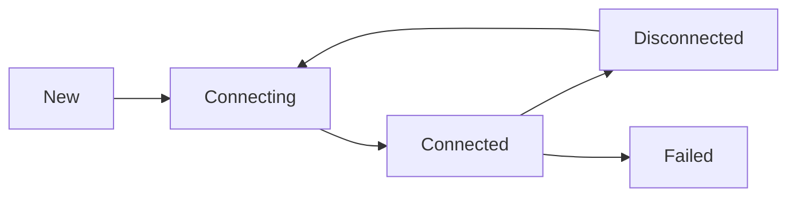

# High-Performance Connection Management System

The QuDAG network layer implements a sophisticated connection management system designed for high throughput, low latency, and efficient resource utilization. This document describes the key components and optimizations used to achieve optimal performance.

## 1. Connection Pooling and Reuse Strategy

The connection manager implements an intelligent pooling system that reduces connection establishment overhead:

- **Pool Management**:
  - Connections are stored in a `DashMap`-based pool with TTL tracking
  - Default pool timeout of 300 seconds (configurable)
  - Automatic cleanup of expired connections
  - Prioritizes reuse over creating new connections

- **Connection Lifecycle**:
  ```rust
  // Example: Connection reuse from pool
  if let Some(mut entry) = self.connection_pool.get_mut(&peer_id) {
      let (_, last_used) = entry.value();
      if last_used.elapsed() < self.pool_timeout {
          // Reuse existing connection
          self.connections.insert(peer_id, ConnectionStatus::Connected);
      }
  }
  ```

## 2. Performance Optimizations

### DashMap for Concurrent Access
- Uses `dashmap::DashMap` for lock-free concurrent access to connection state
- Sharded architecture reduces contention
- O(1) lookups and modifications

### Parking Lot Synchronization
- Utilizes `parking_lot::RwLock` for metrics synchronization
- More efficient than standard library locks
- Better performance under high contention

### Message Batching
- Messages are batched for efficient network utilization:
  - Configurable batch size (default 128 messages)
  - Batch timeout of 50ms to balance latency and throughput
  - Automatic flush when batch is full or timeout reached
  - Efficient batch serialization and encryption

```rust
// Message batching example
if batch_queue.len() >= batch_size || last_batch.elapsed() >= batch_timeout {
    flush_batch().await?;
}
```

## 3. Connection Lifecycle and State Management

### States
- **Connecting**: Initial connection establishment
- **Connected**: Active and ready for communication
- **Disconnected**: Connection terminated normally
- **Failed**: Connection terminated with error

### Resource Management
- Maximum concurrent connections limit
- Automatic cleanup of idle connections
- Connection pooling with TTL
- Secure key management and encryption

### State Transitions


## 4. Metrics Tracking and Resource Limits

### Performance Metrics
- Messages processed per second
- Current connection count
- Average message latency
- Memory usage tracking

### Resource Limits
- Configurable maximum concurrent connections
- Connection pool size management
- Batch size limits
- Memory usage monitoring

### Metrics Collection
```rust
pub struct NetworkMetrics {
    pub messages_per_second: f64,
    pub connections: usize,
    pub avg_latency: Duration,
    pub memory_usage: usize
}
```

## Implementation Details

### Secure Connection Channels
```rust
struct ConnectionChannels {
    tx: mpsc::Sender<Vec<u8>>,
    rx: mpsc::Receiver<Vec<u8>>,
    batch_queue: Vec<Vec<u8>>,
    batch_size: usize,
    batch_timeout: Duration,
    last_batch: Instant,
    key_cache: Arc<aead::LessSafeKey>
}
```

### Connection Manager
```rust
pub struct ConnectionManager {
    max_connections: usize,
    connections: Arc<dashmap::DashMap<PeerId, ConnectionStatus>>,
    connection_pool: Arc<dashmap::DashMap<PeerId, (Connection, Instant)>>,
    pool_timeout: Duration,
    metrics: Arc<parking_lot::RwLock<NetworkMetrics>>
}
```

## Security Considerations

- All connections use QUIC protocol for secure transport
- Constant-time cryptographic operations
- Secure key management with zeroization
- Message encryption using ChaCha20-Poly1305
- Protection against timing attacks

## Best Practices

1. **Connection Management**:
   - Monitor connection counts
   - Configure appropriate timeouts
   - Implement backoff on connection failures
   - Regular cleanup of idle connections

2. **Performance Tuning**:
   - Adjust batch sizes based on workload
   - Monitor and tune pool timeout
   - Set appropriate resource limits
   - Regular metrics collection and analysis

3. **Error Handling**:
   - Implement proper error recovery
   - Use connection status for health checks
   - Monitor failed connection attempts
   - Implement reconnection strategies

## Testing and Validation

The connection management system includes comprehensive tests:
- Unit tests for individual components
- Integration tests for connection lifecycle
- Performance benchmarks
- Security validation
- Resource limit testing