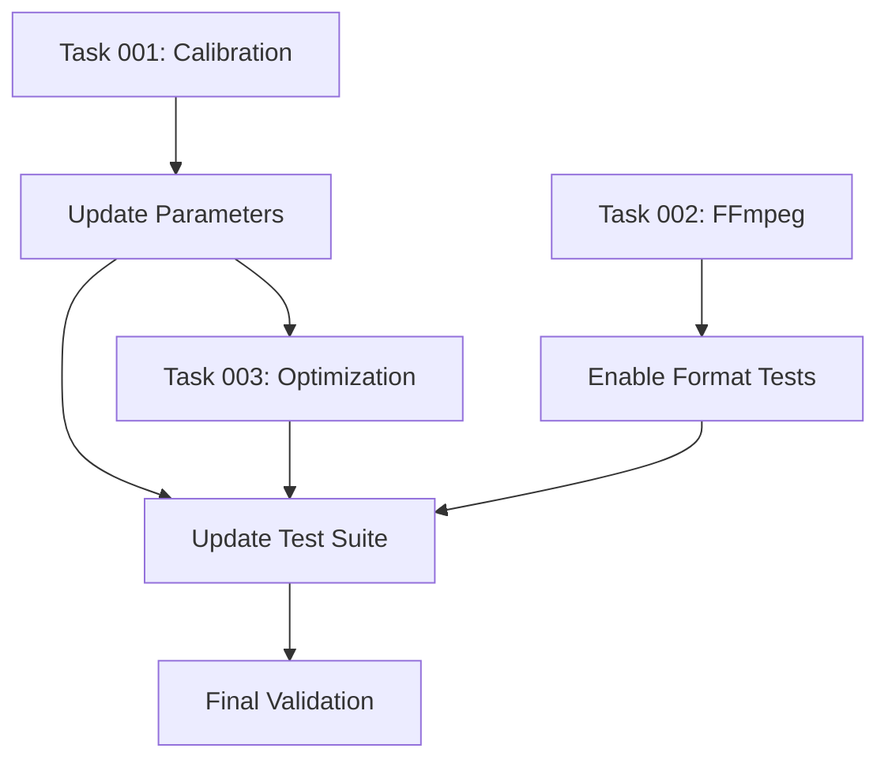

# Claude-SPARC Automated Development System For Claude Code

This file provides guidance to Claude Code (claude.ai/code) when working with code in this repository.

## Overview

The SPARC Automated Development System (`claude-sparc.sh`) is a comprehensive, agentic workflow for automated software development using the SPARC methodology (Specification, Pseudocode, Architecture, Refinement, Completion). This system leverages Claude Code's built-in tools for parallel task orchestration, comprehensive research, and Test-Driven Development.

## Features

- **Comprehensive Research Phase**: Automated web research using parallel batch operations
- **Full SPARC Methodology**: Complete implementation of all 5 SPARC phases
- **TDD London School**: Test-driven development with mocks and behavior testing
- **Parallel Orchestration**: Concurrent development tracks and batch operations
- **Quality Assurance**: Automated linting, testing, and security validation
- **Detailed Commit History**: Structured commit messages for each development phase
- **Multi-Agent Coordination**: Sophisticated system for collaborative development
- **Memory Bank**: Persistent knowledge sharing across agent sessions

## Primary Development Methodology: SPARC

This project follows the **SPARC Automated Development System** (`claude-sparc.sh`) which implements a comprehensive, structured approach to software development using the SPARC methodology: **Specification, Pseudocode, Architecture, Refinement, Completion**.

## Usage

### Basic Usage
```bash
./claude-sparc.sh
```

### With Arguments
```bash
./claude-sparc.sh [OPTIONS] [PROJECT_NAME] [README_PATH]
```

### Help
```bash
./claude-sparc.sh --help
```

## Command Line Options

### Core Options
- `-h, --help` - Show help message and exit
- `-v, --verbose` - Enable verbose output for detailed logging
- `-d, --dry-run` - Show what would be executed without running
- `-c, --config FILE` - Specify MCP configuration file (default: .roo/mcp.json)

### Research Options
- `--skip-research` - Skip the web research phase entirely
- `--research-depth LEVEL` - Set research depth: basic, standard, comprehensive (default: standard)

### Development Options
- `--mode MODE` - Development mode: full, backend-only, frontend-only, api-only (default: full)
- `--skip-tests` - Skip test development (not recommended)
- `--coverage TARGET` - Test coverage target percentage (default: 100)
- `--no-parallel` - Disable parallel execution

### Commit Options
- `--commit-freq FREQ` - Commit frequency: phase, feature, manual (default: phase)
- `--no-commits` - Disable automatic commits

### Output Options
- `--output FORMAT` - Output format: text, json, markdown (default: text)
- `--quiet` - Suppress non-essential output

## Examples

### Basic Development
```bash
# Full-stack development with default settings
./claude-sparc.sh my-app docs/requirements.md

# Backend API development with verbose output
./claude-sparc.sh --mode api-only --verbose user-service api-spec.md

# Frontend-only development with custom coverage
./claude-sparc.sh --mode frontend-only --coverage 90 web-app ui-spec.md
```

### Research Configuration
```bash
# Skip research for rapid prototyping
./claude-sparc.sh --skip-research --coverage 80 prototype-app readme.md

# Comprehensive research for complex projects
./claude-sparc.sh --research-depth comprehensive enterprise-app requirements.md

# Basic research for simple projects
./claude-sparc.sh --research-depth basic simple-tool spec.md
```

### Development Modes
```bash
# API-only development
./claude-sparc.sh --mode api-only --commit-freq feature api-service spec.md

# Backend services only
./claude-sparc.sh --mode backend-only --no-parallel backend-service requirements.md

# Frontend application only
./claude-sparc.sh --mode frontend-only --output json frontend-app ui-spec.md
```

### Testing and Quality
```bash
# Skip tests for rapid prototyping (not recommended)
./claude-sparc.sh --skip-tests --commit-freq manual prototype readme.md

# Custom coverage target
./claude-sparc.sh --coverage 95 --verbose production-app requirements.md

# Manual commit control
./claude-sparc.sh --no-commits --dry-run complex-app spec.md
```

### Advanced Usage
```bash
# Dry run to preview execution
./claude-sparc.sh --dry-run --verbose my-project requirements.md

# Custom MCP configuration
./claude-sparc.sh --config custom-mcp.json --mode full my-app spec.md

# Quiet mode with JSON output
./claude-sparc.sh --quiet --output json --mode api-only service spec.md
```

## SPARC Phases Explained

### Phase 0: Research & Discovery
- **Parallel Web Research**: Uses `BatchTool` and `WebFetchTool` for comprehensive domain research
- **Technology Stack Analysis**: Researches best practices and framework comparisons
- **Implementation Patterns**: Gathers code examples and architectural patterns
- **Competitive Analysis**: Studies existing solutions and industry trends

### Phase 1: Specification
- **Requirements Analysis**: Extracts functional and non-functional requirements
- **User Stories**: Defines acceptance criteria and system boundaries
- **Technical Constraints**: Identifies technology stack and deployment requirements
- **Performance Targets**: Establishes SLAs and scalability goals

### Phase 2: Pseudocode
- **High-Level Architecture**: Defines major components and data flow
- **Algorithm Design**: Core business logic and optimization strategies
- **Test Strategy**: TDD approach with comprehensive test planning
- **Error Handling**: Recovery strategies and validation algorithms

### Phase 3: Architecture
- **Component Architecture**: Detailed specifications and interface definitions
- **Data Architecture**: Database design and access patterns
- **Infrastructure Architecture**: Deployment and CI/CD pipeline design
- **Security Architecture**: Access controls and compliance requirements

### Phase 4: Refinement (TDD Implementation)
- **Parallel Development Tracks**: Backend, frontend, and integration tracks
- **TDD London School**: Red-Green-Refactor cycles with behavior testing
- **Quality Gates**: Automated linting, analysis, and security scans
- **Performance Optimization**: Benchmarking and critical path optimization

### Phase 5: Completion
- **System Integration**: End-to-end testing and requirement validation
- **Documentation**: API docs, deployment guides, and runbooks
- **Production Readiness**: Monitoring, alerting, and security review
- **Deployment**: Automated deployment with validation

## Tool Utilization

### Core Tools
- **`BatchTool`**: Parallel execution of independent operations
- **`WebFetchTool`**: Comprehensive research and documentation gathering
- **`Bash`**: Git operations, CI/CD, testing, and deployment
- **`Edit/Replace`**: Code implementation and refactoring
- **`GlobTool/GrepTool`**: Code analysis and pattern detection
- **`dispatch_agent`**: Complex subtask delegation

### Quality Assurance Tools
- **Linting**: ESLint, Prettier, markdownlint
- **Testing**: Jest, Vitest, Cypress for comprehensive coverage
- **Security**: Security scans and vulnerability assessments
- **Performance**: Benchmarking and profiling tools
- **Documentation**: Automated API documentation generation

## Development Standards

### Code Quality
- **Modularity**: Files ≤ 500 lines, functions ≤ 50 lines
- **Security**: No hardcoded secrets, comprehensive input validation
- **Testing**: 100% test coverage with TDD London School approach
- **Documentation**: Self-documenting code with strategic comments
- **Performance**: Optimized critical paths with benchmarking

### Commit Standards
- **`feat:`** New features and major functionality
- **`test:`** Test implementation and coverage improvements
- **`fix:`** Bug fixes and issue resolution
- **`docs:`** Documentation updates and improvements
- **`arch:`** Architectural changes and design updates
- **`quality:`** Code quality improvements and refactoring
- **`deploy:`** Deployment and infrastructure changes

## Parallel Execution Strategy

### Research Phase
```bash
BatchTool(
  WebFetchTool("domain research"),
  WebFetchTool("technology analysis"),
  WebFetchTool("competitive landscape"),
  WebFetchTool("implementation patterns")
)
```

### Development Phase
```bash
# Concurrent tracks
Track 1: Backend Development (TDD)
Track 2: Frontend Development (TDD)
Track 3: Integration & QA
```

### Quality Assurance
```bash
BatchTool(
  Bash("npm run lint"),
  Bash("npm run test"),
  Bash("npm run security-scan"),
  Bash("npm run performance-test")
)
```

## Success Criteria

- ✅ **100% Test Coverage**: All code covered by comprehensive tests
- ✅ **Quality Gates Passed**: Linting, security, and performance validation
- ✅ **Production Deployment**: Successful deployment with monitoring
- ✅ **Documentation Complete**: Comprehensive docs and runbooks
- ✅ **Security Validated**: Security scans and compliance checks
- ✅ **Performance Optimized**: Benchmarks meet or exceed targets

### Quick Start Examples

```bash
# Basic usage - full development cycle
./claude-sparc.sh project-name requirements.md

# Preview what will be executed
./claude-sparc.sh --dry-run --verbose project-name spec.md

# Get help and see all options
./claude-sparc.sh --help
```

### Project-Specific Examples

```bash
# Web Application Development
./claude-sparc.sh "ecommerce-platform" "requirements/ecommerce-spec.md"

# API Service Development
./claude-sparc.sh "user-service-api" "docs/api-requirements.md"

# Data Processing Pipeline
./claude-sparc.sh "data-pipeline" "specs/data-processing-requirements.md"
```

## Configuration

### MCP Configuration
The system uses `.roo/mcp.json` for MCP server configuration. Ensure your MCP setup includes:
- File system access
- Web search capabilities
- Git integration
- Testing frameworks

### Allowed Tools
The script automatically configures the following tools:
```bash
--allowedTools "WebFetchTool,BatchTool,Bash,Edit,Replace,GlobTool,GrepTool,View,LS,dispatch_agent"
```

## Troubleshooting

### Common Issues
1. **MCP Configuration**: Ensure `.roo/mcp.json` is properly configured
2. **Tool Permissions**: Use `--dangerously-skip-permissions` for development
3. **Network Access**: Ensure internet connectivity for web research
4. **Git Configuration**: Ensure git is configured for commits

### Debug Mode
Add `--verbose` flag for detailed execution logs:
```bash
./claude-sparc.sh "project" "readme.md" --verbose
```

## Contributing

To extend the SPARC system:
1. Fork the repository
2. Create feature branch
3. Follow SPARC methodology for changes
4. Submit pull request with comprehensive tests

## License

This SPARC Automated Development System is part of the claude-code-flow project and follows the same licensing terms.

## Credits

Created by **rUv** - [github.com/ruvnet/](https://github.com/ruvnet/)

This Claude-SPARC Automated Development System represents an innovative approach to AI-driven software development, combining structured methodologies with advanced agent orchestration capabilities.

## SPARC Phase Instructions for Claude

When executing the SPARC methodology, Claude should follow these detailed instructions:

### Phase 0: Research & Discovery (if `--skip-research` not used)

#### Parallel Web Research Strategy
1. **Use BatchTool for parallel research queries**:
   ```
   BatchTool(
     WebFetchTool("domain research for [project domain]"),
     WebFetchTool("technology stack analysis for [tech requirements]"),
     WebFetchTool("competitive landscape and existing solutions"),
     WebFetchTool("implementation patterns and best practices")
   )
   ```

2. **Research Depth Guidelines**:
   - **Basic**: Quick technology overview and stack decisions
   - **Standard**: Include competitive analysis and architectural patterns
   - **Comprehensive**: Add academic papers and detailed technical analysis

3. **Research Output Requirements**:
   - Synthesize findings into actionable technical decisions
   - Identify technology stack based on research
   - Document architectural patterns to follow
   - Note security and performance considerations

### Phase 1: Specification

#### Requirements Analysis Process
1. **Read and analyze the provided requirements document**
2. **Extract functional requirements**:
   - Core features and functionality
   - User stories with acceptance criteria
   - API endpoints and data models (for backend/api modes)
   - UI components and user flows (for frontend/full modes)

3. **Define non-functional requirements**:
   - Performance benchmarks and SLAs
   - Security and compliance requirements
   - Scalability and availability targets
   - Maintainability and extensibility goals

4. **Technical constraints**:
   - Technology stack decisions based on research
   - Integration requirements and dependencies
   - Deployment and infrastructure constraints

### Phase 2: Pseudocode

#### High-Level Architecture Design
1. **System Architecture**:
   - Define major components and their responsibilities
   - Design data flow and communication patterns
   - Specify APIs and integration points
   - Plan error handling and recovery strategies

2. **Algorithm Design**:
   - Core business logic algorithms
   - Data processing and transformation logic
   - Optimization strategies and performance considerations
   - Security and validation algorithms

3. **Test Strategy** (if `--skip-tests` not used):
   - Unit testing approach using TDD London School
   - Integration testing strategy
   - End-to-end testing scenarios
   - Target test coverage (default 100%)

### Phase 3: Architecture

#### Detailed System Design
1. **Component Architecture**:
   - Detailed component specifications
   - Interface definitions and contracts
   - Dependency injection and inversion of control
   - Configuration management strategy

2. **Data Architecture** (backend/api/full modes):
   - Database schema design
   - Data access patterns and repositories
   - Caching strategies and data flow
   - Backup and recovery procedures

3. **Infrastructure Architecture**:
   - Deployment architecture and environments
   - CI/CD pipeline design
   - Monitoring and logging architecture
   - Security architecture and access controls

### Phase 4: Refinement (TDD Implementation)

#### Parallel Development Tracks
Use parallel execution when possible (`--parallel` is default):

**Track 1: Backend Development** (backend/api/full modes)
1. **Setup & Infrastructure**:
   ```bash
   Bash: Initialize project structure
   Bash: Setup development environment
   Bash: Configure CI/CD pipeline
   ```

2. **TDD Core Components** (London School):
   - **Red**: Write failing tests for core business logic
   - **Green**: Implement minimal code to pass tests
   - **Refactor**: Optimize while maintaining green tests
   - Maintain target coverage percentage

3. **API Layer Development**:
   - **Red**: Write API contract tests
   - **Green**: Implement API endpoints
   - **Refactor**: Optimize API performance

**Track 2: Frontend Development** (frontend/full modes)
1. **UI Component Library**:
   - **Red**: Write component tests
   - **Green**: Implement UI components
   - **Refactor**: Optimize for reusability

2. **Application Logic**:
   - **Red**: Write application flow tests
   - **Green**: Implement user interactions
   - **Refactor**: Optimize user experience

**Track 3: Integration & Quality Assurance**
1. **Integration Testing**:
   ```
   BatchTool: Run parallel integration test suites
   Bash: Execute performance benchmarks
   Bash: Run security scans and audits
   ```

2. **Quality Gates**:
   ```
   BatchTool: Parallel quality checks (linting, analysis, documentation)
   Bash: Validate documentation completeness
   ```

#### Tool Utilization Strategy
- **BatchTool**: Parallel research, testing, and quality checks (see detailed instructions below)
- **WebFetchTool**: Comprehensive research and documentation gathering
- **Bash**: Git operations, CI/CD, testing, and deployment
- **Edit/Replace**: Code implementation and refactoring
- **GlobTool/GrepTool**: Code analysis and pattern detection
- **dispatch_agent**: Complex subtask delegation

### Advanced BatchTool Orchestration

The BatchTool enables sophisticated **boomerang orchestration** patterns similar to specialized agent modes. Use BatchTool for parallel execution of independent tasks that can be coordinated back to a central point.

#### Boomerang Orchestration Pattern

```bash
# Phase 1: Launch parallel specialist tasks
BatchTool(
  Task("architect", "Design system architecture for [component]"),
  Task("spec-pseudocode", "Write detailed specifications for [feature]"),
  Task("security-review", "Audit current codebase for vulnerabilities"),
  Task("tdd", "Create test framework for [module]")
)

# Phase 2: Collect and integrate results
BatchTool(
  Task("code", "Implement based on architecture and specs"),
  Task("integration", "Merge all components into cohesive system"),
  Task("docs-writer", "Document the integrated solution")
)

# Phase 3: Validation and deployment
BatchTool(
  Task("debug", "Resolve any integration issues"),
  Task("devops", "Deploy to staging environment"),
  Task("post-deployment-monitoring-mode", "Set up monitoring")
)
```

#### Specialist Mode Integration

When using BatchTool with specialist modes, follow these patterns:

**🏗️ Architect Mode:**
```bash
BatchTool(
  Task("architect", {
    "objective": "Design scalable microservices architecture",
    "constraints": "No hardcoded secrets, modular boundaries",
    "deliverables": "Mermaid diagrams, API contracts, data flows"
  })
)
```

**🧠 Auto-Coder Mode:**
```bash
BatchTool(
  Task("code", {
    "input": "pseudocode and architecture specs",
    "requirements": "Files < 500 lines, env abstraction, modular",
    "output": "Clean, efficient, tested code"
  })
)
```

**🧪 TDD Mode:**
```bash
BatchTool(
  Task("tdd", {
    "approach": "London School TDD",
    "phases": "Red-Green-Refactor",
    "coverage": "100% with meaningful tests"
  })
)
```

**🪲 Debug Mode:**
```bash
BatchTool(
  Task("debug", {
    "focus": "Runtime bugs and integration failures",
    "tools": "Logs, traces, stack analysis",
    "constraints": "Modular fixes, no env changes"
  })
)
```

**🛡️ Security Review Mode:**
```bash
BatchTool(
  Task("security-review", {
    "scope": "Static and dynamic audits",
    "targets": "Secrets, boundaries, file sizes",
    "output": "Risk assessment and mitigations"
  })
)
```

**📚 Documentation Writer Mode:**
```bash
BatchTool(
  Task("docs-writer", {
    "format": "Markdown only",
    "structure": "Sections, examples, headings",
    "constraints": "< 500 lines, no env leaks"
  })
)
```

**🔗 System Integrator Mode:**
```bash
BatchTool(
  Task("integration", {
    "objective": "Merge all outputs into working system",
    "validation": "Interface compatibility, modularity",
    "deliverables": "Tested, production-ready system"
  })
)
```

**📈 Deployment Monitor Mode:**
```bash
BatchTool(
  Task("post-deployment-monitoring-mode", {
    "setup": "Metrics, logs, uptime checks",
    "monitoring": "Performance, regressions, feedback",
    "alerts": "Threshold violations and issues"
  })
)
```

**🧹 Optimizer Mode:**
```bash
BatchTool(
  Task("refinement-optimization-mode", {
    "targets": "Performance, modularity, file sizes",
    "actions": "Refactor, optimize, decouple",
    "validation": "Improved metrics, maintainability"
  })
)
```

**🚀 DevOps Mode:**
```bash
BatchTool(
  Task("devops", {
    "infrastructure": "Cloud provisioning, CI/CD",
    "deployment": "Containers, edge, serverless",
    "security": "Secret management, TLS, monitoring"
  })
)
```

**🔐 Supabase Admin Mode:**
```bash
BatchTool(
  Task("supabase-admin", {
    "database": "Schema design, RLS policies",
    "auth": "User management, security flows",
    "storage": "Buckets, access controls"
  })
)
```

#### Coordination Patterns

**Sequential Dependency Chain:**
```bash
# Step 1: Requirements and Architecture
BatchTool(
  Task("spec-pseudocode", "Define requirements"),
  Task("architect", "Design system architecture")
)

# Step 2: Implementation (depends on Step 1)
BatchTool(
  Task("code", "Implement based on specs and architecture"),
  Task("tdd", "Create comprehensive tests")
)

# Step 3: Quality and Deployment (depends on Step 2)
BatchTool(
  Task("security-review", "Audit implementation"),
  Task("integration", "Merge and test system"),
  Task("devops", "Deploy to production")
)
```

**Parallel Workstreams:**
```bash
# Concurrent development tracks
BatchTool(
  # Frontend Track
  Task("code", "Frontend components and UI"),
  # Backend Track  
  Task("code", "API services and database"),
  # Infrastructure Track
  Task("devops", "CI/CD and deployment setup"),
  # Documentation Track
  Task("docs-writer", "User and technical documentation")
)
```

**Quality Assurance Pipeline:**
```bash
BatchTool(
  Task("tdd", "Run comprehensive test suite"),
  Task("security-review", "Security vulnerability scan"),
  Task("debug", "Performance and error analysis"),
  Task("refinement-optimization-mode", "Code quality audit")
)
```

#### Best Practices for BatchTool Orchestration

1. **Task Independence**: Ensure BatchTool tasks can run in parallel without dependencies
2. **Clear Inputs/Outputs**: Define what each task consumes and produces
3. **Error Handling**: Plan for task failures and recovery strategies
4. **Result Integration**: Have a clear plan for merging parallel task outputs
5. **Resource Management**: Consider computational and memory constraints
6. **Coordination Points**: Define when to wait for all tasks vs. proceeding with partial results

#### SPARC + BatchTool Integration

Use BatchTool to accelerate each SPARC phase:

**Phase 0 (Research):**
```bash
BatchTool(
  WebFetchTool("domain research"),
  WebFetchTool("technology analysis"), 
  WebFetchTool("competitive landscape"),
  WebFetchTool("implementation patterns")
)
```

**Phase 1 (Specification):**
```bash
BatchTool(
  Task("spec-pseudocode", "Functional requirements"),
  Task("spec-pseudocode", "Non-functional requirements"),
  Task("architect", "Technical constraints analysis")
)
```

**Phase 2-3 (Pseudocode + Architecture):**
```bash
BatchTool(
  Task("spec-pseudocode", "High-level algorithms"),
  Task("architect", "Component architecture"),
  Task("architect", "Data architecture"),
  Task("security-review", "Security architecture")
)
```

**Phase 4 (Refinement):**
```bash
BatchTool(
  Task("tdd", "Backend development with tests"),
  Task("code", "Frontend implementation"),
  Task("integration", "System integration"),
  Task("devops", "Infrastructure setup")
)
```

**Phase 5 (Completion):**
```bash
BatchTool(
  Task("integration", "Final system integration"),
  Task("docs-writer", "Complete documentation"),
  Task("devops", "Production deployment"),
  Task("post-deployment-monitoring-mode", "Monitoring setup")
)
```

#### Task Result Coordination

After BatchTool execution, coordinate results using these patterns:

```bash
# Collect and validate results
results = BatchTool.collect()

# Integrate outputs
integrated_system = Task("integration", {
  "inputs": results,
  "validation": "interface_compatibility",
  "output": "production_ready_system"
})

# Final validation
Task("debug", "Validate integrated system")
Task("attempt_completion", "Document final deliverables")
```

### Phase 5: Completion

#### Final Integration & Deployment
1. **System Integration**:
   - Integrate all development tracks
   - Run comprehensive end-to-end tests
   - Validate against original requirements

2. **Documentation & Deployment**:
   - Generate comprehensive API documentation
   - Create deployment guides and runbooks
   - Setup monitoring and alerting

3. **Production Readiness**:
   - Execute production deployment checklist
   - Validate monitoring and observability
   - Conduct final security review

## Quality Standards & Enforcement

### Code Quality Requirements
- **Modularity**: All files ≤ 500 lines, functions ≤ 50 lines
- **Security**: No hardcoded secrets, comprehensive input validation
- **Testing**: Target coverage with TDD London School approach
- **Documentation**: Self-documenting code with strategic comments
- **Performance**: Optimized critical paths with benchmarking

### Commit Standards
Based on `--commit-freq` setting:
- **`phase`** (default): Commit after each SPARC phase completion
- **`feature`**: Commit after each feature implementation
- **`manual`**: No automatic commits

Commit message format:
- **`feat:`** New features and major functionality
- **`test:`** Test implementation and coverage improvements
- **`fix:`** Bug fixes and issue resolution
- **`docs:`** Documentation updates and improvements
- **`arch:`** Architectural changes and design updates
- **`quality:`** Code quality improvements and refactoring
- **`deploy:`** Deployment and infrastructure changes

## Project-Specific Context

### Adapting for Your Project
This SPARC system is designed to be generic and adaptable to any software project. To use it effectively:

#### Backend Projects
Typical backend configurations:
- **APIs**: REST, GraphQL, or gRPC services
- **Databases**: SQL, NoSQL, or hybrid data stores
- **Authentication**: OAuth, JWT, or custom auth systems
- **Infrastructure**: Containers, serverless, or traditional deployment

#### Frontend Projects
Common frontend patterns:
- **Frameworks**: React, Vue, Angular, Svelte, or vanilla JS
- **Styling**: CSS-in-JS, Tailwind, SCSS, or component libraries
- **State Management**: Redux, Zustand, Pinia, or built-in state
- **Build Tools**: Vite, Webpack, Parcel, or framework-specific tooling

#### Full-Stack Projects
Integrated system considerations:
- **Monorepo vs Multi-repo**: Coordinate development across codebases
- **API Contracts**: Ensure frontend/backend compatibility
- **Shared Types**: TypeScript interfaces or schema definitions
- **Testing Strategy**: Unit, integration, and end-to-end testing

### Configuration Adaptation

#### Project Structure Recognition
The SPARC system will adapt to your project structure automatically:

```bash
# Backend-only projects
./claude-sparc.sh --mode backend-only my-api docs/api-spec.md

# Frontend-only projects  
./claude-sparc.sh --mode frontend-only my-app docs/ui-spec.md

# Full-stack projects
./claude-sparc.sh --mode full my-project docs/requirements.md

# API services
./claude-sparc.sh --mode api-only my-service docs/service-spec.md
```

#### Technology Stack Detection
SPARC will analyze your project and adapt to:
- **Package managers**: npm, yarn, pnpm, pip, poetry, cargo, go mod
- **Build systems**: Make, CMake, Gradle, Maven, Bazel
- **Testing frameworks**: Jest, Vitest, PyTest, Go test, RSpec
- **Linting tools**: ESLint, Prettier, Flake8, Clippy, RuboCop

#### Development Commands Template

**Generic Backend Commands:**
```bash
# Install dependencies (adapt to your package manager)
npm install              # Node.js
pip install -e .         # Python
go mod tidy             # Go
cargo build             # Rust

# Run tests (adapt to your testing framework)
npm test                # Node.js
pytest                  # Python  
go test ./...           # Go
cargo test              # Rust

# Start development server (adapt to your framework)
npm run dev             # Node.js
python -m myapp.server  # Python
go run main.go          # Go
cargo run               # Rust
```

**Generic Frontend Commands:**
```bash
# Install dependencies
npm install             # Most frontend projects
yarn install            # Yarn projects
pnpm install            # PNPM projects

# Development server
npm run dev             # Vite, Next.js, Create React App
npm start               # Create React App, Angular
yarn dev                # Yarn projects

# Build for production
npm run build           # Most frontend frameworks
yarn build              # Yarn projects

# Testing
npm test                # Jest, Vitest, others
npm run test:e2e        # End-to-end tests
npm run test:coverage   # Coverage reports
```

### Framework-Specific Adaptations

#### React/Next.js Projects
```bash
# Development
npm run dev
npm run build
npm run lint
npm run type-check

# Testing
npm test
npm run test:coverage
npm run test:e2e
```

#### Vue/Nuxt Projects
```bash
# Development
npm run dev
npm run build
npm run preview

# Testing
npm run test:unit
npm run test:e2e
npm run coverage
```

#### Angular Projects
```bash
# Development
ng serve
ng build
ng test
ng e2e
ng lint
```

#### Python Projects
```bash
# Development
pip install -e ".[dev]"
python -m myapp.server
pytest
flake8
mypy
```

#### Go Projects
```bash
# Development
go mod tidy
go run main.go
go test ./...
golint ./...
go vet ./...
```

#### Rust Projects
```bash
# Development
cargo build
cargo run
cargo test
cargo clippy
cargo fmt
```

## Success Criteria

The SPARC process is complete when:
- ✅ Target test coverage achieved (default 100%)
- ✅ All quality gates passed (linting, security, performance)
- ✅ Production deployment successful
- ✅ Comprehensive documentation complete
- ✅ Security and performance validated
- ✅ Monitoring and observability operational
- ✅ **`<SPARC-COMPLETE>`** displayed

## QuDAG Implementation Status

### Core Cryptographic Primitives ✅ COMPLETE
- **ML-KEM-768**: Quantum-resistant key encapsulation mechanism
- **ML-DSA**: Digital signature algorithm with constant-time operations
- **BLAKE3**: Fast cryptographic hashing
- **Quantum Fingerprinting**: Data authentication using ML-DSA
- **Memory Security**: All sensitive data zeroized on drop
- **Side-Channel Resistance**: Constant-time implementations

### P2P Networking Layer ✅ COMPLETE  
- **P2PNode**: LibP2P-based node with traffic obfuscation
- **Anonymous Routing**: Onion routing with multiple hops
- **Transport Security**: Quantum-resistant encryption
- **Traffic Obfuscation**: ChaCha20Poly1305-based obfuscation
- **Peer Discovery**: Kademlia DHT for peer management
- **Connection Management**: Secure connection handling

### DAG Consensus Implementation ✅ COMPLETE
- **Asynchronous DAG**: Non-blocking message processing
- **QR-Avalanche**: Quantum-resistant consensus algorithm
- **Byzantine Fault Tolerance**: Handles up to 1/3 malicious nodes
- **Tip Selection**: Optimal parent selection algorithm
- **Conflict Resolution**: Automatic conflict detection and resolution
- **Performance Metrics**: Real-time throughput and latency monitoring

### Protocol Coordination 🟡 IN PROGRESS
- **Message Types**: Core protocol message definitions
- **State Management**: Node state synchronization
- **Memory Allocation**: Optimized memory management
- **Instrumentation**: Performance monitoring and metrics
- **Validation**: Protocol compliance checking

### Security Implementation ✅ COMPLETE
- **Memory Security**: Zeroization of sensitive data
- **Constant-Time Operations**: Protection against timing attacks
- **Quantum Resistance**: Post-quantum cryptographic algorithms
- **Input Validation**: Comprehensive input sanitization
- **Error Handling**: Secure error messages without information leakage

### Testing Framework ✅ COMPLETE
- **Unit Tests**: Comprehensive test coverage for all modules
- **Integration Tests**: Cross-module interaction testing
- **Property Tests**: Randomized testing with proptest
- **Security Tests**: Timing attack and side-channel testing
- **Performance Tests**: Benchmarking and regression testing
- **Fuzz Testing**: Automated vulnerability discovery

### Performance Benchmarking ✅ COMPLETE
- **Crypto Benchmarks**: ML-KEM, ML-DSA, and BLAKE3 performance
- **Network Benchmarks**: P2P throughput and latency
- **DAG Benchmarks**: Consensus performance and scalability
- **System Benchmarks**: End-to-end protocol performance

## Adapting SPARC to Your Technology Stack

### Language-Specific Adaptations

#### JavaScript/TypeScript Projects
- **Package Manager Detection**: npm, yarn, pnpm
- **Framework Recognition**: React, Vue, Angular, Node.js, Next.js
- **Testing Tools**: Jest, Vitest, Cypress, Playwright
- **Linting**: ESLint, Prettier, TypeScript compiler

#### Python Projects
- **Package Manager Detection**: pip, poetry, pipenv, conda
- **Framework Recognition**: Django, Flask, FastAPI, Jupyter
- **Testing Tools**: pytest, unittest, coverage
- **Linting**: flake8, black, mypy, pylint

#### Go Projects
- **Module System**: go.mod detection and management
- **Framework Recognition**: Gin, Echo, Fiber, standard library
- **Testing Tools**: go test, testify, ginkgo
- **Linting**: golint, go vet, golangci-lint

#### Rust Projects
- **Package Manager**: Cargo detection and management
- **Framework Recognition**: Actix, Rocket, Warp, Axum
- **Testing Tools**: cargo test, proptest
- **Linting**: clippy, rustfmt

#### Java Projects
- **Build Tools**: Maven, Gradle detection
- **Framework Recognition**: Spring Boot, Quarkus, Micronaut
- **Testing Tools**: JUnit, TestNG, Mockito
- **Linting**: Checkstyle, SpotBugs, PMD

### Framework-Specific SPARC Adaptations

#### API Development
```bash
# Research Phase: API-specific research
WebFetchTool("REST API best practices")
WebFetchTool("OpenAPI specification standards")
WebFetchTool("Authentication patterns")

# Specification Phase: API contracts
Task("spec-pseudocode", "Define API endpoints and data models")
Task("architect", "Design authentication and authorization")

# Implementation Phase: API-focused development
Task("tdd", "Write API contract tests")
Task("code", "Implement endpoints with validation")
Task("security-review", "Audit API security")
```

#### Frontend Development
```bash
# Research Phase: UI/UX focused research
WebFetchTool("Frontend framework comparison")
WebFetchTool("Component library evaluation")
WebFetchTool("State management patterns")

# Implementation Phase: Frontend-focused development
Task("code", "Build component library")
Task("tdd", "Write component tests")
Task("integration", "Connect to API services")
```

#### Database-Centric Projects
```bash
# Research Phase: Data-focused research
WebFetchTool("Database design patterns")
WebFetchTool("Migration strategies")
WebFetchTool("Performance optimization")

# Implementation Phase: Database-focused development
Task("architect", "Design database schema")
Task("code", "Implement data access layer")
Task("tdd", "Write integration tests")
```

## Manual Development (Without SPARC)

If not using `claude-sparc.sh`, follow these guidelines:

1. **Always start with comprehensive research** using WebFetchTool
2. **Use TodoWrite** to plan and track development phases
3. **Follow TDD methodology** with red-green-refactor cycles
4. **Use parallel tools** (BatchTool) when possible for efficiency
5. **Commit frequently** with structured commit messages
6. **Validate quality gates** before considering tasks complete
7. **Adapt to your technology stack** using appropriate tools and patterns

## Multi-Agent Coordination System

This project implements a sophisticated **Multi-Agent Development Coordination System** that enables multiple Claude instances to collaborate effectively on complex development tasks.

### Coordination Directory Structure
```
coordination/
├── COORDINATION_GUIDE.md          # Main coordination protocols
├── memory_bank/                   # Shared knowledge repository
│   ├── calibration_values.md      # Discovered optimal signal parameters
│   ├── test_failures.md           # Analysis of failing tests and patterns
│   └── dependencies.md            # Environment setup knowledge
├── subtasks/                      # Individual task breakdowns
│   ├── task_001_calibration.md    # Signal calibration subtasks
│   ├── task_002_ffmpeg.md         # FFmpeg installation subtasks
│   └── task_003_optimization.md   # Algorithm optimization subtasks
└── orchestration/                 # Agent coordination
    ├── agent_assignments.md       # Current agent assignments
    ├── progress_tracker.md        # Real-time progress updates
    └── integration_plan.md        # Integration dependencies
```

### Memory Bank System

The **Memory Bank** serves as a persistent knowledge repository that allows agents to:
- **Share discoveries**: Optimal parameters, successful solutions
- **Document failures**: Failed approaches to prevent repetition
- **Maintain context**: Environment configurations and dependencies
- **Track progress**: Real-time status updates across agents

#### Key Memory Bank Files

**`calibration_values.md`**: Contains discovered optimal parameters
```json
{
  "api_settings": {
    "timeout": 30000,
    "retry_attempts": 3,
    "batch_size": 100
  },
  "database_config": {
    "connection_pool_size": 10,
    "query_timeout": 5000
  },
  "frontend_config": {
    "chunk_size": 1000,
    "debounce_delay": 300,
    "cache_ttl": 300000
  }
}
```

**`test_failures.md`**: Comprehensive failure analysis
- Categorizes failure patterns by component type
- Documents common failure modes across technologies
- Provides debugging strategies for different frameworks
- Tracks solutions for recurring technology-specific issues

### Multi-Agent Coordination Protocols

#### 1. Agent Assignment System
Before starting work, agents must:
```bash
# Check current assignments
Read: coordination/orchestration/agent_assignments.md

# Update with your agent ID and task
Edit: coordination/orchestration/agent_assignments.md
```

#### 2. Progress Tracking
All agents must update progress using standardized format:
```markdown
## [Timestamp] Agent: [Agent_ID]
**Task**: [Brief description]
**Status**: [🟢 COMPLETE / 🟡 IN_PROGRESS / 🔴 BLOCKED / ⚪ TODO]
**Details**: [What was done/discovered]
**Next**: [What needs to happen next]
```

#### 3. Knowledge Sharing Protocol
Critical discoveries must be immediately documented:
```bash
# Share calibration values
Edit: coordination/memory_bank/calibration_values.md

# Document test failures
Edit: coordination/memory_bank/test_failures.md

# Update progress
Edit: coordination/orchestration/progress_tracker.md
```

### Integration Plan System

The coordination system includes a comprehensive **Integration Plan** that defines:
- **Phase Dependencies**: Which tasks must complete before others
- **Critical Integration Points**: Where components connect
- **Risk Mitigation**: Rollback plans and validation strategies
- **Success Metrics**: Clear completion criteria

#### Integration Sequence


### Project-Specific Coordination Systems

Coordination can be adapted to different project types:

#### Frontend Projects (`ui/coordination/` or `frontend/coordination/`)
- **Implementation Roadmap**: Component development phases
- **Component Architecture**: Dependencies and integration points
- **Feature Coordination**: API contracts and data models
- **Design System**: UI patterns and theme management

#### Backend Projects (`api/coordination/` or `backend/coordination/`)
- **Service Architecture**: Microservice boundaries and communication
- **Database Coordination**: Schema changes and migration strategies
- **API Coordination**: Endpoint design and versioning
- **Infrastructure Coordination**: Deployment and scaling strategies

#### Full-Stack Projects (`coordination/` at project root)
- **Cross-Stack Integration**: Frontend-backend coordination
- **Shared Types**: Interface definitions and contract management
- **End-to-End Testing**: Integration test coordination
- **Deployment Coordination**: Full-stack deployment strategies

### Coordination Rules for Claude Agents

#### Critical Rules
1. **No Parallel Work** on same file without coordination
2. **Test Before Commit** - Run relevant tests before marking complete
3. **Document Failures** - Failed approaches are valuable knowledge
4. **Share Parameters** - Any calibration values found must be shared immediately
5. **Atomic Changes** - Make small, focused changes that can be tested independently

#### Status Markers
- 🟢 **COMPLETE** - Task finished and tested
- 🟡 **IN_PROGRESS** - Currently being worked on
- 🔴 **BLOCKED** - Waiting on dependency or issue
- ⚪ **TODO** - Not yet started
- 🔵 **REVIEW** - Needs peer review

### When Working with Coordination System

#### Before Starting Any Task
1. **Check Agent Assignments**: Ensure no conflicts
2. **Review Memory Bank**: Learn from previous discoveries
3. **Read Progress Tracker**: Understand current state
4. **Check Integration Plan**: Understand dependencies

#### During Task Execution
1. **Update Progress Regularly**: Every significant step
2. **Document Discoveries**: Add to memory bank immediately
3. **Note Blockers**: Update status if dependencies found
4. **Test Incrementally**: Validate each change

#### After Task Completion
1. **Update Final Status**: Mark as complete
2. **Share Results**: Update memory bank with findings
3. **Update Integration Plan**: Note any changes to dependencies
4. **Handoff**: Clear next steps for dependent tasks

### SPARC + Coordination Integration

When using SPARC with the coordination system:

#### Enhanced Research Phase
- Share research findings in memory bank
- Coordinate parallel research to avoid duplication
- Build on previous agents' discoveries

#### Collaborative Development
- Multiple agents can work on different SPARC phases simultaneously
- Shared memory ensures consistency across agents
- Integration plan coordinates handoffs between phases

#### Quality Assurance
- Peer review through coordination system
- Shared test results and calibration values
- Collective validation of success criteria

## Tool Configuration

The SPARC script automatically configures appropriate tools:
```bash
--allowedTools "WebFetchTool,BatchTool,Bash,Edit,Replace,GlobTool,GrepTool,View,LS,dispatch_agent"
```

When working with the coordination system, ensure these tools are used to:
- **Read/Edit**: Access coordination files
- **TodoWrite**: Track personal task progress
- **Bash**: Run tests and validate changes
- **GrepTool**: Search for patterns across coordination files

Adjust based on development mode and options selected.