# QuDAG Protocol Sequence Diagrams

This document provides detailed sequence diagrams for key protocol flows in the QuDAG system, illustrating the interactions between components during various operations.

## Table of Contents

1. [Node Initialization](#node-initialization)
2. [Message Processing](#message-processing)
3. [Consensus Flow](#consensus-flow)
4. [Anonymous Routing](#anonymous-routing)
5. [Dark Address Resolution](#dark-address-resolution)
6. [Peer Discovery](#peer-discovery)
7. [Error Handling](#error-handling)

## Node Initialization

### Complete Node Startup Sequence


### Cryptographic Key Initialization


## Message Processing

### Complete Message Lifecycle


### Quantum-Resistant Signature Verification

```mermaid
sequenceDiagram
    participant Node as Receiving Node
    participant Msg as Message Handler
    participant Crypto as Crypto Module
    participant DSA as ML-DSA Verifier
    participant Hash as BLAKE3 Hasher

    Node->>Msg: Receive message
    Msg->>Crypto: Verify signature
    Crypto->>Hash: Hash message content
    Hash-->>Crypto: Message hash
    Crypto->>DSA: Verify ML-DSA signature
    DSA->>DSA: Constant-time verification
    DSA-->>Crypto: Verification result
    
    alt Signature Valid
        Crypto-->>Msg: Signature verified
        Msg->>Node: Accept message
    else Signature Invalid
        Crypto-->>Msg: Verification failed
        Msg->>Node: Reject message
        Node->>Node: Log security event
    end
```



## Consensus Flow

### QR-Avalanche Consensus Process


### Concurrent Consensus Management


## Anonymous Routing

### Onion Route Creation and Message Transmission


### Traffic Analysis Resistance


## Dark Address Resolution

### .dark Domain Resolution Process


### Shadow Address Generation and Resolution


## Peer Discovery

### Bootstrap and Peer Discovery Process


### Peer Authentication and Handshake

```mermaid
sequenceDiagram
    participant NodeA as Node A
    participant NodeB as Node B
    participant CryptoA as Node A Crypto
    parameter CryptoB as Node B Crypto
    participant Transport as Secure Transport

    NodeA->>NodeB: Connection request
    NodeB->>NodeA: Challenge nonce
    
    NodeA->>CryptoA: Sign challenge
    CryptoA->>CryptoA: Sign with ML-DSA
    CryptoA-->>NodeA: Signature
    NodeA->>NodeB: Send identity + signature

    NodeB->>CryptoB: Verify signature
    CryptoB->>CryptoB: Verify ML-DSA signature
    CryptoB-->>NodeB: Verification result
    
    alt Signature Valid
        NodeB->>NodeA: Send challenge response
        NodeA->>CryptoA: Verify response
        CryptoA-->>NodeA: Verification result
        
        alt Response Valid
            NodeA->>Transport: Establish secure channel
            NodeB->>Transport: Establish secure channel
            Transport-->>NodeA: Channel established
            Transport-->>NodeB: Channel established
            
            NodeA<<->>NodeB: Secure communication
        else Response Invalid
            NodeA->>NodeA: Reject connection
            NodeB->>NodeB: Log security event
        end
    else Signature Invalid
        NodeB->>NodeB: Reject connection
        NodeB->>NodeB: Log security event
    end
```

## Error Handling

### Consensus Failure Recovery


### Network Failure and Recovery


### Cryptographic Error Handling


## Protocol State Transitions

### Node Lifecycle State Machine


These sequence diagrams provide detailed insights into the QuDAG protocol's operation, showing how components interact during various operations while maintaining security and performance characteristics.