# QuDAG Exchange Architecture Overview

## System Architecture

QuDAG Exchange is built as a modular, quantum-secure resource exchange system with multiple layers of functionality. The architecture emphasizes security, scalability, and cross-platform compatibility.

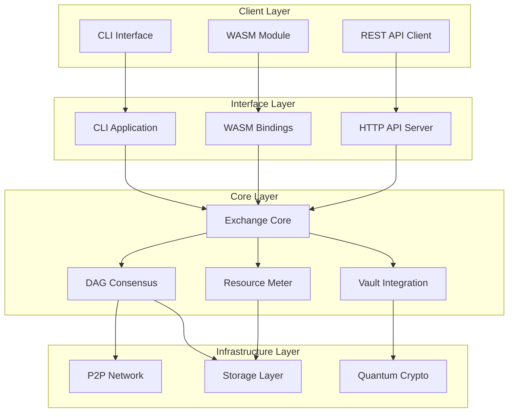

## Component Architecture

### Core Components

#### 1. Exchange Core (`qudag-exchange-core`)

The heart of the system, providing:

- **Ledger Management**: Tracks rUv token balances and transactions
- **Transaction Processing**: Validates and executes token transfers
- **Resource Accounting**: Meters computational resource usage
- **Event System**: Publishes state changes for subscribers

```rust
// Core trait definitions
pub trait Ledger {
    fn get_balance(&self, account: &AccountId) -> Result<Balance>;
    fn transfer(&mut self, from: &AccountId, to: &AccountId, amount: Amount) -> Result<TxId>;
}

pub trait ResourceMeter {
    fn measure_operation(&self, op: &Operation) -> Result<Cost>;
    fn charge_account(&mut self, account: &AccountId, cost: Cost) -> Result<()>;
}
```

#### 2. Vault Integration

Secure key management using QuDAG Vault:

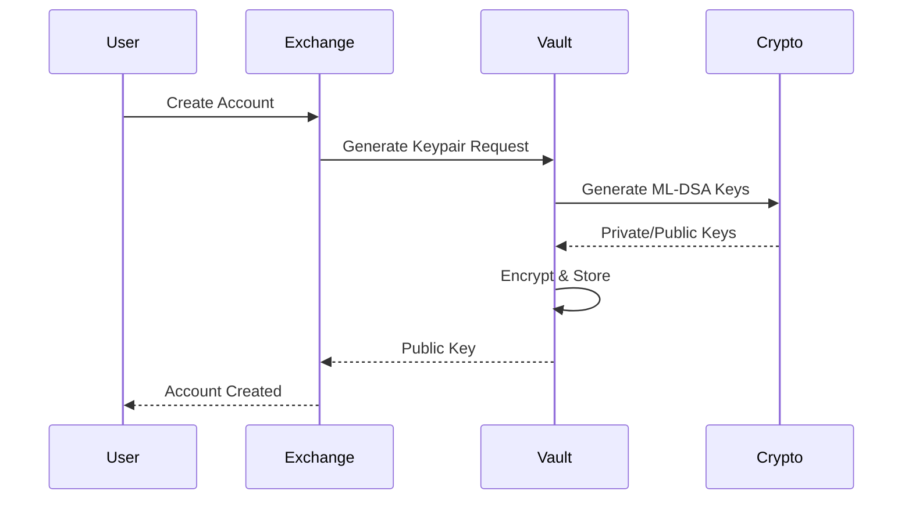

Features:
- Quantum-resistant key generation (ML-DSA, ML-KEM)
- Encrypted key storage with master password
- Hierarchical deterministic key derivation
- Hardware security module (HSM) support

#### 3. DAG Consensus Module

Implements QR-Avalanche consensus for transaction ordering:

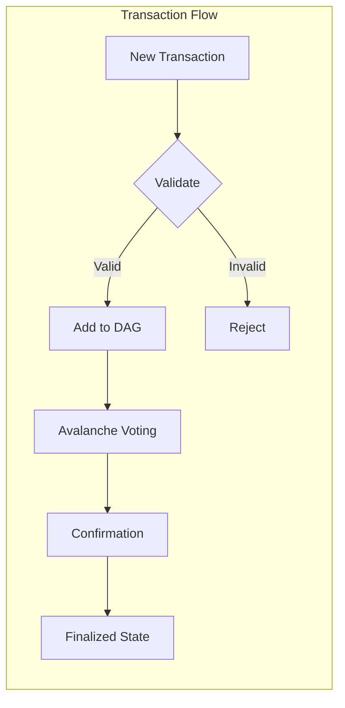

Key properties:
- **Quantum-Resistant**: Uses post-quantum signatures
- **High Throughput**: Parallel transaction processing
- **Fast Finality**: 2-5 second confirmation times
- **Byzantine Fault Tolerant**: Survives up to 33% malicious nodes

#### 4. Resource Metering

Tracks and charges for resource usage:

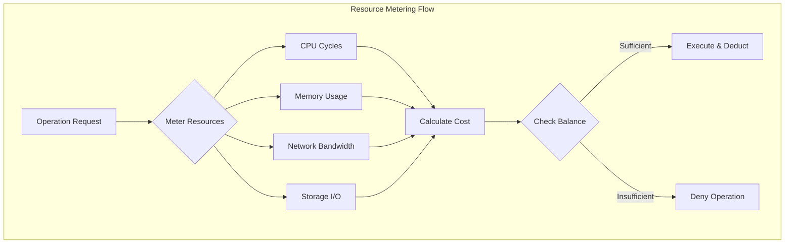

### Network Architecture

#### P2P Network Layer

Built on libp2p for robust peer-to-peer communication:

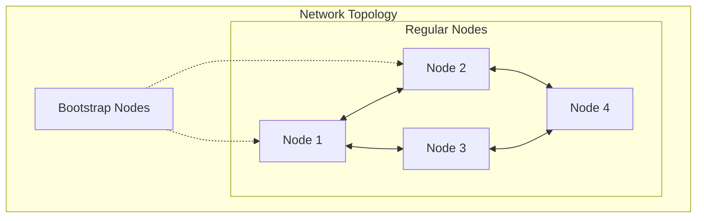

Features:
- **DHT-based Discovery**: Kademlia DHT for peer discovery
- **NAT Traversal**: Automatic hole punching
- **Encrypted Channels**: Noise protocol for secure communication
- **Gossip Protocol**: Efficient message propagation

#### Message Flow

```mermaid
sequenceDiagram
    participant A as Node A
    participant B as Node B
    participant C as Node C
    participant D as Node D
    
    Note over A: User submits transaction
    A->>B: Broadcast Transaction
    A->>C: Broadcast Transaction
    B->>D: Gossip Transaction
    C->>D: Gossip Transaction
    
    Note over B,C,D: Validate & Vote
    B-->>A: Vote Response
    C-->>A: Vote Response
    D-->>A: Vote Response
    
    Note over A,B,C,D: Consensus Achieved
```

### Storage Architecture

#### Multi-Layer Storage

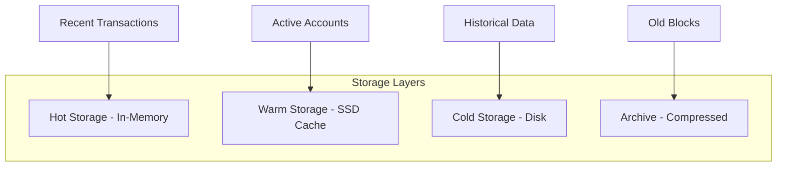

Optimization strategies:
- **Bloom Filters**: Quick existence checks
- **Merkle Trees**: Efficient state proofs
- **Pruning**: Remove old transaction data
- **Compression**: ZSTD for cold storage

### Security Architecture

#### Defense Layers

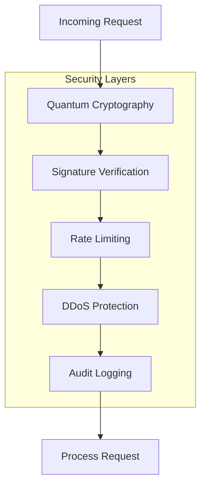

Security features:
- **Post-Quantum Signatures**: ML-DSA (Dilithium)
- **Quantum Key Exchange**: ML-KEM (Kyber)
- **Zero-Knowledge Proofs**: Transaction privacy
- **Time-lock Puzzles**: Front-running prevention

### WASM Architecture

#### Browser Integration

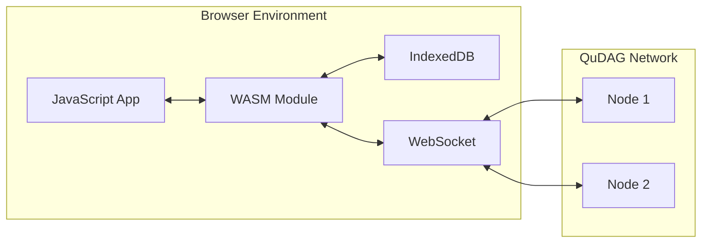

WASM features:
- **Sandboxed Execution**: Memory-safe operations
- **Browser Storage**: IndexedDB for persistence
- **WebRTC Support**: P2P in browsers
- **Compact Size**: ~500KB gzipped

### API Architecture

#### RESTful API Design

```yaml
/api/v1:
  /accounts:
    POST: Create new account
    GET /{id}: Get account info
  
  /transactions:
    POST: Submit transaction
    GET /{id}: Get transaction status
    GET: List transactions (paginated)
  
  /resources:
    GET /offers: List resource offers
    POST /offers: Create resource offer
    POST /reservations: Reserve resources
  
  /network:
    GET /status: Network health
    GET /peers: Connected peers
    GET /stats: Network statistics
```

#### WebSocket API

```javascript
// Real-time event subscriptions
ws.subscribe('account.balance.changed', (event) => {
  console.log(`Balance updated: ${event.newBalance}`);
});

ws.subscribe('transaction.confirmed', (event) => {
  console.log(`Transaction ${event.txId} confirmed`);
});
```

## Data Flow Architecture

### Transaction Lifecycle

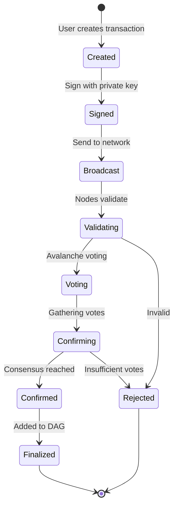

### Resource Trading Flow

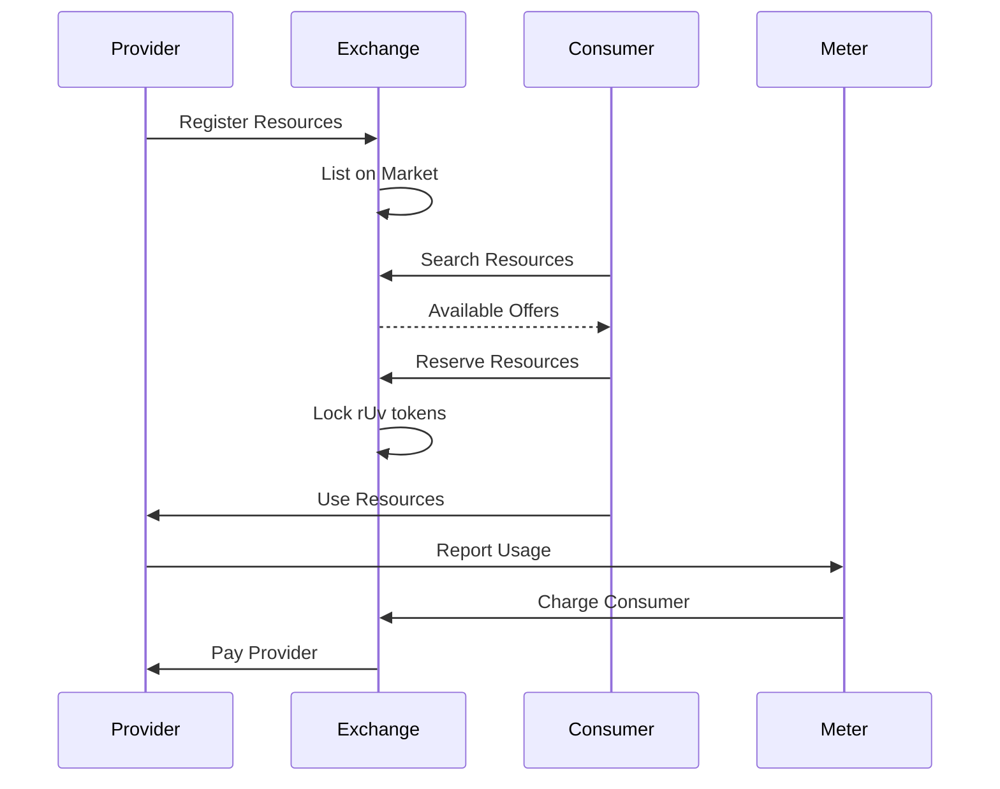

## Deployment Architecture

### Single Node Deployment

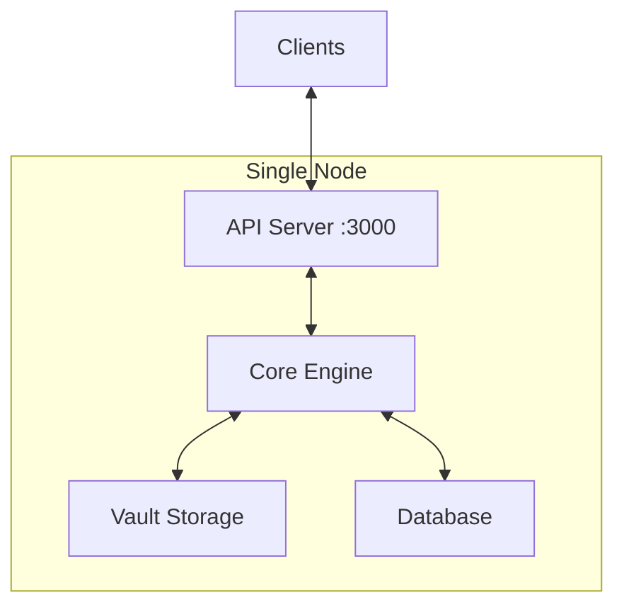

### Multi-Node Cluster

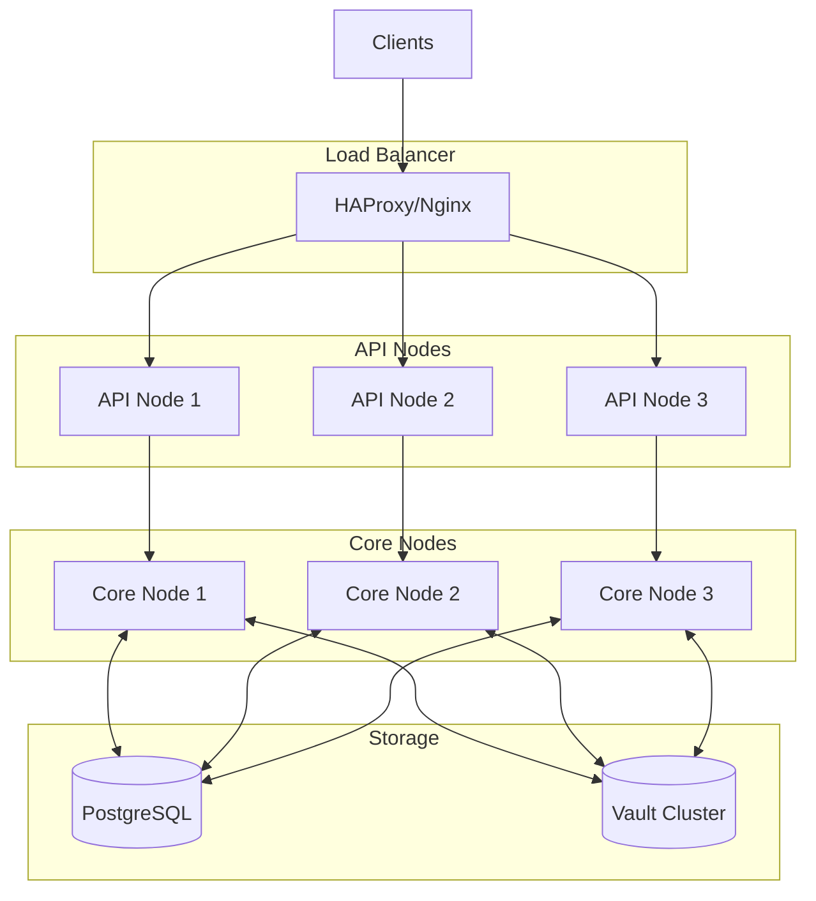

## Performance Considerations

### Optimization Strategies

1. **Parallel Transaction Processing**
   - Multiple validator threads
   - Lock-free data structures
   - Optimistic concurrency control

2. **Caching Layers**
   - Account balance cache
   - Transaction validation cache
   - Network route cache

3. **Batch Operations**
   - Group small transactions
   - Bulk signature verification
   - Compressed network messages

### Scalability Metrics

- **Transaction Throughput**: 10,000+ TPS
- **Confirmation Latency**: 2-5 seconds
- **Network Size**: 10,000+ nodes
- **Storage Growth**: ~1GB/day at full capacity

## Future Architecture Enhancements

### Planned Features

1. **Sharding Support**
   - Horizontal scaling
   - Cross-shard transactions
   - Dynamic shard rebalancing

2. **Layer 2 Solutions**
   - Payment channels
   - State channels
   - Rollup support

3. **Advanced Privacy**
   - Confidential transactions
   - Ring signatures
   - Homomorphic encryption

4. **Interoperability**
   - Cross-chain bridges
   - Atomic swaps
   - Universal resource standards