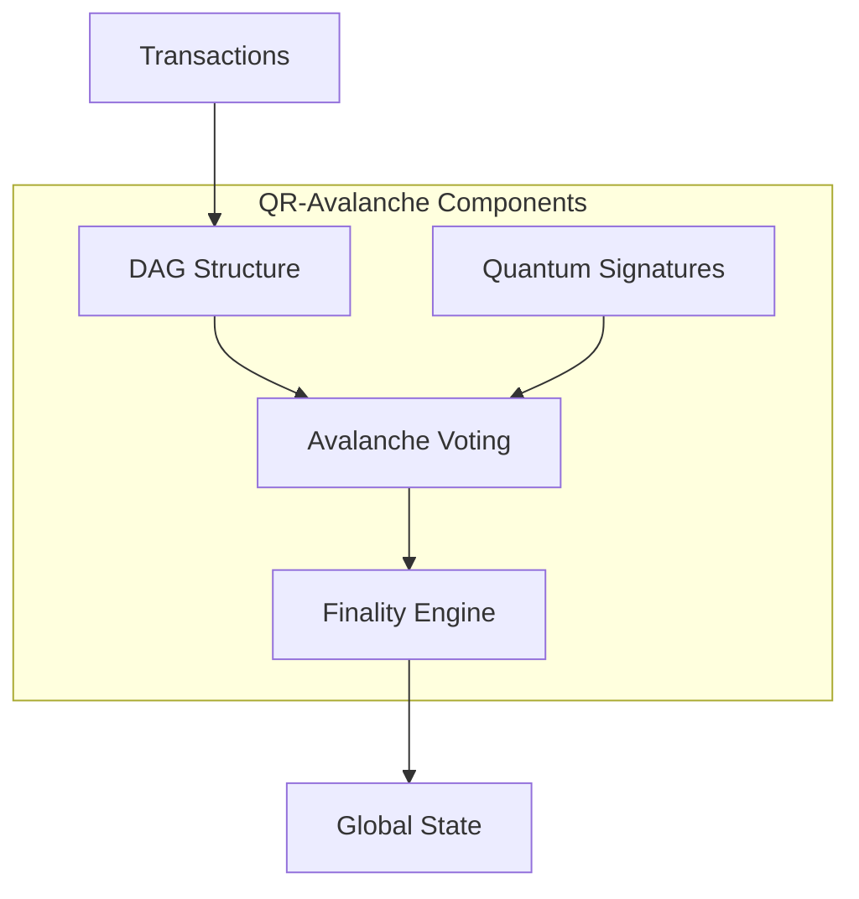

# Consensus Integration Guide

## Overview

This guide explains how to integrate with QuDAG's Quantum-Resistant Avalanche (QR-Avalanche) consensus mechanism. The consensus layer ensures transaction finality, prevents double-spending, and maintains a consistent global state across the network.

## QR-Avalanche Consensus

### Core Concepts

QR-Avalanche is a DAG-based consensus protocol that combines:
- **Avalanche consensus** for fast finality
- **Directed Acyclic Graph (DAG)** structure for parallelism
- **Post-quantum cryptography** for future-proof security



### DAG Structure

Transactions form vertices in a DAG:

```rust
pub struct DagVertex {
    // Unique identifier
    pub id: VertexId,
    
    // Transaction data
    pub transaction: Transaction,
    
    // References to parent vertices
    pub parents: Vec<VertexId>,
    
    // Quantum-resistant signature
    pub signature: DilithiumSignature,
    
    // Consensus metadata
    pub height: u64,
    pub timestamp: Timestamp,
    pub confidence: f64,
}
```

## Integration Steps

### Step 1: Set Up Dependencies

Add QuDAG consensus to your `Cargo.toml`:

```toml
[dependencies]
qudag-dag = "1.0"
qudag-consensus = "1.0"
qudag-crypto = "1.0"
tokio = { version = "1.0", features = ["full"] }
```

### Step 2: Initialize Consensus Engine

```rust
use qudag_consensus::{QrAvalanche, ConsensusConfig, NetworkAdapter};
use qudag_dag::Dag;

pub async fn initialize_consensus() -> Result<QrAvalanche> {
    // Configure consensus parameters
    let config = ConsensusConfig {
        // Avalanche parameters
        sample_size: 20,          // k: Number of validators to query
        quorum_size: 14,          // α: Quorum threshold
        decision_threshold: 20,    // β: Consecutive successes for decision
        
        // Timing parameters
        query_timeout: Duration::from_millis(500),
        max_processing_time: Duration::from_secs(5),
        
        // Security parameters
        signature_algorithm: SignatureAlgorithm::Dilithium3,
        max_parents: 8,
        min_stake: 1000, // Minimum stake to participate
    };
    
    // Initialize DAG storage
    let dag = Dag::new("./data/dag")?;
    
    // Set up network adapter
    let network = NetworkAdapter::new(config.clone());
    
    // Create consensus engine
    let consensus = QrAvalanche::new(config, dag, network).await?;
    
    Ok(consensus)
}
```

### Step 3: Submit Transactions

```rust
pub async fn submit_transaction(
    consensus: &QrAvalanche,
    transaction: Transaction
) -> Result<VertexId> {
    // Select parent vertices
    let parents = consensus.select_parents().await?;
    
    // Create DAG vertex
    let vertex = DagVertex {
        id: VertexId::new(),
        transaction,
        parents,
        signature: sign_vertex(&vertex, &private_key)?,
        height: calculate_height(&parents),
        timestamp: Timestamp::now(),
        confidence: 0.0,
    };
    
    // Submit to consensus
    let vertex_id = consensus.add_vertex(vertex).await?;
    
    // Start consensus process
    consensus.start_consensus(vertex_id).await?;
    
    Ok(vertex_id)
}
```

### Step 4: Implement Voting Logic

```rust
use qudag_consensus::{Vote, VoteRequest, VoteResponse};

#[async_trait]
impl ConsensusValidator for MyValidator {
    async fn on_vote_request(&self, request: VoteRequest) -> VoteResponse {
        // Validate the vertex
        let vertex = self.dag.get_vertex(&request.vertex_id)?;
        
        // Check transaction validity
        let is_valid = self.validate_transaction(&vertex.transaction).await?;
        
        // Check for conflicts
        let has_conflicts = self.check_conflicts(&vertex).await?;
        
        // Determine vote
        let vote = if is_valid && !has_conflicts {
            Vote::Yes
        } else {
            Vote::No
        };
        
        // Sign vote with quantum-resistant signature
        let signature = self.sign_vote(&vote, &request)?;
        
        VoteResponse {
            vote,
            signature,
            validator_id: self.id.clone(),
        }
    }
    
    async fn validate_transaction(&self, tx: &Transaction) -> Result<bool> {
        // Verify signature
        if !verify_quantum_signature(tx)? {
            return Ok(false);
        }
        
        // Check balance
        let balance = self.get_balance(&tx.from).await?;
        if balance < tx.amount + tx.fee {
            return Ok(false);
        }
        
        // Check nonce
        let expected_nonce = self.get_nonce(&tx.from).await?;
        if tx.nonce != expected_nonce {
            return Ok(false);
        }
        
        Ok(true)
    }
}
```

### Step 5: Monitor Consensus Progress

```rust
pub async fn monitor_consensus(consensus: &QrAvalanche, vertex_id: VertexId) {
    let mut event_stream = consensus.subscribe_events(vertex_id).await;
    
    while let Some(event) = event_stream.next().await {
        match event {
            ConsensusEvent::VoteReceived { from, vote } => {
                println!("Received vote {:?} from {}", vote, from);
            }
            
            ConsensusEvent::ConfidenceUpdated { confidence } => {
                println!("Confidence updated: {:.2}%", confidence * 100.0);
            }
            
            ConsensusEvent::Decided { accepted } => {
                if accepted {
                    println!("Transaction accepted!");
                } else {
                    println!("Transaction rejected!");
                }
                break;
            }
            
            ConsensusEvent::Timeout => {
                println!("Consensus timeout - retrying");
            }
        }
    }
}
```

## Advanced Integration

### Custom Conflict Resolution

Implement application-specific conflict detection:

```rust
pub trait ConflictDetector {
    fn conflicts_with(&self, a: &Transaction, b: &Transaction) -> bool;
}

pub struct ResourceConflictDetector;

impl ConflictDetector for ResourceConflictDetector {
    fn conflicts_with(&self, a: &Transaction, b: &Transaction) -> bool {
        match (&a.data, &b.data) {
            // Two reservations conflict if they book the same resource
            (
                TxData::ResourceReservation { resource_id: id1, time_slot: slot1, .. },
                TxData::ResourceReservation { resource_id: id2, time_slot: slot2, .. }
            ) => {
                id1 == id2 && slots_overlap(slot1, slot2)
            }
            
            // Transfers conflict if they spend from the same account
            (
                TxData::Transfer { from: from1, nonce: nonce1, .. },
                TxData::Transfer { from: from2, nonce: nonce2, .. }
            ) => {
                from1 == from2 && nonce1 == nonce2
            }
            
            _ => false
        }
    }
}
```

### Optimistic Execution

Execute transactions optimistically before full confirmation:

```rust
pub struct OptimisticExecutor {
    pending: HashMap<VertexId, PendingExecution>,
    confirmed: HashMap<VertexId, ConfirmedExecution>,
}

impl OptimisticExecutor {
    pub async fn execute_optimistically(&mut self, vertex: &DagVertex) -> Result<()> {
        // Check if parents are confirmed
        let parents_confirmed = self.all_parents_confirmed(&vertex.parents).await?;
        
        if parents_confirmed {
            // Execute immediately
            let result = self.execute_transaction(&vertex.transaction).await?;
            
            // Store as pending
            self.pending.insert(vertex.id, PendingExecution {
                result,
                rollback_data: self.create_rollback(&vertex.transaction)?,
            });
            
            // Listen for confirmation
            self.await_confirmation(vertex.id).await;
        } else {
            // Queue for later execution
            self.queue_for_execution(vertex).await;
        }
        
        Ok(())
    }
    
    async fn on_confirmation(&mut self, vertex_id: VertexId, accepted: bool) {
        if let Some(pending) = self.pending.remove(&vertex_id) {
            if accepted {
                // Move to confirmed
                self.confirmed.insert(vertex_id, ConfirmedExecution {
                    result: pending.result,
                });
            } else {
                // Rollback
                self.rollback(pending.rollback_data).await;
            }
        }
    }
}
```

### State Synchronization

Sync state across nodes:

```rust
pub struct StateSync {
    local_state: State,
    consensus: Arc<QrAvalanche>,
}

impl StateSync {
    pub async fn sync_with_network(&mut self) -> Result<()> {
        // Get latest confirmed vertices
        let frontier = self.consensus.get_frontier().await?;
        
        // Request missing vertices
        for vertex_id in frontier {
            if !self.local_state.has_vertex(&vertex_id) {
                let vertex = self.request_vertex(vertex_id).await?;
                self.apply_vertex(vertex).await?;
            }
        }
        
        // Verify state hash
        let network_state_hash = self.consensus.get_state_hash().await?;
        let local_state_hash = self.local_state.compute_hash();
        
        if network_state_hash != local_state_hash {
            // State diverged - need full sync
            self.full_state_sync().await?;
        }
        
        Ok(())
    }
}
```

## Performance Optimization

### Batch Processing

Process multiple transactions together:

```rust
pub struct BatchProcessor {
    batch_size: usize,
    batch_timeout: Duration,
    pending_batch: Vec<Transaction>,
}

impl BatchProcessor {
    pub async fn add_transaction(&mut self, tx: Transaction) -> Result<()> {
        self.pending_batch.push(tx);
        
        if self.pending_batch.len() >= self.batch_size {
            self.process_batch().await?;
        }
        
        Ok(())
    }
    
    async fn process_batch(&mut self) -> Result<()> {
        if self.pending_batch.is_empty() {
            return Ok(());
        }
        
        // Create batch vertex
        let batch_tx = Transaction::batch(self.pending_batch.drain(..).collect());
        
        // Submit to consensus
        let vertex_id = submit_transaction(&self.consensus, batch_tx).await?;
        
        // Track batch
        self.track_batch(vertex_id).await;
        
        Ok(())
    }
}
```

### Parallel Validation

Validate multiple vertices in parallel:

```rust
pub async fn parallel_validation(vertices: Vec<DagVertex>) -> Vec<ValidationResult> {
    use futures::stream::{self, StreamExt};
    
    let validation_futures = vertices.into_iter().map(|vertex| {
        async move {
            ValidationResult {
                vertex_id: vertex.id,
                is_valid: validate_vertex(vertex).await.unwrap_or(false),
            }
        }
    });
    
    stream::iter(validation_futures)
        .buffer_unordered(10) // Process 10 in parallel
        .collect()
        .await
}
```

### Caching Strategy

Cache frequently accessed data:

```rust
pub struct ConsensusCache {
    // Cache vertex validation results
    validation_cache: LruCache<VertexId, bool>,
    
    // Cache conflict checks
    conflict_cache: LruCache<(VertexId, VertexId), bool>,
    
    // Cache state lookups
    balance_cache: TTLCache<AccountId, Balance>,
}

impl ConsensusCache {
    pub async fn validate_vertex_cached(&mut self, vertex: &DagVertex) -> Result<bool> {
        // Check cache first
        if let Some(&is_valid) = self.validation_cache.get(&vertex.id) {
            return Ok(is_valid);
        }
        
        // Validate and cache result
        let is_valid = validate_vertex(vertex).await?;
        self.validation_cache.put(vertex.id, is_valid);
        
        Ok(is_valid)
    }
}
```

## Monitoring and Debugging

### Consensus Metrics

Track important metrics:

```rust
pub struct ConsensusMetrics {
    // Performance metrics
    pub avg_confirmation_time: Duration,
    pub transactions_per_second: f64,
    pub vertex_propagation_time: Duration,
    
    // Network metrics
    pub active_validators: usize,
    pub network_stake: u64,
    pub vote_participation_rate: f64,
    
    // Health metrics
    pub fork_rate: f64,
    pub orphan_rate: f64,
    pub reorg_depth: u32,
}

pub async fn collect_metrics(consensus: &QrAvalanche) -> ConsensusMetrics {
    ConsensusMetrics {
        avg_confirmation_time: consensus.get_avg_confirmation_time().await,
        transactions_per_second: consensus.get_tps().await,
        vertex_propagation_time: consensus.get_propagation_time().await,
        active_validators: consensus.get_active_validator_count().await,
        network_stake: consensus.get_total_stake().await,
        vote_participation_rate: consensus.get_participation_rate().await,
        fork_rate: consensus.get_fork_rate().await,
        orphan_rate: consensus.get_orphan_rate().await,
        reorg_depth: consensus.get_max_reorg_depth().await,
    }
}
```

### Debug Visualization

Visualize DAG structure:

```rust
pub fn export_dag_dot(dag: &Dag, output_path: &Path) -> Result<()> {
    let mut dot = String::from("digraph G {\n");
    dot.push_str("  rankdir=BT;\n");
    dot.push_str("  node [shape=box];\n");
    
    // Add vertices
    for vertex in dag.iter_vertices() {
        let color = match vertex.confidence {
            c if c >= 0.95 => "green",
            c if c >= 0.5 => "yellow",
            _ => "red",
        };
        
        dot.push_str(&format!(
            "  \"{}\" [label=\"{}\\nConf: {:.2}\" color={}];\n",
            vertex.id.short(),
            vertex.transaction.summary(),
            vertex.confidence,
            color
        ));
        
        // Add edges to parents
        for parent_id in &vertex.parents {
            dot.push_str(&format!(
                "  \"{}\" -> \"{}\";\n",
                vertex.id.short(),
                parent_id.short()
            ));
        }
    }
    
    dot.push_str("}\n");
    
    std::fs::write(output_path, dot)?;
    Ok(())
}
```

## Testing Consensus

### Unit Tests

```rust
#[cfg(test)]
mod tests {
    use super::*;
    
    #[tokio::test]
    async fn test_consensus_simple() {
        // Create test network
        let mut network = TestNetwork::new(5);
        
        // Submit transaction
        let tx = create_test_transaction();
        let vertex_id = network.submit_transaction(tx).await.unwrap();
        
        // Wait for consensus
        let result = network.await_consensus(vertex_id).await.unwrap();
        
        assert!(result.accepted);
        assert!(result.confidence >= 0.95);
    }
    
    #[tokio::test]
    async fn test_double_spend_rejection() {
        let mut network = TestNetwork::new(5);
        
        // Submit two conflicting transactions
        let tx1 = create_transfer("alice", "bob", 100);
        let tx2 = create_transfer("alice", "carol", 100);
        
        let id1 = network.submit_transaction(tx1).await.unwrap();
        let id2 = network.submit_transaction(tx2).await.unwrap();
        
        // Wait for both
        let result1 = network.await_consensus(id1).await.unwrap();
        let result2 = network.await_consensus(id2).await.unwrap();
        
        // Only one should be accepted
        assert!(result1.accepted ^ result2.accepted);
    }
}
```

### Integration Tests

```rust
#[tokio::test]
async fn test_network_partition_recovery() {
    let mut network = TestNetwork::new(10);
    
    // Create partition
    network.partition(&[0, 1, 2, 3, 4], &[5, 6, 7, 8, 9]).await;
    
    // Submit transactions to both partitions
    let tx1 = create_test_transaction();
    let tx2 = create_test_transaction();
    
    let id1 = network.submit_to_partition(0, tx1).await.unwrap();
    let id2 = network.submit_to_partition(1, tx2).await.unwrap();
    
    // Heal partition
    network.heal_partition().await;
    
    // Both should eventually be accepted
    let result1 = network.await_consensus(id1).await.unwrap();
    let result2 = network.await_consensus(id2).await.unwrap();
    
    assert!(result1.accepted);
    assert!(result2.accepted);
}
```

## Best Practices

### 1. Parent Selection

Choose parents wisely for optimal performance:

```rust
pub async fn select_parents(dag: &Dag, max_parents: usize) -> Vec<VertexId> {
    let mut parents = Vec::new();
    
    // Get frontier vertices (no children)
    let frontier = dag.get_frontier().await;
    
    // Sort by confidence and timestamp
    let mut candidates: Vec<_> = frontier.into_iter()
        .map(|id| dag.get_vertex(id))
        .filter_map(Result::ok)
        .collect();
        
    candidates.sort_by(|a, b| {
        b.confidence.partial_cmp(&a.confidence)
            .unwrap_or(std::cmp::Ordering::Equal)
            .then(b.timestamp.cmp(&a.timestamp))
    });
    
    // Select up to max_parents
    for vertex in candidates.into_iter().take(max_parents) {
        parents.push(vertex.id);
    }
    
    parents
}
```

### 2. Validator Selection

Choose validators strategically:

```rust
pub fn select_validators(
    validators: &[ValidatorInfo],
    sample_size: usize
) -> Vec<ValidatorId> {
    // Weight by stake
    let total_stake: u64 = validators.iter().map(|v| v.stake).sum();
    
    let mut selected = HashSet::new();
    let mut rng = thread_rng();
    
    while selected.len() < sample_size {
        let r = rng.gen_range(0..total_stake);
        let mut cumulative = 0;
        
        for validator in validators {
            cumulative += validator.stake;
            if cumulative > r {
                selected.insert(validator.id.clone());
                break;
            }
        }
    }
    
    selected.into_iter().collect()
}
```

### 3. Error Handling

Handle consensus errors gracefully:

```rust
pub async fn robust_consensus_submit(
    consensus: &QrAvalanche,
    transaction: Transaction,
    max_retries: u32
) -> Result<VertexId> {
    let mut retries = 0;
    
    loop {
        match submit_transaction(consensus, transaction.clone()).await {
            Ok(vertex_id) => return Ok(vertex_id),
            
            Err(ConsensusError::NetworkTimeout) if retries < max_retries => {
                retries += 1;
                tokio::time::sleep(Duration::from_secs(1 << retries)).await;
                continue;
            }
            
            Err(ConsensusError::InsufficientValidators) => {
                // Wait for more validators
                wait_for_validators(consensus, 5).await?;
                continue;
            }
            
            Err(e) => return Err(e.into()),
        }
    }
}
```

## Conclusion

Integrating with QuDAG's QR-Avalanche consensus provides fast, secure, and scalable transaction finality. By following this guide and implementing the best practices, you can build robust applications that leverage the full power of quantum-resistant DAG consensus.

For more detailed API documentation, see the [API Reference](api-reference.md).