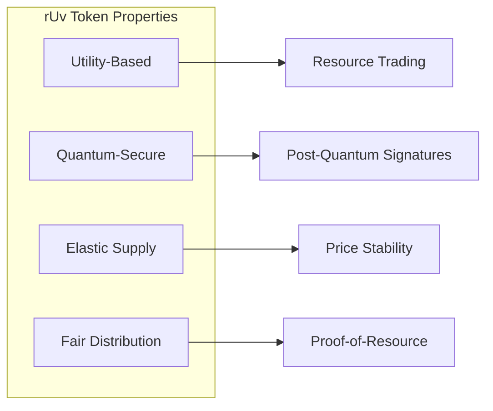
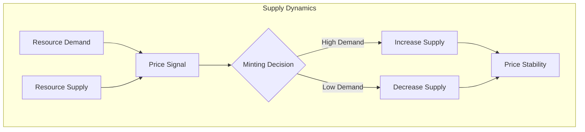
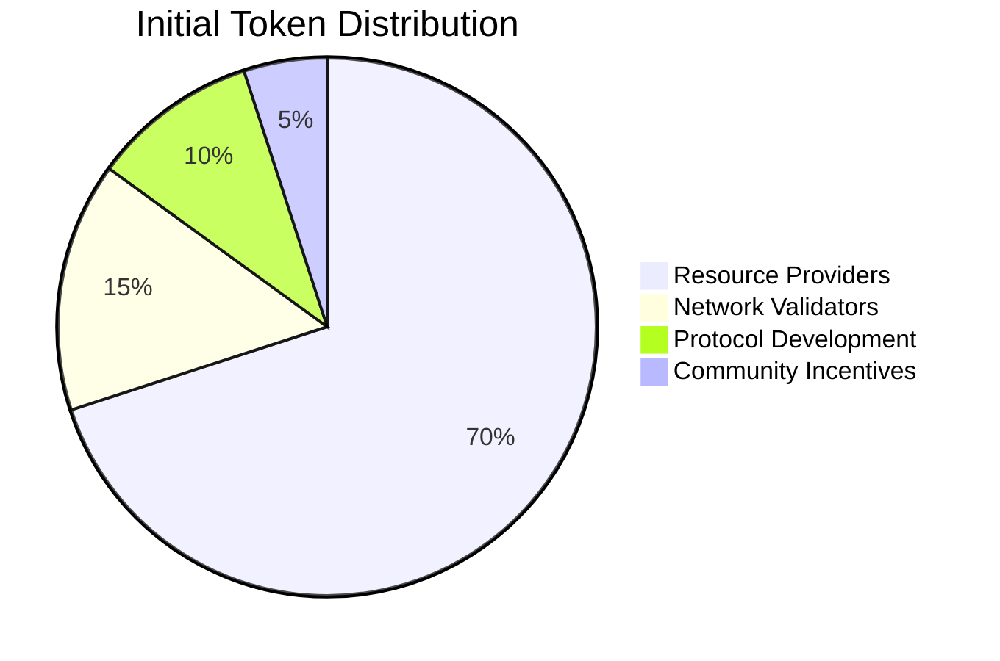
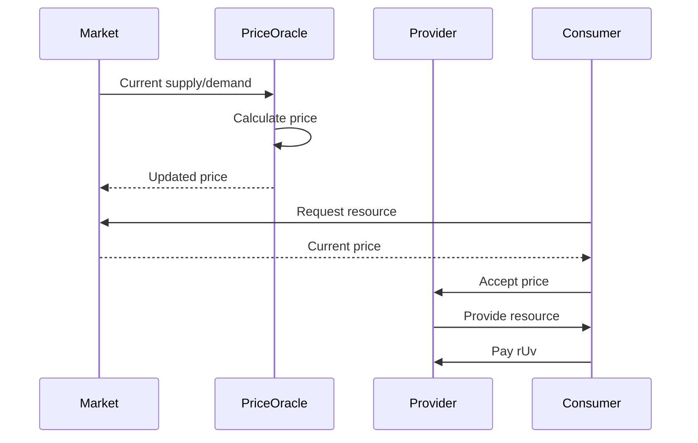
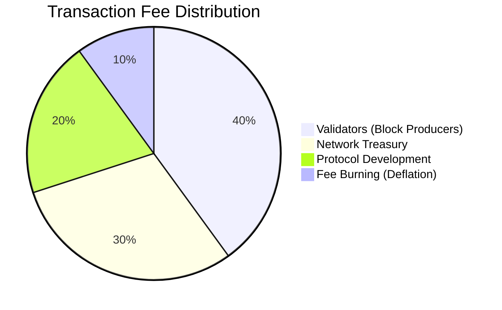
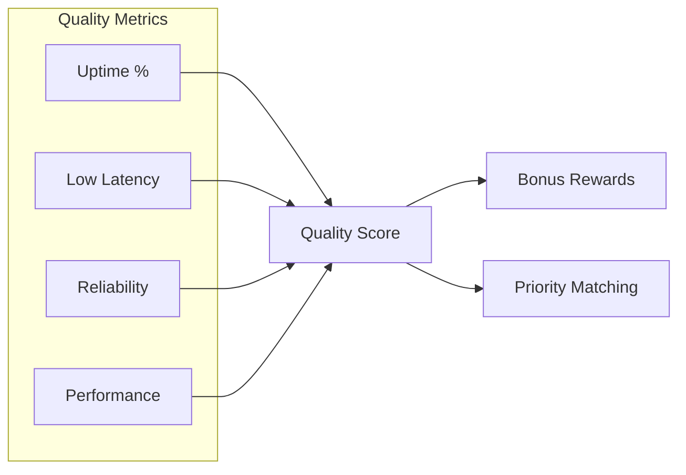
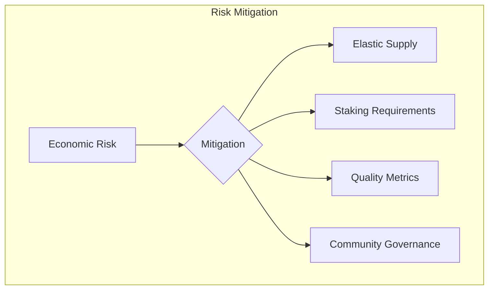

# rUv Token Economics

## Introduction

The **rUv (Resource Utilization Voucher)** token is the native utility token of the QuDAG Exchange ecosystem. It serves as the fundamental unit of value for computational resource trading, enabling a decentralized marketplace where providers and consumers can efficiently exchange computing power, storage, bandwidth, and other digital resources.

## Token Overview

### What is rUv?

rUv stands for **Resource Utilization Voucher**, representing a standardized unit of computational resources. Unlike traditional cryptocurrencies focused on monetary value, rUv tokens are intrinsically tied to real computational utility:

- **1 rUv** ≈ 1 standardized compute unit (SCU)
- **1 SCU** = 1 vCPU-hour @ 2.4GHz equivalent
- Additional resource conversions are dynamically priced based on market demand

### Token Properties



## Token Supply Mechanics

### Dynamic Supply Model

rUv uses an **elastic supply model** that responds to network demand:



### Supply Algorithm

```python
# Simplified supply adjustment algorithm
def adjust_supply(current_supply, utilization_rate, target_utilization=0.7):
    """
    Adjust token supply based on network utilization
    
    utilization_rate: Current resource utilization (0.0 to 1.0)
    target_utilization: Target utilization for optimal efficiency
    """
    if utilization_rate > target_utilization:
        # High demand - increase supply
        supply_increase = (utilization_rate - target_utilization) * 0.1
        new_supply = current_supply * (1 + supply_increase)
    else:
        # Low demand - decrease supply through burning
        supply_decrease = (target_utilization - utilization_rate) * 0.05
        new_supply = current_supply * (1 - supply_decrease)
    
    # Apply bounds to prevent extreme changes
    max_change = 0.02  # 2% max change per epoch
    return clamp(new_supply, 
                 current_supply * (1 - max_change),
                 current_supply * (1 + max_change))
```

## Token Distribution

### Initial Distribution

No pre-mine or ICO. All tokens are earned through resource contribution:



### Earning Mechanisms

#### 1. Resource Provision Rewards

Providers earn rUv by contributing resources:

```python
# Resource earning calculation
def calculate_resource_reward(resource_type, amount, duration, quality_score):
    """
    Calculate rUv rewards for resource provision
    """
    base_rates = {
        'cpu': 1.0,      # 1 rUv per vCPU-hour
        'gpu': 10.0,     # 10 rUv per GPU-hour
        'memory': 0.1,   # 0.1 rUv per GB-hour
        'storage': 0.01, # 0.01 rUv per GB-day
        'bandwidth': 0.001  # 0.001 rUv per GB transferred
    }
    
    base_reward = base_rates[resource_type] * amount * duration
    
    # Apply quality multiplier (uptime, latency, etc.)
    quality_multiplier = 0.5 + (quality_score * 0.5)  # 0.5x to 1.0x
    
    # Apply network demand multiplier
    demand_multiplier = get_demand_multiplier(resource_type)
    
    return base_reward * quality_multiplier * demand_multiplier
```

#### 2. Consensus Participation

Validators earn rewards for maintaining network consensus:

```python
def calculate_validator_reward(blocks_validated, stake_amount, performance_score):
    """
    Calculate validator rewards
    """
    base_reward_per_block = 0.1  # 0.1 rUv per block
    
    # Stake-weighted reward
    stake_multiplier = min(sqrt(stake_amount / 1000), 10)  # Capped multiplier
    
    # Performance bonus (uptime, correct votes, etc.)
    performance_bonus = performance_score * 0.5
    
    return blocks_validated * base_reward_per_block * stake_multiplier * (1 + performance_bonus)
```

## Pricing Mechanisms

### Dynamic Resource Pricing

Resource prices adjust based on supply and demand:



### Price Discovery Algorithm

```python
class ResourcePriceOracle:
    def __init__(self):
        self.price_history = {}
        self.volatility_dampener = 0.1
        
    def calculate_spot_price(self, resource_type, current_supply, current_demand):
        """
        Calculate spot price using automated market maker (AMM) principles
        """
        # Base price from constant product formula
        k = 1000000  # Constant product
        base_price = k / (current_supply ** 2)
        
        # Demand adjustment
        demand_ratio = current_demand / current_supply
        demand_multiplier = 1 + log(max(demand_ratio, 0.1))
        
        # Historical volatility adjustment
        volatility = self.calculate_volatility(resource_type)
        volatility_adjustment = 1 + (volatility * self.volatility_dampener)
        
        spot_price = base_price * demand_multiplier * volatility_adjustment
        
        # Apply circuit breakers
        return self.apply_circuit_breakers(resource_type, spot_price)
    
    def apply_circuit_breakers(self, resource_type, price):
        """
        Prevent extreme price movements
        """
        last_price = self.price_history.get(resource_type, price)
        max_change = 0.10  # 10% max change per update
        
        if price > last_price * (1 + max_change):
            return last_price * (1 + max_change)
        elif price < last_price * (1 - max_change):
            return last_price * (1 - max_change)
        
        return price
```

## Fee Structure

### Transaction Fees

All transactions incur fees to prevent spam and fund network operations:

```python
def calculate_transaction_fee(tx_type, tx_size, network_congestion):
    """
    Calculate transaction fees in rUv
    """
    base_fees = {
        'transfer': 0.001,      # 0.001 rUv base fee
        'resource_offer': 0.01, # 0.01 rUv to list offer
        'resource_claim': 0.005,# 0.005 rUv to claim resource
        'smart_contract': 0.1   # 0.1 rUv for contract execution
    }
    
    base_fee = base_fees.get(tx_type, 0.001)
    
    # Size-based component (per KB)
    size_fee = (tx_size / 1024) * 0.0001
    
    # Congestion pricing (1x to 10x multiplier)
    congestion_multiplier = 1 + (network_congestion * 9)
    
    total_fee = (base_fee + size_fee) * congestion_multiplier
    
    return max(total_fee, 0.0001)  # Minimum fee
```

### Fee Distribution



## Staking Mechanics

### Resource Staking

Providers must stake rUv to offer resources:

```python
def calculate_required_stake(resource_type, resource_amount, provider_reputation):
    """
    Calculate required stake for resource providers
    """
    stake_ratios = {
        'cpu': 10,      # 10 rUv per vCPU
        'gpu': 100,     # 100 rUv per GPU
        'memory': 1,    # 1 rUv per GB
        'storage': 0.1, # 0.1 rUv per GB
        'bandwidth': 0.01  # 0.01 rUv per Mbps
    }
    
    base_stake = stake_ratios[resource_type] * resource_amount
    
    # Reputation reduces stake requirements
    reputation_discount = min(provider_reputation / 100, 0.5)  # Up to 50% discount
    
    return base_stake * (1 - reputation_discount)
```

### Slashing Conditions

Staked tokens can be slashed for misbehavior:

```python
def calculate_slashing_penalty(violation_type, stake_amount, repeat_offender):
    """
    Calculate slashing penalties for violations
    """
    penalty_rates = {
        'downtime': 0.01,          # 1% for excessive downtime
        'false_advertising': 0.05,  # 5% for misrepresented resources
        'data_corruption': 0.10,    # 10% for data integrity failures
        'malicious_behavior': 0.50  # 50% for proven malicious acts
    }
    
    base_penalty = penalty_rates.get(violation_type, 0.01)
    
    # Increase penalty for repeat offenders
    if repeat_offender:
        base_penalty *= 2
    
    return min(stake_amount * base_penalty, stake_amount)
```

## Economic Incentives

### Quality of Service Incentives

Providers are rewarded for maintaining high quality:



### Long-term Commitment Rewards

```python
def calculate_commitment_bonus(stake_duration, stake_amount):
    """
    Bonus rewards for long-term staking
    """
    # Duration in days
    duration_tiers = [
        (30, 0.05),    # 5% bonus for 30+ days
        (90, 0.10),    # 10% bonus for 90+ days
        (180, 0.20),   # 20% bonus for 180+ days
        (365, 0.35)    # 35% bonus for 365+ days
    ]
    
    bonus_rate = 0
    for days, rate in duration_tiers:
        if stake_duration >= days:
            bonus_rate = rate
    
    return stake_amount * bonus_rate
```

## Market Dynamics

### Liquidity Pools

Automated market makers provide liquidity:

```python
class ResourceLiquidityPool:
    def __init__(self, resource_type):
        self.resource_type = resource_type
        self.ruv_reserve = 100000    # Initial rUv liquidity
        self.resource_reserve = 1000  # Initial resource units
        self.fee_rate = 0.003        # 0.3% trading fee
        
    def swap_ruv_for_resource(self, ruv_amount):
        """
        Swap rUv tokens for resources using constant product AMM
        """
        # Apply fee
        ruv_after_fee = ruv_amount * (1 - self.fee_rate)
        
        # Constant product formula: x * y = k
        k = self.ruv_reserve * self.resource_reserve
        
        # Calculate output
        new_ruv_reserve = self.ruv_reserve + ruv_after_fee
        new_resource_reserve = k / new_ruv_reserve
        resource_output = self.resource_reserve - new_resource_reserve
        
        # Update reserves
        self.ruv_reserve = new_ruv_reserve
        self.resource_reserve = new_resource_reserve
        
        return resource_output
```

### Arbitrage Prevention

Multiple mechanisms prevent price manipulation:

1. **Time-weighted Average Prices (TWAP)**
2. **Maximum slippage protection**
3. **Front-running prevention via commit-reveal**
4. **Rate limiting on large trades**

## Governance Impact

### Voting Power

rUv holdings determine governance participation:

```python
def calculate_voting_power(ruv_balance, stake_amount, provider_score):
    """
    Calculate governance voting power
    """
    # Base voting power from holdings
    balance_power = sqrt(ruv_balance)
    
    # Bonus for active staking
    stake_power = sqrt(stake_amount) * 1.5
    
    # Bonus for active providers
    provider_bonus = provider_score * 0.1
    
    total_power = balance_power + stake_power + provider_bonus
    
    # Apply quadratic voting to prevent whale dominance
    return sqrt(total_power)
```

### Economic Parameter Governance

Token holders vote on key economic parameters:

- Base reward rates
- Fee structures
- Staking requirements
- Slashing penalties
- Supply adjustment algorithms

## Future Economic Features

### Planned Enhancements

1. **Derivatives Markets**
   - Resource futures contracts
   - Options for price hedging
   - Perpetual swaps

2. **Cross-Chain Integration**
   - Wrapped rUv on other chains
   - Cross-chain resource trading
   - Unified liquidity pools

3. **Advanced Market Mechanisms**
   - Prediction markets for resource demand
   - Insurance pools for SLA guarantees
   - Reputation-based credit systems

4. **Economic Sustainability**
   - Self-balancing treasury
   - Automated buyback mechanisms
   - Long-term incentive alignment

## Risk Considerations

### Economic Risks

1. **Price Volatility**: Managed through elastic supply and circuit breakers
2. **Market Manipulation**: Prevented via TWAP and slippage protection
3. **Sybil Attacks**: Mitigated through stake requirements
4. **Resource Dumping**: Controlled via quality metrics and slashing

### Mitigation Strategies



## Conclusion

The rUv token economics are designed to create a sustainable, efficient marketplace for computational resources. By aligning incentives between providers and consumers while maintaining price stability and preventing manipulation, the system enables a truly decentralized compute economy that can scale with demand while remaining accessible to all participants.