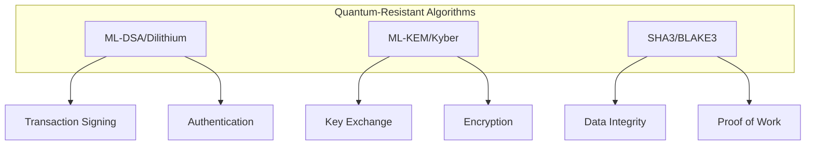
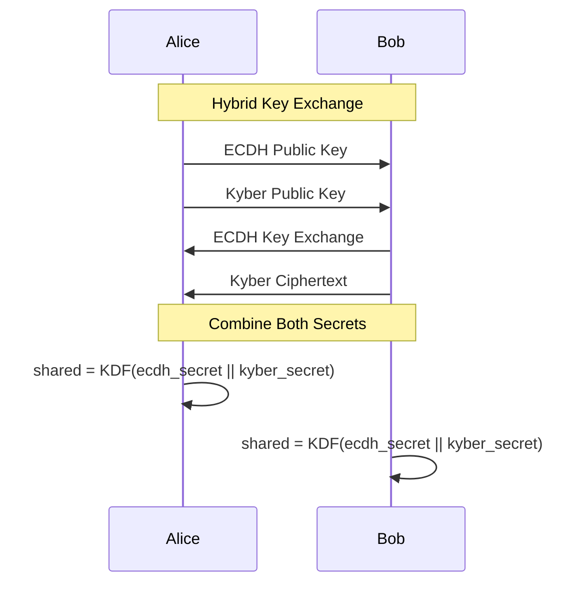
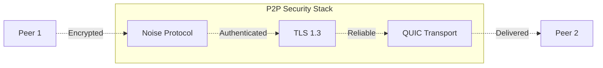
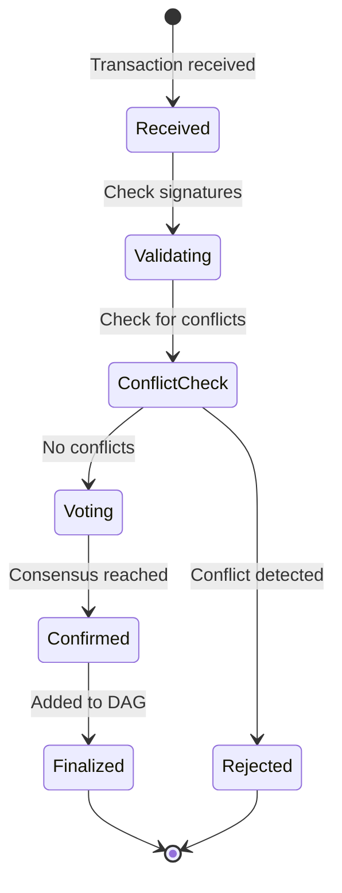
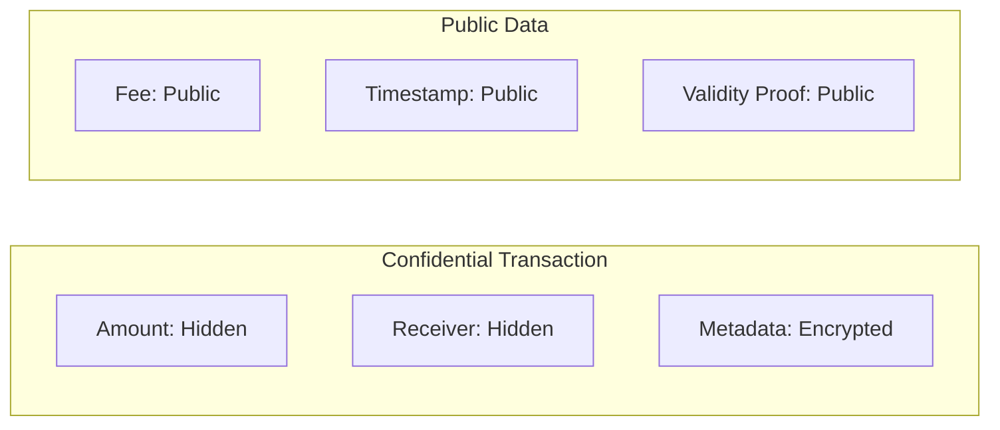
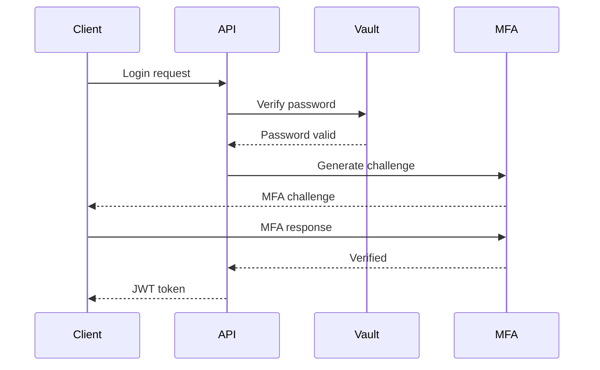

# Security Considerations

## Overview

QuDAG Exchange implements multiple layers of security to protect against both classical and quantum threats. This document outlines the security architecture, best practices, and considerations for operating within the QuDAG Exchange ecosystem.

## Quantum-Resistant Cryptography

### Post-Quantum Algorithms

QuDAG Exchange uses NIST-approved post-quantum cryptographic algorithms:



#### ML-DSA (Dilithium) for Signatures

- **Security Level**: NIST Level 3 (equivalent to AES-192)
- **Key Sizes**: 
  - Private key: 4,000 bytes
  - Public key: 2,592 bytes
  - Signature: 3,293 bytes
- **Performance**: ~0.5ms signing, ~0.2ms verification

```rust
// Example signature implementation
pub fn sign_transaction(tx: &Transaction, private_key: &DilithiumPrivateKey) -> Signature {
    let message = tx.serialize();
    let hash = blake3::hash(&message);
    dilithium::sign(&hash, private_key)
}

pub fn verify_signature(
    tx: &Transaction, 
    signature: &Signature, 
    public_key: &DilithiumPublicKey
) -> bool {
    let message = tx.serialize();
    let hash = blake3::hash(&message);
    dilithium::verify(&hash, signature, public_key)
}
```

#### ML-KEM (Kyber) for Key Encapsulation

- **Security Level**: NIST Level 3
- **Key Sizes**:
  - Private key: 3,168 bytes
  - Public key: 1,568 bytes
  - Ciphertext: 1,568 bytes
- **Shared Secret**: 32 bytes

```rust
// Secure key exchange example
pub fn establish_secure_channel(
    their_public_key: &KyberPublicKey
) -> (SharedSecret, Ciphertext) {
    let (ciphertext, shared_secret) = kyber::encapsulate(their_public_key);
    
    // Derive session keys
    let session_key = derive_session_key(&shared_secret);
    
    (session_key, ciphertext)
}
```

### Hybrid Cryptography

For maximum security during the quantum transition period:



## Key Management

### Hierarchical Deterministic Keys

QuDAG uses BIP32-style HD key derivation with quantum-resistant algorithms:

```
master_seed (256 bits)
    |
    ├── m/44'/9000'/0'/0/0  (Primary signing key)
    ├── m/44'/9000'/0'/0/1  (Primary encryption key)
    ├── m/44'/9000'/0'/1/0  (Resource provider key)
    └── m/44'/9000'/0'/2/x  (Ephemeral session keys)
```

### Vault Security

The QuDAG Vault provides secure key storage:

```rust
pub struct VaultSecurity {
    // Master key derivation
    kdf_algorithm: KdfAlgorithm::Argon2id,
    kdf_iterations: 3,
    kdf_memory: 64 * 1024, // 64 MB
    kdf_parallelism: 4,
    
    // Encryption
    cipher: Cipher::ChaCha20Poly1305,
    key_wrap: KeyWrap::AES256_KWP,
    
    // Additional security
    memory_protection: bool,
    secure_delete: bool,
}
```

### Key Rotation

Automatic key rotation policy:

```yaml
key_rotation_policy:
  signing_keys:
    rotation_period: 90_days
    overlap_period: 7_days
    
  encryption_keys:
    rotation_period: 30_days
    overlap_period: 3_days
    
  session_keys:
    rotation_period: 24_hours
    overlap_period: 1_hour
```

## Network Security

### P2P Security

All peer-to-peer communications are secured:



#### Connection Establishment

```rust
// Secure peer connection
pub async fn connect_to_peer(peer_addr: &Multiaddr) -> Result<SecureStream> {
    // 1. Establish QUIC connection
    let quic_conn = QuicConnection::connect(peer_addr).await?;
    
    // 2. Perform Noise handshake
    let noise_config = NoiseConfig::new(
        &our_private_key,
        vec![NoiseProtocol::XX, NoiseProtocol::IK]
    );
    
    let secure_stream = noise_config.upgrade(quic_conn).await?;
    
    // 3. Verify peer identity
    verify_peer_identity(&secure_stream.remote_public_key())?;
    
    Ok(secure_stream)
}
```

### DDoS Protection

Multi-layer DDoS mitigation:

1. **Connection Rate Limiting**
```rust
rate_limiter: {
    max_connections_per_ip: 10,
    new_connection_rate: 5/second,
    ban_duration: 300 seconds
}
```

2. **Computational Puzzles**
```rust
// Client must solve puzzle before connecting
pub fn generate_connection_puzzle(difficulty: u8) -> Puzzle {
    let challenge = rand::random::<[u8; 32]>();
    let target = calculate_target(difficulty);
    
    Puzzle {
        challenge,
        target,
        algorithm: HashAlgorithm::Blake3,
    }
}
```

3. **Resource Quotas**
```rust
quotas: {
    max_bandwidth_per_peer: 10 MB/s,
    max_messages_per_minute: 1000,
    max_pending_requests: 100
}
```

## Transaction Security

### Double-Spend Prevention

The QR-Avalanche consensus prevents double-spending:



### Transaction Validation

Comprehensive validation pipeline:

```rust
pub fn validate_transaction(tx: &Transaction) -> Result<(), ValidationError> {
    // 1. Signature verification
    verify_quantum_signature(tx)?;
    
    // 2. Balance verification
    check_sender_balance(tx)?;
    
    // 3. Nonce verification (prevent replay)
    verify_nonce(tx)?;
    
    // 4. Time bounds check
    verify_timestamp(tx)?;
    
    // 5. Fee verification
    verify_sufficient_fee(tx)?;
    
    // 6. Resource limits
    check_transaction_size(tx)?;
    
    Ok(())
}
```

### Front-Running Protection

Time-lock puzzles prevent transaction front-running:

```rust
pub struct TimeLockedTransaction {
    encrypted_tx: Vec<u8>,
    puzzle: TimeLockPuzzle,
    reveal_time: Timestamp,
}

impl TimeLockedTransaction {
    pub fn create(tx: &Transaction, lock_duration: Duration) -> Self {
        let puzzle = TimeLockPuzzle::new(lock_duration);
        let encrypted_tx = puzzle.encrypt(&tx.serialize());
        
        Self {
            encrypted_tx,
            puzzle,
            reveal_time: Timestamp::now() + lock_duration,
        }
    }
}
```

## Smart Contract Security

### Resource Metering

Prevent resource exhaustion attacks:

```rust
pub struct ResourceMeter {
    gas_limit: u64,
    memory_limit: usize,
    storage_limit: usize,
    
    gas_used: u64,
    memory_used: usize,
    storage_used: usize,
}

impl ResourceMeter {
    pub fn charge_operation(&mut self, op: &Operation) -> Result<()> {
        let cost = calculate_operation_cost(op);
        
        if self.gas_used + cost > self.gas_limit {
            return Err(Error::OutOfGas);
        }
        
        self.gas_used += cost;
        Ok(())
    }
}
```

### Sandboxing

WASM-based sandboxing for safe execution:

```rust
pub struct WasmSandbox {
    memory_limit: usize,
    instruction_limit: u64,
    import_whitelist: Vec<String>,
    syscall_filter: SyscallFilter,
}

// Restricted imports for contracts
const ALLOWED_IMPORTS: &[&str] = &[
    "env.memory",
    "env.call_contract",
    "env.get_balance",
    "env.transfer",
    // System calls explicitly forbidden
];
```

## Privacy Features

### Zero-Knowledge Proofs

Privacy-preserving balance proofs:

```rust
pub struct BalanceProof {
    commitment: Commitment,
    proof: RangeProof,
    
    // Proves: balance >= amount without revealing balance
}

pub fn create_balance_proof(
    balance: u64,
    amount: u64,
    blinding: Scalar
) -> BalanceProof {
    let commitment = Commitment::new(balance, blinding);
    let proof = RangeProof::prove(
        balance,
        amount,
        blinding,
        &mut thread_rng()
    );
    
    BalanceProof { commitment, proof }
}
```

### Confidential Transactions

Optional transaction privacy:



## API Security

### Authentication

Multi-factor authentication flow:



### Rate Limiting

Adaptive rate limiting:

```rust
pub struct AdaptiveRateLimiter {
    base_limit: u32,
    burst_limit: u32,
    
    // Adjust based on behavior
    reputation_multiplier: f32,
    
    // Different limits per endpoint
    endpoint_limits: HashMap<String, u32>,
}

impl AdaptiveRateLimiter {
    pub fn check_request(&mut self, client: &ClientId, endpoint: &str) -> Result<()> {
        let limit = self.calculate_limit(client, endpoint);
        let current = self.get_request_count(client, endpoint);
        
        if current >= limit {
            return Err(Error::RateLimited);
        }
        
        self.increment_counter(client, endpoint);
        Ok(())
    }
}
```

### Input Validation

Comprehensive input sanitization:

```rust
#[derive(Deserialize, Validate)]
pub struct TransferRequest {
    #[validate(custom = "validate_address")]
    to: String,
    
    #[validate(range(min = 0.001, max = 1000000.0))]
    amount: f64,
    
    #[validate(length(max = 256))]
    memo: Option<String>,
    
    #[validate(custom = "validate_signature")]
    signature: String,
}

fn validate_address(address: &str) -> Result<(), ValidationError> {
    // Check address format and checksum
    if !is_valid_qudag_address(address) {
        return Err(ValidationError::new("invalid_address"));
    }
    Ok(())
}
```

## Operational Security

### Monitoring and Alerting

Real-time security monitoring:

```yaml
security_monitors:
  - name: anomaly_detection
    checks:
      - unusual_transfer_patterns
      - sudden_balance_changes
      - repeated_failed_authentications
    
  - name: network_security
    checks:
      - ddos_attacks
      - sybil_attempts
      - eclipse_attacks
      
  - name: consensus_security
    checks:
      - voting_irregularities
      - fork_attempts
      - censorship_attacks
```

### Incident Response

Automated incident response:

```rust
pub enum SecurityIncident {
    SuspiciousTransaction { tx_id: TxId, reason: String },
    NetworkAttack { attack_type: AttackType, source: IpAddr },
    ConsensusAnomaly { description: String },
}

pub async fn handle_security_incident(incident: SecurityIncident) {
    match incident {
        SecurityIncident::SuspiciousTransaction { tx_id, .. } => {
            // 1. Flag transaction for review
            flag_transaction(tx_id).await;
            
            // 2. Notify validators
            broadcast_alert(Alert::SuspiciousActivity).await;
            
            // 3. Increase monitoring
            increase_monitoring_level().await;
        }
        
        SecurityIncident::NetworkAttack { source, .. } => {
            // 1. Ban attacking IP
            ban_ip_address(source).await;
            
            // 2. Activate DDoS mitigation
            activate_ddos_protection().await;
            
            // 3. Alert operators
            send_operator_alert().await;
        }
        
        // ... handle other incidents
    }
}
```

### Backup and Recovery

Secure backup procedures:

```bash
# Encrypted backup script
#!/bin/bash

# 1. Stop node gracefully
qudag-exchange-cli node stop --graceful

# 2. Create encrypted backup
tar -czf - ~/.qudag/data | \
  openssl enc -aes-256-cbc -salt -pbkdf2 -out backup.tar.gz.enc

# 3. Generate backup hash
sha3sum backup.tar.gz.enc > backup.hash

# 4. Securely store encryption key
echo "Store this key securely: $(openssl rand -hex 32)"

# 5. Restart node
qudag-exchange-cli node start
```

## Security Best Practices

### For Users

1. **Key Management**
   - Use hardware security modules (HSM) for high-value accounts
   - Enable multi-signature for large transactions
   - Regularly rotate keys
   - Never share private keys

2. **Transaction Security**
   - Verify recipient addresses (use address book)
   - Use time-locked transactions for large amounts
   - Enable transaction notifications
   - Review transaction details before signing

3. **Account Security**
   - Use strong, unique passwords
   - Enable 2FA/MFA
   - Monitor account activity
   - Set up withdrawal limits

### For Providers

1. **Infrastructure Security**
   - Keep systems updated
   - Use firewalls and IDS
   - Implement secure boot
   - Regular security audits

2. **Operational Security**
   - Limit access to key material
   - Use secure communication channels
   - Implement logging and monitoring
   - Regular backup testing

3. **Network Security**
   - Use VPNs for management
   - Implement rate limiting
   - Monitor for attacks
   - Participate in security alerts

### For Developers

1. **Code Security**
   - Follow secure coding practices
   - Regular dependency updates
   - Static analysis tools
   - Penetration testing

2. **API Security**
   - Always use HTTPS
   - Implement proper authentication
   - Validate all inputs
   - Use rate limiting

3. **Smart Contract Security**
   - Formal verification
   - Extensive testing
   - Security audits
   - Bug bounties

## Security Audits

### Audit Schedule

Regular security assessments:

| Component | Frequency | Type | Auditor |
|-----------|-----------|------|---------|
| Core Protocol | Quarterly | Full audit | External |
| Cryptography | Bi-annual | Cryptographic review | Academic |
| Smart Contracts | Per deployment | Code audit | Multiple firms |
| Infrastructure | Monthly | Penetration test | Internal + External |
| Dependencies | Weekly | Vulnerability scan | Automated |

### Bug Bounty Program

Rewards for security researchers:

| Severity | Reward | Examples |
|----------|--------|----------|
| Critical | $50,000 - $100,000 | Remote code execution, key compromise |
| High | $10,000 - $50,000 | Fund theft, consensus failure |
| Medium | $1,000 - $10,000 | DoS attacks, information leak |
| Low | $100 - $1,000 | UI bugs, minor issues |

## Compliance

### Regulatory Compliance

- **GDPR**: Right to erasure, data portability
- **SOC 2**: Security controls audit
- **ISO 27001**: Information security management
- **PCI DSS**: Payment card data security (if applicable)

### Privacy Compliance

```rust
// GDPR-compliant data handling
pub trait PersonalDataHandler {
    fn anonymize_data(&self) -> Result<()>;
    fn export_user_data(&self, user_id: &UserId) -> Result<UserData>;
    fn delete_user_data(&self, user_id: &UserId) -> Result<()>;
    fn get_data_retention_policy(&self) -> RetentionPolicy;
}
```

## Conclusion

Security in QuDAG Exchange is multi-layered and comprehensive, addressing both current threats and future quantum computing risks. By implementing defense in depth, using quantum-resistant cryptography, and following security best practices, the platform provides a secure environment for decentralized resource trading. Regular audits, monitoring, and community involvement ensure ongoing security improvements and rapid response to emerging threats.