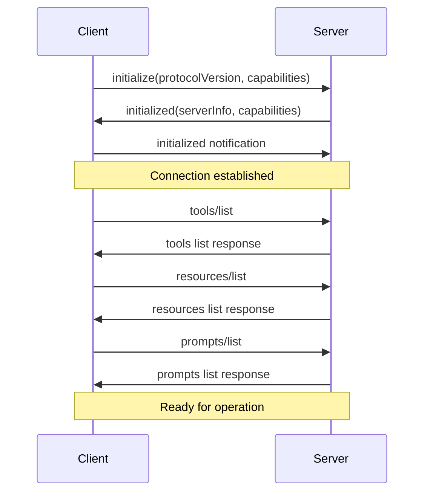
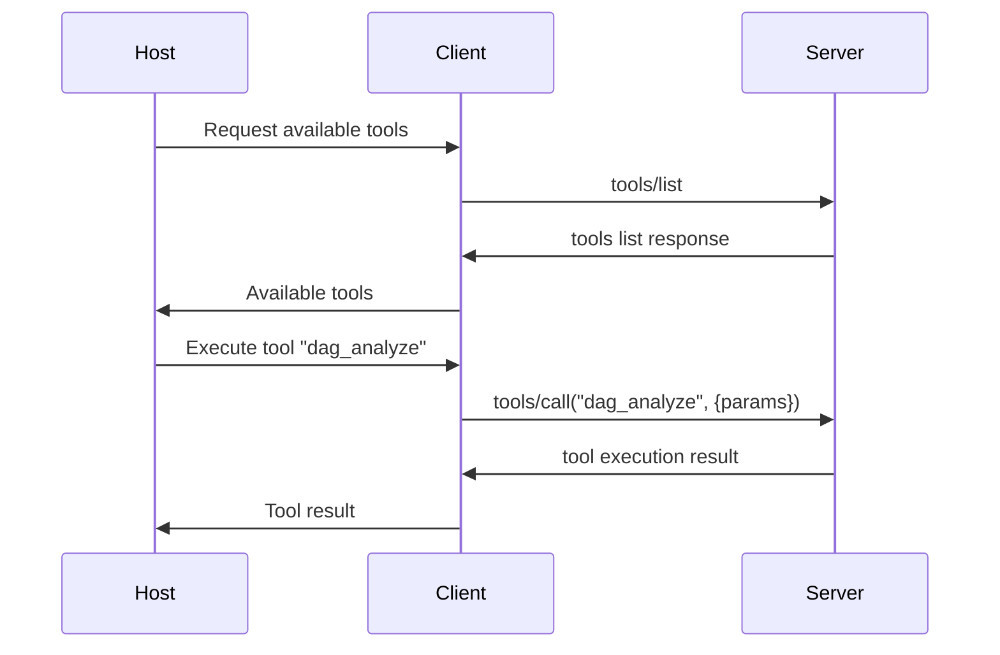
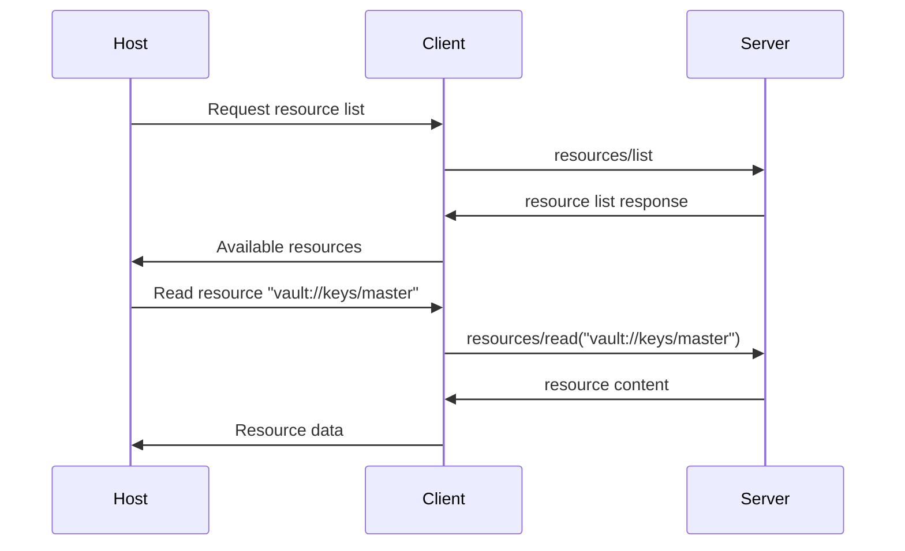
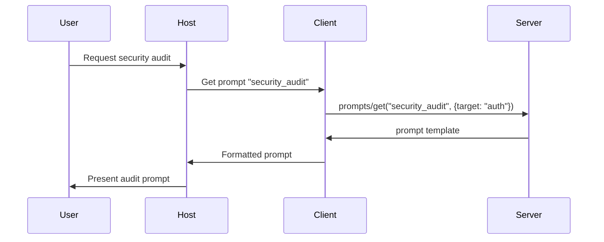

# MCP Protocol Specification: Technical Analysis and Architecture

## Executive Summary

The Model Context Protocol (MCP) represents a paradigm shift in AI-system integration, providing a standardized communication layer between AI models and external data sources, tools, and services. Developed by Anthropic as an open standard, MCP addresses the exponential complexity of the "M×N integration problem" by establishing a universal protocol that reduces integration complexity from O(M×N) to O(M+N).

This document provides a comprehensive technical analysis of the MCP protocol specification, examining its architectural foundations, message formats, transport mechanisms, and practical implications for the QuDAG system integration.

## 1. Protocol Fundamentals

### 1.1 Core Architecture

MCP employs a client-server architecture with four primary components:

1. **Hosts**: LLM applications that coordinate overall system operations and manage interactions with external capabilities
2. **Clients**: Dedicated connection managers that maintain one-to-one stateful relationships with servers
3. **Servers**: Specialized programs that expose capabilities through standardized APIs
4. **Base Protocol**: The foundational communication layer that enables all component interactions

#### Architectural Principles

The MCP architecture is built on several key principles:

- **Separation of Concerns**: Each component has a distinct role with clear boundaries
- **Stateful Connections**: Clients maintain persistent connections with servers for efficient communication
- **Protocol Abstraction**: The base protocol provides transport-agnostic communication
- **Capability Discovery**: Dynamic discovery of available tools, resources, and prompts

### 1.2 Protocol Stack

The MCP protocol stack consists of multiple layers:

```
┌─────────────────────────────────────┐
│     Application Layer               │
│  (Tools, Resources, Prompts)        │
├─────────────────────────────────────┤
│     MCP Protocol Layer             │
│  (Message Routing, Lifecycle)       │
├─────────────────────────────────────┤
│     JSON-RPC 2.0 Layer             │
│  (Message Format, RPC Semantics)    │
├─────────────────────────────────────┤
│     Transport Layer                 │
│  (stdio, SSE, WebSocket, HTTP)      │
└─────────────────────────────────────┘
```

#### Layer Responsibilities

**Application Layer**: Implements business logic for tools, resources, and prompts
**MCP Protocol Layer**: Handles capability negotiation, lifecycle management, and session state
**JSON-RPC 2.0 Layer**: Provides standardized message format and remote procedure call semantics
**Transport Layer**: Manages physical communication channels and message delivery

### 1.3 Capability Model

MCP servers expose three distinct types of capabilities:

#### 1.3.1 Tools (Model-Controlled)
Tools are executable functions that AI models can invoke to perform specific actions. They represent the primary mechanism for AI-driven interactions with external systems.

**Characteristics**:
- Stateful or stateless operation
- Input validation through JSON Schema
- Synchronous or asynchronous execution
- Error handling and recovery mechanisms

**Example Tool Definition**:
```json
{
  "name": "web_search",
  "description": "Perform web search with specified query",
  "inputSchema": {
    "type": "object",
    "properties": {
      "query": {
        "type": "string",
        "description": "Search query"
      },
      "limit": {
        "type": "integer",
        "minimum": 1,
        "maximum": 100,
        "default": 10
      }
    },
    "required": ["query"]
  }
}
```

#### 1.3.2 Resources (Application-Controlled)
Resources provide read-only access to data sources without side effects. They function similarly to REST API GET endpoints but within the MCP context.

**Properties**:
- URI-based addressing
- MIME type specification
- Caching and invalidation support
- Access control and permissions

**Resource URI Patterns**:
```
file:///path/to/document.txt
database://table/records?filter=condition
api://service/endpoint/data
memory://namespace/key
```

#### 1.3.3 Prompts (User-Controlled)
Prompts are templates that optimize the use of tools and resources through predefined interaction patterns.

**Features**:
- Variable interpolation
- Template inheritance
- Versioning and evolution
- Context-aware generation

**Prompt Template Example**:
```json
{
  "name": "code_review",
  "description": "Comprehensive code review template",
  "arguments": [
    {
      "name": "code",
      "description": "Code to review",
      "required": true
    },
    {
      "name": "language",
      "description": "Programming language",
      "required": false
    }
  ],
  "template": "Please review this {{language}} code for:\n\n{{code}}\n\nFocus on: security, performance, maintainability, and best practices."
}
```

## 2. Message Format and Serialization

### 2.1 JSON-RPC 2.0 Foundation

MCP adopts JSON-RPC 2.0 as its message format, providing several advantages:

- **Standardization**: Well-defined specification with broad implementation support
- **Simplicity**: Straightforward request/response semantics
- **Flexibility**: Support for both synchronous and asynchronous operations
- **Compatibility**: Wide language and platform support

### 2.2 Message Types

#### 2.2.1 Request Messages
Requests initiate actions and must include:
- `jsonrpc`: Protocol version ("2.0")
- `id`: Unique identifier for request tracking
- `method`: Target method name
- `params`: Optional parameters object

**Request Structure**:
```json
{
  "jsonrpc": "2.0",
  "id": "req_001",
  "method": "tools/call",
  "params": {
    "name": "file_search",
    "arguments": {
      "pattern": "*.rs",
      "directory": "/src"
    }
  }
}
```

#### 2.2.2 Response Messages
Responses provide results or errors and must include:
- `jsonrpc`: Protocol version ("2.0")
- `id`: Matching request identifier
- `result` OR `error`: Success result or error information

**Success Response**:
```json
{
  "jsonrpc": "2.0",
  "id": "req_001",
  "result": {
    "files": [
      "/src/main.rs",
      "/src/lib.rs",
      "/src/utils.rs"
    ],
    "count": 3,
    "searchTime": 0.045
  }
}
```

**Error Response**:
```json
{
  "jsonrpc": "2.0",
  "id": "req_001",
  "error": {
    "code": -32602,
    "message": "Invalid parameters",
    "data": {
      "field": "directory",
      "reason": "Path does not exist"
    }
  }
}
```

#### 2.2.3 Notification Messages
Notifications are one-way messages that don't require responses:
- `jsonrpc`: Protocol version ("2.0")
- `method`: Target method name
- `params`: Optional parameters object

**Notification Example**:
```json
{
  "jsonrpc": "2.0",
  "method": "server/progress",
  "params": {
    "operation": "indexing",
    "progress": 0.75,
    "message": "Processing file 750 of 1000"
  }
}
```

### 2.3 Standard MCP Methods

MCP defines standardized methods for capability discovery and interaction:

#### 2.3.1 Capability Discovery Methods

**`initialize`**: Establishes connection and negotiates protocol version
```json
{
  "jsonrpc": "2.0",
  "id": "init_001",
  "method": "initialize",
  "params": {
    "protocolVersion": "2025-03-26",
    "capabilities": {
      "experimental": {},
      "sampling": {}
    },
    "clientInfo": {
      "name": "QuDAG-MCP-Client",
      "version": "1.0.0"
    }
  }
}
```

**`tools/list`**: Discovers available tools
```json
{
  "jsonrpc": "2.0",
  "id": "tools_001",
  "method": "tools/list"
}
```

**`resources/list`**: Discovers available resources
```json
{
  "jsonrpc": "2.0",
  "id": "res_001",
  "method": "resources/list"
}
```

**`prompts/list`**: Discovers available prompts
```json
{
  "jsonrpc": "2.0",
  "id": "prompts_001",
  "method": "prompts/list"
}
```

#### 2.3.2 Capability Invocation Methods

**`tools/call`**: Executes a tool with specified arguments
```json
{
  "jsonrpc": "2.0",
  "id": "tool_exec_001",
  "method": "tools/call",
  "params": {
    "name": "dag_query",
    "arguments": {
      "query": "SELECT * FROM nodes WHERE type = 'vault'",
      "limit": 100
    }
  }
}
```

**`resources/read`**: Retrieves resource content
```json
{
  "jsonrpc": "2.0",
  "id": "res_read_001",
  "method": "resources/read",
  "params": {
    "uri": "vault://secrets/config"
  }
}
```

**`prompts/get`**: Retrieves prompt template
```json
{
  "jsonrpc": "2.0",
  "id": "prompt_get_001",
  "method": "prompts/get",
  "params": {
    "name": "security_audit",
    "arguments": {
      "target": "authentication_module"
    }
  }
}
```

## 3. Transport Mechanisms

### 3.1 Transport Layer Overview

MCP supports multiple transport mechanisms to accommodate different deployment scenarios and requirements:

1. **Standard I/O (stdio)**: Optimal for local server processes
2. **Server-Sent Events (SSE)**: Ideal for web-based integrations
3. **WebSocket**: Suitable for real-time bidirectional communication
4. **Streamable HTTP**: Enhanced HTTP transport with batching support

### 3.2 Standard I/O Transport

#### 3.2.1 Characteristics
- **Use Case**: Local server processes launched as subprocesses
- **Communication**: Newline-delimited JSON messages
- **Lifecycle**: Server process management by client
- **Performance**: Low latency, high throughput for local operations

#### 3.2.2 Message Framing
Messages are separated by newline characters (`\n`):
```
{"jsonrpc":"2.0","id":"1","method":"initialize","params":{...}}
{"jsonrpc":"2.0","id":"1","result":{...}}
{"jsonrpc":"2.0","method":"notification","params":{...}}
```

#### 3.2.3 Process Management
```bash
# Server startup
mcp-server --stdio

# Client interaction
echo '{"jsonrpc":"2.0","id":"1","method":"tools/list"}' | mcp-server --stdio
```

### 3.3 Server-Sent Events (SSE) Transport

#### 3.3.1 Architecture
SSE transport uses HTTP for the initial connection establishment and SSE for ongoing communication:

```
Client                    Server
  |                         |
  |-- HTTP POST /connect -->|
  |<-- SSE Stream ----------|
  |                         |
  |-- SSE Message --------->|
  |<-- SSE Response --------|
```

#### 3.3.2 Connection Establishment
```http
POST /mcp/connect HTTP/1.1
Host: server.example.com
Content-Type: application/json

{
  "method": "initialize",
  "params": {
    "protocolVersion": "2025-03-26",
    "capabilities": {}
  }
}
```

#### 3.3.3 Message Exchange
```
data: {"jsonrpc":"2.0","id":"req_1","method":"tools/list"}

data: {"jsonrpc":"2.0","id":"req_1","result":{"tools":[...]}}
```

### 3.4 WebSocket Transport

#### 3.4.1 Connection Setup
```javascript
const ws = new WebSocket('ws://localhost:8080/mcp');
ws.onopen = () => {
  ws.send(JSON.stringify({
    jsonrpc: '2.0',
    id: 'init',
    method: 'initialize',
    params: { protocolVersion: '2025-03-26' }
  }));
};
```

#### 3.4.2 Bidirectional Communication
WebSocket transport supports full-duplex communication:
- Client-initiated requests
- Server-initiated notifications
- Connection keep-alive mechanisms
- Automatic reconnection handling

### 3.5 Streamable HTTP Transport

#### 3.5.1 Enhanced Features
The upcoming Streamable HTTP transport provides:
- **Request Batching**: Multiple requests in single HTTP call
- **Streaming Responses**: Partial result delivery
- **Connection Pooling**: Improved resource utilization
- **Advanced Caching**: Response caching strategies

#### 3.5.2 Batch Request Example
```json
{
  "batch": [
    {
      "jsonrpc": "2.0",
      "id": "batch_1",
      "method": "tools/list"
    },
    {
      "jsonrpc": "2.0",
      "id": "batch_2",
      "method": "resources/list"
    },
    {
      "jsonrpc": "2.0",
      "id": "batch_3",
      "method": "prompts/list"
    }
  ]
}
```

## 4. Capability Negotiation and Lifecycle Management

### 4.1 Connection Lifecycle

#### 4.1.1 Initialization Phase
The initialization phase establishes the communication channel and negotiates protocol capabilities:



#### 4.1.2 Capability Negotiation
During initialization, clients and servers negotiate supported capabilities:

**Client Capabilities**:
```json
{
  "experimental": {
    "customTransport": true
  },
  "sampling": {
    "supported": true
  },
  "notifications": {
    "tools": true,
    "resources": true,
    "prompts": true
  }
}
```

**Server Capabilities**:
```json
{
  "logging": {
    "supported": true,
    "levels": ["debug", "info", "warn", "error"]
  },
  "experimental": {
    "streaming": true,
    "batching": true
  },
  "tools": {
    "listChanged": true
  },
  "resources": {
    "subscribe": true,
    "listChanged": true
  }
}
```

### 4.2 Session Management

#### 4.2.1 Connection State
MCP maintains connection state through several mechanisms:

- **Heartbeat Messages**: Periodic ping/pong to detect connection health
- **Sequence Numbers**: Message ordering and duplicate detection
- **Session Tokens**: Authentication and authorization context
- **Capability Cache**: Cached capability information for performance

#### 4.2.2 Error Handling and Recovery
```json
{
  "jsonrpc": "2.0",
  "id": "req_failed",
  "error": {
    "code": -32000,
    "message": "Server error",
    "data": {
      "type": "temporary_failure",
      "retryAfter": 5000,
      "details": "Database connection lost"
    }
  }
}
```

### 4.3 Dynamic Capability Updates

#### 4.3.1 Capability Change Notifications
Servers can notify clients of capability changes:

```json
{
  "jsonrpc": "2.0",
  "method": "notifications/tools/list_changed",
  "params": {
    "change": "added",
    "tools": [
      {
        "name": "new_tool",
        "description": "Newly available tool",
        "inputSchema": {...}
      }
    ]
  }
}
```

#### 4.3.2 Resource Subscriptions
Clients can subscribe to resource changes:

```json
{
  "jsonrpc": "2.0",
  "id": "sub_001",
  "method": "resources/subscribe",
  "params": {
    "uri": "vault://config/*",
    "changeTypes": ["created", "modified", "deleted"]
  }
}
```

## 5. Message Flow Examples

### 5.1 Tool Discovery and Execution



### 5.2 Resource Access Pattern



### 5.3 Prompt Template Usage



## 6. QuDAG Integration Recommendations

### 6.1 Architecture Alignment

The MCP protocol aligns well with QuDAG's distributed architecture:

#### 6.1.1 DAG Node Integration
- **MCP Servers as DAG Nodes**: Each MCP server can represent a specialized DAG node
- **Capability-Based Routing**: Route requests based on MCP server capabilities
- **Distributed Resource Access**: Use MCP resources to access distributed vault data

#### 6.1.2 Vault System Integration
- **Secure Resource Access**: MCP resources for encrypted vault data
- **Key Management Tools**: MCP tools for cryptographic operations
- **Audit Trail Resources**: MCP resources for access logging

### 6.2 Implementation Strategy

#### 6.2.1 Phase 1: Core MCP Server
```rust
// QuDAG MCP Server structure
pub struct QuDAGMCPServer {
    vault_manager: Arc<VaultManager>,
    dag_storage: Arc<DAGStorage>,
    crypto_engine: Arc<CryptoEngine>,
    capabilities: ServerCapabilities,
}

impl MCPServer for QuDAGMCPServer {
    async fn initialize(&mut self, params: InitializeParams) -> Result<InitializeResult>;
    async fn list_tools(&self) -> Result<Vec<Tool>>;
    async fn call_tool(&self, name: &str, args: Value) -> Result<ToolResult>;
    async fn list_resources(&self) -> Result<Vec<Resource>>;
    async fn read_resource(&self, uri: &str) -> Result<ResourceContent>;
}
```

#### 6.2.2 Phase 2: Distributed MCP Network
- **MCP Server Discovery**: Automatic discovery of QuDAG MCP servers
- **Load Balancing**: Distribute requests across multiple servers
- **Fault Tolerance**: Handle server failures gracefully

#### 6.2.3 Phase 3: Advanced Capabilities
- **Streaming Operations**: Large dataset processing
- **Batch Operations**: Efficient bulk operations
- **Event Subscriptions**: Real-time updates for vault changes

### 6.3 Security Integration

#### 6.3.1 Authentication Integration
```json
{
  "oauth2": {
    "authorizationUrl": "https://qudag.auth/oauth/authorize",
    "tokenUrl": "https://qudag.auth/oauth/token",
    "scopes": {
      "vault:read": "Read vault data",
      "vault:write": "Write vault data",
      "dag:query": "Query DAG structure"
    }
  }
}
```

#### 6.3.2 Authorization Model
- **Capability-Based Access**: Fine-grained permissions per MCP capability
- **Vault-Level Authorization**: Access control at vault granularity
- **Audit Integration**: All MCP operations logged in QuDAG audit trail

### 6.4 Performance Considerations

#### 6.4.1 Caching Strategy
- **Capability Caching**: Cache tool/resource lists for performance
- **Resource Caching**: Cache frequently accessed vault data
- **Connection Pooling**: Reuse connections for efficiency

#### 6.4.2 Scalability Planning
- **Horizontal Scaling**: Multiple MCP servers per QuDAG node
- **Vertical Scaling**: Optimize server resource utilization
- **Load Distribution**: Balance requests across server instances

## 7. Protocol Evolution and Future Considerations

### 7.1 Version Compatibility

#### 7.1.1 Backward Compatibility Strategy
- **Protocol Version Negotiation**: Support multiple protocol versions
- **Feature Detection**: Graceful degradation for unsupported features
- **Migration Paths**: Clear upgrade paths for protocol versions

#### 7.1.2 Forward Compatibility
- **Extensible Message Format**: Support for future message fields
- **Capability Extensibility**: Framework for new capability types
- **Transport Agnostic Design**: Support for future transport mechanisms

### 7.2 Emerging Features

#### 7.2.1 Enhanced Security
- **Zero-Trust Architecture**: Comprehensive security model
- **End-to-End Encryption**: Message-level encryption
- **Advanced Authentication**: Multi-factor authentication support

#### 7.2.2 Performance Optimizations
- **Protocol Compression**: Compressed message formats
- **Multiplexing**: Multiple requests over single connection
- **Adaptive Batching**: Dynamic request batching strategies

### 7.3 Ecosystem Integration

#### 7.3.1 Standard Library Integration
- **Language Bindings**: Native MCP support in popular languages
- **Framework Integration**: Built-in MCP support in AI frameworks
- **Tool Ecosystem**: Rich ecosystem of MCP tools and servers

## 8. Conclusion

The Model Context Protocol represents a significant advancement in AI-system integration, providing a robust, extensible framework for connecting AI models with external capabilities. Its adoption of JSON-RPC 2.0, comprehensive capability model, and flexible transport mechanisms make it an ideal choice for QuDAG system integration.

The protocol's emphasis on standardization, security, and extensibility aligns well with QuDAG's architectural principles and requirements. By implementing MCP support, QuDAG can leverage the growing ecosystem of MCP-compatible tools and services while maintaining its security and performance characteristics.

Key recommendations for QuDAG integration include:

1. **Incremental Implementation**: Start with core MCP server functionality and expand capabilities iteratively
2. **Security First**: Integrate MCP with QuDAG's existing security infrastructure from the beginning
3. **Performance Optimization**: Implement caching and connection pooling strategies early
4. **Community Engagement**: Contribute to the MCP ecosystem and leverage community tools
5. **Future-Proofing**: Design implementation to accommodate protocol evolution and new features

The MCP protocol specification provides a solid foundation for building interoperable, secure, and performant AI-system integrations that will serve QuDAG's needs both today and as the ecosystem continues to evolve.