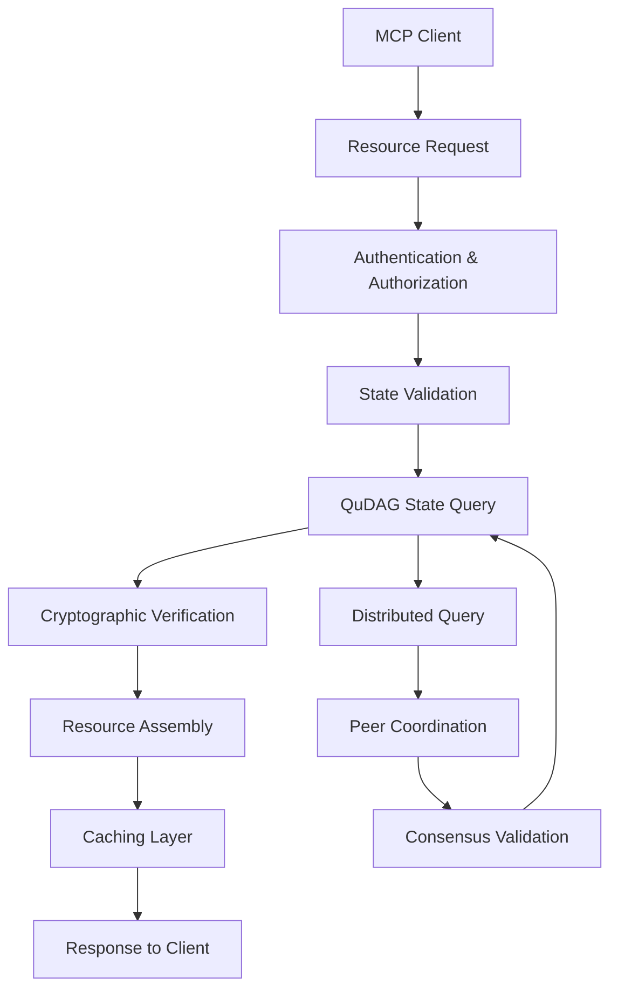
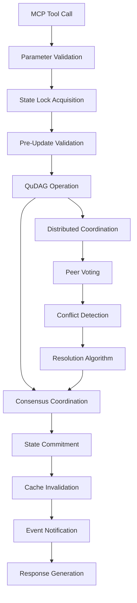

# MCP-QuDAG Data Flow and State Management Analysis

## Executive Summary

This document provides a comprehensive analysis of data flow patterns and state management strategies for integrating QuDAG's quantum-resistant distributed system with the Model Context Protocol (MCP). The analysis addresses the unique challenges of maintaining consistency, security, and performance across distributed quantum-resistant operations while conforming to MCP's resource and tool paradigms.

## QuDAG State Architecture Overview

### 1. Core State Components

#### DAG Consensus State
- **Vertex States**: Pending → Accepted → Finalized → Archived
- **Consensus Voting**: Real-time voting rounds with QR-Avalanche algorithm
- **Tip Selection**: Dynamic tip sets with probabilistic selection
- **Conflict Resolution**: Automatic detection and resolution of conflicting vertices

#### Cryptographic State
- **Key Material**: ML-KEM/ML-DSA key pairs with lifecycle management
- **Signature Chains**: Hierarchical signature validation trees
- **Entropy Pools**: Hardware-backed random number generation
- **Certificate Stores**: Quantum-resistant certificate hierarchies

#### Network State
- **Peer Connections**: Dynamic P2P topology with reputation management
- **Dark Addressing**: Distributed DNS with quantum-resistant proofs
- **Shadow Routing**: Ephemeral anonymous routing paths
- **NAT Traversal**: Connection upgrade and relay management

#### Vault State
- **Secret Storage**: DAG-backed encrypted secret management
- **Access Control**: Time-based and usage-based permissions
- **Backup Management**: Distributed backup with redundancy
- **Audit Trails**: Immutable access and modification logs

### 2. State Distribution Patterns

```typescript
interface QuDAGStateDistribution {
  // Local node state (immediate consistency)
  local_state: {
    consensus_cache: Map<VertexId, ConsensusStatus>;
    network_topology: PeerConnectionMap;
    crypto_material: KeyStore;
    vault_cache: SecretCache;
  };
  
  // Distributed state (eventual consistency)
  distributed_state: {
    dag_consensus: GlobalDAGState;
    peer_reputation: ReputationMatrix;
    dark_dns: DistributedDNSState;
    vault_replicas: VaultReplicationState;
  };
  
  // Ephemeral state (session-based)
  ephemeral_state: {
    active_connections: ConnectionPool;
    pending_operations: OperationQueue;
    shadow_addresses: ShadowAddressPool;
    temp_keys: TemporaryKeyMaterial;
  };
}
```

## MCP State Integration Challenges

### 1. Consistency Models

#### Strong Consistency Requirements
- **Cryptographic Operations**: Key generation, signing, and verification must be atomic
- **Consensus Finality**: Once finalized, DAG vertices cannot be modified
- **Access Control**: Vault permissions must be immediately effective

#### Eventual Consistency Tolerance
- **Peer Reputation**: Reputation scores can propagate gradually
- **Network Topology**: Connection metadata can be eventually consistent
- **Monitoring Data**: Performance metrics and statistics

#### Conflict Resolution Strategies
- **Last-Writer-Wins**: For non-critical metadata updates
- **Consensus-Based**: For critical state changes via DAG consensus
- **User-Mediated**: For semantic conflicts requiring human intervention

### 2. State Synchronization Patterns

#### Real-Time Synchronization
```typescript
interface RealtimeSync {
  event_type: "vertex_added" | "consensus_changed" | "peer_connected";
  source_node: NodeId;
  timestamp: number;
  state_delta: StateDelta;
  cryptographic_proof: Signature;
  consensus_round?: number;
}
```

#### Batch Synchronization
```typescript
interface BatchSync {
  sync_id: string;
  batch_timestamp: number;
  state_snapshot: StateSnapshot;
  merkle_root: Hash;
  validation_proofs: ValidationProof[];
  compression_info: CompressionMetadata;
}
```

#### Incremental Synchronization
```typescript
interface IncrementalSync {
  base_version: number;
  target_version: number;
  delta_operations: StateOperation[];
  dependency_graph: OperationDependencies;
  rollback_data: RollbackInformation;
}
```

## Data Flow Architecture

### 1. MCP Resource Data Flow

#### Resource Creation Flow


#### Resource Update Flow


### 2. State Consistency Guarantees

#### Read Consistency Levels

**Linearizable Reads**
- Use case: Critical security operations, consensus queries
- Implementation: Query majority of nodes, validate consensus
- Latency: High (multi-node coordination required)
- Guarantee: Reads reflect all committed writes

**Sequential Consistency**
- Use case: Normal DAG operations, peer information
- Implementation: Local cache with versioning, periodic sync
- Latency: Medium (occasional remote validation)
- Guarantee: Reads respect causal ordering

**Eventual Consistency**
- Use case: Monitoring data, statistics, reputation scores
- Implementation: Local cache with background synchronization
- Latency: Low (local cache access)
- Guarantee: Eventually reflects all updates

#### Write Consistency Patterns

**Consensus-Based Writes**
```typescript
interface ConsensusWrite {
  operation: StateOperation;
  consensus_options: {
    require_finality: boolean;
    timeout_ms: number;
    min_confirmations: number;
  };
  rollback_strategy: "auto" | "manual" | "none";
}
```

**Atomic Multi-Node Writes**
```typescript
interface AtomicWrite {
  coordinator_node: NodeId;
  participant_nodes: NodeId[];
  prepare_phase: PrepareOperation[];
  commit_phase: CommitOperation[];
  abort_phase: AbortOperation[];
  timeout_ms: number;
}
```

**Eventually Consistent Writes**
```typescript
interface EventualWrite {
  operation: StateOperation;
  propagation_strategy: "gossip" | "broadcast" | "epidemic";
  conflict_resolution: ConflictResolutionPolicy;
  max_propagation_delay_ms: number;
}
```

### 3. Data Transformation Layers

#### QuDAG to MCP Transformation

**State Extraction**
```typescript
interface StateExtractor {
  extractDAGState(vertex_filter?: VertexFilter): DAGResourceSet;
  extractNetworkState(peer_filter?: PeerFilter): NetworkResourceSet;
  extractCryptoState(key_filter?: KeyFilter): CryptoResourceSet;
  extractVaultState(access_context: AccessContext): VaultResourceSet;
}
```

**Resource Serialization**
```typescript
interface ResourceSerializer {
  serializeVertex(vertex: DAGVertex): MCPResource;
  serializePeer(peer: NetworkPeer): MCPResource;
  serializeKeyPair(keypair: CryptoKeyPair): MCPResource;
  serializeSecret(secret: VaultSecret, access_level: AccessLevel): MCPResource;
}
```

**Metadata Enrichment**
```typescript
interface MetadataEnricher {
  addSecurityMetadata(resource: MCPResource): EnrichedResource;
  addPerformanceMetadata(resource: MCPResource): EnrichedResource;
  addConsensusMetadata(resource: MCPResource): EnrichedResource;
  addNetworkMetadata(resource: MCPResource): EnrichedResource;
}
```

#### MCP to QuDAG Transformation

**Operation Translation**
```typescript
interface OperationTranslator {
  translateToolCall(tool_call: MCPToolCall): QuDAGOperation[];
  translateResourceUpdate(update: MCPResourceUpdate): QuDAGStateChange;
  translateSubscription(subscription: MCPSubscription): QuDAGEventFilter;
}
```

**Parameter Validation**
```typescript
interface ParameterValidator {
  validateCryptoParameters(params: CryptoToolParams): ValidationResult;
  validateDAGParameters(params: DAGToolParams): ValidationResult;
  validateNetworkParameters(params: NetworkToolParams): ValidationResult;
  validateVaultParameters(params: VaultToolParams): ValidationResult;
}
```

**Security Context Mapping**
```typescript
interface SecurityMapper {
  mapMCPIdentity(mcp_identity: MCPIdentity): QuDAGIdentity;
  mapPermissions(mcp_permissions: MCPPermissions): QuDAGPermissions;
  mapSecurityLevel(mcp_context: MCPContext): QuDAGSecurityLevel;
}
```

## State Persistence and Recovery

### 1. Persistent State Management

#### DAG State Persistence
```typescript
interface DAGPersistence {
  // Immutable vertex storage
  vertex_store: {
    storage_engine: "rocksdb" | "leveldb" | "custom";
    compression: "lz4" | "zstd" | "none";
    encryption: "aes-256-gcm" | "chacha20-poly1305";
    sharding_strategy: "hash" | "range" | "timestamp";
  };
  
  // Consensus state tracking
  consensus_store: {
    voting_records: VotingHistory;
    finality_checkpoints: FinalityCheckpoints;
    conflict_resolutions: ConflictHistory;
  };
  
  // Index structures for efficient querying
  indices: {
    vertex_by_timestamp: TemporalIndex;
    vertex_by_parent: ParentIndex;
    consensus_by_status: StatusIndex;
  };
}
```

#### Network State Persistence
```typescript
interface NetworkPersistence {
  // Peer relationship data
  peer_store: {
    connection_history: ConnectionLog;
    reputation_scores: ReputationDatabase;
    trust_relationships: TrustGraph;
  };
  
  // Dark addressing data
  dark_dns_store: {
    domain_records: DomainDatabase;
    ownership_proofs: ProofDatabase;
    expiration_tracking: ExpirationQueue;
  };
  
  // Routing information
  routing_store: {
    path_cache: RoutingCache;
    latency_measurements: LatencyDatabase;
    bandwidth_statistics: BandwidthMetrics;
  };
}
```

#### Cryptographic State Persistence
```typescript
interface CryptoPersistence {
  // Key material storage (encrypted)
  key_store: {
    private_keys: EncryptedKeyDatabase;
    public_keys: PublicKeyCache;
    key_derivation_chains: DerivationTrees;
  };
  
  // Signature and verification data
  signature_store: {
    signature_cache: SignatureDatabase;
    verification_history: VerificationLog;
    certificate_chains: CertificateStore;
  };
  
  // Entropy and randomness
  entropy_store: {
    entropy_pools: EntropyDatabase;
    random_state: RandomNumberState;
    hardware_attestations: AttestationLog;
  };
}
```

### 2. State Recovery Mechanisms

#### Crash Recovery
```typescript
interface CrashRecovery {
  recovery_strategy: "wal" | "snapshot" | "hybrid";
  
  write_ahead_log: {
    log_format: "binary" | "json" | "protobuf";
    sync_policy: "sync" | "async" | "batch";
    corruption_detection: "checksum" | "merkle" | "ecc";
  };
  
  snapshot_policy: {
    snapshot_interval_ops: number;
    snapshot_compression: boolean;
    incremental_snapshots: boolean;
  };
  
  recovery_verification: {
    integrity_checks: boolean;
    consensus_validation: boolean;
    cryptographic_verification: boolean;
  };
}
```

#### Network Partition Recovery
```typescript
interface PartitionRecovery {
  partition_detection: {
    heartbeat_timeout_ms: number;
    consensus_timeout_ms: number;
    peer_threshold: number;
  };
  
  partition_handling: {
    strategy: "halt" | "continue" | "split-brain-protection";
    quorum_requirements: QuorumConfiguration;
    conflict_resolution: ConflictResolutionStrategy;
  };
  
  merge_protocol: {
    state_reconciliation: ReconciliationAlgorithm;
    conflict_detection: ConflictDetectionRules;
    merge_validation: MergeValidationRules;
  };
}
```

#### Data Corruption Recovery
```typescript
interface CorruptionRecovery {
  corruption_detection: {
    hash_verification: boolean;
    signature_validation: boolean;
    consensus_validation: boolean;
    redundancy_checking: boolean;
  };
  
  recovery_sources: {
    local_backups: BackupConfiguration;
    peer_recovery: PeerRecoveryProtocol;
    distributed_reconstruction: ReconstructionAlgorithm;
  };
  
  recovery_validation: {
    data_integrity: IntegrityValidation;
    consensus_consistency: ConsensusValidation;
    cryptographic_validity: CryptographicValidation;
  };
}
```

## Real-Time State Synchronization

### 1. Event-Driven Synchronization

#### State Change Events
```typescript
interface StateChangeEvent {
  event_id: string;
  event_type: "vertex_added" | "consensus_updated" | "peer_connected" | "key_generated";
  source_node: NodeId;
  timestamp: number;
  
  // Event-specific data
  event_data: {
    dag_events?: {
      vertex_id: VertexId;
      consensus_status: ConsensusStatus;
      parent_vertices: VertexId[];
    };
    
    network_events?: {
      peer_id: PeerId;
      connection_status: ConnectionStatus;
      reputation_change: ReputationDelta;
    };
    
    crypto_events?: {
      key_id: KeyId;
      operation_type: CryptoOperation;
      security_level: SecurityLevel;
    };
    
    vault_events?: {
      entry_id: EntryId;
      access_type: AccessType;
      user_context: UserContext;
    };
  };
  
  // Synchronization metadata
  sync_metadata: {
    causality_vector: CausalityVector;
    dependency_set: EventId[];
    ordering_constraints: OrderingConstraints;
  };
  
  // Security proofs
  security_proof: {
    event_signature: Signature;
    integrity_hash: Hash;
    timestamp_proof: TimestampProof;
  };
}
```

#### Event Propagation Strategies

**Epidemic Propagation**
```typescript
interface EpidemicPropagation {
  infection_rate: number;
  recovery_rate: number;
  gossip_fanout: number;
  propagation_rounds: number;
  
  anti_entropy: {
    sync_interval_ms: number;
    merkle_tree_comparison: boolean;
    delta_compression: boolean;
  };
}
```

**Structured Propagation**
```typescript
interface StructuredPropagation {
  overlay_topology: "tree" | "mesh" | "ring" | "hypercube";
  routing_algorithm: RoutingAlgorithm;
  failure_handling: FailureHandlingStrategy;
  
  quality_of_service: {
    priority_levels: number;
    bandwidth_allocation: BandwidthPolicy;
    latency_requirements: LatencyConstraints;
  };
}
```

### 2. Subscription Management

#### MCP Subscription to QuDAG Events
```typescript
interface MCPSubscriptionManager {
  // Subscription registration
  registerSubscription(
    pattern: ResourcePattern,
    client_id: ClientId,
    options: SubscriptionOptions
  ): SubscriptionId;
  
  // Event filtering and transformation
  filterEvents(
    events: StateChangeEvent[],
    subscription: Subscription
  ): MCPEvent[];
  
  // Delivery management
  deliverEvents(
    client_id: ClientId,
    events: MCPEvent[]
  ): Promise<DeliveryResult>;
  
  // Subscription lifecycle
  updateSubscription(
    subscription_id: SubscriptionId,
    updates: SubscriptionUpdates
  ): void;
  
  unregisterSubscription(
    subscription_id: SubscriptionId
  ): void;
}
```

#### Event Delivery Guarantees
```typescript
interface DeliveryGuarantees {
  delivery_semantics: "at-most-once" | "at-least-once" | "exactly-once";
  ordering_guarantees: "none" | "per-source" | "global" | "causal";
  reliability_level: "best-effort" | "reliable" | "persistent";
  
  failure_handling: {
    retry_policy: RetryPolicy;
    dead_letter_queue: boolean;
    circuit_breaker: CircuitBreakerConfig;
  };
  
  flow_control: {
    backpressure_handling: BackpressureStrategy;
    buffer_limits: BufferConfiguration;
    rate_limiting: RateLimitingPolicy;
  };
}
```

## Performance Optimization

### 1. Caching Strategies

#### Multi-Level Caching
```typescript
interface CacheHierarchy {
  l1_cache: {
    type: "memory";
    capacity_mb: number;
    eviction_policy: "lru" | "lfu" | "arc";
    ttl_ms: number;
  };
  
  l2_cache: {
    type: "ssd";
    capacity_gb: number;
    compression: boolean;
    encryption: boolean;
  };
  
  l3_cache: {
    type: "distributed";
    replication_factor: number;
    consistency_level: "weak" | "eventual" | "strong";
  };
}
```

#### Cache Coherence Protocol
```typescript
interface CacheCoherence {
  coherence_protocol: "mesi" | "moesi" | "dragon" | "custom";
  
  invalidation_strategy: {
    push_based: boolean;
    pull_based: boolean;
    lease_based: boolean;
  };
  
  consistency_model: {
    sequential_consistency: boolean;
    causal_consistency: boolean;
    eventual_consistency: boolean;
  };
  
  conflict_resolution: {
    timestamp_ordering: boolean;
    vector_clocks: boolean;
    consensus_based: boolean;
  };
}
```

### 2. State Compression and Optimization

#### State Representation Optimization
```typescript
interface StateOptimization {
  compression_algorithms: {
    vertex_data: "lz4" | "zstd" | "brotli";
    consensus_data: "delta" | "snapshot" | "hybrid";
    network_data: "bitmap" | "sparse" | "dense";
  };
  
  index_optimization: {
    bloom_filters: boolean;
    skip_lists: boolean;
    b_plus_trees: boolean;
    lsm_trees: boolean;
  };
  
  memory_optimization: {
    object_pooling: boolean;
    zero_copy_operations: boolean;
    memory_mapping: boolean;
    lazy_loading: boolean;
  };
}
```

#### Delta Synchronization
```typescript
interface DeltaSynchronization {
  delta_computation: {
    algorithm: "xdelta" | "bsdiff" | "custom";
    granularity: "field" | "object" | "collection";
    compression: boolean;
  };
  
  delta_application: {
    atomic_application: boolean;
    rollback_support: boolean;
    verification: boolean;
  };
  
  conflict_resolution: {
    three_way_merge: boolean;
    operational_transform: boolean;
    consensus_based: boolean;
  };
}
```

## Security and Privacy Considerations

### 1. State Security

#### Data Protection
```typescript
interface DataProtection {
  encryption_at_rest: {
    algorithm: "aes-256-gcm" | "chacha20-poly1305" | "ml-kem";
    key_management: KeyManagementPolicy;
    perfect_forward_secrecy: boolean;
  };
  
  encryption_in_transit: {
    protocol: "tls-1.3" | "noise" | "quantum-resistant";
    certificate_validation: CertificatePolicy;
    quantum_resistance: boolean;
  };
  
  access_control: {
    authentication: AuthenticationMethods;
    authorization: AuthorizationPolicies;
    audit_logging: AuditConfiguration;
  };
}
```

#### Privacy Protection
```typescript
interface PrivacyProtection {
  data_minimization: {
    collection_limitation: boolean;
    purpose_limitation: boolean;
    retention_limits: RetentionPolicies;
  };
  
  anonymization: {
    k_anonymity: number;
    l_diversity: boolean;
    differential_privacy: DifferentialPrivacyParams;
  };
  
  metadata_protection: {
    traffic_analysis_resistance: boolean;
    timing_attack_protection: boolean;
    size_obfuscation: boolean;
  };
}
```

### 2. Consensus Security

#### Byzantine Fault Tolerance
```typescript
interface ByzantineFaultTolerance {
  fault_model: "crash" | "byzantine" | "adversarial";
  fault_threshold: number; // f < n/3 for byzantine
  
  detection_mechanisms: {
    invalid_signatures: boolean;
    conflicting_votes: boolean;
    timing_anomalies: boolean;
  };
  
  recovery_strategies: {
    view_change: boolean;
    checkpoint_recovery: boolean;
    state_transfer: boolean;
  };
}
```

#### Cryptographic Integrity
```typescript
interface CryptographicIntegrity {
  integrity_mechanisms: {
    merkle_trees: boolean;
    hash_chains: boolean;
    digital_signatures: boolean;
  };
  
  non_repudiation: {
    signature_requirements: SignatureRequirements;
    timestamp_authorities: TimestampConfiguration;
    audit_trails: AuditTrailConfiguration;
  };
  
  forward_security: {
    key_evolution: boolean;
    signature_chaining: boolean;
    state_commitment: boolean;
  };
}
```

## Implementation Guidelines

### 1. State Management Implementation

```typescript
class QuDAGMCPStateManager {
  private dag_state: DAGStateStore;
  private network_state: NetworkStateStore;
  private crypto_state: CryptoStateStore;
  private vault_state: VaultStateStore;
  
  private consistency_manager: ConsistencyManager;
  private synchronization_manager: SynchronizationManager;
  private cache_manager: CacheManager;
  private event_manager: EventManager;
  
  async getResource(uri: string, options?: GetOptions): Promise<MCPResource> {
    // Parse URI and determine state source
    const resource_type = this.parseResourceType(uri);
    const consistency_level = options?.consistency_level || "eventual";
    
    // Check cache first
    const cached = await this.cache_manager.get(uri, consistency_level);
    if (cached && !this.isStale(cached, consistency_level)) {
      return cached;
    }
    
    // Query appropriate state store
    const state_data = await this.queryStateStore(resource_type, uri);
    
    // Transform to MCP resource
    const resource = await this.transformToMCPResource(state_data);
    
    // Update cache
    await this.cache_manager.set(uri, resource);
    
    return resource;
  }
  
  async updateState(operation: StateOperation): Promise<void> {
    // Validate operation
    await this.validateOperation(operation);
    
    // Acquire necessary locks
    const locks = await this.consistency_manager.acquireLocks(operation);
    
    try {
      // Execute operation
      const result = await this.executeOperation(operation);
      
      // Propagate changes
      await this.synchronization_manager.propagateChanges(result);
      
      // Invalidate cache
      await this.cache_manager.invalidate(operation.affected_resources);
      
      // Notify subscribers
      await this.event_manager.notifySubscribers(result.events);
      
    } finally {
      // Release locks
      await this.consistency_manager.releaseLocks(locks);
    }
  }
  
  subscribeToChanges(pattern: string, callback: EventCallback): SubscriptionId {
    return this.event_manager.subscribe(pattern, callback);
  }
}
```

### 2. Error Handling and Recovery

```typescript
class StateRecoveryManager {
  async detectInconsistency(): Promise<InconsistencyReport> {
    const local_state = await this.getLocalState();
    const peer_states = await this.getPeerStates();
    
    return this.compareStates(local_state, peer_states);
  }
  
  async recoverFromInconsistency(
    report: InconsistencyReport
  ): Promise<RecoveryResult> {
    switch (report.inconsistency_type) {
      case "consensus_divergence":
        return this.recoverConsensusState(report);
      case "network_partition":
        return this.recoverFromPartition(report);
      case "data_corruption":
        return this.recoverCorruptedData(report);
      default:
        throw new Error(`Unknown inconsistency type: ${report.inconsistency_type}`);
    }
  }
  
  private async recoverConsensusState(
    report: InconsistencyReport
  ): Promise<RecoveryResult> {
    // Implement consensus recovery logic
    const majority_state = this.determineMajorityState(report.peer_states);
    await this.reconcileToMajority(majority_state);
    return { success: true, recovery_method: "consensus_reconciliation" };
  }
}
```

## Conclusion

The MCP-QuDAG data flow and state management analysis reveals a complex but manageable integration challenge. Key findings include:

### 1. Critical Success Factors

**Consistency Management**
- Multi-level consistency guarantees based on operation criticality
- Consensus-based coordination for critical state changes
- Efficient caching with appropriate invalidation strategies

**Security Integration**
- End-to-end quantum-resistant cryptographic protection
- Fine-grained access control with cryptographic proofs
- Comprehensive audit trails with non-repudiation

**Performance Optimization**
- Multi-tier caching with intelligent prefetching
- Delta synchronization for efficient state propagation
- Batching and compression for network efficiency

### 2. Implementation Recommendations

**Phased Deployment**
1. Basic state management with eventual consistency
2. Real-time synchronization for critical operations
3. Advanced optimization and security features
4. Production hardening and monitoring

**Architecture Patterns**
- Event-sourcing for auditability and recovery
- CQRS for read/write separation and optimization
- Saga pattern for distributed transaction management
- Circuit breaker pattern for fault tolerance

**Monitoring and Observability**
- Comprehensive metrics for all state operations
- Distributed tracing across node boundaries
- Real-time alerting for consistency violations
- Performance profiling and optimization guidance

The integration of QuDAG's quantum-resistant distributed state with MCP's resource and tool paradigms provides a robust foundation for secure, scalable, and high-performance distributed applications while maintaining the unique security and consistency guarantees that make QuDAG valuable in post-quantum computing environments.