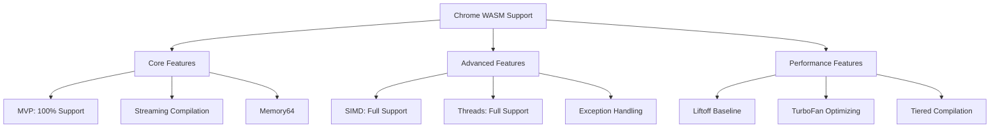
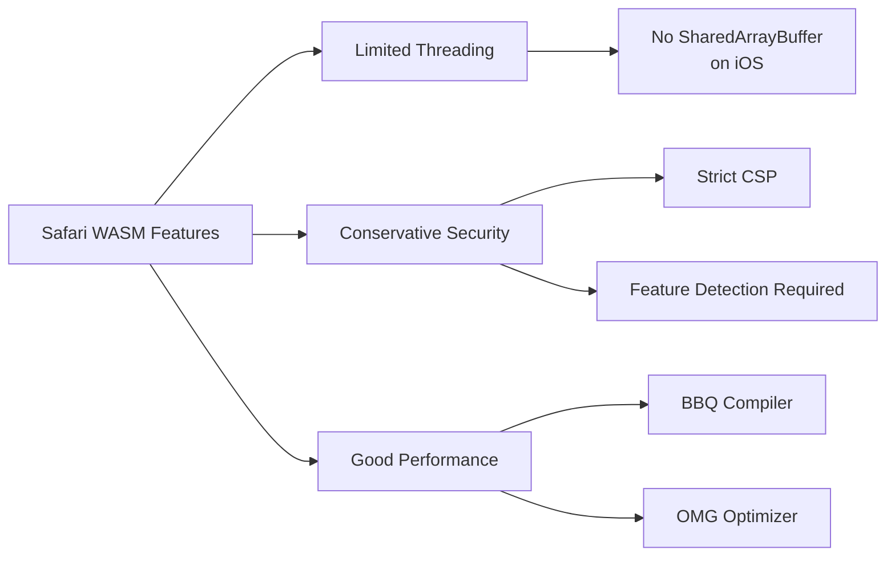
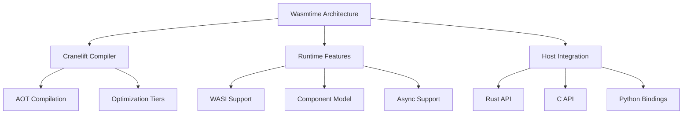
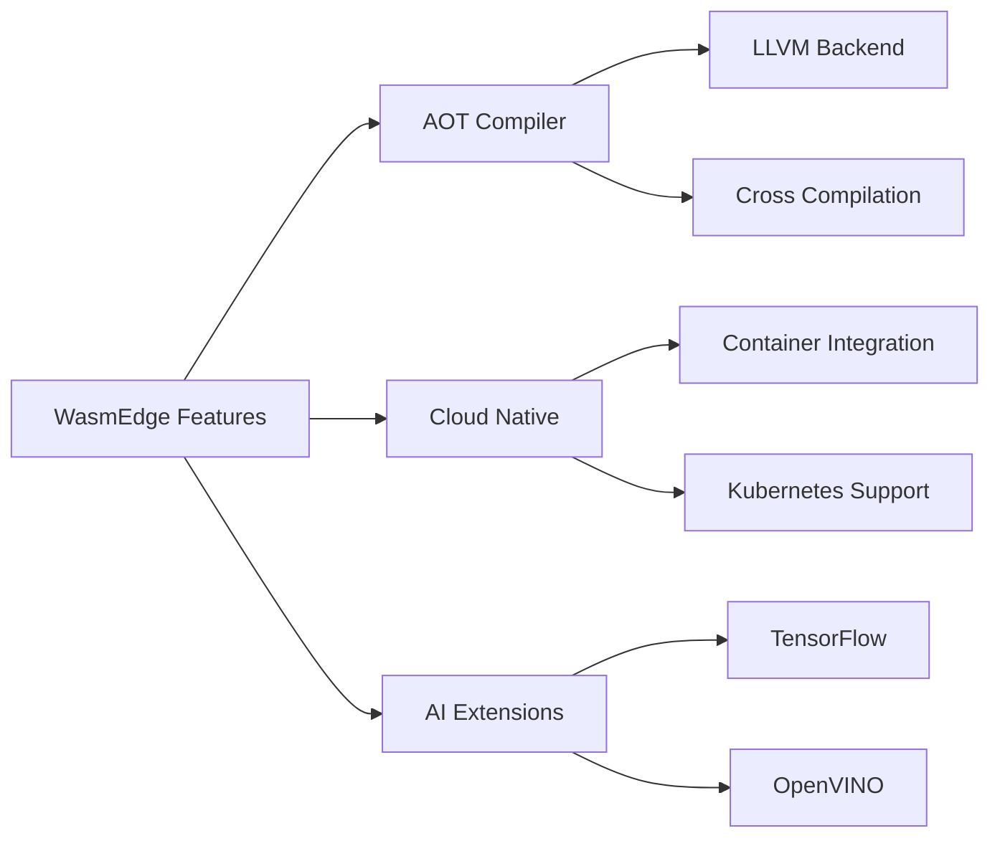
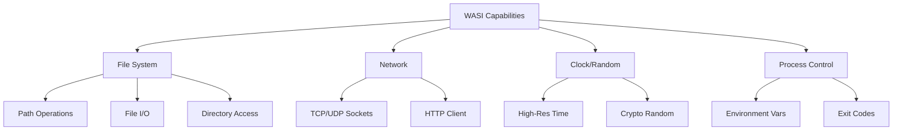
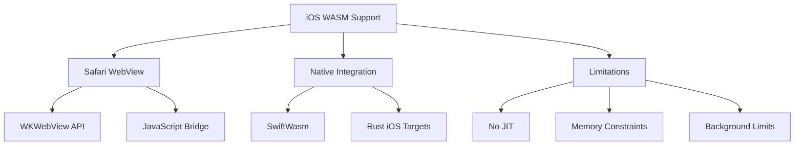
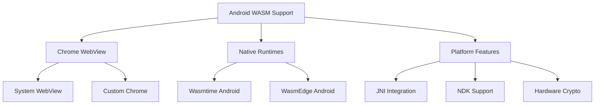
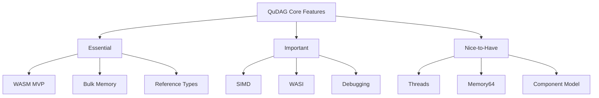
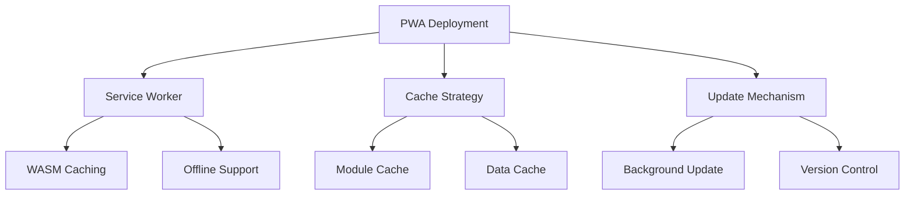

# Cross-Platform Support Matrix for QuDAG WASM Implementation

## Table of Contents
1. [Executive Overview](#executive-overview)
2. [Browser Environment Analysis](#browser-environment-analysis)
3. [Server-Side WASM Runtimes](#server-side-wasm-runtimes)
4. [Native Integration via WASI](#native-integration-via-wasi)
5. [Mobile Platform Considerations](#mobile-platform-considerations)
6. [Feature Compatibility Matrix](#feature-compatibility-matrix)
7. [Platform-Specific Optimizations](#platform-specific-optimizations)
8. [Deployment Strategies](#deployment-strategies)
9. [Testing and Validation Framework](#testing-and-validation-framework)
10. [Recommendations and Best Practices](#recommendations-and-best-practices)

## Executive Overview

QuDAG's vision of a universal, secure vault system demands exceptional cross-platform compatibility. WebAssembly emerges as the ideal technology to achieve this goal, offering consistent execution across browsers, servers, native applications, and mobile devices. This document provides a comprehensive analysis of platform support, identifying capabilities, limitations, and optimization opportunities for each target environment.

The cross-platform landscape for WASM has matured significantly, with robust support across all major browsers, multiple production-ready server-side runtimes, and emerging mobile solutions. By understanding the nuances of each platform, QuDAG can leverage platform-specific features while maintaining a consistent core implementation.

## Browser Environment Analysis

### Chrome/Chromium (V8 Engine)



#### Chrome Capabilities for QuDAG

**Strengths:**
- **Compilation Performance**: Liftoff baseline compiler provides fast startup
- **Optimization**: TurboFan creates highly optimized code for hot paths
- **SIMD Support**: Full 128-bit SIMD with all proposed instructions
- **Threading**: SharedArrayBuffer and Atomics fully supported
- **Memory**: 4GB memory limit (2GB on 32-bit systems)
- **DevTools**: Excellent debugging and profiling capabilities

**Limitations:**
- **Memory Growth**: Cannot shrink memory once grown
- **Module Size**: Soft limit of 1GB for module size
- **Stack Size**: Limited to 1MB by default

**QuDAG-Specific Optimizations:**
```javascript
// Chrome-optimized initialization
const memory = new WebAssembly.Memory({
    initial: 256, // 16MB initial
    maximum: 16384, // 1GB maximum
    shared: true // Enable threading
});

const module = await WebAssembly.instantiateStreaming(
    fetch('qudag.wasm'),
    {
        env: {
            memory,
            // Chrome-specific crypto acceleration
            crypto_accelerate: window.crypto.subtle
        }
    }
);
```

### Firefox (SpiderMonkey Engine)

#### Firefox Capabilities for QuDAG

**Strengths:**
- **Baseline Compiler**: Fast Ion baseline compiler
- **Cranelift Integration**: Optional Cranelift backend for better optimization
- **Debugging**: Superior source-level debugging support
- **SIMD**: Complete SIMD support with auto-vectorization
- **Security**: Strong same-origin policy enforcement

**Limitations:**
- **Memory Limit**: 2GB on 32-bit, 4GB on 64-bit
- **Threading**: More conservative SharedArrayBuffer policies
- **Module Caching**: Less aggressive than Chrome

**Platform-Specific Code:**
```javascript
// Firefox-specific optimizations
if (navigator.userAgent.includes('Firefox')) {
    // Use Firefox's superior debugging capabilities
    WebAssembly.Module.exports(module).forEach(exp => {
        console.debug(`QuDAG Export: ${exp.name}`);
    });
    
    // Adjust memory allocation strategy
    const firefoxMemory = new WebAssembly.Memory({
        initial: 128, // Conservative start
        maximum: 8192, // 512MB limit for stability
        shared: typeof SharedArrayBuffer !== 'undefined'
    });
}
```

### Safari (JavaScriptCore Engine)



#### Safari Capabilities for QuDAG

**Strengths:**
- **Performance**: B3 JIT provides excellent optimization
- **Integration**: Tight integration with WebKit
- **Power Efficiency**: Optimized for battery life
- **Security**: Stringent security model

**Limitations:**
- **Threading**: No SharedArrayBuffer on iOS (security concerns)
- **SIMD**: Partial support, missing some instructions
- **Memory**: More conservative memory limits
- **Feature Lag**: Slower to adopt new proposals

**Safari Workarounds:**
```javascript
// Safari compatibility layer
const isSafari = /^((?!chrome|android).)*safari/i.test(navigator.userAgent);

if (isSafari) {
    // Fallback for missing SharedArrayBuffer
    if (typeof SharedArrayBuffer === 'undefined') {
        // Use single-threaded implementation
        importObject.env.threading_mode = 'single';
    }
    
    // Adjust SIMD usage
    importObject.env.simd_level = detectSafariSIMDSupport();
}
```

### Edge (Chromium-based)

#### Edge Capabilities for QuDAG

**Strengths:**
- **Chrome Parity**: Nearly identical to Chrome capabilities
- **Enterprise Features**: Enhanced security policies
- **Windows Integration**: Better OS-level integration
- **Hardware Acceleration**: DirectX integration possibilities

**Unique Features:**
- **Secure Mode**: Enhanced sandboxing options
- **Enterprise Policies**: Centralized configuration
- **Diagnostic Tools**: Windows-specific profiling

## Server-Side WASM Runtimes

### Wasmtime



#### Wasmtime Capabilities for QuDAG

**Strengths:**
- **Performance**: Cranelift produces highly optimized native code
- **WASI**: Complete WASI preview1 support
- **Safety**: Memory safety guarantees with Rust
- **Debugging**: Excellent debugging support with DWARF
- **Async**: Native async/await support

**Configuration for QuDAG:**
```rust
// Wasmtime configuration for QuDAG
use wasmtime::*;

let mut config = Config::new();
config.wasm_simd(true);
config.wasm_threads(true);
config.wasm_memory64(true);
config.cranelift_opt_level(OptLevel::Speed);
config.allocation_strategy(InstanceAllocationStrategy::Pooling({
    let mut pooling = PoolingAllocationConfig::default();
    pooling.instance_count(1000);
    pooling.instance_memory_pages(65536); // 4GB per instance
    pooling
}));

let engine = Engine::new(&config)?;
```

### Wasmer

#### Wasmer Capabilities for QuDAG

**Strengths:**
- **Multiple Backends**: Cranelift, LLVM, Singlepass
- **Language Support**: Excellent multi-language support
- **Packaging**: WAPM package manager
- **Edge Computing**: Wasmer Edge platform
- **ABI Stability**: Stable ABI for plugins

**Optimization Strategy:**
```rust
// Wasmer configuration for QuDAG
use wasmer::{Store, Module, Instance};
use wasmer_compiler_llvm::LLVM;

let compiler = LLVM::new()
    .opt_level(LLVMOptLevel::Aggressive)
    .enable_simd(true)
    .enable_threads(true);

let store = Store::new_with_compiler(compiler);

// Custom memory configuration
let memory_type = MemoryType::new(
    Pages(256),    // 16MB initial
    Some(Pages(16384)), // 1GB maximum
    true           // shared
);
```

### WasmEdge



#### WasmEdge Capabilities for QuDAG

**Strengths:**
- **Performance**: LLVM-based AOT compilation
- **Cloud Native**: Container and orchestration support
- **Extensions**: Rich plugin ecosystem
- **Networking**: Advanced networking capabilities
- **Security**: SELinux and AppArmor integration

**Deployment Configuration:**
```yaml
# WasmEdge deployment for QuDAG
apiVersion: v1
kind: ConfigMap
metadata:
  name: wasmedge-qudag-config
data:
  config.toml: |
    [runtime]
    simd = true
    threads = true
    memory_limit = "1GB"
    
    [compiler]
    optimization_level = 3
    enable_aot = true
    
    [plugins]
    crypto_acceleration = true
    wasi_nn = false
```

## Native Integration via WASI

### WASI Capability Analysis



### WASI Implementation for QuDAG

#### File System Integration
```rust
// WASI file system access for QuDAG vault storage
use wasi::*;

pub struct VaultStorage {
    base_path: String,
}

impl VaultStorage {
    pub fn init() -> Result<Self, Errno> {
        // Check WASI capabilities
        let prestat = unsafe { fd_prestat_get(3)? };
        
        match prestat.tag {
            PREOPENTYPE_DIR => {
                let mut path_buf = vec![0u8; prestat.u.dir.pr_name_len];
                unsafe {
                    fd_prestat_dir_name(3, path_buf.as_mut_ptr(), path_buf.len())?;
                }
                
                Ok(Self {
                    base_path: String::from_utf8_lossy(&path_buf).to_string(),
                })
            }
            _ => Err(ERRNO_BADF),
        }
    }
    
    pub fn store_encrypted(&self, key: &str, data: &[u8]) -> Result<(), Errno> {
        let path = format!("{}/vault/{}.enc", self.base_path, key);
        let fd = unsafe {
            path_open(
                3,
                LOOKUPFLAGS_SYMLINK_FOLLOW,
                path.as_ptr(),
                path.len(),
                OFLAGS_CREAT | OFLAGS_TRUNC,
                RIGHTS_FD_WRITE | RIGHTS_FD_SYNC,
                RIGHTS_FD_WRITE,
                FDFLAGS_SYNC,
            )?
        };
        
        let iovec = [Ciovec {
            buf: data.as_ptr(),
            buf_len: data.len(),
        }];
        
        unsafe {
            fd_write(fd, &iovec)?;
            fd_sync(fd)?;
            fd_close(fd)?;
        }
        
        Ok(())
    }
}
```

#### Network Capabilities
```rust
// WASI networking for distributed QuDAG
pub struct NetworkSync {
    socket_fd: Fd,
}

impl NetworkSync {
    pub async fn connect_peer(&mut self, addr: &str) -> Result<(), Errno> {
        // WASI socket operations
        let sock = unsafe {
            sock_open(ADDRESSFAMILY_INET4, SOCKTYPE_STREAM, 0)?
        };
        
        // Parse address
        let addr_parts: Vec<&str> = addr.split(':').collect();
        let ip = parse_ipv4(addr_parts[0])?;
        let port = addr_parts[1].parse::<u16>().map_err(|_| ERRNO_INVAL)?;
        
        let sockaddr = Sockaddr {
            family: ADDRESSFAMILY_INET4,
            addr: ip,
            port,
        };
        
        unsafe {
            sock_connect(sock, &sockaddr)?;
        }
        
        self.socket_fd = sock;
        Ok(())
    }
}
```

## Mobile Platform Considerations

### iOS Platform Analysis



#### iOS Implementation Strategy

**WebView Approach:**
```swift
// iOS WebView integration for QuDAG
import WebKit

class QuDAGWebView: WKWebView {
    private var qudag: WKUserContentController
    
    init() {
        let config = WKWebViewConfiguration()
        
        // Enable WASM
        config.preferences.setValue(true, forKey: "allowFileAccessFromFileURLs")
        config.setValue(true, forKey: "allowUniversalAccessFromFileURLs")
        
        // Memory configuration
        config.processPool = WKProcessPool()
        config.websiteDataStore = .nonPersistent()
        
        self.qudag = WKUserContentController()
        config.userContentController = self.qudag
        
        super.init(frame: .zero, configuration: config)
        
        // Load QuDAG WASM module
        loadQuDAGModule()
    }
    
    private func loadQuDAGModule() {
        let script = """
        (async function() {
            const memory = new WebAssembly.Memory({
                initial: 64, // 4MB - iOS conservative
                maximum: 1024 // 64MB limit
            });
            
            const module = await WebAssembly.instantiate(
                QUDAG_WASM_BYTES,
                { env: { memory } }
            );
            
            window.qudag = module.instance.exports;
        })();
        """
        
        let userScript = WKUserScript(
            source: script,
            injectionTime: .atDocumentStart,
            forMainFrameOnly: true
        )
        qudag.addUserScript(userScript)
    }
}
```

**Native Approach (Experimental):**
```rust
// Using wasm3 or wasmtime for iOS
#[cfg(target_os = "ios")]
pub mod ios {
    use wasm3::{Environment, Module};
    
    pub struct QuDAGiOS {
        env: Environment,
        module: Module,
    }
    
    impl QuDAGiOS {
        pub fn new() -> Result<Self, Box<dyn Error>> {
            let env = Environment::new()?;
            let runtime = env.create_runtime(1024 * 1024)?; // 1MB stack
            
            let module = Module::parse(&env, include_bytes!("qudag.wasm"))?;
            runtime.load_module(module)?;
            
            Ok(Self { env, module })
        }
    }
}
```

### Android Platform Analysis



#### Android Implementation

**WebView Integration:**
```kotlin
// Android WebView for QuDAG
class QuDAGWebView(context: Context) : WebView(context) {
    
    init {
        settings.apply {
            javaScriptEnabled = true
            domStorageEnabled = true
            allowFileAccess = true
            
            // Enable WASM
            setMediaPlaybackRequiresUserGesture(false)
            mixedContentMode = WebSettings.MIXED_CONTENT_COMPATIBILITY_MODE
        }
        
        // Add JavaScript interface
        addJavascriptInterface(QuDAGInterface(), "QuDAGAndroid")
        
        // Load WASM module
        loadUrl("file:///android_asset/qudag.html")
    }
    
    inner class QuDAGInterface {
        @JavascriptInterface
        fun storeSecret(key: String, value: String): Boolean {
            return try {
                // Android Keystore integration
                val keystore = KeyStore.getInstance("AndroidKeyStore")
                keystore.load(null)
                
                // Encrypt with hardware backing
                val cipher = Cipher.getInstance("AES/GCM/NoPadding")
                cipher.init(Cipher.ENCRYPT_MODE, getOrCreateKey(key))
                
                val encrypted = cipher.doFinal(value.toByteArray())
                saveToStorage(key, encrypted)
                
                true
            } catch (e: Exception) {
                false
            }
        }
    }
}
```

**Native Integration (JNI):**
```cpp
// JNI wrapper for QuDAG WASM
#include <jni.h>
#include <wasmtime.h>

extern "C" {
    JNIEXPORT jlong JNICALL
    Java_com_qudag_wasm_QuDAGNative_initializeVault(
        JNIEnv* env, 
        jobject /* this */,
        jint memory_pages
    ) {
        wasm_config_t* config = wasm_config_new();
        wasmtime_config_wasm_threads_set(config, true);
        wasmtime_config_wasm_simd_set(config, true);
        
        wasm_engine_t* engine = wasm_engine_new_with_config(config);
        wasmtime_store_t* store = wasmtime_store_new(engine, NULL, NULL);
        
        wasmtime_context_t* context = wasmtime_store_context(store);
        
        // Load QuDAG module
        wasm_byte_vec_t wasm;
        load_file("qudag.wasm", &wasm);
        
        wasmtime_module_t* module = NULL;
        wasmtime_module_new(engine, &wasm, &module);
        
        // Return handle
        return reinterpret_cast<jlong>(store);
    }
}
```

## Feature Compatibility Matrix

### Comprehensive Feature Support Table

| Feature | Chrome | Firefox | Safari | Edge | Wasmtime | Wasmer | WasmEdge | iOS | Android |
|---------|--------|---------|--------|------|----------|---------|----------|-----|---------|
| **Core WASM MVP** | ✅ | ✅ | ✅ | ✅ | ✅ | ✅ | ✅ | ✅ | ✅ |
| **SIMD** | ✅ | ✅ | ⚠️ | ✅ | ✅ | ✅ | ✅ | ⚠️ | ✅ |
| **Threads** | ✅ | ✅ | ❌ | ✅ | ✅ | ✅ | ✅ | ❌ | ✅ |
| **Memory64** | ✅ | ✅ | ❌ | ✅ | ✅ | ✅ | ✅ | ❌ | ⚠️ |
| **Exception Handling** | ✅ | ✅ | ⚠️ | ✅ | ✅ | ✅ | ✅ | ⚠️ | ✅ |
| **Tail Calls** | ⚠️ | ⚠️ | ❌ | ⚠️ | ✅ | ⚠️ | ✅ | ❌ | ⚠️ |
| **Reference Types** | ✅ | ✅ | ✅ | ✅ | ✅ | ✅ | ✅ | ✅ | ✅ |
| **Multi-Value** | ✅ | ✅ | ✅ | ✅ | ✅ | ✅ | ✅ | ✅ | ✅ |
| **Bulk Memory** | ✅ | ✅ | ✅ | ✅ | ✅ | ✅ | ✅ | ✅ | ✅ |
| **WASI Preview 1** | ❌ | ❌ | ❌ | ❌ | ✅ | ✅ | ✅ | ⚠️ | ⚠️ |
| **Component Model** | ❌ | ❌ | ❌ | ❌ | ⚠️ | ❌ | ❌ | ❌ | ❌ |
| **Memory Growth** | 4GB | 4GB | 1GB | 4GB | ♾️ | ♾️ | ♾️ | 1GB | 2GB |
| **Module Size Limit** | 1GB | 1GB | 512MB | 1GB | ♾️ | ♾️ | ♾️ | 256MB | 512MB |
| **Debugging Support** | ✅ | ✅ | ⚠️ | ✅ | ✅ | ✅ | ✅ | ⚠️ | ✅ |

Legend:
- ✅ Full support
- ⚠️ Partial support or requires workarounds
- ❌ Not supported
- ♾️ No practical limit

### QuDAG Feature Requirements



## Platform-Specific Optimizations

### Browser Optimizations

```javascript
// Platform detection and optimization
class QuDAGPlatformOptimizer {
    constructor() {
        this.platform = this.detectPlatform();
        this.capabilities = this.detectCapabilities();
    }
    
    detectPlatform() {
        const ua = navigator.userAgent;
        if (ua.includes('Chrome')) return 'chrome';
        if (ua.includes('Firefox')) return 'firefox';
        if (ua.includes('Safari')) return 'safari';
        if (ua.includes('Edge')) return 'edge';
        return 'unknown';
    }
    
    detectCapabilities() {
        return {
            simd: typeof WebAssembly.validate === 'function' && 
                  WebAssembly.validate(new Uint8Array([
                      0x00, 0x61, 0x73, 0x6d, 0x01, 0x00, 0x00, 0x00,
                      0x01, 0x05, 0x01, 0x60, 0x00, 0x01, 0x7b
                  ])),
            threads: typeof SharedArrayBuffer !== 'undefined',
            bigInt: typeof BigInt !== 'undefined',
            streaming: typeof WebAssembly.instantiateStreaming === 'function'
        };
    }
    
    getOptimalConfig() {
        const config = {
            memory: {
                initial: 256,  // 16MB default
                maximum: 16384 // 1GB default
            },
            compiler: 'default',
            features: []
        };
        
        switch (this.platform) {
            case 'chrome':
                config.memory.initial = 512;  // 32MB
                config.compiler = 'turbofan';
                if (this.capabilities.simd) config.features.push('simd');
                if (this.capabilities.threads) config.features.push('threads');
                break;
                
            case 'firefox':
                config.memory.initial = 256;  // Conservative
                config.compiler = 'ion';
                if (this.capabilities.simd) config.features.push('simd');
                break;
                
            case 'safari':
                config.memory.initial = 128;  // Very conservative
                config.memory.maximum = 8192; // 512MB limit
                config.compiler = 'bbq';
                break;
        }
        
        return config;
    }
}
```

### Server Runtime Optimizations

```rust
// Server-side optimization framework
pub struct RuntimeOptimizer {
    runtime: RuntimeType,
    cpu_features: CpuFeatures,
}

#[derive(Debug)]
pub enum RuntimeType {
    Wasmtime,
    Wasmer,
    WasmEdge,
}

impl RuntimeOptimizer {
    pub fn new() -> Self {
        Self {
            runtime: detect_runtime(),
            cpu_features: detect_cpu_features(),
        }
    }
    
    pub fn optimize_for_qudag(&self) -> OptimizationConfig {
        match self.runtime {
            RuntimeType::Wasmtime => {
                OptimizationConfig {
                    compiler_flags: vec![
                        "--opt-level=speed_and_size",
                        "--enable-simd",
                        "--enable-parallel-compilation",
                    ],
                    memory_config: MemoryConfig {
                        guard_size: 2 << 20, // 2MB guard pages
                        static_memory_maximum_size: Some(1 << 30), // 1GB
                        static_memory_guard_size: 2 << 20,
                        dynamic_memory_guard_size: 65536,
                    },
                    features: self.cpu_features.to_wasm_features(),
                }
            },
            RuntimeType::Wasmer => {
                OptimizationConfig {
                    compiler_flags: vec![
                        "--llvm-opt-level=3",
                        "--enable-verifier",
                        "--backend-parallel-compilation",
                    ],
                    memory_config: MemoryConfig {
                        guard_size: 4 << 20, // 4MB guard pages
                        static_memory_maximum_size: None,
                        static_memory_guard_size: 4 << 20,
                        dynamic_memory_guard_size: 131072,
                    },
                    features: self.cpu_features.to_wasm_features(),
                }
            },
            RuntimeType::WasmEdge => {
                OptimizationConfig {
                    compiler_flags: vec![
                        "--optimize=3",
                        "--enable-all-statistics",
                        "--enable-aot",
                    ],
                    memory_config: MemoryConfig {
                        guard_size: 1 << 20, // 1MB guard pages
                        static_memory_maximum_size: Some(2 << 30), // 2GB
                        static_memory_guard_size: 1 << 20,
                        dynamic_memory_guard_size: 32768,
                    },
                    features: self.cpu_features.to_wasm_features(),
                }
            }
        }
    }
}
```

## Deployment Strategies

### Progressive Web App Deployment



```javascript
// Service Worker for QuDAG PWA
self.addEventListener('install', async (event) => {
    event.waitUntil(
        caches.open('qudag-v1').then(async (cache) => {
            // Cache WASM module
            await cache.add('/qudag.wasm');
            // Cache supporting files
            await cache.addAll([
                '/',
                '/index.html',
                '/qudag-loader.js',
                '/qudag-worker.js'
            ]);
        })
    );
});

self.addEventListener('fetch', (event) => {
    if (event.request.url.endsWith('.wasm')) {
        event.respondWith(
            caches.match(event.request).then((response) => {
                if (response) {
                    // Validate WASM module hash
                    return response.clone().arrayBuffer().then(async (buffer) => {
                        const hash = await crypto.subtle.digest('SHA-256', buffer);
                        if (validateHash(hash)) {
                            return response;
                        }
                        // Re-fetch if hash mismatch
                        return fetch(event.request);
                    });
                }
                return fetch(event.request);
            })
        );
    }
});
```

### Container Deployment

```dockerfile
# Multi-stage Dockerfile for QuDAG
FROM rust:1.70 as builder

# Build QuDAG WASM module
WORKDIR /build
COPY . .
RUN cargo build --target wasm32-wasi --release

# Runtime stage with WasmEdge
FROM wasmedge/wasmedge:latest

# Copy WASM module
COPY --from=builder /build/target/wasm32-wasi/release/qudag.wasm /app/

# Install WasmEdge plugins
RUN wasmedge plugin install wasicrypto

# Runtime configuration
ENV WASMEDGE_PLUGIN_PATH=/usr/local/lib/wasmedge
ENV WASMEDGE_CONF_FILE=/app/wasmedge.toml

# Copy configuration
COPY wasmedge.toml /app/

EXPOSE 8080

CMD ["wasmedge", "--reactor", "/app/qudag.wasm"]
```

### Edge Deployment

```yaml
# Cloudflare Workers deployment
name: qudag-vault
type: webpack
account_id: YOUR_ACCOUNT_ID
workers_dev: true
routes:
  - pattern: "vault.example.com/*"
    zone_id: YOUR_ZONE_ID

[build]
command = "npm run build"
watch_paths = ["src/**/*.rs"]

[build.upload]
format = "modules"
main = "./worker.mjs"

[[build.upload.rules]]
type = "CompiledWasm"
globs = ["**/*.wasm"]

[env.production]
kv_namespaces = [
  { binding = "VAULT_STORE", id = "YOUR_KV_ID" }
]

[wasm_modules]
QUDAG_WASM = "build/qudag.wasm"
```

## Testing and Validation Framework

### Cross-Platform Test Suite

```typescript
// Comprehensive cross-platform test framework
export class QuDAGCrossPlatformTests {
    private platforms: Platform[] = [
        new ChromePlatform(),
        new FirefoxPlatform(),
        new SafariPlatform(),
        new WasmtimePlatform(),
        new MobilePlatform()
    ];
    
    async runCompatibilityTests(): Promise<TestResults> {
        const results = new TestResults();
        
        for (const platform of this.platforms) {
            console.log(`Testing on ${platform.name}...`);
            
            // Feature detection tests
            results.addResult(
                platform.name,
                'features',
                await this.testFeatureSupport(platform)
            );
            
            // Performance benchmarks
            results.addResult(
                platform.name,
                'performance',
                await this.testPerformance(platform)
            );
            
            // Memory limits
            results.addResult(
                platform.name,
                'memory',
                await this.testMemoryLimits(platform)
            );
            
            // Cryptographic operations
            results.addResult(
                platform.name,
                'crypto',
                await this.testCryptoOperations(platform)
            );
        }
        
        return results;
    }
    
    private async testFeatureSupport(platform: Platform): Promise<FeatureTestResult> {
        const features = {
            simd: await platform.testSIMD(),
            threads: await platform.testThreads(),
            memory64: await platform.testMemory64(),
            exceptions: await platform.testExceptions(),
            wasi: await platform.testWASI()
        };
        
        return new FeatureTestResult(features);
    }
    
    private async testPerformance(platform: Platform): Promise<PerformanceResult> {
        const benchmarks = {
            sha256: await platform.benchmarkSHA256(),
            aes256: await platform.benchmarkAES256(),
            dagInsert: await platform.benchmarkDAGInsert(),
            dagQuery: await platform.benchmarkDAGQuery()
        };
        
        return new PerformanceResult(benchmarks);
    }
}
```

### Continuous Integration Configuration

```yaml
# GitHub Actions for cross-platform testing
name: Cross-Platform WASM Tests

on: [push, pull_request]

jobs:
  browser-tests:
    runs-on: ubuntu-latest
    strategy:
      matrix:
        browser: [chrome, firefox, safari]
    steps:
      - uses: actions/checkout@v3
      - uses: actions/setup-node@v3
      - name: Build WASM Module
        run: |
          cargo install wasm-pack
          wasm-pack build --target web
      
      - name: Run Browser Tests
        uses: microsoft/playwright-github-action@v1
        with:
          browsers: ${{ matrix.browser }}
      
      - name: Execute Tests
        run: npm test -- --browser=${{ matrix.browser }}
  
  runtime-tests:
    runs-on: ubuntu-latest
    strategy:
      matrix:
        runtime: [wasmtime, wasmer, wasmedge]
    steps:
      - uses: actions/checkout@v3
      - name: Install Runtime
        run: |
          case ${{ matrix.runtime }} in
            wasmtime) curl -sSf https://wasmtime.dev/install.sh | bash ;;
            wasmer) curl -sSfL https://get.wasmer.io | sh ;;
            wasmedge) curl -sSf https://raw.githubusercontent.com/WasmEdge/WasmEdge/master/utils/install.sh | bash ;;
          esac
      
      - name: Run Runtime Tests
        run: cargo test --features ${{ matrix.runtime }}
  
  mobile-tests:
    strategy:
      matrix:
        platform: [ios, android]
    runs-on: macos-latest
    steps:
      - uses: actions/checkout@v3
      - name: Setup Mobile Environment
        run: |
          if [ "${{ matrix.platform }}" = "ios" ]; then
            xcode-select --install
            brew install ios-sim
          else
            brew install android-sdk
          fi
      
      - name: Build and Test
        run: ./scripts/test-mobile.sh ${{ matrix.platform }}
```

## Recommendations and Best Practices

### Architecture Recommendations

1. **Feature Detection First**
   - Always detect capabilities at runtime
   - Provide graceful fallbacks
   - Use progressive enhancement

2. **Memory Management**
   - Start with conservative allocations
   - Monitor growth patterns
   - Implement memory pressure responses

3. **Platform-Specific Builds**
   - Create optimized builds per platform
   - Use conditional compilation
   - Minimize module size for mobile

### Implementation Best Practices

```rust
// Platform abstraction layer
pub trait PlatformCapabilities {
    fn has_simd(&self) -> bool;
    fn has_threads(&self) -> bool;
    fn max_memory(&self) -> usize;
    fn optimal_worker_count(&self) -> usize;
}

pub struct QuDAGRuntime {
    capabilities: Box<dyn PlatformCapabilities>,
    crypto_backend: CryptoBackend,
    dag_engine: DAGEngine,
}

impl QuDAGRuntime {
    pub fn new() -> Result<Self, Error> {
        let capabilities = detect_platform_capabilities()?;
        
        let crypto_backend = if capabilities.has_simd() {
            CryptoBackend::SIMD
        } else {
            CryptoBackend::Scalar
        };
        
        let dag_engine = if capabilities.has_threads() {
            DAGEngine::Parallel(capabilities.optimal_worker_count())
        } else {
            DAGEngine::Sequential
        };
        
        Ok(Self {
            capabilities,
            crypto_backend,
            dag_engine,
        })
    }
}
```

### Testing Strategy

1. **Unit Tests**: Platform-agnostic core logic
2. **Integration Tests**: Platform-specific features
3. **E2E Tests**: Full deployment scenarios
4. **Performance Tests**: Platform benchmarks
5. **Security Tests**: Platform-specific vulnerabilities

### Deployment Checklist

- [ ] Feature detection implemented
- [ ] Fallbacks for missing features
- [ ] Memory limits respected
- [ ] Platform-specific optimizations applied
- [ ] Security policies configured
- [ ] Performance benchmarks passing
- [ ] Documentation updated
- [ ] CI/CD pipelines configured

## Conclusion

QuDAG's cross-platform WASM implementation represents a significant engineering challenge that requires careful consideration of each target platform's capabilities and limitations. By following the recommendations in this document, the QuDAG team can build a robust, performant, and truly universal vault system that works seamlessly across browsers, servers, native applications, and mobile devices.

The key to success lies in:
- Comprehensive feature detection and graceful degradation
- Platform-specific optimizations without compromising portability
- Rigorous testing across all target environments
- Continuous monitoring and optimization based on real-world usage

With WASM as the foundation, QuDAG can achieve its vision of a secure, distributed vault system that works everywhere, providing users with consistent functionality regardless of their chosen platform.