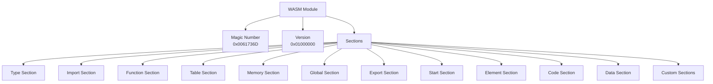
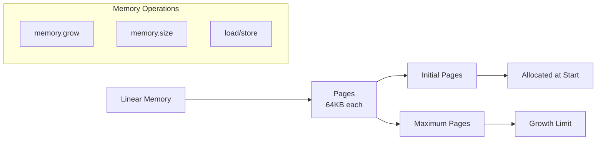
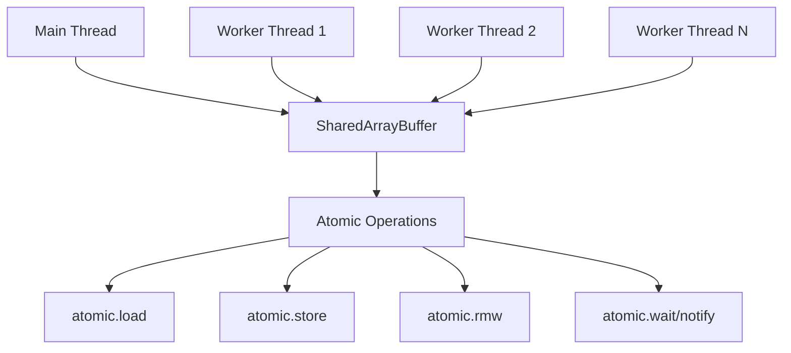
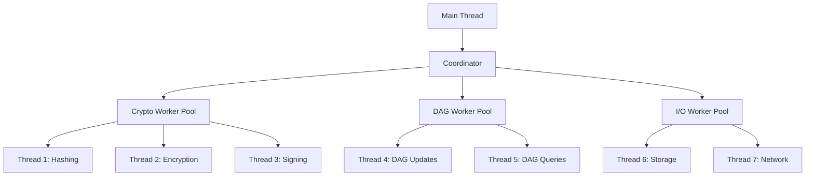
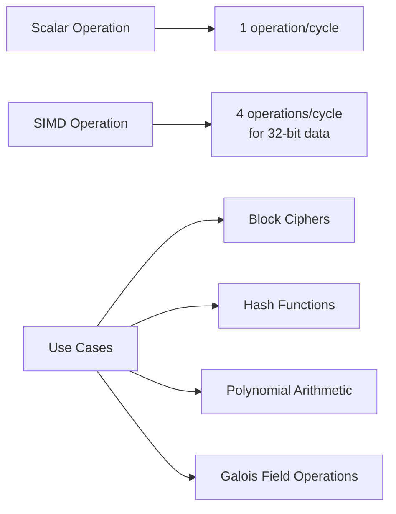
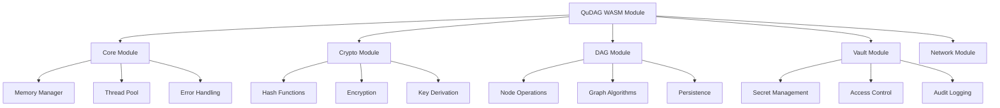
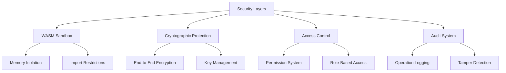
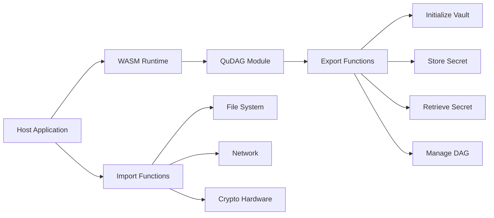
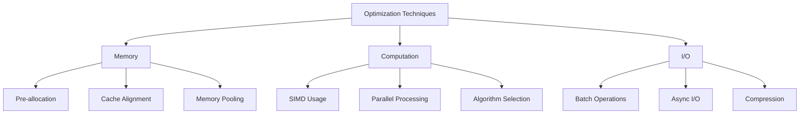

# WASM Architecture Overview for QuDAG Implementation

## Table of Contents
1. [Executive Summary](#executive-summary)
2. [WASM Binary Format and Module Structure](#wasm-binary-format-and-module-structure)
3. [Memory Management in WASM](#memory-management-in-wasm)
4. [Threading and Atomics Capabilities](#threading-and-atomics-capabilities)
5. [SIMD Operations for Cryptography](#simd-operations-for-cryptography)
6. [QuDAG-Specific Architecture Considerations](#qudag-specific-architecture-considerations)
7. [Security Model and Sandboxing](#security-model-and-sandboxing)
8. [Integration Patterns](#integration-patterns)
9. [Performance Optimization Strategies](#performance-optimization-strategies)
10. [Recommendations for QuDAG Implementation](#recommendations-for-qudag-implementation)

## Executive Summary

WebAssembly (WASM) represents a revolutionary approach to portable, high-performance computing that aligns perfectly with QuDAG's goals of creating a secure, distributed vault system. This document provides a comprehensive analysis of WASM architecture fundamentals and their specific application to the QuDAG ecosystem.

The QuDAG system, with its emphasis on cryptographic operations, DAG-based storage, and cross-platform compatibility, can leverage WASM's unique capabilities to achieve near-native performance while maintaining the security and portability requirements essential for a distributed vault system. Through careful architectural design, we can utilize WASM's sandboxed execution environment, efficient memory model, and emerging parallel processing capabilities to create a robust foundation for QuDAG's cross-platform deployment.

## WASM Binary Format and Module Structure

### Binary Format Overview

WebAssembly's binary format is designed for compactness, fast decoding, and streaming compilation. The format consists of a magic number (0x00 0x61 0x73 0x6D) followed by a version number (currently 0x01 0x00 0x00 0x00) and a sequence of sections.



### Module Structure Details

#### Type Section (ID: 1)
The type section declares all function signatures used in the module. For QuDAG, this would include signatures for cryptographic operations, DAG manipulation functions, and vault management routines:

- Cryptographic primitives: `(func (param i32 i32 i32) (result i32))`
- DAG operations: `(func (param i32) (result i32))`
- Vault operations: `(func (param i32 i32) (result i64))`

#### Import Section (ID: 2)
Imports allow WASM modules to interact with the host environment. For QuDAG, critical imports include:

- Memory allocation functions from the host
- Cryptographic accelerators (when available)
- File system access (through WASI)
- Network operations for distributed functionality

#### Function Section (ID: 3)
Associates function bodies with their type signatures. QuDAG's function section would map implementations to their cryptographic and DAG operation signatures.

#### Memory Section (ID: 5)
Defines linear memory segments. QuDAG requires careful memory layout planning:

```
Memory Layout for QuDAG:
0x0000 - 0x1000: Reserved for WASM runtime
0x1000 - 0x10000: Stack space
0x10000 - 0x20000: Heap for temporary allocations
0x20000 - 0x30000: Cryptographic working memory
0x30000 - 0x40000: DAG node cache
0x40000 - 0x50000: Vault metadata
0x50000+: Dynamic allocation space
```

### Custom Sections for QuDAG

Custom sections provide extensibility for QuDAG-specific metadata:

1. **Cryptographic Capabilities Section**: Declares supported algorithms and key sizes
2. **DAG Schema Section**: Defines the DAG structure and node formats
3. **Vault Configuration Section**: Contains vault initialization parameters

## Memory Management in WASM

### Linear Memory Model

WASM uses a linear memory model where memory is a contiguous, byte-addressable array. This model provides several advantages for QuDAG:

1. **Predictable Performance**: No garbage collection pauses
2. **Direct Control**: Manual memory management for cryptographic operations
3. **Security**: Clear boundaries and access patterns



### Memory Management Strategies for QuDAG

#### 1. Arena Allocation
For temporary cryptographic operations, implement arena allocators:

```
Arena Structure:
- Base pointer
- Current offset
- Maximum size
- Reset capability

Benefits:
- O(1) allocation
- Bulk deallocation
- Cache-friendly access patterns
```

#### 2. Object Pools
For frequently allocated/deallocated objects like DAG nodes:

```
Pool Configuration:
- Fixed-size blocks
- Free list management
- Pre-allocation on initialization
- Statistics tracking
```

#### 3. Memory-Mapped Structures
Directly map QuDAG structures to WASM memory:

```
DAG Node Layout (32 bytes):
Offset 0-16: Node hash (128-bit)
Offset 16-20: Parent count (32-bit)
Offset 20-24: Child count (32-bit)
Offset 24-28: Metadata pointer (32-bit)
Offset 28-32: Flags and version (32-bit)
```

### Memory Safety Considerations

1. **Bounds Checking**: WASM automatically performs bounds checking on all memory accesses
2. **Type Safety**: Strong typing prevents type confusion attacks
3. **Isolation**: Each WASM instance has its own memory space

## Threading and Atomics Capabilities

### WASM Threads Proposal

The WASM threads proposal introduces shared memory and atomic operations, enabling parallel processing crucial for QuDAG's performance:



### Atomic Operations for QuDAG

#### 1. Lock-Free Data Structures
Implement lock-free queues for DAG operations:

```
Atomic Operations Required:
- compare_exchange for CAS operations
- fetch_add for reference counting
- load/store with memory ordering
```

#### 2. Work Stealing Queues
For parallel cryptographic operations:

```
Queue Design:
- Local deque per worker
- Atomic steal operations
- Minimal contention
- Cache-line awareness
```

### Threading Architecture for QuDAG



### Synchronization Primitives

1. **Mutexes**: Implemented using atomics.wait/notify
2. **Semaphores**: For resource counting
3. **Barriers**: For phase synchronization
4. **Read-Write Locks**: For DAG access patterns

## SIMD Operations for Cryptography

### WASM SIMD Proposal

The SIMD proposal introduces 128-bit vector operations, providing significant performance improvements for cryptographic operations:



### SIMD Instructions for QuDAG

#### 1. Vector Arithmetic
- `i32x4.add`: Parallel addition for hash functions
- `i32x4.mul`: Multiplication for polynomial operations
- `i32x4.xor`: XOR operations for stream ciphers

#### 2. Shuffle and Permute
- `i8x16.shuffle`: Byte permutations for AES
- `i32x4.extract_lane`: Lane extraction for reductions

#### 3. Comparison and Selection
- `i32x4.eq`: Parallel comparisons
- `v128.bitselect`: Conditional moves without branches

### Cryptographic Algorithm Optimization

#### SHA-256 Optimization
```
SIMD Optimization Strategy:
1. Process 4 blocks in parallel
2. Use shuffle for message schedule
3. Vectorize round functions
4. Expected speedup: 2.5-3x
```

#### AES Optimization
```
SIMD Implementation:
1. Parallel SubBytes using lookup tables
2. ShiftRows via shuffle operations
3. MixColumns using polynomial multiplication
4. Expected speedup: 4-5x
```

#### Blake3 for DAG Hashing
```
Why Blake3 for QuDAG:
1. Inherently parallel design
2. SIMD-friendly operations
3. Incremental hashing capability
4. Excellent performance on WASM
```

## QuDAG-Specific Architecture Considerations

### Module Organization



### Component Interactions

1. **Crypto Module**: Provides all cryptographic primitives with SIMD optimization
2. **DAG Module**: Implements the directed acyclic graph with thread-safe operations
3. **Vault Module**: Manages secrets using the crypto and DAG modules
4. **Network Module**: Handles distributed operations with end-to-end encryption

### Memory Layout Strategy

```
Module Memory Allocation:
Core:    2MB  (0x000000 - 0x200000)
Crypto:  4MB  (0x200000 - 0x600000)
DAG:     8MB  (0x600000 - 0xE00000)
Vault:   2MB  (0xE00000 - 0x1000000)
Dynamic: Rest (0x1000000+)
```

## Security Model and Sandboxing

### WASM Security Guarantees

1. **Memory Isolation**: Each instance has separate memory
2. **Type Safety**: Prevents type confusion attacks
3. **Control Flow Integrity**: No arbitrary jumps
4. **Capability-Based Security**: Explicit imports only

### QuDAG Security Enhancements



### Threat Mitigation

1. **Side-Channel Attacks**: Constant-time implementations
2. **Memory Exhaustion**: Configurable limits
3. **Timing Attacks**: Normalized execution paths
4. **Fault Injection**: Redundant computations

## Integration Patterns

### Host Environment Integration



### API Design Principles

1. **Minimal Surface Area**: Export only necessary functions
2. **Type Safety**: Use typed arrays for data exchange
3. **Error Propagation**: Clear error codes and messages
4. **Async Support**: Promise-based APIs for long operations

### Language Bindings

```
JavaScript/TypeScript:
- Direct WASM instantiation
- Typed wrapper classes
- Async/await support

Rust:
- wasm-bindgen integration
- Direct memory sharing
- Zero-copy operations

Python:
- wasmtime-py bindings
- NumPy integration for crypto
- Async support via asyncio

Go:
- Wasmer-go integration
- Channel-based communication
- Goroutine compatibility
```

## Performance Optimization Strategies

### Compilation Optimization

1. **Link-Time Optimization (LTO)**: Whole-program optimization
2. **Dead Code Elimination**: Remove unused functions
3. **Function Inlining**: Reduce call overhead
4. **Loop Unrolling**: Maximize SIMD utilization

### Runtime Optimization



### Benchmarking Framework

```
Benchmark Categories:
1. Cryptographic Operations
   - Hash throughput
   - Encryption speed
   - Key derivation time

2. DAG Operations
   - Node insertion rate
   - Graph traversal speed
   - Persistence latency

3. Vault Operations
   - Secret storage time
   - Retrieval latency
   - Batch operation efficiency

4. Memory Usage
   - Peak allocation
   - Fragmentation rate
   - GC pressure (if applicable)
```

## Recommendations for QuDAG Implementation

### Phase 1: Foundation (Months 1-2)

1. **Core Module Development**
   - Implement memory management system
   - Create thread pool infrastructure
   - Establish error handling framework

2. **Basic Cryptography**
   - Port essential algorithms to WASM
   - Implement SIMD optimizations
   - Create benchmark suite

### Phase 2: DAG Implementation (Months 3-4)

1. **DAG Core**
   - Implement thread-safe node operations
   - Create persistence layer
   - Optimize graph algorithms

2. **Integration**
   - Connect crypto and DAG modules
   - Implement basic vault operations
   - Create test harness

### Phase 3: Advanced Features (Months 5-6)

1. **Distributed Capabilities**
   - Network protocol implementation
   - Consensus mechanisms
   - Replication strategies

2. **Performance Optimization**
   - Profile and optimize hot paths
   - Implement advanced SIMD usage
   - Fine-tune memory allocation

### Phase 4: Production Readiness (Months 7-8)

1. **Security Hardening**
   - Security audit
   - Fuzzing campaigns
   - Side-channel analysis

2. **Platform Integration**
   - Create language bindings
   - Build deployment tools
   - Documentation and examples

### Technical Stack Recommendations

```
Build Tools:
- Rust with wasm32-unknown-unknown target
- wasm-pack for JavaScript integration
- wasmtime for testing

Development Tools:
- Chrome DevTools for profiling
- wabt for binary analysis
- Binaryen for optimization

Testing Framework:
- Property-based testing
- Fuzzing with wasm-fuzzer
- Performance regression suite
```

### Best Practices

1. **Memory Management**
   - Use arena allocation for temporary data
   - Implement proper cleanup in all paths
   - Monitor memory growth

2. **Security**
   - Constant-time crypto implementations
   - Clear sensitive data after use
   - Validate all inputs

3. **Performance**
   - Profile before optimizing
   - Use SIMD where beneficial
   - Batch operations when possible

4. **Maintainability**
   - Comprehensive documentation
   - Extensive test coverage
   - Clear module boundaries

## Conclusion

WebAssembly provides an ideal foundation for implementing QuDAG's cross-platform vault system. Its combination of near-native performance, strong security guarantees, and excellent portability aligns perfectly with QuDAG's requirements. By leveraging WASM's binary format efficiency, linear memory model, emerging threading capabilities, and SIMD operations, we can create a high-performance, secure implementation that runs consistently across all platforms.

The architecture outlined in this document provides a roadmap for implementing QuDAG in WASM, with careful attention to performance optimization, security considerations, and practical deployment concerns. Following these recommendations will result in a robust, efficient, and maintainable implementation that can serve as the foundation for QuDAG's distributed vault ecosystem.