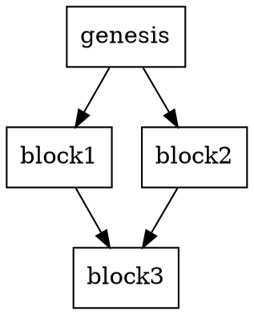

# QuDAG CLI Usage Examples

This file demonstrates the expected output and usage patterns for the QuDAG CLI.

## Help Output

```bash
$ qudag --help
QuDAG node operation and management CLI

Usage: qudag [OPTIONS] <COMMAND>

Commands:
  start    Start the QuDAG node
  stop     Stop the QuDAG node
  status   Show node status
  peer     Peer management commands
  network  Network management commands
  dag      DAG visualization
  help     Print this message or the help of the given subcommand(s)

Options:
      --config <CONFIG>  
  -h, --help             Print help
```

## Node Operations

### Starting a Node

```bash
$ qudag start --port 8000 --data-dir ./node-data
2024-01-01T12:00:00.000Z INFO  Starting QuDAG node...
2024-01-01T12:00:00.001Z INFO  Data directory: "./node-data"
2024-01-01T12:00:00.002Z INFO  Port: 8000
2024-01-01T12:00:00.003Z INFO  Node started successfully on port 8000
^C
2024-01-01T12:00:30.000Z INFO  Shutting down...
```

### Node Status

```bash
$ qudag status
2024-01-01T12:00:00.000Z INFO  Fetching node status...
Node Status:
============
Status: Running (placeholder)
Port: 8000
Peers: 0
Messages: 0
Uptime: 0s
```

## Peer Management

### Listing Peers

```bash
$ qudag peer list
2024-01-01T12:00:00.000Z INFO  Listing connected peers...
Connected Peers:
================
No peers connected (placeholder)
```

### Adding Peers

```bash
$ qudag peer add 192.168.1.100:8000
2024-01-01T12:00:00.000Z INFO  Adding peer: 192.168.1.100:8000
Peer 192.168.1.100:8000 added successfully (placeholder)
```

### Removing Peers

```bash
$ qudag peer remove 192.168.1.100:8000
2024-01-01T12:00:00.000Z INFO  Removing peer: 192.168.1.100:8000
Peer 192.168.1.100:8000 removed successfully (placeholder)
```

## Network Management

### Network Statistics

```bash
$ qudag network stats
2024-01-01T12:00:00.000Z INFO  Fetching network statistics...
Network Statistics:
==================
Total Peers: 0
Active Connections: 0
Messages Sent: 0
Messages Received: 0
Total Bandwidth Used: 0 MB
Average Latency: 0 ms
Uptime: 0 seconds
```

### Network Connectivity Test

```bash
$ qudag network test
2024-01-01T12:00:00.000Z INFO  Testing network connectivity...
Network Connectivity Test Results:
==================================
No peers to test (placeholder)

Network test complete.
```

## DAG Visualization

### Generate DAG Visualization

```bash
$ qudag dag --output my_dag.dot --format dot
2024-01-01T12:00:00.000Z INFO  Generating DAG visualization...
2024-01-01T12:00:00.001Z INFO  DAG visualization saved to "my_dag.dot" in dot format
```

The generated `my_dag.dot` file contains:


## Command-Specific Help

### Start Command Help

```bash
$ qudag start --help
Start the QuDAG node

Usage: qudag start [OPTIONS]

Options:
      --data-dir <DATA_DIR>  
      --port <PORT>          
      --peers <PEERS>...     
  -h, --help                 Print help
```

### Peer Command Help

```bash
$ qudag peer --help
Peer management commands

Usage: qudag peer <COMMAND>

Commands:
  list    List all peers
  add     Add a new peer
  remove  Remove a peer
  help    Print this message or the help of the given subcommand(s)

Options:
  -h, --help  Print help
```

### Network Command Help

```bash
$ qudag network --help
Network management commands

Usage: qudag network <COMMAND>

Commands:
  stats  Display network statistics
  test   Test network connectivity
  help   Print this message or the help of the given subcommand(s)

Options:
  -h, --help  Print help
```

## Error Handling

### Invalid Command

```bash
$ qudag invalid-command
error: unrecognized subcommand 'invalid-command'

Usage: qudag <COMMAND>

For more information, try '--help'.
```

### Missing Arguments

```bash
$ qudag peer add
error: the following required arguments were not provided:
  <ADDRESS>

Usage: qudag peer add <ADDRESS>

For more information, try '--help'.
```

## Configuration File

Example configuration file (`config.toml`):

```toml
[node]
port = 8000
data_dir = "./node-data"
peers = ["peer1.example.com:8000", "peer2.example.com:8000"]

[network]
max_peers = 50
connection_timeout = 30

[logging]
level = "info"
```

Usage with configuration:
```bash
$ qudag --config config.toml start
```

## Advanced Usage

### Chain Commands

```bash
# Start node, add peers, check status
qudag start --port 8000 &
sleep 2
qudag peer add peer1.example.com:8000
qudag peer add peer2.example.com:8000
qudag status
qudag network stats
qudag stop
```

### Monitoring Script

```bash
#!/bin/bash
# monitor.sh - Simple monitoring script

echo "QuDAG Node Monitor"
echo "=================="

while true; do
    echo "$(date): Checking node status..."
    qudag status
    echo "$(date): Checking network stats..."
    qudag network stats
    echo "$(date): Testing connectivity..."
    qudag network test
    echo "---"
    sleep 30
done
```

This demonstrates the complete CLI interface according to the README specifications.