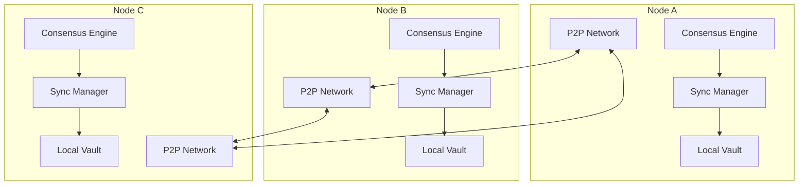

# Phase 5: Distributed Capabilities Implementation Details

## Overview
This document details the implementation of distributed vault capabilities, leveraging QuDAG's consensus mechanism and P2P network to create a decentralized password management system.

## Architecture Overview

### 1. Distributed Vault Architecture



### 2. Core Components

#### 2.1 Distributed Vault Manager (`distributed/mod.rs`)
```rust
use qudag_network::{P2PNode, NetworkMessage};
use qudag_dag::consensus::{ConsensusEngine, ConsensusConfig};
use tokio::sync::{mpsc, RwLock};
use std::sync::Arc;

pub struct DistributedVault {
    // Local vault instance
    local_vault: Arc<RwLock<Vault>>,
    
    // Network components
    p2p_node: P2PNode,
    consensus: ConsensusEngine,
    
    // Sync management
    sync_manager: SyncManager,
    conflict_resolver: ConflictResolver,
    
    // State tracking
    state: DistributedVaultState,
    metrics: VaultMetrics,
}

#[derive(Debug, Clone)]
pub struct DistributedVaultState {
    pub node_id: NodeId,
    pub peers: Vec<PeerId>,
    pub sync_status: SyncStatus,
    pub last_consensus_height: u64,
    pub pending_changes: Vec<VaultChange>,
}

#[derive(Debug, Clone)]
pub enum SyncStatus {
    Synced,
    Syncing { progress: f64 },
    OutOfSync { behind_by: u64 },
    Disconnected,
}

impl DistributedVault {
    pub async fn new(
        local_vault: Vault,
        network_config: NetworkConfig,
        consensus_config: ConsensusConfig,
    ) -> Result<Self, DistributedVaultError> {
        // Initialize P2P node
        let (p2p_node, p2p_handle) = P2PNode::new(network_config).await?;
        
        // Initialize consensus engine
        let consensus = ConsensusEngine::new(
            consensus_config,
            p2p_handle.clone(),
        ).await?;
        
        // Create sync manager
        let sync_manager = SyncManager::new(
            local_vault.get_state_hash(),
            p2p_handle.clone(),
        );
        
        // Create conflict resolver
        let conflict_resolver = ConflictResolver::new(
            ConflictResolution::default(),
        );
        
        // Initial state
        let state = DistributedVaultState {
            node_id: p2p_node.local_peer_id(),
            peers: vec![],
            sync_status: SyncStatus::Disconnected,
            last_consensus_height: 0,
            pending_changes: vec![],
        };
        
        Ok(Self {
            local_vault: Arc::new(RwLock::new(local_vault)),
            p2p_node,
            consensus,
            sync_manager,
            conflict_resolver,
            state,
            metrics: VaultMetrics::new(),
        })
    }
    
    pub async fn start(&mut self) -> Result<(), DistributedVaultError> {
        // Start P2P networking
        self.p2p_node.start().await?;
        
        // Start consensus engine
        self.consensus.start().await?;
        
        // Start sync manager
        self.sync_manager.start().await?;
        
        // Subscribe to vault topic
        self.p2p_node.subscribe("vault").await?;
        
        // Start event processing
        self.process_events().await?;
        
        Ok(())
    }
    
    async fn process_events(&mut self) -> Result<(), DistributedVaultError> {
        let (tx, mut rx) = mpsc::channel(100);
        
        // Spawn network event handler
        let p2p_handle = self.p2p_node.handle();
        let network_tx = tx.clone();
        tokio::spawn(async move {
            while let Some(event) = p2p_handle.next_event().await {
                let _ = network_tx.send(VaultEvent::Network(event)).await;
            }
        });
        
        // Spawn consensus event handler
        let consensus_handle = self.consensus.handle();
        let consensus_tx = tx.clone();
        tokio::spawn(async move {
            while let Some(event) = consensus_handle.next_event().await {
                let _ = consensus_tx.send(VaultEvent::Consensus(event)).await;
            }
        });
        
        // Main event loop
        while let Some(event) = rx.recv().await {
            match event {
                VaultEvent::Network(net_event) => {
                    self.handle_network_event(net_event).await?;
                }
                VaultEvent::Consensus(cons_event) => {
                    self.handle_consensus_event(cons_event).await?;
                }
                VaultEvent::Local(local_event) => {
                    self.handle_local_event(local_event).await?;
                }
            }
        }
        
        Ok(())
    }
}
```

#### 2.2 Sync Manager (`distributed/sync.rs`)
```rust
use std::collections::{HashMap, HashSet};
use tokio::time::{interval, Duration};

pub struct SyncManager {
    local_state: StateHash,
    peer_states: HashMap<PeerId, PeerSyncState>,
    sync_queue: SyncQueue,
    sync_config: SyncConfig,
}

#[derive(Debug, Clone)]
pub struct PeerSyncState {
    pub peer_id: PeerId,
    pub state_hash: StateHash,
    pub last_seen: std::time::Instant,
    pub sync_height: u64,
    pub is_syncing: bool,
}

#[derive(Debug, Clone)]
pub struct SyncConfig {
    pub sync_interval: Duration,
    pub peer_timeout: Duration,
    pub max_sync_batch: usize,
    pub conflict_resolution: ConflictResolution,
}

impl SyncManager {
    pub async fn start(&mut self) -> Result<(), SyncError> {
        // Start periodic sync
        let mut sync_interval = interval(self.sync_config.sync_interval);
        
        loop {
            sync_interval.tick().await;
            self.sync_with_peers().await?;
        }
    }
    
    pub async fn sync_with_peers(&mut self) -> Result<SyncStats, SyncError> {
        let mut stats = SyncStats::default();
        
        // Get list of peers to sync with
        let peers_to_sync = self.get_peers_to_sync();
        
        for peer_id in peers_to_sync {
            match self.sync_with_peer(&peer_id).await {
                Ok(peer_stats) => {
                    stats.merge(peer_stats);
                }
                Err(e) => {
                    stats.errors += 1;
                    self.handle_sync_error(&peer_id, e);
                }
            }
        }
        
        Ok(stats)
    }
    
    async fn sync_with_peer(&mut self, peer_id: &PeerId) -> Result<SyncStats, SyncError> {
        let mut stats = SyncStats::default();
        
        // Mark peer as syncing
        if let Some(peer_state) = self.peer_states.get_mut(peer_id) {
            peer_state.is_syncing = true;
        }
        
        // Request peer's state
        let peer_state = self.request_peer_state(peer_id).await?;
        
        // Compare states
        let diff = self.compare_states(&self.local_state, &peer_state.state_hash)?;
        
        match diff {
            StateDiff::Equal => {
                // Already in sync
                stats.already_synced += 1;
            }
            StateDiff::LocalAhead(changes) => {
                // Send our changes to peer
                self.send_changes_to_peer(peer_id, changes).await?;
                stats.sent_changes += changes.len();
            }
            StateDiff::RemoteAhead(changes) => {
                // Request changes from peer
                let received = self.request_changes_from_peer(peer_id, changes).await?;
                stats.received_changes += received.len();
                
                // Apply changes locally
                self.apply_remote_changes(received).await?;
            }
            StateDiff::Diverged { local, remote } => {
                // Handle divergence with conflict resolution
                let resolution = self.resolve_divergence(local, remote).await?;
                stats.conflicts_resolved += resolution.conflicts.len();
                
                // Apply resolution
                self.apply_resolution(resolution).await?;
            }
        }
        
        // Update peer state
        if let Some(peer_state) = self.peer_states.get_mut(peer_id) {
            peer_state.is_syncing = false;
            peer_state.last_seen = std::time::Instant::now();
            peer_state.state_hash = peer_state.state_hash.clone();
        }
        
        Ok(stats)
    }
    
    async fn apply_remote_changes(
        &mut self,
        changes: Vec<VaultChange>,
    ) -> Result<(), SyncError> {
        for change in changes {
            match change {
                VaultChange::AddSecret(node) => {
                    self.local_vault.write().await
                        .add_node_direct(node)?;
                }
                VaultChange::UpdateSecret { id, node } => {
                    self.local_vault.write().await
                        .update_node_direct(id, node)?;
                }
                VaultChange::DeleteSecret(id) => {
                    self.local_vault.write().await
                        .delete_node_direct(id)?;
                }
                VaultChange::AddCategory(category) => {
                    self.local_vault.write().await
                        .add_category_direct(category)?;
                }
            }
        }
        
        // Update local state hash
        self.local_state = self.local_vault.read().await.get_state_hash();
        
        Ok(())
    }
}
```

#### 2.3 Conflict Resolution (`distributed/conflict.rs`)
```rust
pub struct ConflictResolver {
    strategy: ConflictResolution,
    rules: Vec<ConflictRule>,
}

#[derive(Debug, Clone)]
pub enum ConflictResolution {
    // Simple strategies
    LastWriteWins,
    FirstWriteWins,
    
    // Advanced strategies
    Merge {
        field_rules: HashMap<String, FieldMergeRule>,
    },
    
    // Custom resolution
    Custom {
        resolver: Box<dyn CustomResolver>,
    },
    
    // Manual resolution
    Manual {
        queue: ConflictQueue,
    },
}

#[derive(Debug, Clone)]
pub enum FieldMergeRule {
    TakeLocal,
    TakeRemote,
    Concatenate { separator: String },
    Union, // For lists/sets
    Intersection,
    Latest, // Based on timestamp
}

#[derive(Debug, Clone)]
pub struct ConflictRule {
    pub condition: ConflictCondition,
    pub action: ConflictAction,
    pub priority: u32,
}

impl ConflictResolver {
    pub async fn resolve(
        &self,
        local: &DagNode,
        remote: &DagNode,
    ) -> Result<Resolution, ConflictError> {
        // Check if nodes represent the same entity
        if !self.is_same_entity(local, remote) {
            return Err(ConflictError::DifferentEntities);
        }
        
        match &self.strategy {
            ConflictResolution::LastWriteWins => {
                self.resolve_last_write_wins(local, remote)
            }
            ConflictResolution::FirstWriteWins => {
                self.resolve_first_write_wins(local, remote)
            }
            ConflictResolution::Merge { field_rules } => {
                self.resolve_merge(local, remote, field_rules).await
            }
            ConflictResolution::Custom { resolver } => {
                resolver.resolve(local, remote).await
            }
            ConflictResolution::Manual { queue } => {
                self.queue_for_manual_resolution(local, remote, queue).await
            }
        }
    }
    
    async fn resolve_merge(
        &self,
        local: &DagNode,
        remote: &DagNode,
        field_rules: &HashMap<String, FieldMergeRule>,
    ) -> Result<Resolution, ConflictError> {
        // Decrypt both nodes
        let local_entry = self.decrypt_node(local)?;
        let remote_entry = self.decrypt_node(remote)?;
        
        // Create merged entry
        let mut merged = SecretEntry::new(local_entry.label.clone());
        
        // Apply field rules
        for (field, rule) in field_rules {
            match field.as_str() {
                "username" => {
                    merged.username = self.merge_field(
                        &local_entry.username,
                        &remote_entry.username,
                        rule,
                    )?;
                }
                "password" => {
                    merged.password = self.merge_secure_field(
                        &local_entry.password,
                        &remote_entry.password,
                        rule,
                    )?;
                }
                "url" => {
                    merged.url = self.merge_optional_field(
                        &local_entry.url,
                        &remote_entry.url,
                        rule,
                    )?;
                }
                "tags" => {
                    merged.tags = self.merge_list_field(
                        &local_entry.tags,
                        &remote_entry.tags,
                        rule,
                    )?;
                }
                _ => {
                    // Handle custom fields
                    if let Some(local_val) = local_entry.custom_fields.get(field) {
                        if let Some(remote_val) = remote_entry.custom_fields.get(field) {
                            let merged_val = self.merge_secure_field(
                                local_val,
                                remote_val,
                                rule,
                            )?;
                            merged.custom_fields.insert(field.clone(), merged_val);
                        }
                    }
                }
            }
        }
        
        // Use latest timestamps
        merged.created_at = local_entry.created_at.min(remote_entry.created_at);
        merged.modified_at = local_entry.modified_at.max(remote_entry.modified_at);
        
        // Create resolution
        Ok(Resolution {
            result: ResolutionResult::Merged(merged),
            local_node: local.clone(),
            remote_node: remote.clone(),
            conflicts: vec![Conflict {
                field: "multiple".to_string(),
                local_value: format!("{:?}", local_entry),
                remote_value: format!("{:?}", remote_entry),
                resolution: "merged".to_string(),
            }],
        })
    }
}
```

#### 2.4 Consensus Integration (`distributed/consensus.rs`)
```rust
use qudag_dag::consensus::{ConsensusMessage, ConsensusResult};

pub struct VaultConsensusAdapter {
    consensus: ConsensusEngine,
    vault: Arc<RwLock<Vault>>,
    pending_txs: HashMap<TxId, VaultTransaction>,
}

#[derive(Debug, Clone, Serialize, Deserialize)]
pub struct VaultTransaction {
    pub id: TxId,
    pub change: VaultChange,
    pub author: PeerId,
    pub signature: Vec<u8>,
    pub timestamp: u64,
    pub nonce: u64,
}

impl VaultConsensusAdapter {
    pub async fn submit_change(
        &mut self,
        change: VaultChange,
    ) -> Result<TxId, ConsensusError> {
        // Create transaction
        let tx = VaultTransaction {
            id: TxId::new(),
            change,
            author: self.consensus.local_peer_id(),
            signature: self.sign_change(&change)?,
            timestamp: current_timestamp(),
            nonce: self.next_nonce(),
        };
        
        // Store pending
        self.pending_txs.insert(tx.id.clone(), tx.clone());
        
        // Submit to consensus
        let message = ConsensusMessage::Transaction(
            serde_json::to_vec(&tx)?
        );
        
        self.consensus.submit(message).await?;
        
        Ok(tx.id)
    }
    
    pub async fn handle_consensus_result(
        &mut self,
        result: ConsensusResult,
    ) -> Result<(), ConsensusError> {
        match result {
            ConsensusResult::Committed { height, transactions } => {
                // Apply committed transactions
                for tx_data in transactions {
                    let tx: VaultTransaction = serde_json::from_slice(&tx_data)?;
                    
                    // Verify signature
                    if !self.verify_transaction(&tx)? {
                        continue; // Skip invalid transactions
                    }
                    
                    // Apply change
                    self.apply_transaction(tx).await?;
                }
                
                // Update consensus height
                self.update_consensus_height(height);
            }
            ConsensusResult::Rejected { tx_id, reason } => {
                // Remove from pending
                self.pending_txs.remove(&tx_id);
                
                // Log rejection
                self.log_rejection(tx_id, reason);
            }
        }
        
        Ok(())
    }
    
    async fn apply_transaction(
        &mut self,
        tx: VaultTransaction,
    ) -> Result<(), ConsensusError> {
        let mut vault = self.vault.write().await;
        
        match tx.change {
            VaultChange::AddSecret(node) => {
                vault.add_consensus_node(node, tx.author)?;
            }
            VaultChange::UpdateSecret { id, node } => {
                vault.update_consensus_node(id, node, tx.author)?;
            }
            VaultChange::DeleteSecret(id) => {
                vault.delete_consensus_node(id, tx.author)?;
            }
            VaultChange::AddCategory(category) => {
                vault.add_consensus_category(category, tx.author)?;
            }
        }
        
        // Remove from pending
        self.pending_txs.remove(&tx.id);
        
        Ok(())
    }
}
```

### 3. Network Protocol

#### 3.1 Message Types (`distributed/protocol.rs`)
```rust
#[derive(Debug, Clone, Serialize, Deserialize)]
pub enum VaultMessage {
    // State synchronization
    StateRequest,
    StateResponse {
        state_hash: StateHash,
        height: u64,
        node_count: usize,
    },
    
    // Change propagation
    ChangeRequest {
        from_height: u64,
        to_height: u64,
        max_changes: usize,
    },
    ChangeResponse {
        changes: Vec<VaultChange>,
        more_available: bool,
    },
    
    // Direct sync
    NodeRequest {
        node_ids: Vec<NodeId>,
    },
    NodeResponse {
        nodes: Vec<EncryptedNode>,
    },
    
    // Conflict resolution
    ConflictDetected {
        local: NodeId,
        remote: NodeId,
        conflict_type: ConflictType,
    },
    ConflictResolution {
        resolution: Resolution,
        approved_by: Vec<PeerId>,
    },
    
    // Consensus
    ConsensusProposal {
        tx: VaultTransaction,
    },
    ConsensusVote {
        tx_id: TxId,
        vote: bool,
        voter: PeerId,
        signature: Vec<u8>,
    },
}

pub struct VaultProtocol {
    handlers: HashMap<MessageType, Box<dyn MessageHandler>>,
}

impl VaultProtocol {
    pub async fn handle_message(
        &self,
        message: VaultMessage,
        from: PeerId,
    ) -> Result<Option<VaultMessage>, ProtocolError> {
        match message {
            VaultMessage::StateRequest => {
                self.handle_state_request(from).await
            }
            VaultMessage::StateResponse { state_hash, height, node_count } => {
                self.handle_state_response(from, state_hash, height, node_count).await
            }
            VaultMessage::ChangeRequest { from_height, to_height, max_changes } => {
                self.handle_change_request(from, from_height, to_height, max_changes).await
            }
            // ... other handlers
        }
    }
}
```

### 4. Performance Optimizations

#### 4.1 Caching Layer (`distributed/cache.rs`)
```rust
use lru::LruCache;
use dashmap::DashMap;

pub struct DistributedCache {
    // Node cache
    node_cache: Arc<DashMap<NodeId, CachedNode>>,
    
    // State cache
    state_cache: Arc<RwLock<LruCache<StateHash, StateSnapshot>>>,
    
    // Query cache
    query_cache: Arc<DashMap<QueryKey, QueryResult>>,
    
    // Metrics
    metrics: CacheMetrics,
}

#[derive(Clone)]
pub struct CachedNode {
    pub node: DagNode,
    pub decrypted: Option<SecretEntry>,
    pub last_access: std::time::Instant,
    pub access_count: u32,
}

impl DistributedCache {
    pub async fn get_node(&self, id: &NodeId) -> Option<DagNode> {
        if let Some(mut cached) = self.node_cache.get_mut(id) {
            cached.last_access = std::time::Instant::now();
            cached.access_count += 1;
            self.metrics.hits.fetch_add(1, Ordering::Relaxed);
            Some(cached.node.clone())
        } else {
            self.metrics.misses.fetch_add(1, Ordering::Relaxed);
            None
        }
    }
    
    pub async fn cache_query(
        &self,
        key: QueryKey,
        result: QueryResult,
    ) {
        // Check cache size
        if self.query_cache.len() >= self.max_query_cache_size {
            // Evict oldest entries
            self.evict_old_queries().await;
        }
        
        self.query_cache.insert(key, result);
    }
    
    pub async fn invalidate_node(&self, id: &NodeId) {
        self.node_cache.remove(id);
        
        // Also invalidate related queries
        self.invalidate_queries_for_node(id).await;
    }
}
```

#### 4.2 Batch Operations (`distributed/batch.rs`)
```rust
pub struct BatchProcessor {
    batch_size: usize,
    batch_timeout: Duration,
    pending: Vec<VaultOperation>,
    processor: Box<dyn OperationProcessor>,
}

impl BatchProcessor {
    pub async fn add_operation(&mut self, op: VaultOperation) -> OperationHandle {
        let handle = OperationHandle::new();
        
        self.pending.push(op);
        
        if self.pending.len() >= self.batch_size {
            self.process_batch().await;
        } else {
            // Schedule timeout processing
            self.schedule_timeout_processing();
        }
        
        handle
    }
    
    async fn process_batch(&mut self) {
        if self.pending.is_empty() {
            return;
        }
        
        let batch = std::mem::take(&mut self.pending);
        
        // Process in parallel
        let results = tokio::join_all(
            batch.chunks(self.parallel_chunk_size)
                .map(|chunk| self.processor.process_chunk(chunk))
        ).await;
        
        // Handle results
        for result in results {
            match result {
                Ok(processed) => {
                    for (op, result) in processed {
                        op.complete(result);
                    }
                }
                Err(e) => {
                    // Handle batch error
                    self.handle_batch_error(e);
                }
            }
        }
    }
}
```

### 5. Security Considerations

#### 5.1 Access Control (`distributed/access.rs`)
```rust
pub struct DistributedAccessControl {
    policies: HashMap<ResourceId, AccessPolicy>,
    roles: HashMap<PeerId, Role>,
    audit_log: AuditLog,
}

#[derive(Debug, Clone)]
pub struct AccessPolicy {
    pub resource: ResourcePattern,
    pub required_role: Role,
    pub additional_checks: Vec<AccessCheck>,
}

#[derive(Debug, Clone)]
pub enum AccessCheck {
    RequireSignature(PublicKey),
    RequireMultiSig {
        keys: Vec<PublicKey>,
        threshold: usize,
    },
    TimeWindow {
        start: u64,
        end: u64,
    },
    RateLimit {
        max_operations: u32,
        window: Duration,
    },
}

impl DistributedAccessControl {
    pub async fn check_access(
        &self,
        peer: &PeerId,
        operation: &VaultOperation,
    ) -> Result<AccessDecision, AccessError> {
        // Get peer role
        let role = self.roles.get(peer)
            .ok_or(AccessError::UnknownPeer)?;
        
        // Find applicable policy
        let policy = self.find_policy(&operation.resource())?;
        
        // Check role
        if !role.has_permission(&policy.required_role) {
            return Ok(AccessDecision::Denied {
                reason: "Insufficient role".to_string(),
            });
        }
        
        // Check additional conditions
        for check in &policy.additional_checks {
            match check {
                AccessCheck::RequireSignature(pubkey) => {
                    if !operation.verify_signature(pubkey)? {
                        return Ok(AccessDecision::Denied {
                            reason: "Invalid signature".to_string(),
                        });
                    }
                }
                AccessCheck::RequireMultiSig { keys, threshold } => {
                    let valid_sigs = operation.count_valid_signatures(keys)?;
                    if valid_sigs < *threshold {
                        return Ok(AccessDecision::Denied {
                            reason: format!("Need {} signatures, got {}", threshold, valid_sigs),
                        });
                    }
                }
                // ... other checks
            }
        }
        
        // Log access
        self.audit_log.log_access(peer, operation, AccessDecision::Allowed).await?;
        
        Ok(AccessDecision::Allowed)
    }
}
```

### 6. Monitoring and Metrics

#### 6.1 Metrics Collection (`distributed/metrics.rs`)
```rust
use prometheus::{Counter, Gauge, Histogram, Registry};

pub struct DistributedVaultMetrics {
    // Network metrics
    pub messages_sent: Counter,
    pub messages_received: Counter,
    pub sync_operations: Counter,
    pub sync_errors: Counter,
    
    // Consensus metrics
    pub consensus_height: Gauge,
    pub pending_transactions: Gauge,
    pub consensus_latency: Histogram,
    
    // Conflict metrics
    pub conflicts_detected: Counter,
    pub conflicts_resolved: Counter,
    pub conflict_resolution_time: Histogram,
    
    // Performance metrics
    pub operation_latency: Histogram,
    pub cache_hit_rate: Gauge,
    pub network_bandwidth: Gauge,
}

impl DistributedVaultMetrics {
    pub fn new(registry: &Registry) -> Result<Self, MetricsError> {
        Ok(Self {
            messages_sent: Counter::new("vault_messages_sent", "Total messages sent")?,
            messages_received: Counter::new("vault_messages_received", "Total messages received")?,
            sync_operations: Counter::new("vault_sync_operations", "Total sync operations")?,
            sync_errors: Counter::new("vault_sync_errors", "Total sync errors")?,
            
            consensus_height: Gauge::new("vault_consensus_height", "Current consensus height")?,
            pending_transactions: Gauge::new("vault_pending_tx", "Pending transactions")?,
            consensus_latency: Histogram::new("vault_consensus_latency", "Consensus latency")?,
            
            conflicts_detected: Counter::new("vault_conflicts_detected", "Conflicts detected")?,
            conflicts_resolved: Counter::new("vault_conflicts_resolved", "Conflicts resolved")?,
            conflict_resolution_time: Histogram::new("vault_conflict_time", "Conflict resolution time")?,
            
            operation_latency: Histogram::new("vault_op_latency", "Operation latency")?,
            cache_hit_rate: Gauge::new("vault_cache_hit_rate", "Cache hit rate")?,
            network_bandwidth: Gauge::new("vault_network_bandwidth", "Network bandwidth usage")?,
        })
    }
    
    pub fn record_sync_operation(&self, success: bool, duration: Duration) {
        self.sync_operations.inc();
        if !success {
            self.sync_errors.inc();
        }
        self.operation_latency.observe(duration.as_secs_f64());
    }
}
```

### 7. Testing Infrastructure

#### 7.1 Distributed Testing (`distributed/tests.rs`)
```rust
#[cfg(test)]
mod distributed_tests {
    use super::*;
    use testcontainers::{clients, images};
    
    #[tokio::test]
    async fn test_three_node_sync() {
        // Create test network
        let network = TestNetwork::new(3).await;
        
        // Create vaults on each node
        let vault1 = DistributedVault::new_test(network.node(0)).await;
        let vault2 = DistributedVault::new_test(network.node(1)).await;
        let vault3 = DistributedVault::new_test(network.node(2)).await;
        
        // Add secret on node 1
        let entry = SecretEntry::new("test_secret");
        let id = vault1.add_secret(entry.clone()).await.unwrap();
        
        // Wait for sync
        tokio::time::sleep(Duration::from_secs(2)).await;
        
        // Verify secret exists on all nodes
        let entry2 = vault2.get_secret(&id).await.unwrap();
        let entry3 = vault3.get_secret(&id).await.unwrap();
        
        assert_eq!(entry.label, entry2.label);
        assert_eq!(entry.label, entry3.label);
    }
    
    #[tokio::test]
    async fn test_conflict_resolution() {
        let network = TestNetwork::new(2).await;
        
        // Create vaults
        let mut vault1 = DistributedVault::new_test(network.node(0)).await;
        let mut vault2 = DistributedVault::new_test(network.node(1)).await;
        
        // Disconnect nodes
        network.partition(vec![0], vec![1]).await;
        
        // Add same secret on both nodes
        let entry1 = SecretEntry {
            label: "conflict_test".to_string(),
            username: "user1".to_string(),
            password: SecureString::from("pass1"),
            ..Default::default()
        };
        
        let entry2 = SecretEntry {
            label: "conflict_test".to_string(),
            username: "user2".to_string(),
            password: SecureString::from("pass2"),
            ..Default::default()
        };
        
        let id1 = vault1.add_secret(entry1).await.unwrap();
        let id2 = vault2.add_secret(entry2).await.unwrap();
        
        // Reconnect and sync
        network.heal().await;
        vault1.sync_with_peers().await.unwrap();
        
        // Check conflict was resolved
        let resolved1 = vault1.get_secret_by_label("conflict_test").await.unwrap();
        let resolved2 = vault2.get_secret_by_label("conflict_test").await.unwrap();
        
        assert_eq!(resolved1.username, resolved2.username);
    }
    
    #[tokio::test]
    async fn test_consensus_ordering() {
        let network = TestNetwork::new(5).await;
        let vaults: Vec<_> = (0..5)
            .map(|i| DistributedVault::new_test(network.node(i)))
            .collect();
        
        // Submit operations concurrently
        let mut handles = vec![];
        
        for (i, vault) in vaults.iter().enumerate() {
            let vault = vault.clone();
            let handle = tokio::spawn(async move {
                for j in 0..10 {
                    let entry = SecretEntry::new(format!("secret_{}_{}", i, j));
                    vault.add_secret(entry).await.unwrap();
                }
            });
            handles.push(handle);
        }
        
        // Wait for all operations
        for handle in handles {
            handle.await.unwrap();
        }
        
        // Wait for consensus
        tokio::time::sleep(Duration::from_secs(5)).await;
        
        // Verify all vaults have same state
        let state1 = vaults[0].get_state_hash().await;
        for vault in &vaults[1..] {
            let state = vault.get_state_hash().await;
            assert_eq!(state1, state);
        }
    }
}
```

### 8. Migration and Deployment

#### 8.1 Migration Strategy
```rust
pub struct VaultMigration {
    source: Box<dyn VaultStorage>,
    target: DistributedVault,
    config: MigrationConfig,
}

impl VaultMigration {
    pub async fn migrate(&mut self) -> Result<MigrationReport, MigrationError> {
        let mut report = MigrationReport::default();
        
        // Phase 1: Read-only mode
        self.source.set_read_only(true)?;
        
        // Phase 2: Initial sync
        let entries = self.source.export_all()?;
        report.total_entries = entries.len();
        
        for batch in entries.chunks(self.config.batch_size) {
            match self.target.import_batch(batch).await {
                Ok(imported) => report.imported += imported,
                Err(e) => {
                    report.errors.push(e);
                    if self.config.stop_on_error {
                        return Err(MigrationError::ImportFailed);
                    }
                }
            }
            
            // Progress callback
            if let Some(callback) = &self.config.progress_callback {
                callback(report.imported, report.total_entries);
            }
        }
        
        // Phase 3: Verification
        if self.config.verify {
            report.verification = Some(self.verify_migration().await?);
        }
        
        // Phase 4: Cutover
        if self.config.auto_cutover && report.errors.is_empty() {
            self.perform_cutover().await?;
        }
        
        Ok(report)
    }
}
```

## Performance Targets

### Latency
- Local operations: < 10ms
- Sync operations: < 100ms (LAN), < 500ms (WAN)
- Consensus commit: < 1s
- Conflict resolution: < 50ms (automatic), < 5s (complex)

### Throughput
- Operations per second: > 10,000 (local), > 1,000 (distributed)
- Sync bandwidth: < 10 MB/s per peer
- Concurrent users: > 100 per node

### Scalability
- Nodes in network: up to 1,000
- Secrets per vault: up to 1,000,000
- Network partitions: tolerates up to n/3 failures

## Security Requirements

### Cryptographic
- All network communication encrypted with TLS 1.3
- Node authentication via Dilithium signatures
- State integrity via Merkle trees
- Forward secrecy for all communications

### Access Control
- Fine-grained RBAC policies
- Multi-signature support for critical operations
- Audit logging with tamper detection
- Rate limiting and anomaly detection

### Privacy
- No plaintext secrets in network messages
- Minimal metadata exposure
- Optional onion routing for enhanced privacy
- Plausible deniability features

## Conclusion

The distributed capabilities transform QuDAG Vault from a local password manager into a resilient, quantum-resistant distributed system. By leveraging QuDAG's consensus mechanism and P2P network, we achieve:

1. **High Availability**: Vault remains accessible even if nodes fail
2. **Consistency**: All nodes converge to the same state
3. **Partition Tolerance**: Network splits are handled gracefully
4. **Security**: Quantum-resistant throughout the stack
5. **Performance**: Optimized for both local and distributed operations

This architecture provides a foundation for building enterprise-grade distributed security infrastructure while maintaining the simplicity and security of the local vault experience.